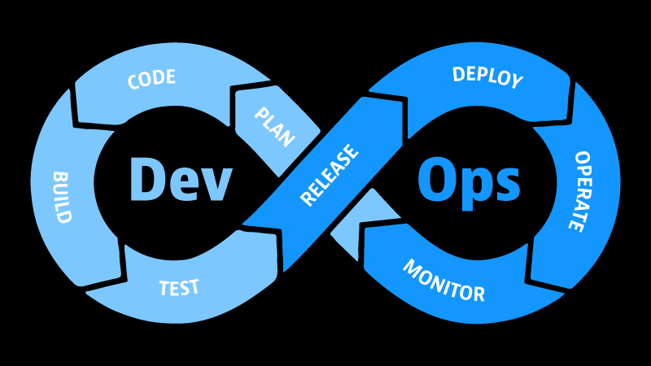

# Day 1 - Introduction

## DevOps란?

- 소프트웨어 개발에서 좀 더 현명하게 일하는 방법
- 소프트웨어 개발자 뿐만 아니라 개인, 운영자, QA 엔지니어 등 모두가 DevOps를 이해하면 좋음
- **DevOps의 목표**: 제품이 초기 아이디어 단계부터 최종 사용자에게 실제 운영 서비스로 전달되기까지의 시간을 단축하는 것
- 애플리케이션을 지속적으로 전달하기 위해 DevOps와 **애자일**은 주로 함께 이루어짐
- DevOps 관점에서 **개발, 테스트, 배포**는 모두 함께 이루어지고 이를 효율적으로 하기 위해서는 **자동화**를 활용해야 함

  

# Day 2 - Responsibilities of a DevOps Engineer

## DevOps 엔지니어의 역할

- 애플리케이션을 제작하는 것은 **두 가지 파트**로 이루어져 있음
    - 애플리케이션을 작성하고 테스트하는 **개발 파트**
    - 애플리케이션을 서버에 배포하고 유지하는 **운영 파트**
- **DevOps 엔지니어는 두 파트를 연결**하는 역할을 함

## DevOps 엔지니어의 책임

- DevOps 엔지니어는 애플리케이션을 프로그래밍하지는 않지만 개발 업무, 시스템, 도구 등 **개발의 전반적인 과정에 대한 개념을 이해**하고 있어야 함
- 또한 **애플리케이션이 배포될 서버를 생성하고 설정해야 함**
- 가상화, IaaS, 컨테이너 등 다양한 서버에 대한 이해도 필요함
- DevOps 엔지니어의 핵심 업무는 **자동화하여 새로운 애플리케이션 버전을 출시**하는 것

  

# Day 3 - DevOps Lifecycle - Application Focused

## Development

- 코딩할 필요는 없으나 애플리케이션에 대한 최상의 인프라 결정을 내릴 수 있도록 일부 코드를 읽을 수 있으면 좋음
- 중요한 것은 코드를 버전 관리 시스템을 사용하여 유지 관리해야 한다는 것 → Git

## Testing

- 테스팅 환경으로 컨테이너를 사용하여 물리적 또는 클라우드 인프라 비용 오버헤드를 개선할 수 있음
- 테스팅 단계 또한 통합 단계의 일부로 자동화될 수 있음

## Integration

- 통합은 데브옵스 라이프사이클의 중간
- 새로운 코드 변경사항을 빌드 및 테스트 하여 공유 레포지토리에 통합

## Deployment

- 최종 사용자가 사용할 수 있도록 애플리케이션을 배포
- 배포 단계에서 **Application Configuration Management**(애플리케이션 구성 관리)와 **Infrastructure as Code**(코드형 인프라)가 중요한 역할을 할 수 있음
    
    <aside>
    💡 Application Configuration Management(애플리케이션 형상 관리)는 애플리케이션의 변경사항을 체계적으로 추적하고 통제하는 것으로 소스 코드 뿐만 아니라 개발 환경, 빌드 구조 등 전반적인 내역에 대한 관리 체계를 정의한다. 대표적인 도구로 Git이 있다.
    
    </aside>
    
    <aside>
    💡 Infrastructure as Code는 인프라 구성을 프로그래밍하는 것처럼 처리하는 방식이다. 이를 통해 애플리케이션은 자체적으로 가상 시스템을 생성하고 오케스트레이션하는 스크립트를 포함할 수 있다. 대표적인 도구로 테라폼이 있다.
    
    </aside>
    

## Monitoring

- 애플리케이션의 성능을 지속적으로 모니터링하여 개발자가 향후 릴리스에서 개선된 서비스를 제공할 수 있음
- 모니터링의 핵심 요소는 안정성이며 이는 **observability**(관찰 가능성), **security and data management**(보안 및 데이터 관리) 영역으로 이어짐

    <aside>
    💡 observability(관찰 가능성)은 시스템의 외부 출력을 기반으로 시스템의 내부 상태를 추론하는 기능이다. 모니터링과 달리 사전에 정의된 메트릭과 알람에 의존하는 대신, 시스템 동작의 더욱 전체적인 관점을 제공한다.

    </aside>

  

# Day 4 - DevOps & Agile

## Agile

- **작은 결과물을 빠르게 제공**하는데 중점을 둠
- 매주 또는 매달 점진적인 업데이트를 통해 새 버전을 출시함
- 최종 목표는 사용자에게 최적의 경험을 제공하는 것

## DevOps

- **소프트웨어 개발자와 운영자의 협력을 기반으로 하는 배포 관행**
- 간소화된 개발 프로세스를 제공하고 잘못된 커뮤니케이션을 최소화함

## Agile과 DevOps의 차이점

### 팀

- 애자일은 일반적으로 소프트웨어 개발자와 프로젝트 관리자에게 적용
- 데브옵스 엔지니어는 애자일 팀의 일원으로 개발, QA, 운영이 교차하는 지점에 있음

### 적용된 프레임 워크

- 애자일은 다양한 관리 프레임워크가 있음
    - Scrum > Kanban > Lean > Extreme > Crystal > Dynamic > Feature-Driven
- 데브옵스는 구체적인 방법론을 제공하지 않음. 그러나 코드형 인프라, 코드형 아키텍처, 모니터링, 자가 치유, 엔드투엔드 테스트 자동화와 같은 관행을 장려함

### 피드백

- 애자일 피드백의 주요 출처는 최종 사용자
- 데브옵스는 이해관계자와 팀 자체의 피드백의 우선순위가 더 높음

### 대상 영역

- 애자일은 소프트웨어 개발에 더 중점을 둠
- 데브옵스는 소프트웨어 개발에도 중점을 두지만 배포 및 릴리스 후 단계에도 적용됨

### 문서

- 애자일은 문서화 및 모니터링보다 유연성과 당면한 작업에 우선순위를 둠
- 데브옵스는 프로젝트 문서가 필수

### 위험 요소

- 애자일 리스크는 우선순위와 요구사항이 계속 변하기 때문에 예측하거나 평가하기 어려움
- 데브옵스 위험은 용어에 대한 오해와 적절한 도구의 부재로 인해 나타남

### 사용되는 툴

- 애자일 도구는 커뮤니케이션 협업, 메트릭 및 피드백 처리에 중점을 둠
    - JIRA, Trello, Slack, Zoom, SurveyMonkey 등
- 데브옵스는 팀 커뮤니케이션, 소프트웨어 개발, 배포 및 통합을 위한 도구를 사용함
    - Jenkins, GitHub Actions, BitBucket 등

## Agile과 DevOps를 결합하면 얻을 수 있는 이점

- 유연한 관리와 강력한 기술
- 애자일 관행으로 데브옵스 팀이 우선순위를 보다 효육적으로 소통할 수 있음
- 데브옵스를 위해 사용되는 자동화 비용은 신속하고 자주 배포해야 하는 애자일 요구사항에 의해 정당화 됨

  

# Day 5 - Plan > Code > Build > Testing > Release > Deploy > Operate > Monitor >

## Plan

- 개발팀이 다음 스프린트에서 출시할 기능과 버그 수정을 결정할 때 데브옵스 엔지니어는 개발팀이 구축한 인프라로 작업하도록 돕거나 좋지 않은 방향으로 들어갈 때 더 나은 방향을 안내할 수 있음

## Code

- 코드를 작성하는 동안 어떤 서비스를 사용할 수 있고 어떻게 상호작용할 수 있는지 잘 이해할 수 있도록 도움
- 코드 작성이 완료되면 코드를 리포지토리에 병합함

## Build

- 코드를 변환 또는 컴파일하거나 도커 이미지를 생성
- CI 파이프라인을 이용하여 프로세스를 자동화할 수 있음

## Test

- 개발팀이 제안한 테스트를 실행

## Release

- 애플리케이션 유형에 따라 릴리스 프로세스가 작업 중인 애플리케이션에 따라 생략될 수도 있음
- 일반적으로 github, git 리포지토리에서 가져온 코드나 빌드된 도커 이미지를 프로덕션 서버에 배포하기 위해 레지스트리나 리포지토리에 저장

## Deploy

- 프로덕션 환경에 코드를 적용함

## Operate

- 고객이 사이트나 애플리케이션을 사용할 때 발생하는 문제를 파악하고 대처 방안을 마련함
- 예를 들어 사이트가 느릴 경우, 원인을 파악하고 피크 기간 동안 서버 수를 늘리는 자동 확장 기능을 구축할 수 있음

## Monitoring

- 메모리 사용률, CPU 사용률, 디스크 공간, API 엔드포인트, 응답 시간 등을 모니터링
- 로그를 통해 무슨 일이 일어나고 있는지 나타냄

## 다듬기 & 반복

- 수행한 프로세스를 검토하고 개선할 부분을 찾음
- 이를 바탕으로 다시 계획 단계로 돌아가 전체 과정을 반복함

## Continuous

- 여러 도구들이 지속적인 프로세스를 달성하도록 함
- 모든 환경을 자동화하는 것이 목표이며 이를 지속적 통합/지속적 배포 또는 줄여서 CI/CD라고도 함

## Continuous Delivery

- Plan > Code > Build > Test

## Continuous Integration

- Countinous Delivery와 Release 단계의 결과를 합친 것
- Plan > Code > Build > Test > Release

## Continuous Deployment

- 성공적인 CI 릴리즈 후 CD 단계로 이동
- Deploy > Operate > Monitoring

  

# Day 6 - DevOps - The real stories

## Amazon

- 2011년에 지속적 배포 프로세스를 채택하여 개발자가 원할 때 필요한 서버에 코드를 배포
- 이를 통해 새로운 소프트웨어를 평균 11.6초 만에 프로덕션 서버에 배포할 수 있게 됨

## Netflix

- 배포 가능한 웹 이미지로 코드를 자동으로 빌드
- 이미지가 업데이트 되면 맞춤형으로 구축된 웹 기반 플랫폼을 사용하여 넷플릭스 인프라에 통합됨
- 이미지 배포에 실패하면 롤백되어 이전 버전으로 트래픽이 다시 라우팅 되도록 지속적인 모니터링이 이루어짐

## Etsy

- 2009년 말에 이미 개발자가 코드를 배포할 수 있도록 했을 가능성이 높음
- 개발자가 배포 책임감을 느낄 때 애플리케이션 성능, 가동 시간 및 기타 목표에 대한 책임감도 함께 갖게 된다는 것을 깨달음

  

# Day 21 - The Big Picture: DevOps and Networking

## 넷데브옵스 | 네트워크 데브옵스

- 네트워크에 데브옵스 원칙과 관행을 적용하고 버전 제어 및 자동화 도구를 네트워크 생성, 테스트, 모니터링 및 배포에 적용하는 것
- 네트워크를 자동화하면 전반적으로 배포 속도, 네트워킹 인프라의 안정성을 높이고 지속적인 개선을 가능하게 함
- 테스트가 완료된 네트워크 정책은 코드로 되어 있기 때문에 다른 위치에서도 빠르게 사용할 수 있음

## 네트워킹 기본 사항

### 호스트

- 트래픽을 보내거나 받는 모든 장치
- 컴퓨터, TV, 노트북, 프린터, 서버, 휴대폰 등

### IP 주소

- 호스트의 신원

### 네트워크

- 호스트 간 트래픽을 전송
- 유사한 연결이 필요한 호스트들의 그룹
- 네트워크의 호스트는 동일한 IP 주소 공간을 공유함

### 스위치

- 호스트 간 데이터 패킷을 전달함

### 라우터

- 네트워크 간 통신을 용이하게 함 (스위치는 네트워크 내 통신)
- 트래픽 제어 지점(보안, 필터링, 리디렉션)을 제공함
- 라우팅 테이블은 라우터가 학습하여 알고 있는 모든 네트워크

### 스위치 vs. 라우터

- 라우팅 - 네트워크 간 데이터를 이동하는 프로세스
- 스위칭 - 네트워크 내에서 데이터를 이동하는 프로세스

  

# Day 22 - The OSI Model - The 7 Layers

## OSI 모델

- 서로 다른 제품과 소프트웨어 간의 상호 운용성을 지원하기 위해 컴퓨터 기능을 보편적인 규칙과 요구사항으로 특성화함
- 7가지 추상화 계층으로 나뉨
    - **Physical, Data Link, Network, Transport, Session, Presentation, Application**

## Physical

- 물리적 케이블 등의 수단을 통해 한 호스트에서 다른 호스트로 데이터를 전송하기 위한 하드웨어
- 와이파이, 허브, 케이블

## Data Link

- 데이터가 프레임으로 패키지화 되어 노드 간 전송이 가능하게 함
- 물리 계층에서 발생했을 수 있는 오류를 수정
- MAC 주소가 도입됨

## Network

- End to End 전송을 목표로 하며 IP 주소가 있음
- 라우터와 호스트 등 IP가 있는 모든 것

> **Layer 2와 Layer 3에 모두 주소체계가 있는 이유**
호스트와 호스트 사이에 데이터를 전송할 때 여러 개의 스위치와 라우터를 통과하며 각 장치에는 Layer 2 MAC 주소가 있음
Layer2 MAC 주소는 호스트에서 스위치/라우터로만 이동하며 Layer 3 IP 주소는 데이터 패킷이 최종 호스트에 도달할 때까지 패킷을 유지함
IP 주소 - Layer 3 = End to End
MAC 주소 - Layer 2 = Hop to Hop
> 

## Transport

- 데이터 스트림을 구분하기 위해 존재
- MAC, IP와 마찬가지로 Port가 있음
- 서비스 간 통신

## Session, Presentation, Application

- Source 호스트는 캡슐화 프로세스를 거쳐 데이터를 Layer 4로 전송
- Layer 4는 데이터에 헤더를 추가 ⇒ 세그먼트
- 세그먼트는 OSI 스택을 통해 Layer 3으로 전달되고 데이터에 Source IP 주소와 Destination IP 주소가 포함된 헤더를 추가함 ⇒ 패킷
- Layer 2로 패킷이 전달되며 데이터에 Source 및 Destination MAC 주소가 포함된 패킷이 추가됨 ⇒ 프레임
- 프레임은 1과 0으로 변환되어 Layer 1 물리적 케이블 또는 와이파이를 통해 전송됨
- 수신은 스택을 역방향으로 진행하여 이루어짐

  

# Day 23 - Network Protocols

## 네트워크 프로토콜

- 인터넷 표준을 구성하는 일련의 규칙과 메시지

### ARP

- 주소 확인 프로토콜
- Layer 2에서 IP 주소를 고정된 물리적 컴퓨터 주소(MAC)에 연결함

### FTP

- 파일 전송 프로토콜
- source에서 destination으로 파일을 전송할 수 있음
- FTP는 익명 액세스를 사용하도록 구성한 경우도 있어서 SSL/TLS 연결을 제공하는 FTPS를 더 자주 볼 수 있음
- OSI 모델의 애플리케이션 계층에 해당

### SMTP

- 메일 서버는 SMTP를 사용하여 메일을 주고 받음

### HTTP

- 하이퍼 텍스트 전송 프로토콜
- 웹사이트에 액세스할 수 있게 함
- 그러나 HTTP보다 HTTPS가 권장되며 더 많이 사용됨

### SSL/TLS

- SSL - 보안 소켓 계층
- TLS - 전송 계층 보안
- TLS는 네트워크를 통해 안전한 통신을 제공하는 암호화 프로토콜
- 일반적으로 HTTPS를 보호하는데 사용됨

### HTTPS

- SSL/TLS로 보호되는 HTTP
- 호스트 간에 데이터가 교환되는 동안 인증, 개인 정보 보호 및 무결성을 제공하는데 중점을 둠

### DNS

- 도메인 이름 시스템
- 도메인 주소를 입력하면 IP 주소로 연결됨

### DHCP

- 동적 호스트 구성 프로토콜
- 인터넷에 액세스하거나 서로 파일을 전송하기 위해서 호스트는 4가지를 필요로 함
    - IP 주소
    - 서브넷 마스크
    - 기본 게이트웨이
    - DNS
- DHCP는 네트워크의 범위를 정하면 네트워크에서 사용 가능한 모든 호스트에게 프로토콜 기본 설정을 자동으로 제공

### Subnet

- IP 네트워크의 논리적 세분화
- 대규모 네트워크를 더 효율적으로 실행할 수 있는 더 작고 관리하기 쉬운 네트워크로 나눔
- 서브넷에 연결된 장치는 공통 IP 주소 식별자를 공유하여 서로 통신할 수 있음
- 라우터는 서브넷 간의 통신을 관리함

  

# Day 24 - Network Automation

## 네트워크 자동화의 기본 사항

- 민첩성 달성
- 비용 절감
- 오류 제거
- 규정 준수 보장
- 중앙 집중식 관리

## 네트워킹 자동화에 대한 접근 방식

- 작업을 식별하고 네트워크 변경 요청에 대한 검색을 통해 솔루션을 자동화할 문제를 파악
- 작업을 나누고 서로 다른 네트워크 기능이 어떻게 작동하고 상호 작용하는지 분석
- 재사용 가능한 정책, 재사용 가능한 서비스 작업, 프로세스 및 입출력을 정의하고 단순화
- 정책을 비즈니스 별 활동과 결합
- 가용성과 서비스를 유지하면서 정책과 프로세스를 반복하여 추가하고 개선
- 네트워크 서비스를 오케스트레이션

## 네트워크 자동화 도구

- 운영체제 - Linux OS
- 통합 개발 환경(IDE) - Visual Studio Code
- 구성 관리 - Ansible
- CI/CD - Jenkins
- 버전 관리 - Git, GitHub, GitLab, BitBucket
- 언어 | 스크립팅 - Python
- API 분석 - Postman
