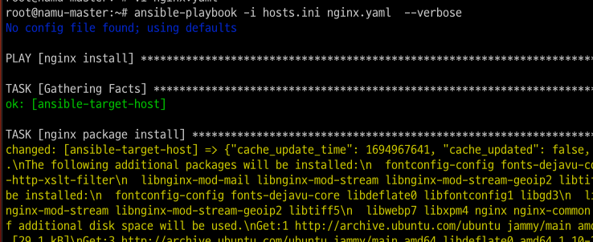
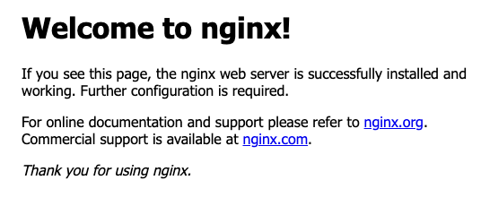

# Overview: Course 
본 과정은 DevOps의 문화, 관련된 tool, 프로세스에 대해 주요 키워드를 따라 학습하는 과정이다.  
90일간 주어진 자료를 가지고 학습하고, 추가적으로 궁금한 내용을 들춰보며 추가한다.  
원본은 90일의 과정이지만, 여기서는 스터디 일정에 맞춰 한 주에 2주차 분량을 학습하고 정리한다.  

DevOps는 SW 개발을 좀 더 현명하게 하고자 하는 방법론에서 출발한다.  
SW 개발과 운영의 통합, 초기 아이디어 단계부터 최종 사용자, 내부 팀 도는 고객 등 모든 사용자에게 실제 운영 서비스로 전달되기까지의 시간을 단축하는 일.  

DevOps를 항상 함께 따라다니는 키워드로 CI/CD, 애자일 방법론 등이 있다.  
DevOps적 mindset의 기본은 긴 SW 배포 프로세스 주기를 더 작게, 자주 배포하는 방식으로 시간을 단축하는 것에 있다.  
또한, 개발, 운영, QA 팀 간 사일로를 무너뜨릴 책임도 DevOps에 있다.  
DevOps의 관점에서 개발, 테스트, 배포는 모두 DevOps 팀과 함께 이루어져야 한다. 그리고 이를 위한 과정에서 __자동화__ 를 최대한 활용한다.  

>사일로 현상 (silo effect)  <-> 부서 이기주의 현상
>회사 내 팀이나 부서가 분리되어 커뮤니케이션, 협업, 혁신을 방해하는 부정적인 현상  
>팀 간 조정과 협력이 부족해져 궁극적으로 회사의 전반적인 성과와 성장에 해를 끼친다.  
>이를 해결하기 위해 협업과 소통의 문화를 조성하고, 프로젝트 관리 도구나 커뮤니케이션 플랫폼을 통해 팀 간 실시간 정보 공유 라인을 구축하는 등 많은 기업들이 사일로 현상을 경계해야할 대상으로 규정하고 있다.  

[So you want to learn DevOps?](https://www.kasten.io/kubernetes/resources/blog/devops-learning-curve)  
[roadmap.sh - DevOps](https://roadmap.sh/devops)  

Python
Linux (SSH, Shell Instruction, Linux 디렉터리 구조)
Network (DNS, 서브넷, 게이트웨이, DHCP, NAT, OSI모델, 방화벽, 로드밸런서, 프록시 서버, HTTP/HTTPS..)
주요 CSP - AWS 
Git, GitHub
Container/Docker/Kubernetes
IaC - Terraform
CI/CD - Jenkins, GitHub Actions
Monitoring - ELK 스택, Prometheus, Grafana
데이터 저장 및 보호 - 백업, 이미그레이션, 재해 복구


[DevOps in 5 Minutes](https://www.youtube.com/watch?v=Xrgk023l4lI)  
two type: developer, development team vs operatoin team  
development team: 계획, 디자인, 초기설계  
operation team: 테스트, 구현  

oper -> dev로 feedback (bugs, needed fixing,, )  
dev팀은 feedback을 받기전까지 idle 상태로 기다림  
=> dev팀은 다른 프로젝트에 돌입, oper팀은 남은 프로젝트를 제공 

DevOps는 이러한 운영팀과 개발팀의 분리로 인한 문제를 해결하고 
빠른 개발, 지속적인 프로세스, 효율성 향상 등을 가져온다.  
즉, DevOps는 운영팀과 개발팀 사이에서 소통을 위한 stream line이 된다.  

DevOps를 도입한 개발 사이클은 다음과 같다.  
    
출처: https://www.youtube.com/watch?v=Xrgk023l4lI  

<br>

[What is DevOps? Easy way](https://www.youtube.com/watch?v=_Gpe1Zn-1fE&t=43s)  
Development + Operations = DevOps
DevOps는 특정 기술이나 도구가 아닌 개발 방법론, 모토에 가깝다.

개발팀은 코드작성, 새로운 기능 디자인, 테스트 기능 등등..  
운영팀은 서버 매니지(+scailling issue), 대역폭, 보안, 백업..  

DevOps의 모든 팀원은 운영과 개발에 관한 내용을 공유하고 완수할 책임을 갖는다.  

provision prepare infra, maintain, os, linux basic, virutalization, networking, 온프레미스, 클라우드 환경, containers, k8s, aws specific service.., CI/CD pipeline, 

개발과 배포 
그 과정에서 테스트, 빌드, 배포.. 등 자동화 -> CI/CD 
사람은 반드시 실수한다. -> 자동화.
잰킨스, 깃랩, 깃허브액션.

모니터링, Oveserbability

이 모든 전반에 걸친 automating 
IaC.. Provisioning infra as code 
문서화, 인프라 상태에 대한 투명, 협력 강화
IaC: Terraform, Config. Managing: Ansible

<br>

# Contents

* [1. What is and why do we use DevOps](#what-is-and-why-do-we-use-devops)
    * [Day.2 DevOps](#day2)
    * [Day.3 DevOps LifeCycle](#day3)
    * [Day.4 DevOps & Agile](#day4)
    * [Day.5 LifeCycle & CI/CD](#day5)
    * [Day.6 Summary](#day6)
* [2. Understand Networking](#understand-networking)
    * [Day.21 What is Network DevOps?](#day21)
    * [Day.22 OSI 7 layers](#day22)
    * [Day.23 Protocol](#day23)
    * [Day.24 Network Automation](#day24)
    * [Day.25 ](#day25)
    * [Day.26 ](#day26)
* [+) Ansible](#ansible-앤서블)

# What is and why do we use DevOps

## Day.2
소프트웨어 개발팀에는 두 가지 주요 파트가 있다.  
개발: 애플리케이션을 작성, 테스트  
운영: 애플리케이션을 서버에 배포, 유지보수

### 데브옵스는 개발파트와 운영파트를 연결한다.  
개발자는 프로그래밍 언어, 빌드도구, 코드 저장소 등을 이용해 애플리케이션을 만듬.  
DevOps 엔지니어는 직접 애플리케이션을 프로그래밍하지는 않지만, 전반적인 프로세스(개발업무, 시스템, 도구)를 잘 이해할 필요가 있다. 

App.은 결국 서버에 배포해야함.  
서버는 온프레미스, 퍼블릭 클라우드, 서버리스 등의 방법으로 배포.
서버를 생성하고 설정, App. 실행 환경을 준비하는 사람이 필요. -> DevOps 엔지니어의 책임  

서버는 일반적으로 Linux를 의미  
우리의 App.이 다른 서비스들과 통신할 수 있도록 하기 위해 일정 수준의 네트워킹 및 구성에 대한 지식도 필요  
DNS, DHCP, Load Balancing... 등

### eveything. but not all.
네트워크/인프라에 대한 이해가 필요하다고 해도, 그 분야의 전문가가 될 필요는 없다.  
우리에게 필요한건   
1. 서버를 올리고
2. 실행시키고  
3. 상호 간 통신이 가능하도록 구성  
위와 같은 지식만을 가지고 있으면 된다.  

마찬가지로 개발에 대해서도 기본적인 지식만을 필요로한다.  
최근에는 많은 부분을 컨테이너로 동작시키기 때믄에, 가상화, IaaS와 더불어 컨테이너화에 대한 이해가 중요하다.  

### High-Level Overview
DevOps의 핵심업무는 버그 수정 및 새 기능이 추가된 버전을 운영환경에 적용,  
즉, '새 애플리케이션 버전을 어떻게 출시하는가'에 있다.  
이를 위해 테스트를 포함한 자동화된 방식을 적용.  

<br>

## Day.3
### DevOps LifeCycle - Application Focused
애플리케이션 처음부터 끝까지. 고차원의 시각으로 바라본다.  

#### Development
고객 또는 최종 사용자의 요구사항을 도출하고 애플리케이션에 대한 계획이나 요구사항을 마련한다.  
요구사항을 바탕으로 새로운 애플리케이션을 만든다.  

__Need__
* IDE, 프로그래밍 언어 선택
* 버전관리, Git
* 코드 저장소, GitHub/GitLab

#### Testing
이미 요구사항 존재, 애플리케이션 개발 중  
이 단게에서 QA는 버그를 테스트, 테스트 환경 시뮬레이션에는 컨테이너를 자주 사용. -> 물리적/클라우드 인프라의 비용 오버헤드 개선  
지속적 통합의 일부로 자동화 고려.  

__Need__
* CI에 Testing 자동화

#### Integration
__통합은 DevOps 생명주기에 중앙에 있다__  
매일 or 매주 단위로 개발자가 소스코드에 변경사항을 더 자주 커밋해야하는 practice(관행)  

매 커밋마다 애플리케이션은 자동화된 테스트 단계를 거치며, 다음 단계로 가기 전 문제나 버그를 조기 발견할 수 있음.   

__Need__
* Commit 사이클 관리

#### Deployment
코드를 프로덕션 서버에 배포하는 단계, DevOps의 정수,,,  
각 애플리케이션마다 필요한 하드웨어나 구성이 다름.  
Application Configuration Management와 Infrastructure as Code가 주요 Topic으로 나오는 부분이다.  
애플리케이션이 컨테이너화 된 상태로 가상 머신의 위에서 실행될 수 있으며, 이러한 컨테이너들을 오케스트레이션하기 위해 k8s와 같은 플랫폼을 사용한다.  

__Need__
* Ansible, Terraform
* Docker, k8s 
* CI/CD tools, (like Jenkins, GitHub action..)

#### Monitoring
배포하고있는 애플리케이션의 성능을 지속적으로 모니터링   
-> 개발자가 향후 릴리스에서 개선할 부분을 찾을 수 있음/더 나은 서비스 제공  

애플리케이션이 필요할 때 항상 사용할 수 있길(안정성, reliability)  
-> 지속적 모니터링 observability, security and data management 영역으로 이어짐  
피드백을 통한 애플리케이션의 지속적 개선, 업데이트 및 릴리스

DevOps 엔지니어라는 말은 실제로 Cloud Native Engineer/Architect, Virtualization Admin., Clout Architect/Engineer, Infra Admin. 등과 같은 직책을 포함해서  
DevOps에서 사용되는 프로세스의 범위를 강조하기 위해 사용되는 일반적인 단어이다.  
DevOps는 단지 '누군가의 직책'이 아니라 누구나 따라야 할 프로세스와 문화 그 자체를 의미한다.  

<br>

## Day.4

### DevOps & Agile

#### Agile Development  
큰 완제품을 한 번에 출시하기보다 작은 결과물로 더 빠르게, 자주 제공하는데 중점을 두는 개발 방법론.  
반복적인 개발, 매주 또는 매달 점진적인 업데이트를 통한 새 릴리스 출시.  
궁긍적으로 최종 사용자에게 최고의 경험을 제공  

#### DevOps  
일반적으로 SW개발자와 운영 전문가 간 협력을 기반으로 하는 배포 관행.  
간소화된 개발 프로세스 제공. 팀 간 커뮤니케이션을 통한 효율적인 개발/운영 사이클


### What is different, Agile vs DevOps
Agile은 짧은 반복 주기 요구 -> DevOps가 제공하는 자동화를 통해 달성  
Agile 고객의 신속한 피드백 -> DevOps가 새로운 환경을 쉽게 만들 수 있을때만 가능  

__Participants__  
Agile은 최종 사용자와 개발자 간 커뮤니케이션 중점(외부 지향적)  
DevOps는 개발자와 운영, 팀원을 대상으로 함(내부 관행)  

__Team__  
Agile은 SW개발자와 PM에게 적용. DevOps 엔지니어는 제품 주기의 모든 단계에 관여하고 Agile 팀의 일원으로 개발/QA/운영이 교차하는 지점에 존재한다.  

__Framework__  
유연성과 투명성을 달성하기 위해 Agile에는 Scrum > Kanban > Lean > Extreme > Crystal > Dynamic > Feature-Driven 과 같은 관리 프레임워크 존재  
DevOps는 협업을 통한 개발 방식에 중점을 두지만 구체적인 방법론 제공 X  
대신 IaC, 모니터링, Self-healing, end-to-end 테스트 자동화와 같은 관행 장려.  

__Feedback__  
피드백의 출처가 다름  
Agile: 보통 최종 사용자 / DevOps: 이해관계자와 팀 자체 피드백  

__Boundary__  
Agile: 소프트웨어 개발에 중점  
DevOps: 소프트웨어 개발, 모니터링, 고가용성, 보안 및 데이터 보호.. 개발 ~ 릴리스 후 단계까지 적용  

__Docs__  
Agile: 문서화, 모니터링 < 유연성, 당면한 작업
DevOps: 프로젝트 문서를 필수 프로젝트 구성 요소로 생각

__Risk__  
Agile의 경우 우선순위와 요구사항에 대한 예측/평가가 어려움  
DevOps의 경우 용어에 대한 오해와 적절한 도구의 부재에서 비롯. 

__Tools__  
Agile 도구는 경영진의 커뮤니케이션 협업, 메트릭 및 피드백 처리에 중점을 둔다.  
인기있는 도구로는 JIRA, Trello, Slack, Zoom, SurveyMonkey  
DevOps는 팀 커뮤니케이션, SW개발, 배포 및 통합을 위해 Jenkins/GitHub Actions/BitBucket 등 도구를 사용  

<br>

### Agile과 DevOps를 모아보자  
__Benefit__
* 유연한 프로젝트 관리와 강력한 도구, 제품 품질의 향상
* 팀의 협업 개선, 팀의 사기를 높이고 직원 이직률을 낮춤
* 애자일 방법론은 DevOps팀이 우선순위를 보다 효율적으로 소통하도록 만듬
* DevOps, 자동화를 위한 비용은 Agile의 요구사항(신속, 자주 배포)에 따라 정당화됨  

__Agile과 DevOps를 동시에 도입하기__
1. 개발팀과 운영팀을 통합하라
2. 빌드 및 운영 팀을 만들고 모든 개발/운영 관련 문제를 전체 DevOps 팀에서 공유/논의
3. 스프린트에 대한 접근 방식 변경, 우선순위를 두고 개발과 동일한 가치의 DevOps 작업을 제공하라. 개발팀과 운영팀 간의 workflow와 대립되는 문제에 대한 의견 교환을 장려하라.
4. 모든 개발 단계에 QA를 포함한다.
5. 올바른 도구를 사용한다.
6. 가능한 모든 것을 자동화한다.
7. 가시적인 수치를 따라 측정/제어하라.

<br>

## Day.5

### Plan > Code > Build > Test > Release > Deploy > Operate > Monitoring  
  

* Plan: 팀이 더 좋은 방향으로 갈 수 있도록, 업무 파악, 협력, 인프라 지원 등
* Code: 인프라에 대한 이해, 사용가능한 서비스와 해당 서비스와 상호작용 방법 등에 대한 지원, 코드 병합.
* Buold: 자동화 프로세스의 첫 단계. 코드를 가져와 컴파일, 변환, 도커 이미지 생성 등 CI 파이프라인을 통한 자동화. 
* Test: 제품에 문제가 발생하지 않도록 최소화하기 위한 시도. 최소한 이전에 작동하던 것이 깨지지 않도록 보장해야 함.
* Release: GitHub 리포지토리에서 가져온 코드나 빌드된 도커 이미지를 프로덕션 서버에 배포하기 위해 레지스트리나 리포지토리에 저장. 이를 통해 배포 프로세스 진행  
* Deploy: 개발의 최종단계. 프로덕션 환경에 코드를 적용하는 과정. 
* Operate: 고객의 실 사용시 발생하는 문제 파악, 대처방안 마련. 서버의 auto scale, 운영 상황의 메트릭(서비스의 성능 수치값) 처리 등 일반적으로 자동화 시킴. 자동화 프로세스에는 알림을 추가하는 것이 좋음
* Monitoring: 운영의 auto scale 등을 위해 필요. 메모리 사용률, CPU 사용률, 디스크 공간, API 엔드포인트, 응답시간 등을 측정, 로깅, 모니터링. 

### CI/CD
위와 같은 과정에 많은 도구들을 사용해 지속적인 개선 통합 프로세스가 형성됨.  
이는 모든 코드와 클라우드 인프라 또는 환경을 완전히 자동화하는 것을 궁긍적인 목표로 함.  
위와 같은 전체 flow를 CI/CD, 지속적 통합/지속적 배포로 설명하기도 한다.  

  
https://www.redhat.com/ko/topics/devops/what-is-ci-cd  

#### CI, Continuous Integration
Plan > Code > Build > Test
성공/실패 경우 모두 포함. 
변경사항이 적용되면 빌드, 테스트 수행 자동화

#### CD, Continuous Delivery
Release
CI의 빌드 자동화, 유닛 및 통합 테스트 수행 후 유효한 코드를 리포지토리에 자동으로 릴리즈.  
CI가 먼저 구축되어 있어야 하며, 프로덕션 환경으로 배포할 준비가 되어있는 코드베이스를 확보하는 것을 목표로 함  

#### CD, Continuous Deployment
Deploy > Operating > Monitoring  
배포 준비가 완료된 애플리케이션을 프로덕션으로 릴리스하는 작업을 자동화
실 사례에서는 개발자가 변경사항을 작성한 후 몇 분 이내에 클라우드 애플리케이션을 자동으로 실행할 수 있는 것을 의미(자동화된 테스트 통과시)

<br>

## Day.6

### Summary
DevOps는 개발과 운영의 조합이다. 애플리케이션 라이프사이클을 관리하기 위한 방법론이다.  
DevOps의 주요 목표는 개발 라이프사이클 단축 및 비즈니스 목표와 연계하여 기능 및 수정사항을 자주 제공하는 것.  
데브옵스는 SW를 안정적, 신속하게 배포하고 개발할 수 있는 개발 정근 방식  
지속적인 개발, 테스트, 배포, 모니터링으로 보기도 한다.  


<br>


# Understand Networking
[Networking Fundamental Series - Practical Networking](https://www.youtube.com/playlist?list=PLIFyRwBY_4bRLmKfP1KnZA6rZbRHtxmXi)

## Day.21

### What is Network DevOps?
NetDevOps라고도 함, 네트워크에 DevOps 원칙을 적용하고 버전 컨트롤 및 자동화 도구를 네트워크 생성/테스트/모니터링/배포에 적용  

프로비저닝/구성/테스트/버전제어 및 배포와 관련된 자동화 원칙으로부터 시작  
자동화를 통한 이점  
* 배포 속도 향상
* 네트워크 인프라 안정성 확보
* 지속적인 개선 및 여러 환경에서 프로세스 공유(코드의 재사용)

<br>

[What is Network DevOps](https://www.thousandeyes.com/learning/techtorials/network-devops)  
네트워크 DevOps는 네트워크 엔지니어링 및 운영에서 DevOps 문화와 원칙을 적용하는 것을 의미한다.  
네트워킹 기술의 지속적인 개발, 통합 및 배포와 함께 __API로서의 네트워크__ 개념을 포함한 네트워크 자동화를 수행한다.  

데브옵스와 애자일을 적용하여 민첩한 개발을 채택하는 IT 및 생산 팀에 비해 수동적인 네트워크 팀은 개발에 관문이 되었다.  
이러한 맥락에서 민첩성을 유지하려는 행동으로 프로비저닝, 구성, 테스트, 버전제어, 애플리케이션 및 네트워크 서비스 배포를 포함한 자동화 원칙을 네트워크에 도입하게 되었다.  
다중 공급업체 SDN(소프트웨어 정의 네트워킹) 환경을 사용하여 기존 하드웨어 솔루션에 비해 새로운 기능을 더 빠르게 구현할 수 있게 되었다.  

자동화는 다음 요구사항에 부합한다.  
1. 배포속도: 자동화를 통해 개발 및 테스트 단계에서 빠른 네트워크 구성 또는 정책 변경이 가능하다.
2. 인프라 안정성: 자동화를 통해 개발자는 컨테이너 같은 임시 인프라에 대하 네트워킹 지원은 물론, 모든 App.의 업데이트와 운영 전반에 걸쳐 테스트를 생성하고 인프라 안정성을 달성할 수 있다.
3. 일관된 프로세스: 설정 및 테스트된 정책을 재사용하여 새로이 전체 네트워크를 다시 설계할 필요가 없다. 이로써 App. 수명주기 전반에 걸쳐 리소스 효율성, 보안 및 가용성이 크게 향상된다. 

네트워크 데브옵스의 모범사례
1. 지속적인 통합: 중앙 저장소에 새로운 코드 변경사항을 지속적으로 추가.
2. 지속적인 전달: 코드변경, 테스트 및 릴리스의 자동화. 
3. 지속적인 모니터링
4. 앱 경험과 네트워크 측정항목의 상관관계: Http 응답시간, 페이지 로드, 트랜잭션 시간과 같은 앱 및 사용자 경험 측정항목이 네트워크 측정항목과 연결되야 한다. 
5. 지속적인 테스트: 자동화된 테스트는 마이크로서비스, 버전관리, 미들웨어 설치 및 애플리케이션 자체를 포함하도록 확장되어야 한다.  

<br>

### Network Basics

#### 네트워크 장치 (용어 정리)
* __호스트__: 네트워크를 통해 트래픽을 보내거나 받는 모든 장치  
* __IP Address__: 각 호스트의 신원을 나타냄
    * 32bits로 구성. 1byte씩 네 개의 옥텟으로 표현. ex) 172.0.0.1
    * IP 주소는 계층적으로 할당된다.(Subnetting)
* __네트워크__: 호스트 간 트래픽을 전송하는 역할, 비슷한 연결이 필요한 호스트의 논리적 그룹  
    * 네트워크 호스트는 동일한 IP주소 공간을 공유
    * 네트워크는 다른 네트워크를 포함할 수 있다.(subnet)
    * 네트워크와 또 다른 네트워크의 연결 = Internet
* __스위치__: 네트워크 내에서 호스트 간 데이터 패킷을 전달하는 장치. 스위치는 호스트와 직접 연결되어 패킷을 전달함.
* __라우터__: 네트워크와 네트워크를 연결하는 장치. 
    * 트래픽 제어지점(보안, 필터링, 리다이렉션)을 제공할 수 있음  
    * 자신이 연결된 네트워크를 학습, 라우팅 테이블에 저장
    * 연결된 네트워크에 IP 주소를 알고 있음. 
    * IP주소는 각 호스트가 로컬 네트워크에서 나가는 통로(게이트웨이)로 사용됨, 네트워크 계층 구조를 생성한다.  
* __라우팅__: 네트워크를 통해 전송되는 데이터 패킷의 목적지까지 경로를 설정. 

#### 스위치 vs 라우터
라우팅: 네트워크 간 데이터를 이동하는 프로세스  
스위칭: 네트워크 내에서 데이터를 이동하는 프로세스  

#### Learn More 
라우팅/스위칭을 수행하는 장치
* 액세스 포인트(AP): 무선랜을 구성하는 장치로, 유선랜과 무선랜을 연결시켜주는 장치(유선->무선랜 제공)
    * 중앙제어: BSS(Basic Service Set) 내 여러 이동노드에 대한 조정
    * 브리징: 유선과 무선을 잇는 브리지 역할. 여러 BSS로 구성된 ESS 내 BSS 상호간에 브리지 역할 (AP간 로밍)
    * 리피터: BSS 내 이동노드 간 연결성 제공 
    * 분배시스템으로의 접근 서비스 제공  
    * STA = Station  
      
* 방화벽: 원치않는 트래픽으로부터 네트워크를 보호하는 보안 솔루션. 사전 프로그래밍된 일련의 규칙에 따라 들어오는 악성코드 차단.
* 로드 밸런서: 네트워크나 서버 환경에서 트래픽을 분산시키는 역할(가용성과 성능향상).
* Layer 3 스위치: IP주소 및 라우팅 기능을 사용하여 패킷을 라우팅하고 관리. 라우팅/스위칭/VLAN 지원/보안 및 액세스 지원/QoS 지원/스케일링
    * VLAN(Virtual LAN): 논리적으로 LAN을 서로 다른 그룹의 장치로 분할/관리
* IDS/IPS, 침입 탐지/방지 시스템
    * IDS (Intrusion Detection System): 네트워크/시스템 내에서 일어나는 비정상적 활동을 감지하고 경고. 알려진 공격 시그니처나 정상적인 활동 패턴과의 차이점을 바탕으로 감지
    * IPS (Intrusion Prevention System): 침입을 감지하면 자동으로 공격을 중단하거나 차단.
* 프록시(Proxy): 클라이언트-서버 간 통신을 중개/제어. 다양한 목적으로 사용됨
    * 보안 및 개인정보 보호: 클라이언트의 IP주소나 식별 정보를 원격 서버에 노출시키지 않고 통신. 사용자의 개인정보 보호와 익명성 유지
    * 캐싱: 이전에 요청한 콘텐츠를 저장, 동일한 요청이 들어올 시 저장된 콘텐츠를 제공. 대역폭 절약과 응답시간 단축
    * 접근제어 및 필터링: 특정 웹사이트나 콘텐츠에 대한 액세스 제어/필터링
    * 로드 밸런싱: 클라이언트 요청을 여러 서버로 분산 
    * 안전한 트래픽 라우팅: VPN(가상 사설망) 연결을 통해 안전한 터널을 설정하거나, 원격 지역에서의 접속을 안전하게 관리
    * 숨겨진 서버 구성: 웹 서버와 DB 서버 등 중요한 서버를 외부로 노출하지 않고, 프록시를 통해 간접적으로 액세스. 보안 향상
* 가상 스위치(Virtual Switch): 가상 환경에서 논리적으로 네트워크 트래픽을 스위칭하고 관리. ex)VM 간(또는 외부 네트워크와) 통신을 가능하게 하고 가상 머신과 물리 네트워크 간 연결 제공..
* 가상 라우터(Virtual Router): 가상화된 네트워크에서 패킷을 라우팅, 다른 네트워크 세그먼트로 패킷을 전달. 가상환경 내 서로 다른 서브넷 간 통신을 지원하고 인터넷과의 연결 관리.
    * ex) 서로다른 가상 서브넷 (개발, 테스트 및 프로덕션 환경) 사이의 트래픽을 분리

<br>

## Day.22

### OSI 7 layers
OSI, Open System Interconnection(개방형 시스템 상호 연결) 모델   
<-> ISO, International Organization for Standardization
네트워킹을 통해 호스트가 유선으로 데이터를 자동으로 공유  
but 이게 가능하려면 호스트가 일련의 규칙을 따라야 함   


1. Physical   
물리적 전송매체의 특성을 정의, 비트의 전송  
이더넷/광케이블/WI-FI/Hubs  

2. Data Link  
물리계층에서 발생하는 물리적 전송오류를 제어  
데이터를 프레임으로 패키징, 노드 간 전송의 책임(MAC 주소 사용, NIC에 위치)  
* NIC = Network Interface Card, 모든 NIC는 고유의 MAC 주소를 가짐
* MAC 주소는 48비트, 12개의 16진수

3. Network  
end-to-end 간 전송의책임. IP주소 사용/라우팅

4. Transport  
프로세스와 프로세스간 통신의 엔드포인트. 포트번호를 통한 프로세스 식별

5. Session / Presentaion / Application  
애플리케이션 레벨에서의 통신을 의미
데이터의 표현, 암호화 등을 정의
사용자 애플리케이션.  

  

<br>

## Day.23

### Protocol  
프로토콜: 서로 다른 두 호스트가 통신하기 위한 일련의 규칙/메시지  

__ARP__ - Address Resolution Protocol  
IP 주소를 고정된 물리적 컴퓨터 주소(MAC 주소)로 변환  

__FTP__ - File Transfer Protocol  
source -> destination, 파일 전송  
일반적으로 인증 수행, but 익명 액세스를 사용하도록 만들수도 있음.  

__FTPS__ -  클라이언트에서 FTP 서버로 SSL/TLS 연결을 제공 + 보안성  
OSI 모델의 애플리케이션 계층에서 동작  

__SMTP__ - Simple Mail Transfer Protocol  
전자 메일 전송에 사용되는 메일 서버에서 메일 메시지를 보내고 받기 위한 프로토콜  

__HTTP__ - Hyper Text Transfer Protocol  
웹을 위한.. 텍스트(html, xml...)를 주고받는 프로토콜.  

__HTTPS__ - Http + Secure(TLS로 암호화됨)  
호스트 간에 데이터가 교환되는 동안 인증, 개인 정보 보호 및 무결성을 제공  

__SSL__ - Secure Socket Layer | __TLS__ - Transport Layer Security  
SSL의 뒤를 이어 등장한 TLS는 네트워크를 통해 안전한 통신을 제공하는 암호화 프로토콜  

__DNS__ - Domain Name System  
도메인 이름을 IP 주소에 매핑  
호스트, 서비스 및 기타 리소스에 연결할 수 있도록 하는 역할  
모든 호스트에서 인터넷 연결이 필요한 경우 해당 도메인 이름을 확인할 수 있도록 DNS가 필요  

__DHCP__ - Dynamic Host Configuration Protocol  
주어진 대역의 IP를 이하 시스템(노드)들에게 동적으로 할당/회수  

__NAT__ - Network Address Translation  
사설 네트워크와 공인 네트워크 사이 IP 주소를 변환하거나 할당하는 프로세스를 의미  
주로 IPv4의 주소 고갈 문제를 해결하고 네트워크 보안을 강화  
1. IP주소 변환: 사설IP <-> 공인IP 주소 간 변환. 한정된 공인 IP주소를 효과적으로 사용, __여러 장치가 동일한 공인 IP주소 공유__
2. 네트워크 보안: 내부망에서 외부로 나가는 트래픽을 관리/필터링하는 보안 계층으로 작용. 외부 서버로부터 내부장치를 숨김
3. PAT, Port Address Translation: NAT의 한 형태로 포트번호를 사용하여 각 내부 장치와 해당 트래픽을 구분

### 프로토콜을 통한 통신  
모든 호스트에는 다음과 같은 네가지가 필요하다.  
1. IP 주소: 네트워크에서 호스트의 식별자
2. 서브넷 마스크: 호스트 네트워크의 사이즈
3. 기본 게이트웨이: 라우터의 IP 주소
4. DNS: 도메인명을 IP주소로 변환

기본 게이트웨이: 네트워크에서 Layer 3 연결을 제공하는 라우터의 IP  

if 호스트가 1,000개 또는 10,000개라면? 네 가지를 결정하는 데 오랜 시간이 소요됨  
-> DHCP 등장, 네트워크의 범위를 결정하면 이 프로토콜이 네트워크에서 사용 가능한 모든 호스트에 배포  

  

#### 서브넷  
__서브넷: IP 주소에서 네트워크 영역을 논리적 세분화__  
대규모 네트워크를 더 효율적으로 실행, 관리하기 쉬운 작은 네트워크들로 나눔  

충분한 서브넷을 가진 연결된 장치는 공통 IP주소 식별자를 공유하여 서로 통신  
라우터는 서브넷 간 통신 관리  

서브넷은 더 작은 서브넷으로 세분화 될 수 있다.  
대규모 네트워크를 서브넷으로 분할하면 IP주소 재할당이 가능하고 네트워크 혼잡 간소화와 통신 효율성의 이점이 있다  
또한, 네트워크의 한 섹션이 손상되면 해당 섹션을 격리하여 악의적인 공격자가 더 큰 네트워크로 이동하기 어렵게 만드는 방식으로 보안성 향상시킬 수 있다.  

##### 서브넷 마스크  
IP 주소 체계의 Network ID와 Host ID를 분리하는 역할  

__기본 서브넷 마스크__  

  

서브넷 마스크와 IP주소를 AND 연산하여 Network ID를 얻을 수 있다.  
ex) 192.168.32.0/24 => C 클래스의 IP주소이며 서브넷 마스크는 24개의 1(왼쪽에서부터 1의 개수) -> 즉, 255.255.255.0  

##### 서브넷팅 (subnetting)
IP주소 낭비를 방지하기 위해 원본 네트워크를 여러개의 서브넷으로 분리하는 것을 의미한다.  
서브넷팅은 서브넷 마스크의 bit 수를 증가시키는 것으로 볼수있다.  
서브넷 마스크의 bit 수를 1씩 증가시키면 할당할 수 있는 네트워크가 2배수로 증가하고 호스트 수는 2배수로 감소한다.  

  

>할당가능 host 수에서 2개를 뺴는 이유  
>첫번째 주소 192.168.32.0은 네트워크 주소로 사용되고  
>마지막 주소 192.168.32.255는 브로드캐스트 용으로 사용되므로 제외한다.  

서브넷팅의 결과 
1. 192.168.32.0/25 -> 네트워크 주소로 사용  \
192.168.32.1 ~ 126 -> 호스트 할당  \
192.168.32.127 -> 브로드캐스트 주소로 사용  
2. 192.168.32.128/25 -> 네트워크 주소로 사용   \
192.168.32.129 ~ 254-> 호스트 할당  \
192.168.32.255 -> 브로드캐스트 주소로 사용  

##### IP 클래스
IPv4는 총 32비트를 4개의 옥텟, 각 옥텟이 0~255의 값을 갖는다.  
IP 주소는 네트워크 주소 + 호스트 주소로 만들어진다.  
* 네트워크 주소: 라우터를 거치지 않고 내부적으로 통신이 가능한 __'영역'__ 을 가리키는 주소
* 호스트 주소: 특정한 한 네트워크 내에서 서로를 구분하기 위한 주소 
>네트워크 주소로 네트워크를 찾아가고 호스트 주소로 네트워크 내 특정 장치에 접근할 수 있다.  

  

또, IP 주소는 대역에 따라 미리 정의해둔 A~E 클래스로 분류한다.  
클래스는 Network ID와 Host ID를 구분하는 역할을 한다.  

  

* A Class: 대규모 네트워크 환경에 사용.  
   
* B Class: 중규모 네트워크  
   
* C Class: 소규모 네트워크  
   
* D Class: 멀티캐스트를 위해 존재
* E Class: 미래에 사용될 용도로 구분해 놓은 네트워크  

<br>

## Day.24

### 네트워크 자동화

네트워크 자동화의 필요성
* 민첩성 달성
* 비용 절감
* 오류 제거
* 규정 준수 보장
* 중앙 집중식 관리

#### 네트워킹 자동화에 대한 접근 방식  
네트워크 변경 요청에 대해 자동화할 문제를 파악하는 것이 최우선  
* 현재 수동 처리중인 변경 요청과 worflow의 목록 작성
* 가장 일반적이고 시간이 오래 걸리며 오류가 발생하기 쉬운 활동부터 
* 비즈니스 중심 접근 방식을 취하여 요청의 우선순위를 정함   

이와 같은 프레임워크를 통해 자동화 프로세스를 구축. 자동화해야 하는 작업과 하지 않아야 하는 작업을 구분  


작업을 나누고 서로 다른 네트워크 기능의 동작/상호작용 분석  
* 애플리케이션 배포를 위해 인프라/네트워크이 받는 여러 계층이 변경 티켓을 기반으로
* 네트워크 서비스를 여러 영역으로 나누고 서로간의 상호작용을 분석
    * 애플리케이션 최적화
    * ADC(애플리케이션 전송 컨트롤러)
    * 방화벽
    * DDI(DNS, DHCP, IPAM.. 등)
    * 라우팅

>IPAM?
>Ip Address Management, 엔터프라이즈급 IP주소 및 도메인 네임관리, 네트워크 관리 등을 구현하는 솔루션  
> IP주소를 자동으로 부여하고 쉽게 찾을 수 있도록 지원하는 미들웨어의 역할

재사용 가능한 정책(policy)/서비스 작업/프로세스 및 입출력을 정의하고 단순화  
* 다양한 서비스/프로세스 및 입출력을 위한 오퍼링을 정의
* 배포 프로세스를 간소화, 신규 워크로드와 기존 워크로드 모두의 시장 출시 시간을 단축시킬 수 있음
* 표준 프로세스가 마련되면, 멀티스레드 접근 방식과 제공을 위해 개별 요청에 따라 프로세스를 순서화 및 조정할 수 있음 

정책을 비즈니스 활동과 결합
* 서비스 작업이 상호 운용 가능한지 확인
* 중복 서비스 작업을 연결하여 비즈니스 서비스를 만들 수 있도록 정렬
* 필요에 따라 서비스 작업을 연결, 연결할 수 있는 유연성 제공
* Self-Service capabilities를 배포하고 운영 효율성을 높이기 방안을 세워라
* 감독 및 규정 준수에 지속적으로 기여할 수 있도록 다양한 기술 스킬셋을 허용

가용성과 서비스를 유지하며 정책과 프로세스를 반복하여 추가/개선  
* 기존 작업의 작은 부분부터 자동화
* 자동화로의 변화를 반복하여 필요한 가용성을 유지하며 민첩성을 점진적으로 추가

네트워크 서비스를 오케스트레이션
* 애플리케이션의 신속 제공을 위해선 배포 프로세스의 자동화가 이루어져야 함
* 자동화와 배포순서를 제어할 수 있는 End to End 오케스트레이션

#### 네트워크 자동화 도구
OS: Linux / IDE: VSCode  / Configuration Managing: Ansible Tower(Ansible의 GUI버전)
CI/CD: Jenkins / 네트워크 자동화 프레임워크: Nornir / API 분석: Postman

>Postman, RESTful API를 분석하기 위한 도구  
>API를 빌드, 테스트 및 수정하는데 도움을 주는 도구이다.  

<br>

## Day.25

소프트웨어 정의 네트워크(SDN): SW를 통해 네트워크 리소스를 가상화/추상화하는 네트워크 인프라 접근 방식  
애플리케이션 또는 API를 이용하여 네트워크를 프로그래밍하고, 중앙에서 전체 네트워크를 제어/관리하는 것을 말한다.  

SDN의 핵심: 네트워크 장비의 Control Plane과 Data Plane의 분리  
* Control Plane: 네트워크 장비를 제어하는 장치   
* Data Plane: 데이터를 전송하는 장치  

  

기존 라우터에는 제어부와 전송부가 함께 존재한다. (제어부: 최적의 경로 계산/전송부: 실질적인 데이터 전송)  
네트워크 관리자는 각각의 네트워크 장비를 수동으로 관리해야 했으며, 전체 기능이 필요하지 않더라도 비싼 라우터를 구매해야했다.  

SDN은 제어부와 전송부가 분리되어 제어부를 별도의 컴퓨팅 서버로 분리하고 값싼 전송 장치만을 사용할 수 있다.  

따라서 SDN의 장점은 다음과 같다.
1. 비용 절감: 제어부는 여러 네트워크 장비 제어 -> 관리 간소화/운영비 절감, 각 장비의 사용을 각각의 기능에 최적화시킬 수 있으므로 리소스 낭비가 없음
2. 확장성 및 유연성: '가상화'에서 오는 장점. 하드웨어를 소프트웨어로 전환하며 더 이상 물리적 리소스의 한계에 구애받지 않아도 됨  

[SDN이란?](https://suyeon96.tistory.com/48)
  
네트워크 오케스트레이션: SDN 컨트롤러에서 한 단계 더 높은 수준의 서비스로, 제공할 네트워크의 서비스 수준을 오케스트레이션한다.  
이를 통해 원하는 플랫폼(VMware, Kubernetes, Public Cloud 등)에 통합할 수 있다.  

정책 기반 관리(Policy-Based Management): 자원 구성, 보안, 네트워크 설정, 서비스 제공 등과 관련된 결정과 작업을 정책에 기반하여 자동화하고 관리하는 프레임워크  
* 정책정의
* 자동화
* 리소스 추적 및 모니터링
* 리소스 프로비저닝
* 오류 및 에외처리
* 변경 관리
* 보안 강화


<br>
<br>
<br>

## Ansible, 앤서블
앤서블은 여러 개의 서버를 효율적으로 관리하기 위해 고안된 Configuration Automation Tool이다.  

>Linux에서 여러 대의 서버의 동일한 환경을 구성하기 위해 사용하는 가장 기초적인 방법은 쉘 스크립트이다.  
>다만 클러스터에 존재하는 많은 서버들에 동시에, 동일한 환경을 배포해야 하는 상황에서 쉘 스크립트는 한계점을 지닌다.  
>이를 위해 고안된 것이 IaC라는 개념이며, 이는 환경의 배포와 구성을 규격화된 코드로 정의해 사용하는 것을 의미한다.  

앤서블은 환경 구성뿐 아니라 클러스터의 체계적인 관리, 확장 가능한 모듈 사용 등 다방면에서 사용된다.  

앤서블은 클라이언트-서버 구조지만 별도의 에이전트가 없다.  
에이전트 역할을 SSH 데몬이 대신하기 때문에 SSH 접속만 가능하면 앤서블의 제어대상이 될 수 있다.  

### Ansible 시작하기  
실습 구성은 다음과 같다.  
외부 서버 Hypervisor에 master(Ansible 실행) 노드와 worker(앤서블 작업 대상) 노드를 한대씩 생성했다.  
그 후 개인 노트북을 통해 master 노드에 ssh로 접속해 실습을 진행한다.  
Ubuntu 22.04에서 실습을 진행한다.  

  


Ansible은 Python으로 작성되었다. Ansible cli를 설치하기 위해 pip3를 이용한다.  
```bash
sudo apt update
sudo apt install python3-pip
sudo pip3 install ansible
```

  

worker 노드에 앤서블 전용 사용자를 생성하고 sudo를 실행할 수 있는 권한을 준다.  
```bash
adduser ansible-worker
visudo  # ansible-worker가 sudo 권한을 비밀번호 없이 사용할 수 있도록 설정해야 한다.
```

다음과 같이 수정한다.  
```bash
# User privilege specifiaction
root    ALL=(ALL:ALL) ALL
ansible-worker ALL=(ALL)    NOPASSWD:ALL
```  

master에 ssh 키 쌍을 생성하고 이를 worker 노드에 복사한다.  
```bash
ssh-keygen -t rsa
ssh-copy-id ansible-worker@192.168.1.153
```

master에 hosts.ini 파일을 생성하고 다음과 같이 작성한다.  


ssh를 통한 ansible 연결을 확인한다.
```bash
ansible -m ping -i hosts.ini all 
```


### Ansible의 기본 개념
앤서블은 인벤터리, 플레이북, 모듈로 구성된다.  
각각은 __1)어디서, 2)무엇을, 3)어떻게__ 수행할지를 결정한다.

### 인벤터리(inventory)
인벤터리는 앤서블에 의해 제어되는 노드를 정의한다.  
즉, IaC의 대상이 될 서버들의 목록의 정의한다. 위에서 사용한 hosts.ini와 같다.  
인벤터리에는 여러 서버들의 접속 정보 (SSH용 IP, 포트, 리눅스 사용자) 등을 정의한다.

  

호스트 정보를 정의할 때는 서버의 이름을 가장 앞에 쓰고(ansible-target-host) 그 다음 차례로 해당 서버의 정보(앤서블 변수)를 나열한다.  
즉, 현재 인벤터리 파일에서 해당 서버를 고유하게 식별하는 이름이 ansible-target-host이며,  
해당 서버에 SSH로 접근하기 위해 192.168.1.153이라는 Endpoint를 사용하고 리눅스 사용자 ansible-worker로 접속한다는 것을 의미한다.  
추가적으로 'ansible_port'와 같은 앤서블 변수를 통해 SSH 포트 등의 옵션도 정의할 수 있다.  

인벤터리 파일은 INI와 YAML 두 형식으로 작성할 수 있다.  

INI 파일 형식  

  

YAML 파일 형식  

  

인벤터리 파일에서 여러 개의 호스트를 그룹화해서 사용할 수 있다.  
```bash
ansible -m ping -i inventory.ini webservers
```


### 플레이북(playbook)
플레이북은 yaml 포맷으로 작성되며, 인벤터리 파일에서 정의된 서버들이 무엇을 해야할지를 정의한다.  

일반적으로 앤서블 사용 = 플레이북 사용을 의미  
인벤터리를 통해 작업을 수행할 노드를/플레이북을 통해 무엇을 해야하는지를 정의

nginx.yaml, (nignx 패키지를 설치하는 간단한 플레이북 예제)  
```bash
---
- name: nginx install
  hosts: all
  become: true
  tasks:
    - name: nginx package install
      apt:
        name: nginx
        state: latest
```

인벤터리 파일에서 모든 호스트를 대상으로 (hosts: all), 인벤터리의 접속한 리눅스 사용자가 sudo 권한으로 수행(become: true)함을 의미한다.  
__tasks__ 는 실제로 플레이북을 통해 실행되는 작업을 나열  
tasks의 하위 항목에 수행할 task 나열. 예제에서는 apt를 통해 nginx(name: nginx)의 마지막 릴리즈를 설치해라(state: latest)라는 의미

플레이북은 ansible-playbook 명령어를 통해 실행, 마지막 인자에 플레이북 파일의 이름을 넘겨준다.  
```bash
ansbile-playbook -i hosts.ini nignx.yaml
```

  

worker 노드에 접속해서 확인할 결과 nginx 서버가 돌고있다.  

  

worker 노드의 IP주소로 접속하면 다음과 같은 화면이 우리를 반긴다.  

  

실제로는 롤(role)이라는 앤서블의 요소를 통해 여러 개의 플레이북을 정의해서 사용한다.  


### 모듈(module)
모듈은 플레이북에서 task가 어떻게 수행될지를 나타내는 요소  

예를들어 yum 명령어를 통해 패키지를 설치할 땐, yum 모듈을 사용할 수 있다.(apt도 마찬가지)  
위에 nignx.yaml에서 apt 모듈을 사용해, task의 이름 바로 밑에 모듈의 이름인 'apt'를 명시했다.  

그리고 apt를 통해 수행할 명령(state: latest)와 어떤 패키지에 대해(name: nginx) 수행할 것인지를 명시했다.  
주의할 점: 모듈마다 요구하는 옵션이 모두 다르기 때문에, 사용할 모듈 별 옵션 사용법을 미리 숙지해야한다.  

예를 들어 debug 모듈(디버깅을 위한 각종 값 또는 변수 출력)은 다음과 같이 사용된다.  
```bash
---
- name: debug module test
  hosts: all
  become: true
  tasks:
    -name: debug test
      debug:
        msg: "Hello, debugin module"
```

debug 모듈은 출력할 내용에 대한 명시(msg:)가 필요하다.  

### 앤서블과 멱등성  
일반적으로 앤서블은 멱등성(idempotence)를 제공하는 환경자동화 도구로 언급된다.  

>멱등성: 동일한 작업을 반복 수행해도 변화가 없음  

앤서블의 플레이북애서는 모듈 실행 시 결과를 상태로(state)로 정의함으로써 최종적으로 존재해야 하는 환경을 명시한다.  
즉, 해당 상태가 만족되면 앤서블은 추가 작업없이 task를 종료한다  
따라서 한 번 성공적으로 수행된 플레이북을 다시 수행해도 서버에 전혀 영향을 끼치지 않는다.  
