# Contents
* [3. Containers](#containers)
    * [Day.42 The Big Picture: Containers](#day42)
    * [Day.43 What is Docker & Getting installed](#day43)
    * [Day.44 Docker Images & Hands-On with Docker Desktop](#day44)
    * [Day.45 The anatomy of a Docker Image](#day45)
    * [Day.46 Docker Compose](#day46)
    * [Day.47 Docker Networking & Security](#day47)
    * [Day.48 Alternatives to Docker](#day48)
* [4. Kubernetes](#kubernetes)
    * [Day.49 The Big Picture: Kubernetes](#day49)
    * [Day.50 Choosing your Kubernetes platform](#day50)
    * [Day.51 Deploying your first Kubernetes Cluster](#day51)
    * [Day.52 Setting up a multinode Kubernetes Cluster](#day52)
    * [Day.53 Rancher Overview - Hands On](#day53)
    * [Day.54 Kubernetes Application Deployment](#day54)
    * [Day.55 State and Ingress in Kubernetes](#day55)

<br>
<br>

# Containers

## Day.42
컨테이너, 특히 그 중심이 되는 기술인 Docker에 대해서 알아보자.   

### Overview: Container
애플리케이션은 여러가지 방법으로 실행될 수 있다.  
예를 들어  
* 하드웨어 + 운영체제 + 단일 애플리케이션
* 가상 머신 또는 클라우드 기반 IaaS 인스턴스에서 애플리케이션
* 가상머신의 DB + 퍼블릭 클라우드의 PaaS... 
* 컨테이너 환경  

컨테이너 기술은 왜 각광받고 있을까?  
컨테이너는 이미 수십년 전부터 존재. Docker와 같은 도구는 어떻게 인기를 얻었을까?  
Docker의 성공에는 쉽게 찾고 사용할 수 있는 __이미지 에코시스템__ 이 있었다.  
이는 실행환겨에 구애받지 않는 일관성을 가져왔다.  

또한 컨테이너 이미지에는 컨테이너 실행에 필요한 모든 라이브러리와 종속성이 함께 패키징된다.  
따라서 기존 시스템에서 다른 시스템으로 원활한 이동이 가능하다.  

컨테이너 이미지가 갖는 장점  
* 컨테이너는 컨테이너 내 모든 종속성을 패키징하고 격리할 수 있다.
* 한 시스템에서 다른 시스템으로 쉽게 이동할 수 있다.
* 컨테이너는 배포와 확장이 간단하다.

|Distribution|Installation|Operation|
|:-:|:-:|:-:|
|Find|Install|Start|
|Download|onfiguration|Security|
|License|Uninstall|Ports|
|Package|Dependencies|Resource Conflicts|
|Trust|Platform|Auto-Restart|
|Find|Libraries|Updates|

컨테이너를 사용하면 독립적인 컨테이너를 확장하고 로드 밸런서를 사용할 수 있다.  
컨테이너는 애플리케이션 관리에 있어 많은 유연성과 편의성을 제공한다.  

### what is container?
컨테이너는 프로세스로, 코드와 모든 종속성을 패키징하여 애플리케이션이 한 컴퓨터 시스템에서 다른 시스템으로 빠르고 안정적으로 이동, 실행되도록 하는 소프트웨어의 표준 단위이다.  
컨테이너화 된 소프트웨어는 인프라에 관계없이 항상 동일한 동작을 보장한다.  
소프트웨어를 환경에서 분리하여, 개발환경과 프로덕션 환경 간 차이를 없앤다.  

<br>

## Day.43

### Docker, Docker Install
Docker: 컨테이너를 빌드, 실행 및 관리하기 위한 프레임워크  
>docker라는 용어는 개발자/관리자가 앱을 개발, 배포 및 실행하기 위한 플랫폼으로 docker 프로젝트 전반이나  
>이미지와 컨테이너를 관리하는 호스트에서 실행되는 docker 데몬 프로세스를 의미하기도 한다.  

### Docker Engine
Docker Engine: 애플리케이션을 빌드하고 컨테이너화하기 위한 오픈소스 컨테이너화 기술  
클라이언트-서버 구조로 작동  
* 서버: 데몬 프로세스인 dockerd가 존재
* 클라이언트: docker CLI를 통해 서버에 요청
* API: 클라이언트 프로그램이 서버에 Docker 데몬에게 요청할 수 있는 인터페이스 제공

### Docker Desktop
Docker 개발환경의 GUI 프로그램. OS 네이티브로 호스트 운영체제의 가상화 기능을 활용.  
docker(container)화 된 애플리케이션을 빌드, 디버그, 테스트, 패키징, 배포 등 가능  

### Docker Compose
여러 컨테이너를 조합, 더 복잡한 서비스를 가능하게 하는 도구.  
단일 파일로 여러 컨테이너에 대한 내용을 정의 후 애플리케이션을 정의해 둔 내용/순서대로 실행 시킬 수 있다는 이점이 있다.  

### DockerHub
Docker의 중앙 집중 리소스 저장소.  
일반적으로 docker 이미지를 호스팅하는 레지스트리로 사용. Github 등과 통합하여 CI/CD 파이프라인 구축, 부분적 자동화 등

### Dockerfile
docker 이미지를 빌드할 때, 넘겨야하는 매개변수나 빌드 시 포함해야할 옵션, 이미지, 컨테이너 이름 등을 지정.
docker 이미지 빌드를 위한 명세서

<br>

## Day.44

### Docker 이미지, Docker Desktop 실습
Docker 이미지: Docker 컨테이너에서 코드를 실행하는데 사용되는 파일, Docker 컨테이너를 빌드하기 위한 템플릿 또는 시작점  
DockerHub: Docker로 작업하기 위한 중앙 집중식 리소스, 일반적으로 docker 이미지 호스팅하는 레포로 사용.  
* 내가 만든 이미지를 업로드할수 있으며, 남이 만든(또는 공식으로 제공) 이미지를 가져와 사용할수도 있다.
* Official image: 엄선된 Docker 오픈소스 리포지토리
* Verified Pubisher: 검증된 퍼블리셔의 고품질 docker 컨텐츠   

[DockerHub](https://hub.docker.com/)

최초로 docker 이미지를 가져와 빌드하고 실행해보자  
```bash
docker run -d -p 80:80 docker/getting-started
```
처음 명령을 실행하므로 우리에겐 해당하는 이미지가 없다. 
이 경우 Docker는 주어진 경로(default:DockerHub)에서 자동으로 해당하는 이미지를 찾아 로컬에 가져온다.

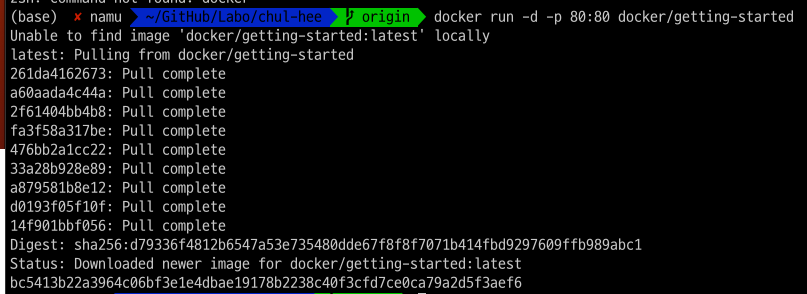

이렇게 한번 로컬 가져온 이미지는 다음 번 실행 시 다시 다운받을 필요없이 사용이 가능하다.  

그 후 Docker Desktop을 확인해보면 컨테이너가 하나 추가됐다.  

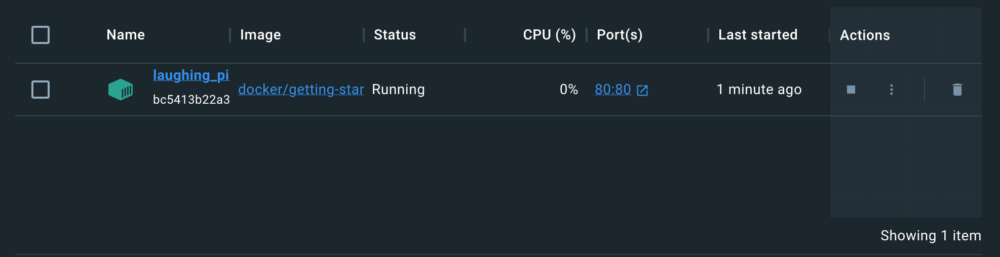  

```bash
docker run -d -p 80:80 docker/getting-started
```
다시보자.  
* -d : 컨테이너를 detached mode로 실행한다 (백그라운드)
* -p : 호스트의 80포트와 컨테이너의 80포트를 매핑한다.
* docker/getting-started  : 사용할 이미지

ubuntu 운영체제 컨테이너를 실행하고 그 안에서 bash쉘을 실행시킨다.  
```bash
docker run -it ubuntu bash
```

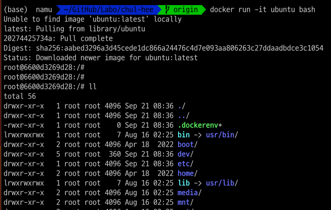  

ubuntu 이미지를 통해 컨테이너를 실행했고 '-it' 옵션을 통해 단말에 접속하여 bash 쉘을 실행한다.  
자세히보면 프롬프트가 어느샌가 root@6600d3269d28:/# 으로 바뀐것을 확인할 수 있다.  

<br>

## Day.45

### Docker 이미지 구조
Docker 이미지: Docker 플랫폼에서 executable한 컨테이너를 만들기 위한 읽기 전용 템플릿.  
애플리케이션과 그 실행에 필요한 모든 파일을 패키징하여 편리하게 이동/공유가 가능하다.  

__Docker 이미지를 생성하려면?__   
Docker 이미지를 생성하기 위해서는 Dockerfile을 생성해야 한다.  

지난 실습에서처럼 ubuntu 이미지를 가져와 컨테이너를 실행한 후, 추가적인 의존성들을 설치한다면?  
컨테이너가 종료되거나 재시작하면 추가적으로 설치한 모든 의존성들이 사라진다.  

### Dockerfile
Dockerfile을 통해 docker를 빌드할 때 수행해야할 명령들을 미리 정의할 수 있다.  

docker 이미지를 구성하는 각 계층을 레이어라고 하며, 이러한 레이어는 읽기전용으로 스택처럼 쌓이게된다.  
최종적으로는 맨 위에 위치하는 내용만이 새로 작성된 내용으로 이미지에 드러난다.  
각 레이어는 바로 아래 레이어에 종속되며, 이러한 레이어는 효율적인 docker 이미지 생명주기 관리의 핵심이다.

자주 변경되는 레이어는 가능한 스택에서 가장 높은 곳에 구성하는 것이 효율적이다.  
docker의 이미지 레이어를 변경하면, docker는 해당 레이어 뿐 아니라, 해당 레이어에서 빌드된 모든 레이어를 다시 빌드한다.  
따라서, 스택에 가장 최상위 레이어의 변경사항은 해당 레이어만을 빌드한다.  

docker가 이미지로부터 빌드되어 컨테이너로 수행될 때, __컨테이너 레이어__ 가 한 계층 추가된다.  
이 레이어는 컨테이너가 실행되는 동안의 모든 변경사항을 기록하게 된다.  
__컨테이너 레이어__ 는 컨테이너와 소스 이미지 사이 유일한 차이점이 된다.  

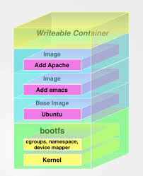  

---

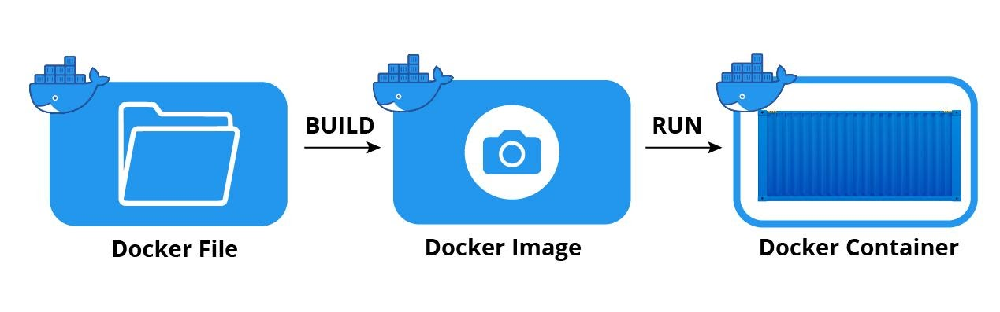  

Docker 이미지에는 개별 이미지 레이어 파일 뿐 아니라 manifest 파일도 포함된다.  
manifest에는 이미지에 대한 JSON 형식으로된 설명이며 이미지 태그, 전자서명, 다양한 호스트 플랫폼에 맞게 컨테이너를 구성하는 방법에 대한 세부정보와 같은 정보가 담겨있다.  

  

### Docker 이미지 생성  
이미지를 생성하는 두 가지 방법이 있다.  

```bash
# 컨테이너를 실행하고 그 위에 모든 종속을 설치한 후 사용한다.  
docker commit container name
```
이는 매우 간단하고 빠르지만, 라이프사이클을 관리하기 어렵고 수동 구성/재구성이 많이 필요하므로 추천되지 않는다.  

보통은 Dockerfile을 통한 방법을 추천한다.  
이는 더 쉬운 라이프사이클 관리와 CI/CD에 쉽게 통합할 수 있다든 장점이 있다.  

Dockerfile에는 총 3단계에 걸쳐 이미지를 생성하는데 필요한 명령들을 정의한다.  
|Command|Purpose|
|:-:|:-:|
|FROM|상위 이미지를 지정합니다.|
|WORKDIR|Dockerfile에서 다음에 나오는 명령의 작업 디렉터리를 설정합니다.
|RUN|컨테이너에 필요한 애플리케이션과 패키지를 설치합니다.|
|COPY|특정 위치에서 파일 또는 디렉터리를 복사합니다.|
|ADD|복사뿐만 아니라 원격 URL을 처리하고 압축 파일의 압축을 풀 수도 있습니다.|
|ENTRYPOINT|컨테이너가 시작될 때 항상 실행되는 명령입니다. 지정하지 않으면 기본값은 "/bin/sh -c"입니다.|
|CMD|엔트리포인트로 전달된 인자입니다. 엔트리포인트가 설정되지 않은 경우(기본값은 "/bin/sh -c"), 컨테이너가 실행하는 명령은 CMD가 됩니다.|
|EXPOSE|컨테이너 애플리케이션에 액세스할 포트를 정의합니다.|
|LABEL|이미지에 메타데이터를 추가합니다.|

기본적인 Dockerfile을 작성해보자
```bash
FROM ubuntu:18.04
RUN apt-get update && apt-get upgrade -y
RUN apt-get install -y nginx curl
RUN rm -rf /var/lib/apt/lists/*
```

현재 경로에 dockerfile을 생성했다면 이를 통해 다음과 같은 방법으로 이미지를 생성할 수 있다.  
기본적으로 Dockerfile을 찾아서 실행하지만, 이름을 다르게 생성했을 경우 명시해줘야 한다.  
```bash
# '.' 은 현재경로에 dockerfile이 있음을 명시. 
docker build -t [이미지명]:[태그] .
# 일반적으로는 username을 함께명시
docker build -t [사용자명]/[이미지명]:[버전태그]
docker build -t nginx_image:0.1 .
```

그 결과 nginx_image 라는 이름의 TAG 0.1인 이미지가 생성됐다.  

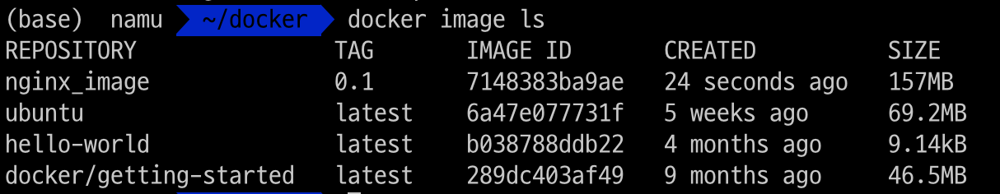  

생성한 Docker 이미지를 DockerHub에 푸시하기위해서는, 이미지 생성시 사용자명을 명시해줘야한다.  

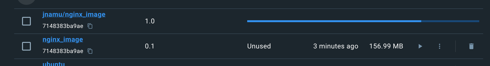  

DockerHub에 접속해 방금 업로드한 이미지를 확인할 수 있다.  

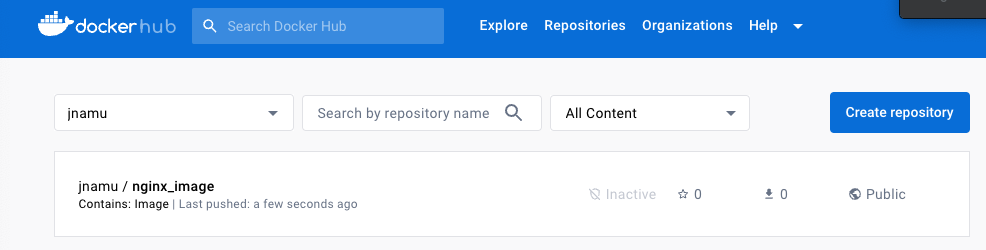

<br>

## Day.46

### Docker Compose
일반적으로 프로덕션 환경에서는 서로 다른 컨테이너 이미지를 통해 여러 애플리케이션을 빌드하고 사용하기 때문에 
컨테이너 하나만을 운용하는 것은 부족하다.  

특히 최근들어 MSA와 같은 아키텍처와 고가용성 및 안정성에 대한 내용들이 화두되며 여러 컨테이너를 다루고 싶은 욕구가 불어났다.  
이제는 많은 회사들이 프론트와 백을 분리하고, 웹서버와 각종 WAS, DB를 분리한다.  
신뢰성을 위해 서버를 다중화하고 DB도 다중화하여 클러스터링한다.  

클라우드 환경은 특히나 각 서버, 역할들을 격리된 하나의 컨테이너로 사용하기 적합하다.
이때 여러 컨테이너를 통해 더 복잡한 앱을 실행할 수 있는 도구로 Docker Compose가 등장한다.  

여러 컨테이너에 대한 내용을 단일 파일에 작성하고 단일 명령을 통해 실행할 수 있다.  

Docker Compose는 또 하나의 도구로 설치해야 할 대상이지만, Linux 환경에서만 추가적으로 설치하면 된다.  
mac, window 환경에서 docker desktop을 사용한다면 docker-compose는 이미 설치되어있을 가능성이 크다.  

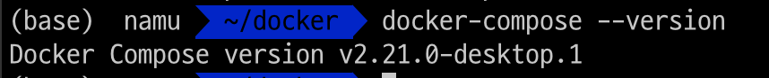  

### docker-compose.yaml
Docker Compose는 기본적으로 docker-compose.yaml 파일을 통해 여러 개의 컨테이너를 관리/배포한다.  
>docker-compose.yaml은 Docker Compose를 통해 명령하기 위한 구성파일이다.  

tutorial에서 제공하는 yaml 파일을 사용한다.  
```yaml
version: '3.9'

services:
  db:
    image: mysql:5.7
    platform: linux/amd64
    volumes:
      - db_data:/var/lib/mysql
    restart: always
    environment:
      MYSQL_ROOT_PASSWORD: somewordpress
      MYSQL_DATABASE: wordpress
      MYSQL_USER: wordpress
      MYSQL_PASSWORD: wordpress

  wordpress:
    depends_on:
      - db
    image: wordpress:latest
    volumes:
      - wordpress_data:/var/www/html
    ports:
      - '8000:80'
    restart: always
    environment:
      WORDPRESS_DB_HOST: db
      WORDPRESS_DB_USER: wordpress
      WORDPRESS_DB_PASSWORD: wordpress
      WORDPRESS_DB_NAME: wordpress
volumes:
  db_data: {}
  wordpress_data: {}
```

두 개의 서비스를 확인할 수 있다.  
1. db
2. wordpress  

각각은 mysql 5.7 버전과 worldpress의 최신 릴리즈 버전의 이미지를 가져와 사용한다.  
데이터베이스의 상태(데이터)를 저장할 수 있도록 볼륨을 생성하고 환경변수를 통해 비밀번호, 사용자 이름 등을 정의한다.  
그리고 wordpress 서비스는 db라는 앞서 정의한 mysql 컨테이너에 의존하고 있다.  

>## depends_on 옵션과 컨테이너 실행 순서  
>docker-compose에서 depends_on을 통해 서비스의 시작과 종료 순서를 제어할 수 있다.  
>depends_on은 특정 컨테이너에 대한 의존 관계를 나타내며, 이 항목에 명시된 컨테이너가 먼저 생성되고 실행되도록 한다.  
>(반대로 컨테이너가 제거될때는 의존하는 컨테이너가 먼저, 의존되는 컨테이너가 그 후에 제거된다)  
>
>주의해야할 점은 실행 순서만 제어할 뿐, 컨테이너 내부의 __어플리케이션이 준비된 상태인지에 대해 확인하지 않는다.__  
>(여담으로 links, volumes_from, network_mode: "service:..." 또한 같은 류의 종속성을 설정한다.)  
>
>DB 컨테이너와 웹서버 컨테이너가 순서대로 실행된다고 해도, DB가 초기화 중이라면 웹서버가 정상 작동하지 못한다.  
>이와같은 문제를 해결하기 위한 방법으로 depends_on에 condition을 통해 healthcheck를 하는 방법과 wait-for-it, dockerize 등 패키지를 사용하는 방법이 존재한다.  
>
>__depends_on에 몇가지 구성들을 추가할 수 있다.__  
>* restart: true로 설정하면 의존성 서비스가 업데이트 된 이후 Compose가 이 서비스를 재시작한다.  
>    * 주의할 점은 의존성 업데이트와 같은 Compose 작업에 한하여 적용된다. 컨테이너가 종료된 후 자동 다시시작과는 다르다.  
>* condition: depends_on, 즉 의존성이 충족된 것으로 판단하는 기준을 설정  
>    * service_started: 컨테이너 실행(디폴트)
>    * service_healthy: 의존 서비스를 시작하기 전에 의존성이 정상(healthchek를 통해)일 것으로 예상되어야 함.
>    * service_completed_successfully: 의존 서비스를 시작하기 전에 의존성이 성공적으로 완료될 때까지 기다려야함.
>* required: false로 설정하면 의존성 서비스가 시작되지 않거나 사용불가할 때 경고만 제공한다.  
>
>__healthcheck__  
>서비스 컨테이너의 정상 여부를 확인한다. Dockerfile과 동일한 방식으로 작동하며, Compose 파일이 Dockerfile에 설정된 값을 재정의하게 된다.  
>```yaml
># test: 컨테이너 상태확인을 위해 Compose가 실행하는 명령
># 문자열이거나 목록일 수 있으며, 목록인 경우 첫번째 항목은 NONE 또는 CMD, CMD-SHELL이어야 함.
># string은 목록에서 CMD-SHELL을 쓰는것과 같다.
>healthcheck:
>    test: ["CMD", "curl", "-f", "http://localhost"]
>    interval: 1m30s
>    timeout: 10s
>    retries: 3
>    start_period: 40s
>    start_interval: 5s
>```
>
>```yaml
>test: ["CMD-SHELL", "curl -f http://localhost || exit 1"]
>위 아래 두 문장은 같다.
>test: curl -f https://localhost || exit 1
>```
>
>최종적으로 작성되는 docker-compose 파일은 다음과 같다.  
>```yaml
>version: '3.8'
>services:
>  applicaion-service:
>    image: your-applicaion-service:0.0.1
>    depends_on:
>      cassandra-init-keyspace:
>        condition: service_completed_successfully
>
>
>  cassandra:
>    image: cassandra:4.0.1
>    ports:
>      - "9042:9042"
>    healthcheck:
>      test: ["CMD", "cqlsh", "-u cassandra", "-p cassandra" ,"-e describe keyspaces"]
>      interval: 15s
>      timeout: 10s
>      retries: 10
>
>  cassandra-init-keyspace:
>    image: cassandra:4.0.1
>    depends_on:
>      cassandra:
>        condition: service_healthy
>    volumes:
>      - ./src/main/resources/cassandra/init.cql:/init.cql
>    command: /bin/bash -c "echo loading cassandra keyspace && cqlsh cassandra -f /init.cql"
>```
>
>[docker docs: depends_on](https://docs.docker.com/compose/compose-file/05-services/#depends_on)  
>[docker docs: healthcheck](https://docs.docker.com/compose/compose-file/05-services/#healthcheck)  
>[how to start service only when other service had comleted?](https://stackoverflow.com/questions/48092592/how-to-start-service-only-when-other-service-had-completed)
>
>wait-for-it는 쉘 스크립트로 작성되어 있어 설치와 적용이 간단하다.  
>[wait-for-it](https://github.com/vishnubob/wait-for-it)  
>dockerize는 비교적 복잡하지만, 순차적 서비스 실행 이외에도 환경변수 설정, 로그 파일 위치 지정 등 다양한 기능을 제공한다.  
>[dockerize](https://github.com/jwilder/dockerize)


### 프로젝트 빌드
이제 앞서 작성한 docker-compose.yaml 파일을 통해 두 개의 서비스 컨테이너를 실행해보자.  

>mac에서는 docker-compose.yaml의 서비스 하위에 ;platform: linux/amd64' 항목을 추가하자.  
mysql의 디폴트 이미지를 arm으로 찾으려다, 해당하는 이미지가 존재하지 않아 실패할 수 있다.

```bash
docker-compose up -d
```

먼저 mysql과 워드프레스의 docker 이미지를 다운받은 후 컨테이너가 실행된다.  

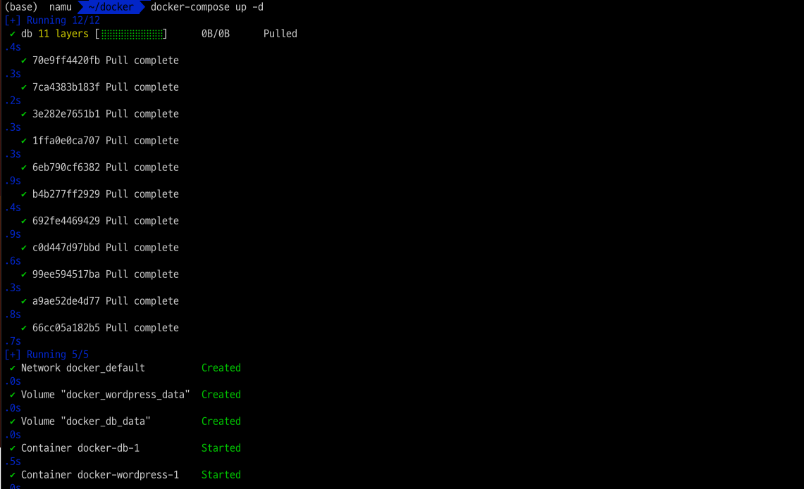  

docker ps를 통해 현재 실행중인 docker 컨테이너의 정보를 확인할 수 있다.  
db 서버와 워드프레스 서버가 실행되고 있다.  

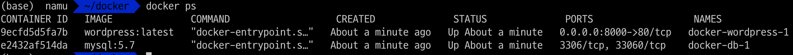  

워드프레스 서버가 돌고있는 localhost:8000에 접속하면 다음과 같은 워드프레스 화면이 나타난다.

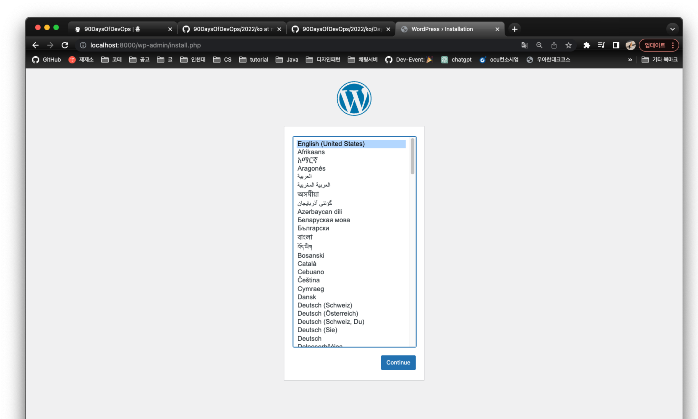

docker 데스크톱에는 다음과 같이 두 컨테이너가 묶여서 나오는 것을 확인할 수 있다.

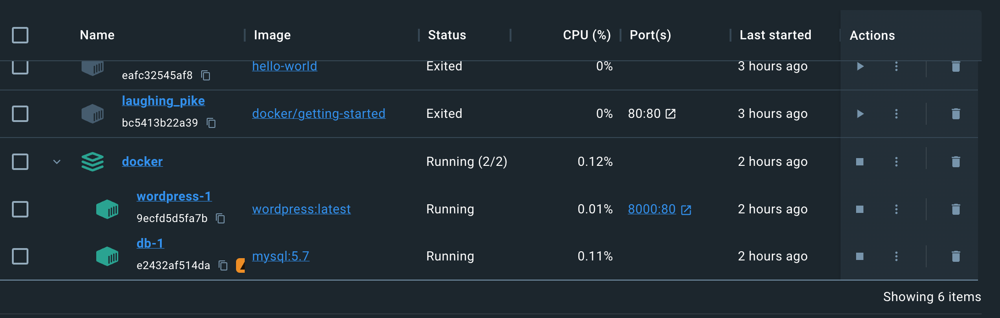

이제 컨테이너를 삭제하자.  
```bash
# docker-compose down 으로 컨테이너를 삭제해도 볼륨은 여전히 남는다!
docker-compose down
# 주의! 아래 명령은 볼륨까지 삭제한다.
docker-compose down --volumes
```

### docker compose vs kubernetes  
kubernetes 클러스터의 노드들은 여러 서버에 걸쳐 실행된다.  
이와 같이 여러 서버에 걸친 다중 컨테이너를 관리, 자동화, 오케스트레이션하는 것이 kubernetes의 목적이다. 

반면에 Docker Compose의 경우 하나의 호스트에서 여러 대의 컨테이너를 실행하는 것에 초점이 맞춰져있다.  
여기서 논의할 점은 Docker Compose에는 여러 가상머신이나 물리적 머신이 없다는 것이다.  


[awsome-compose](https://github.com/docker/awesome-compose/tree/master/elasticsearch-logstash-kibana)  
도커 컴포즈를 통해 ELK 스택을 배포하는 샘플 코드를 제공한다.  

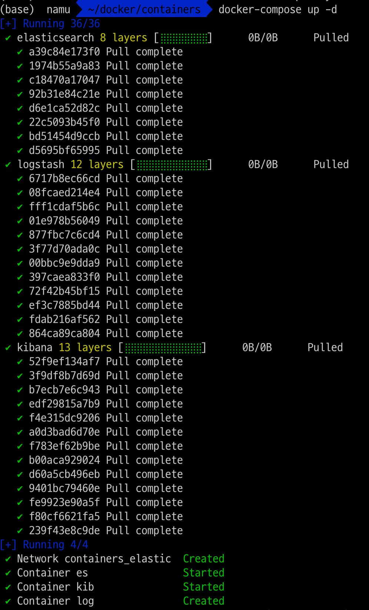  


<br>

## Day.47 

### Docker 네트워킹 및 보안

```bash
# 컨테이너 네트워크를 구성/관리하기 위한 기본 명령어
docker network
```

각 네트워크는 고유한 ID와 이름을 갖으며, 단일 드라이버와 연결된다.  
bridge 네트워크와 host 네트워크는 각각의 드라이버와 이름이 동일하다.  host = host, bridge = bridge
```bash
# 네트워크 목록 확인
docker network ls
```


```bash
# inspect: 점검하다.  
docker network inspect 
docker network inspect bridge
```

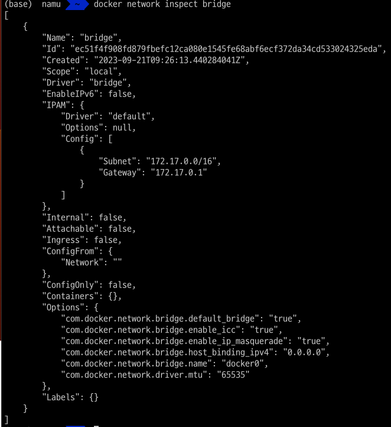  

#### bridge 
도커를 설치하면 brdige라는 pre-defined된 네트워크가 제공된다.  
여기서 네트워크의 이름과 드라이버의 이름이 모두 brdige로 같지만, 그 둘은 같지 않다.  

이 말은 다른 이름을 가진 네트워크가 같은 bridge 드라이버로 연결될 수 있다는 의미이다.  
위 inspect 명령의 결과로 bridge 네트워크의 scope(범위)가 로컬로 지정되있음을 확인할 수 있다.  
* local: 네트워크가 이 docker host에만 존재한다는 것을 의미
* bridge 드라이버로 생성된 모든 네트워크는 Linux bridge(virtual switch)를 기반으로 한다.  


### 컨테이너 연결
컨테이너 생성 시, 네트워크를 지정하지 않으면 기본적으로 bridge 사용  

```bash
# sleep 명령을 계속 실행 (백그라운드 -d)
docker run -dt ubuntu sleep infinity
```

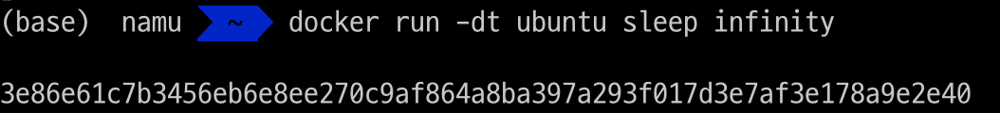

```bash
docker network inspect bridge
```

네트워크를 지정하지 않았기 때문에, 기본적으로 bridge 네트워크를 사용한다.  
bridge 네트워크의 정보에서 위에서 생성한 컨테이너를 확인할 수 있다.

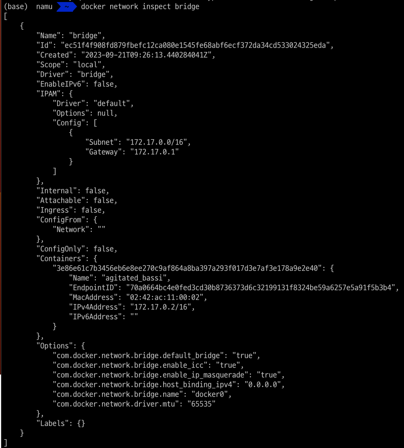  


### 외부 연결을 위한 NAT 구성
시나리오  
Nginx 컨테이너 8080:80 배포. 
```bash
docker run --name web1 -d -p 8080:80 nginx
```

'0.0.0.0:8080->80/tcp': 모든 host 인터페이스의 8080 포트를 web1 컨테이너 내부의 80포트에 매핑  
외부소스에서 컨테이너의 웹 서비스에 액세스할 수 있게 해줌  

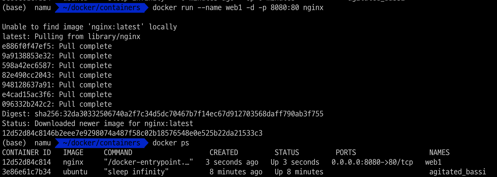  

브라우저에서 [IP 주소]:8080 에 접속하면 다음과 같은 nignx 서버의 기본 페이지를 확인할 수 있다.  

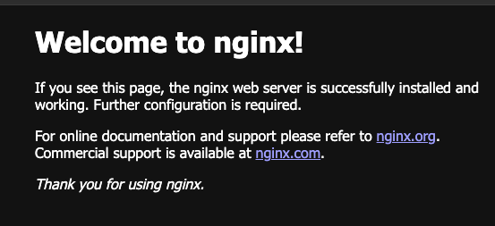


### 컨테이너 보안
컨테이너는 전체 서버 구성에 비해 안전한 워크로드 환경 제공  
* 컨테이너가 하나의 보안 경계로 작용  
* 역할과 책임의 분리, 최소 권한 원칙
* Vulnerable surface 감소

#### 루트 권한  
docker는 기본적으로 root 권한을 사용한다.  
이는 엔터프라이즈 환경에 부적합하며 많은 보안 취약점을 유발한다.  

이를 위해 일반 사용자가 docker에 대한 명령을 수행할 수 있도록 만드는 방법이 있다.  
기본적으로 dockerfile을 만들 때 사용자 계정을 만들 수 있다.  
```bash
FROM ubuntu:18.04
RUN apt-get update && apt-get upgrade -y
# gid 1000 그룹 생성(basicuser) && uid 1000, 그룹 basicuser의 basicuser라는 유저 생성
RUN groupadd -g 1000 basicuser && useradd -r -u 1000 -g basicuser basicuser
# 이 컨테이너를 통해 실행되는 command는 basicuser의 권한으로 수행
USER basicuser
```

#### private registry
DockerHub를 통해 외부의 이미지를 가져와서 실행할 경우, 해당 이미지 퍼블리셔가 믿음직한지, 이미지 자체가 변조되진 않았는지 등 신경써야 할 보안요소가 많다.  
이를 해결하기 위해 사내에서 사용하는 이미지의 경우 private registry를 구성해 사내 네트워크 상에서만 접속할 수 있도록 구성할 수 있다.  

Docker Registry를 통해 간단한 프라이빗 레지스트리를 구성할 수 있다.
[Docker Registry](https://github.com/jang-namu/cclab-research/blob/main/Docker.md#2-docker-registry%EB%A1%9C-%ED%94%84%EB%9D%BC%EC%9D%B4%EB%B9%97-%EB%A0%88%EC%A7%80%EC%8A%A4%ED%8A%B8%EB%A6%AC-%EA%B5%AC%EC%B6%95)  

<br>

## Day.48 
Docker는 애플리케이션을 개발, 테스트, 배포 및 관리하기 위한 플랫폼으로 컨테이너를 대중화시켰지만,  
최근에는 Docker 이외에도 여러 선택지가 존재한다.  

### Docker의 대안

#### Podman
Podman은 리눅스 시스템에서 OCI 컨테이너를 개발, 관리, 실행하기 위한 __데몬이 없는__ 컨테이너 엔진.  
컨테이너를 루트로 실행하거나 루트리스 모드로 실행할 수 있음  

#### LXC
LXC는 사용자가 여러 개의 리눅스 컨테이너 환경을 생성할 수 있게 해주는 컨테이너 엔진  
Docker와 달리 별도의 시스템 파일과 네트워킹 기능을 갖춘 리눅스 머신을 생성하기 위한 하이퍼바이저로 동작  

#### Containerd  
__독립형 컨테이너 런타임__  
Docker에 일부였다가 분리되었다. 현재는 CNCF의 주요 컨테이너 런타임으로 속해있다.  

### 기타 Docker 도구

#### Gradle  
빌드 스캔을 통해 디버깅, 모든 빌드의 이력을 추적  
실행 옵션을 통해 변경사항 업데이트 시, 자동으로 빌드 실행  
사용자 지정으로 모든 파일 디렉토리 구조를 아티팩트 리포지토리로 지정할 수 있음

#### Packer
여러 머신 이미지를 병렬로 생산  
내장 디버거를 통해 빌드 시 쉽게 디버깅  

#### Logspout
로깅 도구로 동일한 로그를 여러 대상에게 전송할 수 있고 오픈소스이다.  
Docker 소켓에 액세스하기만 하면 되기 때문에 파일 관리가 간단해진다.  

#### Logstash
플러그인을 통한 데이터 파이프라인 사용자 정의  
분석을 위한 데이터 구문 분석/변환, 다양한 출력 포맷  

#### Portainer
템플릿을 통한 애플리케이션 배포  
팀원 생성과 역할/권한 부여  


### Review: Understaing Contianers
[Understanding containers - Red Hat](https://www.redhat.com/en/topics/containers)  https://docs.docker.com/engine/deprecated/
컨테이너는 애플리케이션과 그 실행 환경, 실행에 필요한 모든 파일 모두를 패키징/격리하는 기술이다.  
컨테이너는 개발, 테스트, 상용과 같은 서로 다른 환경 간 이동을 간단하게 만든다.  
또한, 컨테이너는 security에도 중요한 역할은 하는데, 컨테이너 파이프라인에 보안요소를 세움으로써 인프라, 컨테이너의 신뢰성, 확장성, 신뢰성을 보장한다.  
컨테이너화된 애플리케이션은 public, private 그리고 하이브리드 클라우드와 온프레미스 환경 등 전반에서 일관된 기능과 실행을 보장하며 손쉬운 이동이 가능하다.  

#### 컨테이너의 장점
컨테이너는 개발/운영 팀간 책임 영역을 분리함으로써 충돌을 최소화한다.   
이를통해 개발팀은 앱에 집중하고 운영팀은 인프라에 집중할 수 있다.  
컨테이너는 오픈소스 기반 기술이기 때문에, Podman, Skopeo, Buildah, CRI-O, k8s, 그리고 docker와 같은 훌륭한 도구들을 사용할 수 있다.  

컨테이너는 시스템의 운영체제 커널을 공유하고 프로세스를 격리함으로써 테스팅, 개발, 상용 환경을 이리저리 쉽게 옮겨다닐 수 있다.  
컨테이너는 가볍고 이식성이 높기 때문에 빠른 개발과 배포가 가능하다.  

#### 컨테이너 오케스트레이션이란?, 컨테이너로 할수있는 것
상용환경에서는 수백, 수천대의 컨테이너를 운용하기 때문에 이를 일일히 제어하기는 어렵다.  
쿠버네티스와 같은 컨테이너 오케스트레이션 툴은 여러 컨테이너를 클러스터로 배포하고 이를 관리하기 위한 자동화된 솔루션을 제공한다.  

컨테이너 기반 어플리케이션은 높은 수준의 분산 클라우드 아키텍처에서 작동할 수 있으며, 여러가지 툴을 통해 개발, delivery, 통합, 자동화를 제공한다.  
마이크로서비스 아키텍처를 사용하다면 컨테이너는 각각의 마이크로 서비스로서 배포될 수 있으며, 각 컨테이너는 service mesh 네트워크를 통해 연결된다.  


<br>
<br>
<br>

# Kubernetes

## Day.49  

### Overview: Kubernetes
docker-compose: 호스트 한대에서 여러 개의 컨테이너를 통합/관리  
kubernetes: 여러 노드(머신)에 걸친 컨테이너를 통합/관리  

플랫폼으로서 쿠버네티스느는 요구사항과 desired state에 따라 컨테이너를 오케스트레이션  
컨테이너 오케스트레이션 도구에는 쿠버네티스 뿐 아니라, Docker Swarm, Hashicorp Nomad 등..  

### Kubernetes란?  
[kubernetes.io](https://kubernetes.io/docs/concepts/overview/)  

쿠버네티스는 컨테이너화된 워크로드와 서비스를 관리하기 위한 이식 가능하고 확장 가능한 오픈소스 플랫폼  
선언적 구성과 자동화에 용이  

컨테이너만으로는 프로덕션 환경에 적용하기 어려움  
쿠버네티스는 다음과 같은 이점을 제공  
1. Service Discovery 및 Load balancing  
쿠버네티스는 DNS 또는 IP 주소를 통해 컨테이너를 노출할 수 있음  
또한, 네트워크 트래픽을 로드밸런싱하고 분산하여 안정적인 배포를 가능하게함
2. Storage Orchestration  
로컬 스토리지, CSP 등 원하는 스토리지 시스템을 자동으로 마운트 가능  
3. Automated rollouts and rollbacks
배포된 컨테이너에 대해 desired state를 수정할 수 있으며, 실제 상태를 desired state에 맞춰 변경할 수 있음.  
ex) 롤링 업데이트, 블루-그린 디플로이먼트, '배포를 위한 새 컨테이너를 생성, 기존 컨테이너 제거, 모든 리소스를 새 컨테이너에 적용.'하는 과정을 모두 자동화   
>rollout: 새 버전의 소프트웨어를 배포하는 프로세스  
rollback: 문제가 발생한 경우 이전 버전으로 되돌리는 프로세스  
4. Automatic bin packing
컨테이너화된 작업을 실행하는 데 사용할 수 있는 노드 클러스터를 쿠버네티스에 제공하고  
각 컨테이너에 필요한 CPU와 메모리량을 쿠버네티스에 알림, 쿠버네티스는 리소스를 효율적으로 활용학 위해 컨테이너를 노드에 맞춤
5. Self-healing
장애가 발생한 컨테이너를 다시 시작, 컨테이너의 교체, user-defined health check에 응답하지 않는 컨테이너를 죽이고  
이 과정에서 서비스를 제공할 준비가 될 때까지 클라이언트에 알림을 보내지 않는다.  
6. Secret and Configuration Management  
패스워드, OAuth 토큰, SSH key와 같은 민감한 정보를 저장/관리하게 해줌  
컨테이너 이미지를 변경하거나 구성 파일의 민감한 정보를 노출하지 않고 애플리케이션 구성이나 secret을 업데이트/deploy할 수 있음

<br>

쿠버네티스는 분산 시스템을 탄력적으로 실행할 수 있는 프레임워크 제공  
오케스트레이션: 컨테이너의 배포, 배치 및 라이프 사이클을 관리
또한,
* 호스트를 하나의 대상으로 묶어 클러스터로 관리
* 컨테이너를 적절한 노드에 배포하기 위한 스케줄관리
* 클라이언트의 요청을 적절한 컨테이너로 라우팅하기 위한 서비스 디스커버리
* 워크로드에 적합한 수의 노드와 컨테이너를 보장하는 복제
* un-healthy한 컨테이너와 노드를 감지하고 교체

### Kubernetes 주요 구성요소
쿠버네티스는 애플리케이션을 프로비저닝, 관리 및 확장하기 위한 컨테이너 오케스트레이터  
VM 또는 물리적 머신과 같은 워커머신의 모음인 노드 클러스터에서 컨테이너화 된 앱의 생명주기를 관리  

앱을 위한 리소스(DB커넥션, 네트워크, 시크릿..)를 앱에 추가  
앱에 필요한 인프라 리소스는 선언적으로 관리  

선언적 모델: 사용자가 원하는 상태를 정의하면 쿠버네티스가 이에 맞춰 자동으로 상태를 조정  

### 클러스터
노드의 그룹. 각 노드에는 컨테이너 런타임, kubelet(컨트롤 플레인의 명령을 받는 에이전트), 프록시 존재  
컨트롤 플레인은 워커노드와 비교하여 몇가지 고유한 역할을 가짐 -> 가장 중요한 것 = Kube API서버  

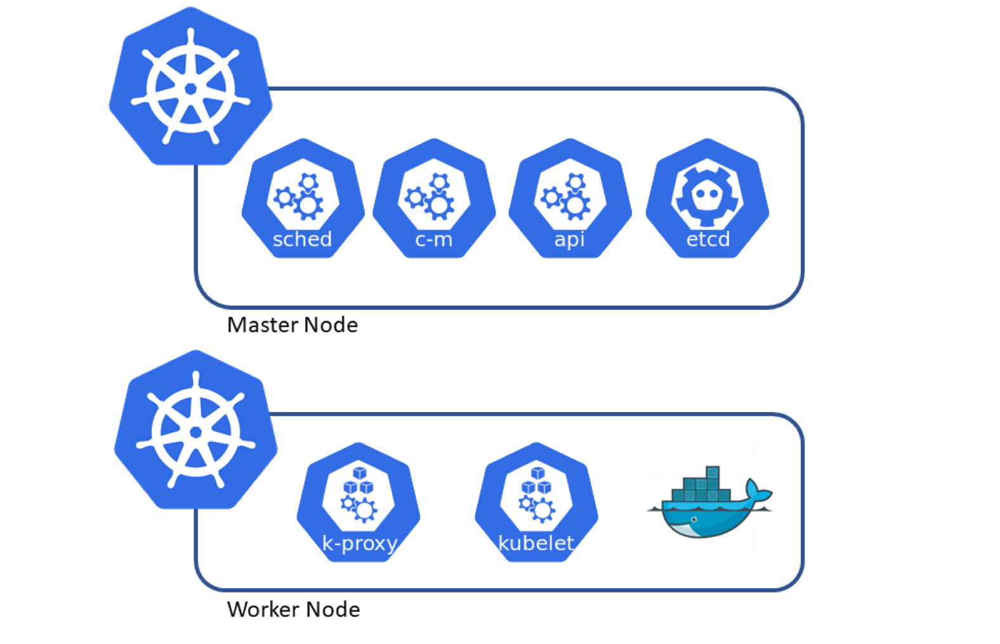  

#### 컨트롤 플레인 
모든 쿠버네티스 클러스터에는 컨트롤 플레인 노드 필요  
클러스터에 대한 전역적인 결정(ex 스케줄링)을 내리고 클러스터 이벤트를 감지 및 응답  

#### Kube API 서버
Pod, 서비스, 응답 컨트롤러 등 API 오브젝트에 대한 데이터의 유효성 검사와 구성을 맡음  
다른 모든 컴포넌트가 상호작용하는 클러스터의 shared state에 대한 프론트엔드와 REST operation을 제공함

#### 스케줄러  
파드를 노드에 할당하는 프로세스를 수행.  
스케줄링 큐에 있는 파드들 각각의 제약 및 사용가능한 리소스를 고려하여 적합한 노드를 결정  
스케줄러는 노드에 대한 순위를 매기고 파드를 적합한 노드에 바인드시킴  

#### 컨트롤러 매니저
쿠버네티스와 함께 재공되는 핵심 제어 루프를 임베드하는 daemon.  
시스템 상태를 조정하는 비종료 루프로 API 서버를 통해 클러스터의 shared state를 감시하고  
현재 상태를 desired state로 이동시키기 위해 변경을 시도하는 제어루프  

#### etcd
모든 클러스터 데이터를 저장하는 쿠버네티스의 백업 저장소  
일관성과 높은 가용성을 보장하는 키/값 저장소

<br>

#### 워커 노드 
워크로드를 수행하는 워커 머신, 물리적(베어메탈) 머신이거나 VM일수있음  
각 노드는 하나 이상의 Pod를 호스트 가능, 쿠버네티스 노드는 컨트롤 플레인에 의해 관리됨  

#### kubelet  
클러스터의 각 노드에서 실행되는 에이전트, 컨테이너가 Pod에서 실행되고 있는지 확인  
PodSpec을 참고하여 스펙에 해당하는 컨테이너가 실행 중이고 정상인지 확인   

#### kube-proxy
클러스터의 각 노드에서 실행되는 네트워크 프록시, 쿠버네티스 서비스 개념의 일부를 구현  
노드에서 네트워크 규칙을 유지/관리. 규칙은 클러스터 내부 또는 외부의 네트워크 세션에서 Pod로의 네트워크 통신을 허용함  
운영체제 패킷 필터링 계층이 사용가능하면 이를 사용하고, 그렇지 않을 경우 트래픽 자체를 전달함.  

#### 컨테이너 런타임
컨테이너 실행을 담당. docker/containerd/CRI-O...   

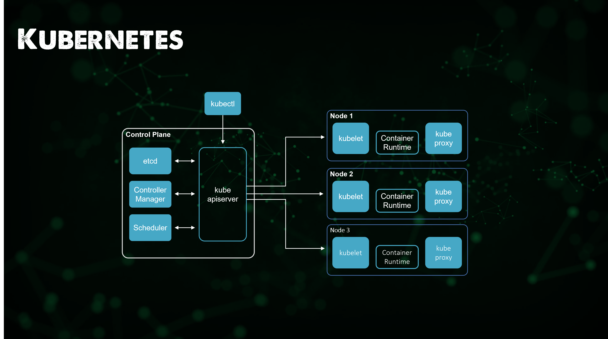  

<br>

### Pod
논리적 __애플리케이션을 구성하는 컨테이너 그룹__  
Pod는 공통 데이터볼륨/네트워킹 네임스페이스 공유  
임시적이며 컨트롤 플레인의 결정에 의해 이동/변경 될 수 있음  
쿠버네티스는 Pod를 식별하기 위해 레이블(이름-값) 개념 사용   
* 컨테이너의 볼륨, secret, configuration을 다룸
* 임시적, 죽을 경우 자동으로 재시작
* ReplicationSet에 의해 수평적으로 확장될 때 복사되며, 각 Pod는 동일한 컨테이너 코드를 실행하게됨

### Deployments
Pod를 따로 실행시킬 수도 있지만, 이런 경우 Pod가 죽으면 그냥 죽고 끝나버림(재시작하지 않음)  
Deployment는 Pod가 지속적으로 실행되게 만들 수 있음  
현재 실행하고있는 앱을 downtime 없이 업데이트하거나 Pod가 죽었을 때 재시작하는 전략을 지정할 수 있음  

### ReplicaSets
레플리카셋은 앱이 원하는 만큼의 Pod를 갖도록 보장함  
Deployment가 레플리카셋을 생성하는 경우도 있으며, 레플리카셋은 Deployment에 따라 Pod를 생성하고 확장함  

>Pod, ReplicaSets, Deployments는 일반적으로 서로 배타적이지 않지만 그렇게 설계할수도 있음  

### StatefulSet
앱이 상태(state)에 대한 정보를 유지하길 원할 경우 사용(ex Database)  
StatefulSets의 Pod는 서로 대체될 수 없음(호환이 안됨)  
* 각 Pod에는 고유하며 영구적인 식별자가 존재. 컨트롤러는 모든 rescheduling에 대해 이 정보를 유지한다.  

### DaemonSet
연속적인 프로세르를 위한 컴포넌트  
노드 당 하나의 Pod로 실행됨  
클러스터에 새로운 노드가 하나 추가될때마다 Pod가 실행됨  
모니터링이나 로깅과 같은 백그라운드 작업에 유용  
* StatefulSets과 마찬가지로 각 Pod에는 고유하며 영구적인 식별자가 존재. 컨트롤러는 모든 rescheduling에 대해 이 정보를 유지한다.  

<br>

### Service
__Pod에 액세스하기 위한 단일 엔드포인트__  
최종적으로 클러스터의 Pod 목록 중 하나로 중 트래픽을 라우팅하는 방법  
임시적인 요소인 Pod를 지속적으로 연결할 수 있게 만들어줌  

  

<br>

## Day.50 
쿠버네티스 플랫폼 

1. Bare-Metal 클러스터  
여러 대 물리적 서버에서 Linux OS를 실행하는 옵션이 가장 대중적  
쿠버네트스 클러스터를 직접 구축하고 관리할 관리자가 필요

2. Virtualisation(가상화)  
테스팅, 학습, 프로덕션 할것없이 많이 사용  
가상머신을 스핀업하여 노드로 사용해서 함께 클러스터링. VMware나 Hyper-V 등도 다양한 형태의 솔루션 제공    
>spin up, 스핀업  
>어딘가 컴퓨터에 존재하는 VM을 부트하는 것

3. 로컬 데스크탑  
무료이고 실제 쿠버네티스 운영 환경과 비슷한 환경에서 작업, 학습할 수 있는 환경 구성할 수 있음.  
Minikube는 로컬에 클러스터를 구성하고 많은 애드온을 제공

4. 쿠버네티스 Managed 서비스
퍼블릭 클라우드의 가상 머신을 활용하여 노드로 사용.  
최종 사용자로부터 관리 및 제어 계층을 제거한 서비스로 아마존 EKS, 마이크로소프트 AKS, 구글 쿠버네티스 엔진(GKE) 등  

이외에도 Red Hat의 OpenShift 등, OpenShift는 대부분의 주요 CSP에서 실행 가능하며 클러스터가 배포된 위치에 상관없이 관리자에게 최상의 사용성 제공   

Minikube는 애드온을 통해 빠르게 구축이 가능하고, 사용 후 빠르게 날려버릴 수 있음  
멀티플 클러스터를 구성할수도 있으며, 대부분 환경에서 실행가능  
[Minikube(권장)](https://vzilla.co.uk/vzilla-blog/project_pace-kasten-k10-demo-environment-for-everyone)  

<br>

## Day.51

### 쿠버네티스 클러스터 배포하기  
Minikube 이용, 로컬 머신에서 클러스터를 배포해보자  

__Minikube?__  
macOS, 윈도우, 리눅스 환경에서 로컬 쿠버네티스 클러스터를 빠르게 구성할 수 있음  
애플리케이션 개발자와 새로운 쿠버네티스 사용자를 돕기위한 프로젝트(학습, 테스트용으로 많이 사용)  

[Start Minikube](https://minikube.sigs.k8s.io/docs/start/)  
Minikube를 실행하기위해선 컨테이너 런타임이나 VM 매니저가 필요(docker, Hyper-V, Podman 등등)  

arkade는 쿠버네티스용 마켓플레이스, docker-compose, argocd ... 등 쿠버네티스 도구를 쉽게 다운받게 해줌  
__arkade 다운__ [GitHub: arkade](https://github.com/alexellis/arkade)
```bash
curl -sLS https://get.arkade.dev | sudo sh
```


</img>  

</img>  


### 클러스터 start / run
클러스터를 실행/배포.  

```bash
minikube start
```

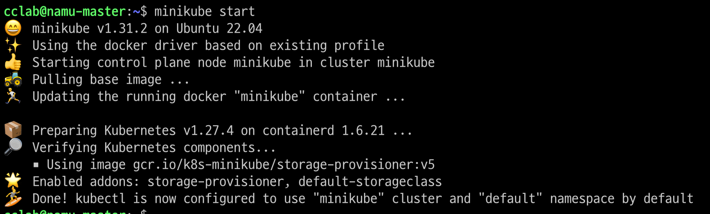  

미니쿠베 애드온 등을 추가하여 클러스터를 확장할 수 있다.

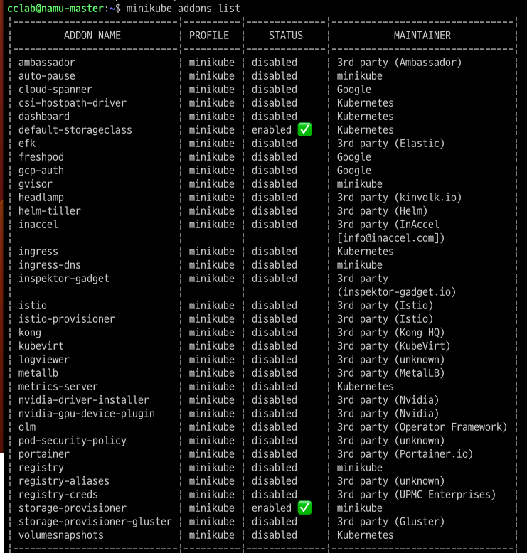  

Minikube 클러스터는 단일 Docker 컨테이너로 실행  
컨테이너에는 컨트롤 플레인 노드와 워커노드를 하나의 인스턴스에 포함  

애드온을 포함해 확장된 클러스터 구성을 저의하고 실행한다.  
apiserver의 포트를 6443으로 설정하고 컨테이너런타임으로 containerd를 사용, 쿠버네티스 버전도 1.21.2를 명시해 사용  
```bash
minikube start --addons volumesnapshots, csi-hostpath-driver --apiserver-port=6443 --container-runtime=containerd -p mcd-demo --kubernetes-version=1.21.2
```

arkade로 kubectl 설치  
```bash
arkade get kubectl
```

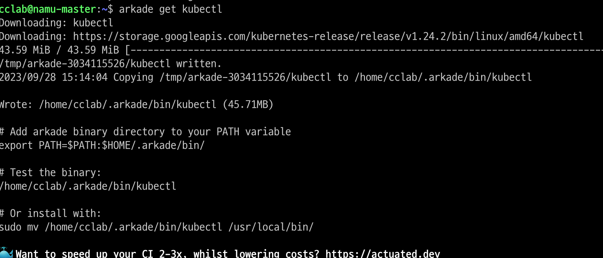  


클러스터의 노드 확인  
```bash
kubectl get nodes
```

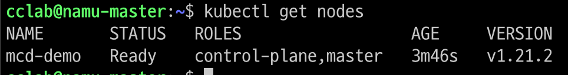  

<br>

### Kubectl
Kubectl은 k8s 클러스터와 상호작용하기 위한 cli  
애플리케이션 배포, 클러스터 자원 점검 및 관리를 위해 사용  
컨트롤플레인 노드의 API 서버와 통신하며 작동한다.  

[kubectl cheat sheet - Unofficial k8s](https://unofficial-kubernetes.readthedocs.io/en/latest/)  

<br>

## Day.52

### 멀티노드 쿠버네티스 클러스터 by Vargrant

#### Vagrant
VM 라이프사이클을 관리하는 CLI 유틸리티  
vSphere, Hyper-V, VirtualBox, Docker 등 다양한 플랫폼에서 VM을 스핀업/다운 하는데 사용  

#### Lab
[실습용 Vagrantfile](https://github.com/MichaelCade/90DaysOfDevOps/tree/main/2022/Days/Kubernetes)

arkade를 통해 vagrant를 다운받는다.
```bash
arkade get vagrant
```  

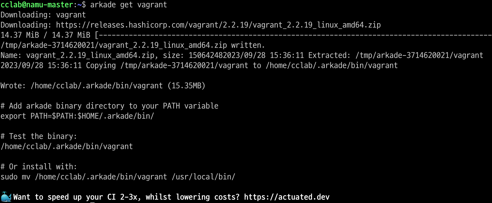  

ESXi로 띄운 VM에소 vagrant를 다운받고 실행했더니 다음과 같은 오류가 생겼다.  
ubuntu 22.04부터는 libfuse2가 더 이상 기본적으로 설치되지 않는다고 한다.  
[error loading libfuse.so.2](https://github.com/Zettlr/Zettlr/issues/3517)


apt를 통해 libfuse2를 설치한다
```bash
sudo apt install libfuse2
```

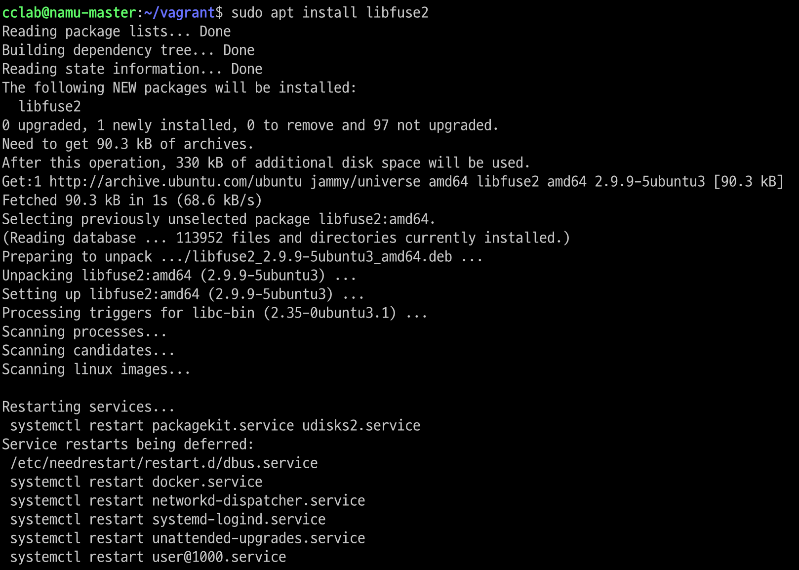  

libfuse2를 설치한 후, 다시 한 번 'up' 해본다.  
시스템에 사용할 수 있는 디폴트 provider가 없다고 한다.  
Vagrant를 실행하기 위한 run develpoment environments, 즉 실행환경을 찾을 수 없단다.  
Vagrant는 Hyper-V, VMware, VirtualBox,, 그리고 Docker에서 사용할 수 있다.  

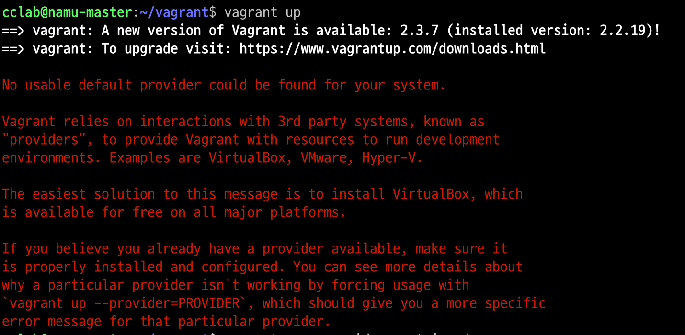

docker를 provider로 명시하여 Vagrant를 실행하겠다.
```bash
vagrant up --provider=docker
```

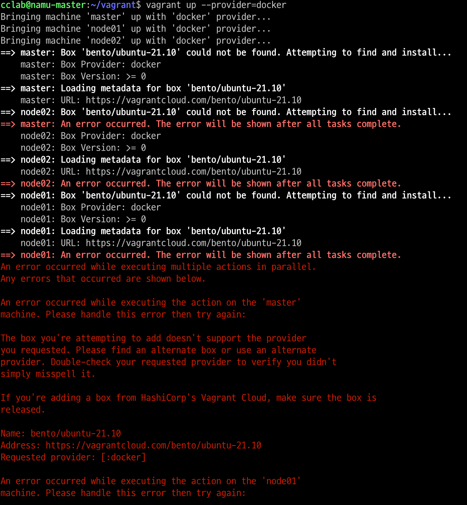  

예시에서 사용하는 Vagrant Box가 docker provider를 지원하지 않는다고 한다.  

### VirtualBox Beta
m1 mac은 VirtualBox의 stable 릴리즈가 없다.  
이전에 m1 맥용 VirtualBox Beta로 설치해둔게 있어서 로컬환경에서 진행한다.  

vagrant 폴더를 만들고 그 안에 Vagrantfile을 작성했다.  
[실습용 Vagrantfile](https://github.com/MichaelCade/90DaysOfDevOps/tree/main/2022/Days/Kubernetes)  

iterm에서 vagrant를 실행한다.  
```zsh
vagrant up
```

안된다. 스크립트가 존재하지 않다고한다.  
당연하다. 위 링크에서 scripts 폴더와 그 안에 쉘 스크립트 파일을 해당경로에 가져와야한다.

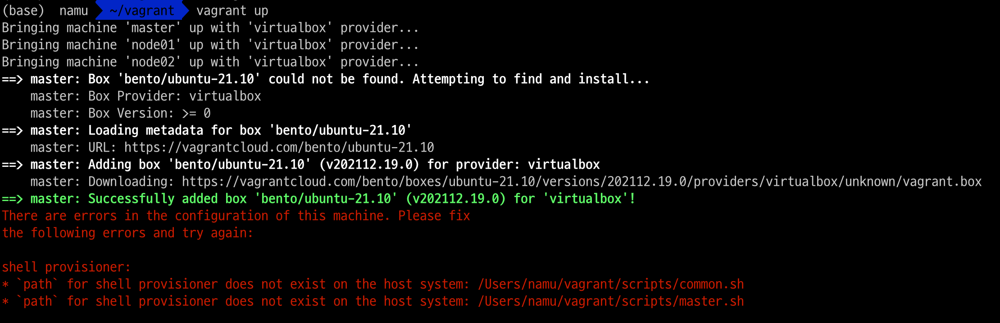  

폴더와 스크립트 파일을 작성하고 실행한다.  

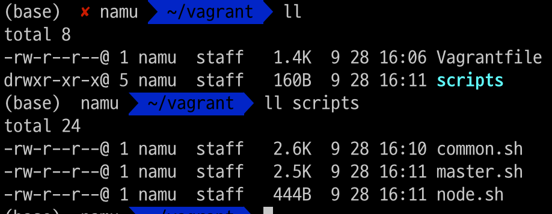  

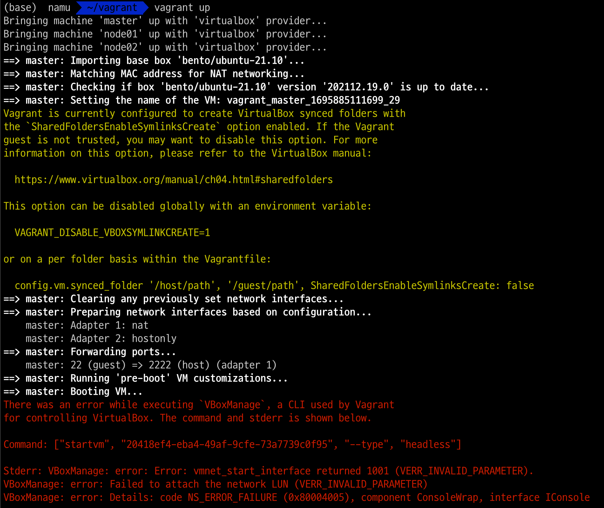  

vmnet_start-interface의 인수가 이상하다고 한다.  

.. skip

[Vagrant VM에서 Kubernetes 클러스터를 설정하는 방법](https://devopscube.com/kubernetes-cluster-vagrant/)


### 쿠버네티스 클러스터에 액세스  
Context: Kubeconfig 파일의 context 요소는 그룹에 접근하기 위한 별칭으로 사용  
각 Context는 cluster, namespace, user의 세 파라미터를 가짐  
kubectl cli는 기본적으로 클러스터와 상호작용하기 위해 현재 context의 파라미터를 사용  
```bash
# choose current context
kubectl config use-context
```

외부의 데스크톱이나 노트북에서 쿠버네티스 클러스터에 액세스하기 위해 context가 필요  
kubectl은 엔드포인트 및 자격증명과 같은 쿠버네티스 클러스터의 세부 정보를 저장하기 위해 '.kube/config' 사용  

config 파일을 복사해서 '$HOME/.kube/config'로 가져온다.  
이제 로컬 워크스테이션에서 kubectl을 통해 클러스터에 액세스 할 수 있음.  


<br>


## Day.53

### Rancher
Rancher 스택은 인프라에서 여러개의 쿠버네티스 클러스터를 관리할 때 발생하는 운영/보안 문제를 해결    
동시에 컨테이너화 된 워크로드를 실행하기 위한 통합 도구 제공  

Rancher를 사용하면 거의 대부분 환경에서 프로덕션 급 쿠버네티스 클러스터 배포 가능  
중앙 집중식 인증과 액세스 제어 및 통합 가시성 제공  

### Deploy Rancher
Rancher를 위한 여러 방법이 존재하지만  
여기서는 로컬 워크스테이션에 docker 컨테이너로 Rancher를 배포한다.  

[Rancher Quick Start](https://rancher.com/docs/rancher/v2.6/en/quick-start-guide/deployment/)  

```bash
sudo docker run -d --restart=unless-stopped -p 80:80 -p 443:443 --privileged rancher/rancher
```

__Rancher UI__  
Rancher 컨테이너가 실행되면, 웹 브라우저로 UI에 접속할 수 있다.  

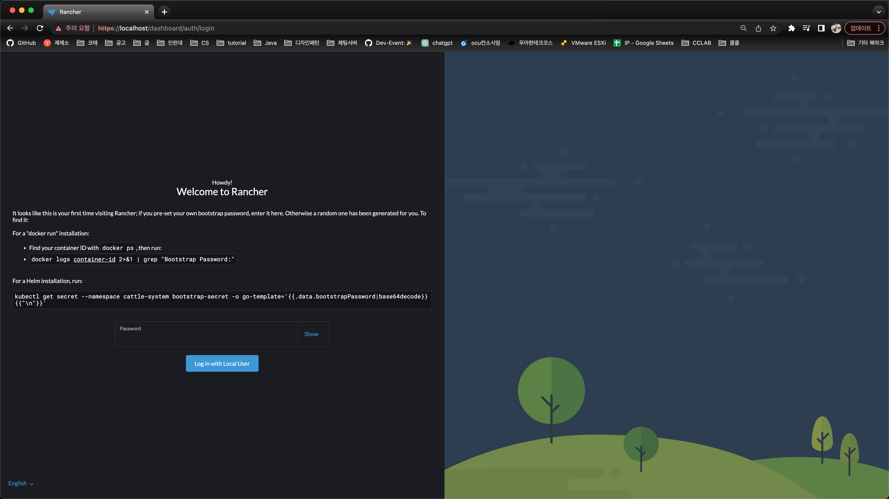  

처음 접속하면 패스워드를 입력하라고 한다.  
초기 패스워드는 다음과 같이 알 수 있다.

```bash
docker ps
docker logs  [container-id]  2>&1 | grep "Bootstrap Password:"
```

Rancher는 클러스터를 구성/관리할 수 있는 훌륭한 대시보드를 제공한다.  

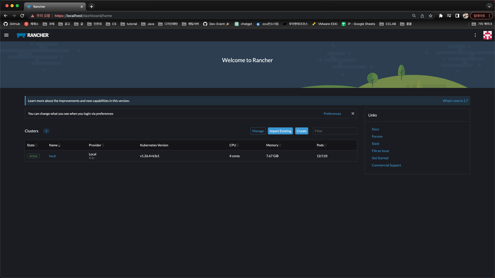  

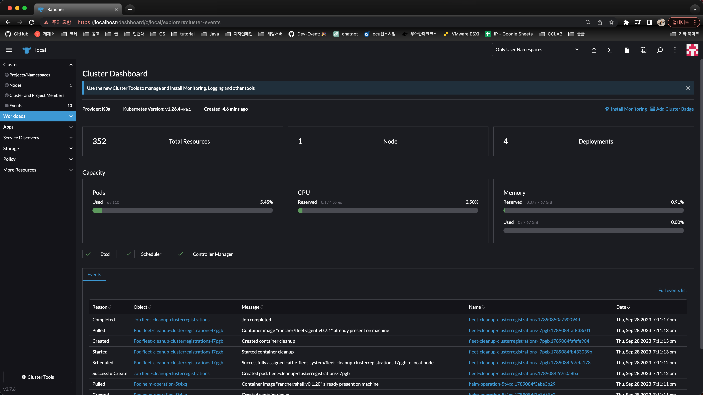    
  
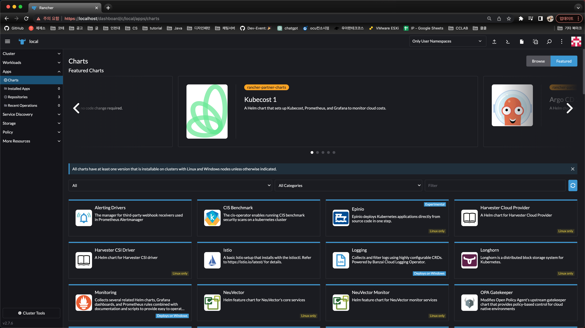  

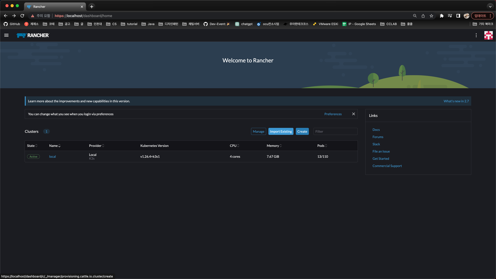  

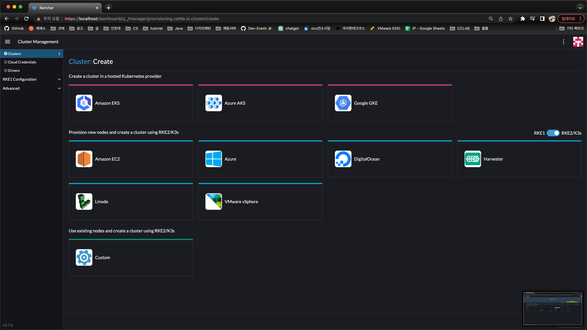  

<br>

## Day.54

### 쿠버네티스 애플리케이션 배포  
기본적인 flow: 컨테이너 이미지를 가져와 클러스터에 pod로 배포  

애플리케이션을 쿠버네티스 클러스터에 배포하는 두가지 방법
1. YAML 파일
2. Helm 차트

Minikube 사용.  


### 비상태 애플리케이션 생성  
nginx 이용, pod를 제공한 후 nginx pod에서 호스팅하는 웹서버에 접속할 수 있도록 서비스 생성  

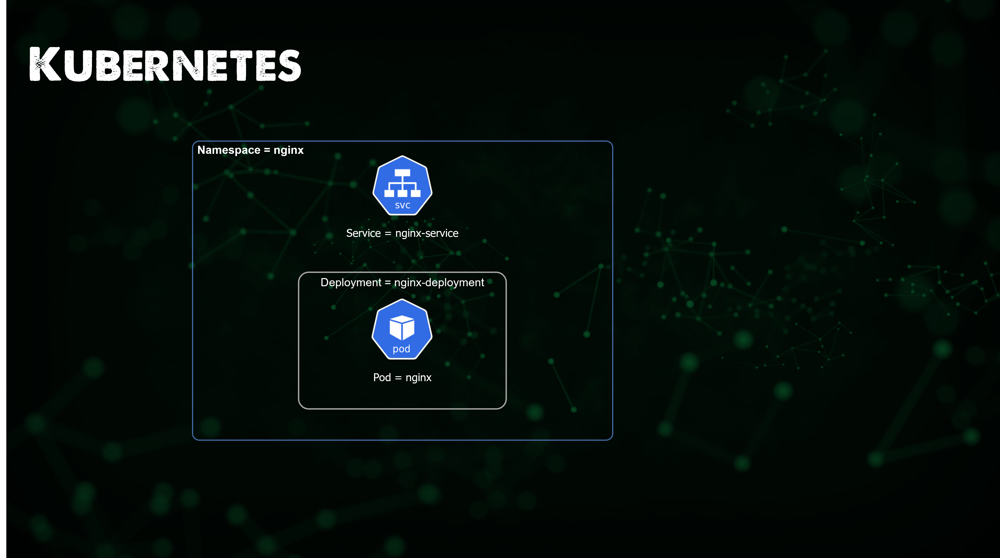

```bash
mkdir day54
cd day54
vi nginx-stateless-demo.yaml
```

[demo file](https://github.com/MichaelCade/90DaysOfDevOps/tree/main/2022/Days/Kubernetes)

```yaml
apiVersion: v1
kind: Namespace
metadata:
  name: nginx
  "labels": {
    "name": "nginx"
  }
---
apiVersion: apps/v1
kind: Deployment
metadata:
  name: nginx-deployment
  namespace: nginx
spec:
  selector:
    matchLabels:
      app: nginx
  replicas: 1
  template:
    metadata:
      labels:
        app: nginx
    spec:
      containers:
      - name: nginx
        image: nginx
        ports:
        - containerPort: 80
---
apiVersion: v1
kind: Service
metadata:
  name: nginx-service
  namespace: nginx
spec:
  selector:
    app: nginx-deployment
  ports:
    - protocol: TCP
      port: 80
      targetPort: 80
```

yaml 파일을 이용해 작성  
애플리케이션의 각 구성요소 별로 파일을 나눠 작성할수도 있다. (네임스페이스, 배포 및 서비스 생성을 위해 별도의 파일로 작성)  
예제의 경우 '---'를 통해 하나의 yaml 파일에서 구분해 작성했음    


```bash
kubectl get ns
# yaml 파일을 통해 애플리케이션 배포
kubectl create -f nginx-stateless-demo.yaml
```

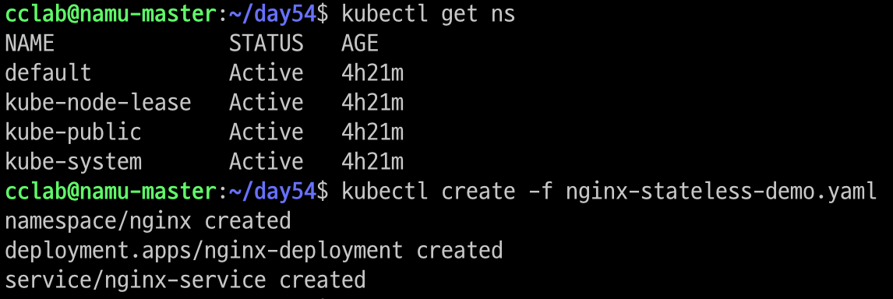  

```bash
# nginx namespace 생성된 것 확인
kubectl get ns
# nginx namespace의 파드, 서비스, 디플로이먼트 확인
kubectl get pods -n nginx
kubectl get service -n nginx
kubectl get deployment -n nginx

kubectl get all -n nginx
```

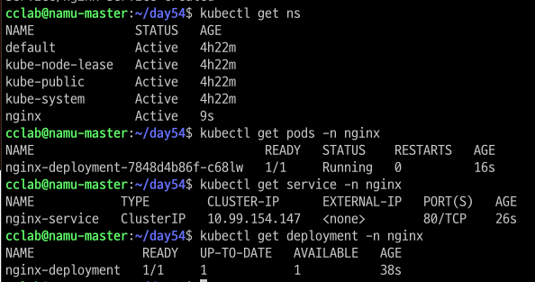  

레플리카셋이 존재한다.  
deploy에서 배포할 이미지의 레플리카 수를 정의했기 때문  
현재 1로 설정되었지만, 여러 방법으로 확장 가능하다.  

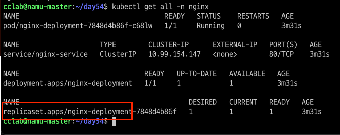  

deploymennt를 수정해보자.  
replicas의 수를 늘려본다.  

```bash
# Deploy를 수정 
kubectl edit deployment  nginx-deployment -n nginx
```

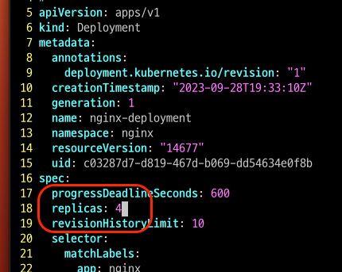  

replicas를 1 -> 4로 확장한다.  
```bash
kubectl get pods -n nginx
```

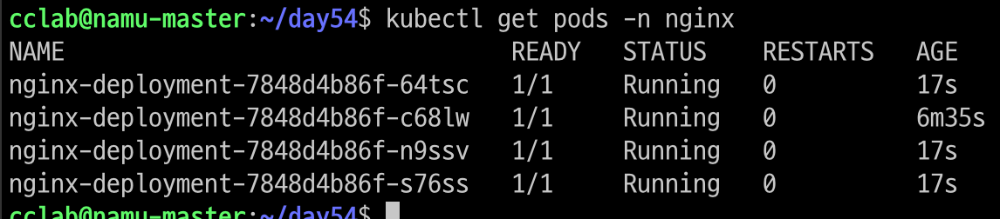

nginx 네임스페이스에 파드가 추가로 배포됐다.  

또는 아래와 같은 방법으로도 scale 할 수 있다.
```bash
kubectl scale deployment  nginx-deployment --replicas=10 -n nginx
```

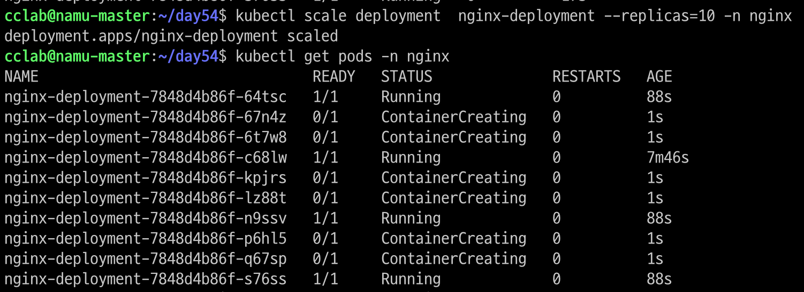  

### 애플리케이션 노출하기  
현재 배포한 서비스에는 외부 IP가 없으므로 외부에서 접속할 수 없다.  
몇 가지 옵션
1. ClusterIP: 표시되는 IP는 클러스터 내부에 서 사용하는 IP, 클러스터 내에서만 연결가능
2. NodePort: NAT를 통해 클러스터에서 선택한 각 노드의 동일한 포트에 서비스를 노출
3. Load Balancer: 현재 클라우드에 외부 로드밸런서 생성
4. Port Forward: 로컬 호스트에서 내부 쿠버네티스 클러스터 프로세스에 액세스하고 상호작용 가능. 테스트에 주로 사용

로컬 워크스테이션에서 포트포워딩해보자.
```bash
kubectl port-forward deployment/nginx-deployment -n nginx 8090:80
```
로컬 머신과 포트에 대한 포트포워딩을 하므로 터미널은 사용할 수 없게 된다.   
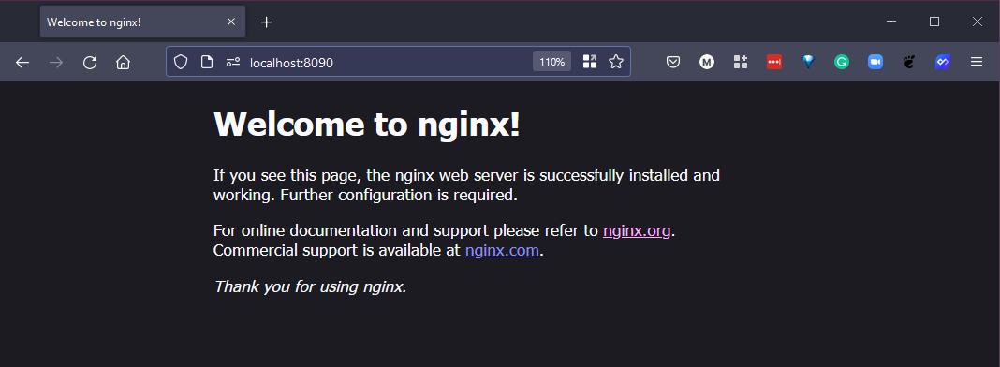

Minikube를 사용하여 서비스에 액세스하기 위한 URL을 생성할 수 있다.  
[미니쿠베 - 서비스](https://minikube.sigs.k8s.io/docs/commands/service/)  


```bash
# 현재 서비스 삭제
kubectl delete service nginx-service -n nginx
# expose, NodePort 유형으로 변경
kubectl expose deployment nginx-deployment --name nginx-service --namespace nginx --port=80 --type=NodePort
```

  

서비스에 대한 터널을 생성한다.  
```bash
minikube --profile='mcd-demo' service nginx-service --url -n nginx
```
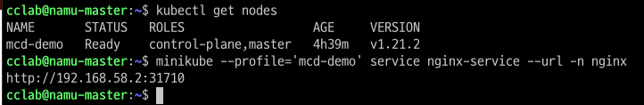

현재 외부 호스트 베어메탈 하이퍼바이저의 VM에서 minikube를 실행하고 있으므로  
로컬에서는 접속이 안된다.  

로컬에서 미니쿠베를 설치 후, 해당 항목까지 따라왔다면 생성된 터널을 통해 접속할 수 있다.  

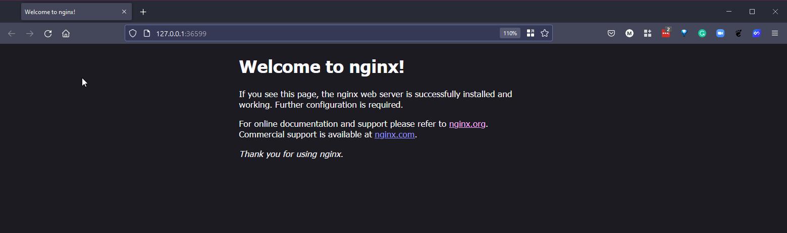  


### Helm 
[Helm](https://helm.sh/)  
헬름은 쿠버네티스를 위한 패키지 매니저  
클러스터에 애플리케이션을 다운로드하고 설치하는 일반적인 방법  

[아티팩트허브-k8s의 도커허브?](https://artifacthub.io/)  
[KubeApps-Helm차트의 UI제공](https://kubeapps.dev/)  

Helm은 패키지 애플리케이션과 비슷하게 차트를 배포  
차트는 미리 구성된 애플리케이션 리소스를 사용하기 쉽게 하나로 배포하는 방법  

Helm을 다운받자.  
```bash
curl -fsSL -o get_helm.sh https://raw.githubusercontent.com/helm/helm/master/scripts/get-helm-3

chmod 700 get_helm.sh

./get_helm.sh
```

<br>


### State와 Ingress
 Stateful 애플리케이션과 데이터베이스가 제대로 작동하려면, 호스트 이름, IP 등 불변한 식별자를 통해 pod가 서로 연결될 수 있도록 해야 함.  
 ex) MySQL 클러스터, Redis, Kafka, MongoDB ...

### Stateful 애플리케이션
StatefulSet은 Kubernetes가 스케줄링 위치에 관계없이 유지 관리하는 고유하고 영구적인 ID와 안정적인 호스트 이름을 가진 pod의 집합  
StatefulSet pod의 상태 정보 및 기타 데이터는 연결된 영속성 디스크 스토리지에 저장됨  

__Deployment__
* Deployment의 pod는 복제가능하며, 서로 동일하고 상호 교환이 가능  
* 임의의 해시를 사용하여 임의의 순서로 pod를 생성
* 모든 pod에 로드 밸런싱하는 하나의 서비스  

__StatefulSet__
* ex) mongo-0, mongo-1 ...
* Stateful 애플리케이션은 복제하기 어려움  
* 동시에 생성하거나 삭제할 수 없음  
* 임의로 주소를 지정할 수 없음  
* 레플리카 pod는 동일하지 않음  
* 고정된 개별 DNS 이름
* pod 아이덴티티 - 상태 유지, 역할 유지
* Stateful 앱 복제는 복잡함
* 해야 할 일이 많음:
* 복제 및 데이터 동기화를 구성
* 원격 공유 스토리지를 사용할 수 있도록 설정
* 관리 및 백업

StatefulSet의 각 Pod는 고유한 식별자를 가짐  
파드는 동일한 사양으로 생성되지만 상호 교환적이지 못함(같지않음)  
모든 스케줄링에 걸쳐 고유하고 영구적인 식별자를 가짐  

스테이트풀셋의 각 파드는 영구 볼륨과 데이터베이스의 복제본에 액세스하여 읽기 가능  
마스터가 지속적으로 업데이트, 파드는 영속성 볼륨에 파드 상태 저장  
만약 파드가 죽으면 새 파드가 프로비저닝 될 때 스토리지에 저장된 파드 상태를 이어받는다.  

### Persistent Volume, Claims, StorageClass  
쿠버네티스는 기본적으로 지속성을 제공하지 않음 -> 외부 볼륨이 필요  
스토리지는 파드 생명주기에 의존하지 않는 또 하나의 계층이어야 함  
스토리즈는 모든 쿠버네티스 노드에서 사용 가능하고 액세스할 수 있어야 함  
또한 쿠버네티스 클러스터가 충돌하더라도 생존할 수 있도록 클러스터 외부에 존재  

#### Persistent Volume
* 데이터를 저장하기 위한 클러스터 리소스(예: CPU 및 RAM)  
* YAML 파일을 통해 생성
* 실제 물리적 스토리지(NAS)
* Kubernetes 클러스터에 외부 요소 통합
* 다양한 유형의 스토리지를 사용 가능
* PV(영속성 볼륨)는 네임스페이스가 없음
* 로컬 스토리지를 사용할 수 있지만 클러스터의 한 노드에 한정되는 문제 존재
* 데이터베이스 지속성은 원격 스토리지(NAS) 사용해야함ㅁ  


#### Persistent Volume Claims
PV만 있어도 사용할 수 있지만 애플리케이션에서 Claims하지 않으면 사용되지 않음

* YAML 파일을 통해 생성
* 영속성 볼륨 Claims은 pod 구성(볼륨 어트리뷰트)에서 사용
* PVC는 pod와 동일한 네임스페이스에 존재
* 볼륨이 pod에 마운트됨
* pod는 여러 가지 볼륨 유형(ConfigMaps, Secrets, PVC)을 사용

PV와 PVC를 생각하는 또 다른 방법은 다음과 같다.  
PV는 Kubernetes 어드민에 의해 생성  
PVC는 사용자 또는 애플리케이션 개발자가 생성  

#### ConfigMaps | Secrets
각각은 pod의 구성 파일과 인증서 파일

#### StorageClass
* YAML 파일을 통해 생성
* PVC가 영속성 볼륨을 Claims할 때 동적으로 프로비저닝
* 각 스토리지 백엔드에는 프로비저너가 있음
* 스토리지 백엔드는 (프로비저너 속성을 통해) YAML에 정의됨
* 기본 스토리지 공급자 추상화
* 해당 스토리지에 대한 파라미터 정의


### Practice
미니쿠베 클러스터 사용. Stateful 워크로드를 배포해보자.  
[사용 예제](https://github.com/MichaelCade/90DaysOfDevOps/tree/main/2022/Days/Kubernetes)
```bash
# CSI-hostpath-driver: 스토리지 클래스 제공
minikube start --addons volumesnapshots,csi-hostpath-driver --apiserver-port=6443 --container-runtime=containerd -p mc-demo --kubernetes-version=1.21.2
```

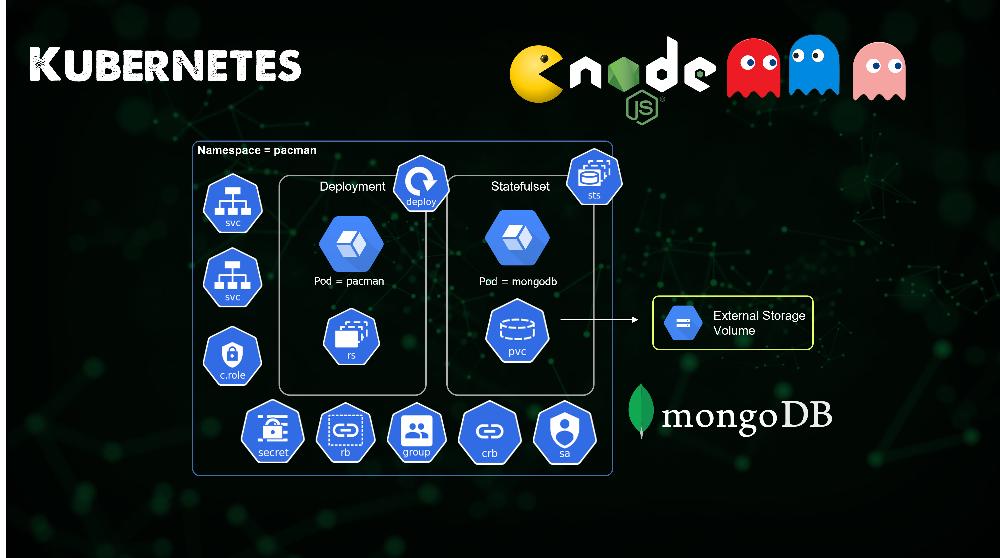  


### StorageClass Configuration
배포하기 전에 기본 Storageclass가 'csi-hostpath-sc'인지 확인   
일반적으로 'kubectl get storageclass'를 통해 확인  

but, 미니쿠베는 표준 스토리지 클래스를 기본값으로 표시함  
따라서 미니쿠베에서는 
```bash
#  CSI-hostpath-sc 스토리지 클래스를 기본값으로 설정
kubectl patch storageclass csi-hostpath-sc -p '{"metadata": {"annotations":{"storageclass.kubernetes.io/is-default-class":"true"}}}'
# 표준 StorageClass에서 기본 어노테이션을 제거
kubectl patch storageclass standard -p '{"metadata": {"annotations":{"storageclass.kubernetes.io/is-default-class":"false"}}}'

kubectl get namespace
```

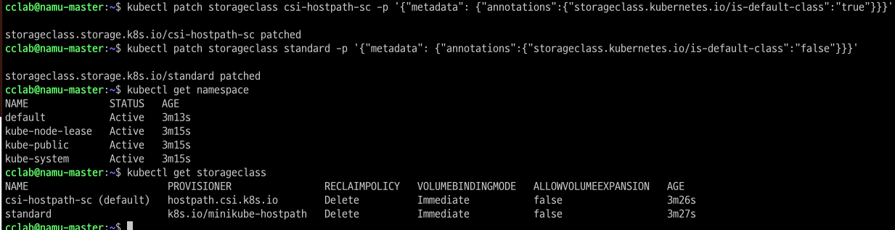  

pacman-stateful-demo.yaml을 작성하고 배포한다.  
```bash
vi pacman-stateful-demo.yaml
kubectl create -f pacman-stateful-demo.yaml
```

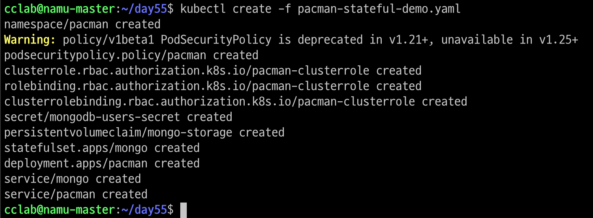  


```bash
kubectl get ns
kubectl get all -n pacman
```

pacman으로된 새로운 네임스페이스 생성됨  
pacman 네임스페이스 내부에 NodeJS 웹 프론트엔드 파드와 데이터베이스 파드 mongo 존재  
두 파드 모두 해당 파드에 액세스하기 위한 서비스가 존재  
pacman을 위한 deployment와 mongo를 위한 StatefulSet 존재  

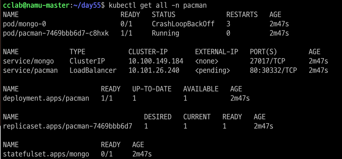

>mongo가 CrashLoopBackOff로 뜨지않았지만..  
>원래는 떠야한다.  
>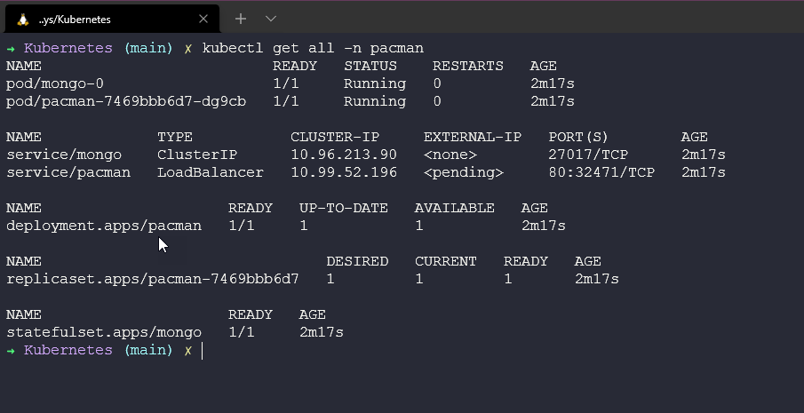  


```bash
kubectl get pv
kubectl get pvc -n pacman
```

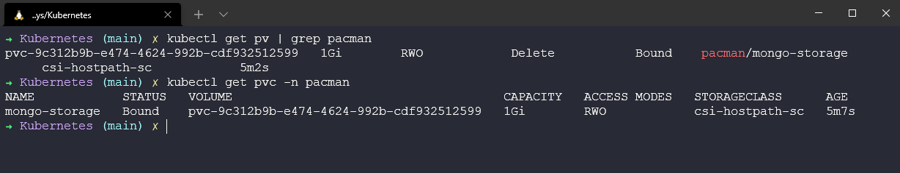  


클러스터 내에서 Ingress 또는 로드 밸런서에 액세스하여 외부에서 액세스하기 위한 IP를 자동으로 받도록 설정되어있다.  
```bash
# 포트포워드 방식을 통해 애플리케이션에 액세스
kubectl port-forward svc/pacman 9090:80 -n pacman
```

팩맨게임에서 플레이하고 점수를 DB에 저장  

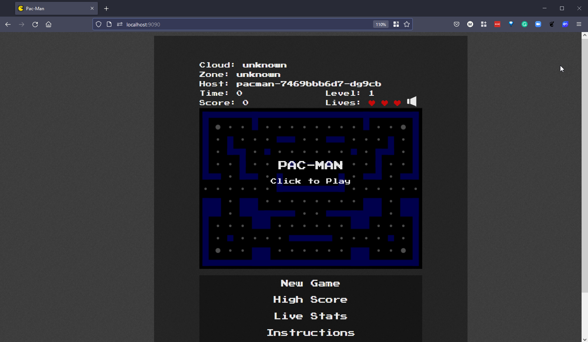  

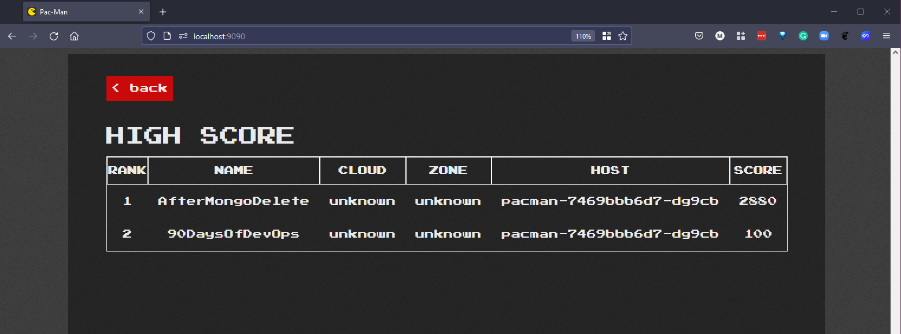  

mongo-0 파드를 삭제해도 외부스토리에 저장되기 때문에 사용할 수 있다.  

```bash
kubectl delete pod mongo-0 -n pacman
```

### Ingress
프로덕션환경에선 대규모 사용자가 애플리케이션에 액세스 해야 함  
NodePort가 비슷해보이지만 이 역시 테스트 목적으로 사용  

Ingress는 클러스터 내에서 라우팅 규칙을 정의할 수 있으며, 더 나은 서비스 노출 방법 제공  
애플리케이션 내부 서비스에 대한 포워드 요청을 생성한다.  

CSP 사용 시, 관리형 쿠버네티스 제품에는 대부분 클러스터에 대한 인그레스 옵션이나 로드밸런서 옵션이 제공됨  
클러스터를 실행하는 경우 엔트리포인트를 구성할 필요가 있음  

#### Minikube에 Ingress 구성

```bash
# mcd-demo라는 클러스터에 ingress 활성화  
minikube --profile='mcd-demo' addons enable ingress
```  

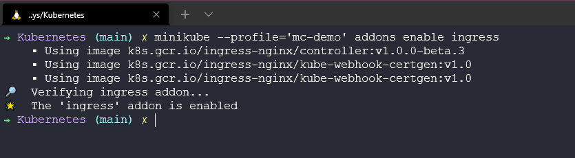  

Ingress-nginx 네임스페이스가 생성됐다.  

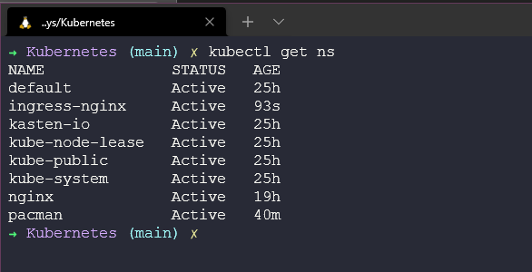  

Ingress 구성 yaml파일  
[pacman-ingress.yaml](https://github.com/MichaelCade/90DaysOfDevOps/blob/main/2022/Days/Kubernetes/pacman-ingress.yaml)  

```bash
# 파일을 통해 ingress 생성
kubectl create -f pacman-ingress.yaml
```

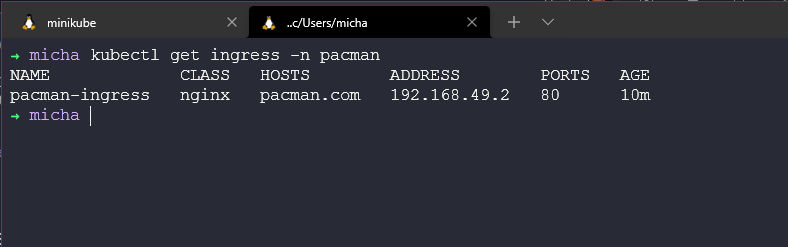  

```bash
# 미니쿠베 터널을 생성
minikube tunnel --profile=mc-demo
```
생성한 터널을 통해 액세스하여 Pacman 게임을 할 수 있음  


