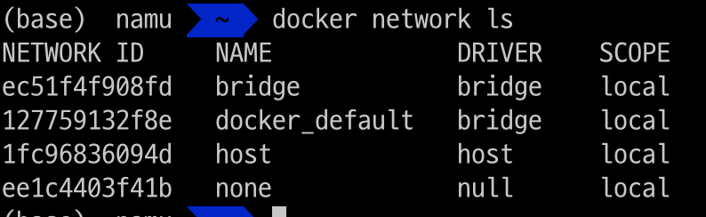

# Contents
* [3. Containers](#containers)
    * [Day.42 The Big Picture: Containers](#day42)
    * [Day.43 What is Docker & Getting installed](#day43)
    * [Day.44 Docker Images & Hands-On with Docker Desktop](#day44)
    * [Day.45 The anatomy of a Docker Image](#day45)
    * [Day.46 Docker Compose](#day46)
    * [Day.47 Docker Networking & Security](#day47)
    * [Day.48 Alternatives to Docker](#day48)
* [4. Kubernetes](#kubernetes)
    * [Day.49 The Big Picture: Kubernetes](#day49)
    * [Day.50 Choosing your Kubernetes platform](#day50)
    * [Day.51 Deploying your first Kubernetes Cluster](#day51)
    * [Day.52 Setting up a multinode Kubernetes Cluster](#day52)
    * [Day.53 Rancher Overview - Hands On](#day53)
    * [Day.54 Kubernetes Application Deployment](#day54)
    * [Day.55 State and Ingress in Kubernetes](#day55)

<br>
<br>

# Containers

## Day.42
컨테이너, 특히 그 중심이 되는 기술인 Docker에 대해서 알아보자.   

### Overview: Container
애플리케이션은 여러가지 방법으로 실행될 수 있다.  
예를 들어  
* 하드웨어 + 운영체제 + 단일 애플리케이션
* 가상 머신 또는 클라우드 기반 IaaS 인스턴스에서 애플리케이션
* 가상머신의 DB + 퍼블릭 클라우드의 PaaS... 
* 컨테이너 환경  

컨테이너 기술은 왜 각광받고 있을까?  
컨테이너는 이미 수십년 전부터 존재. Docker와 같은 도구는 어떻게 인기를 얻었을까?  
Docker의 성공에는 쉽게 찾고 사용할 수 있는 __이미지 에코시스템__ 이 있었다.  
이는 실행환겨에 구애받지 않는 일관성을 가져왔다.  

또한 컨테이너 이미지에는 컨테이너 실행에 필요한 모든 라이브러리와 종속성이 함께 패키징된다.  
따라서 기존 시스템에서 다른 시스템으로 원활한 이동이 가능하다.  

컨테이너 이미지가 갖는 장점  
* 컨테이너는 컨테이너 내 모든 종속성을 패키징하고 격리할 수 있다.
* 한 시스템에서 다른 시스템으로 쉽게 이동할 수 있다.
* 컨테이너는 배포와 확장이 간단하다.

|Distribution|Installation|Operation|
|:-:|:-:|:-:|
|Find|Install|Start|
|Download|onfiguration|Security|
|License|Uninstall|Ports|
|Package|Dependencies|Resource Conflicts|
|Trust|Platform|Auto-Restart|
|Find|Libraries|Updates|

컨테이너를 사용하면 독립적인 컨테이너를 확장하고 로드 밸런서를 사용할 수 있다.  
컨테이너는 애플리케이션 관리에 있어 많은 유연성과 편의성을 제공한다.  

### what is container?
컨테이너는 프로세스로, 코드와 모든 종속성을 패키징하여 애플리케이션이 한 컴퓨터 시스템에서 다른 시스템으로 빠르고 안정적으로 이동, 실행되도록 하는 소프트웨어의 표준 단위이다.  
컨테이너화 된 소프트웨어는 인프라에 관계없이 항상 동일한 동작을 보장한다.  
소프트웨어를 환경에서 분리하여, 개발환경과 프로덕션 환경 간 차이를 없앤다.  

<br>

## Day.43

### Docker, Docker Install
Docker: 컨테이너를 빌드, 실행 및 관리하기 위한 프레임워크  
>docker라는 용어는 개발자/관리자가 앱을 개발, 배포 및 실행하기 위한 플랫폼으로 docker 프로젝트 전반이나  
>이미지와 컨테이너를 관리하는 호스트에서 실행되는 docker 데몬 프로세스를 의미하기도 한다.  

### Docker Engine
Docker Engine: 애플리케이션을 빌드하고 컨테이너화하기 위한 오픈소스 컨테이너화 기술  
클라이언트-서버 구조로 작동  
* 서버: 데몬 프로세스인 dockerd가 존재
* 클라이언트: docker CLI를 통해 서버에 요청
* API: 클라이언트 프로그램이 서버에 Docker 데몬에게 요청할 수 있는 인터페이스 제공

### Docker Desktop
Docker 개발환경의 GUI 프로그램. OS 네이티브로 호스트 운영체제의 가상화 기능을 활용.  
docker(container)화 된 애플리케이션을 빌드, 디버그, 테스트, 패키징, 배포 등 가능  

### Docker Compose
여러 컨테이너를 조합, 더 복잡한 서비스를 가능하게 하는 도구.  
단일 파일로 여러 컨테이너에 대한 내용을 정의 후 애플리케이션을 정의해 둔 내용/순서대로 실행 시킬 수 있다는 이점이 있다.  

### DockerHub
Docker의 중앙 집중 리소스 저장소.  
일반적으로 docker 이미지를 호스팅하는 레지스트리로 사용. Github 등과 통합하여 CI/CD 파이프라인 구축, 부분적 자동화 등

### Dockerfile
docker 이미지를 빌드할 때, 넘겨야하는 매개변수나 빌드 시 포함해야할 옵션, 이미지, 컨테이너 이름 등을 지정.
docker 이미지 빌드를 위한 명세서

<br>

## Day.44

### Docker 이미지, Docker Desktop 실습
Docker 이미지: Docker 컨테이너에서 코드를 실행하는데 사용되는 파일, Docker 컨테이너를 빌드하기 위한 템플릿 또는 시작점  
DockerHub: Docker로 작업하기 위한 중앙 집중식 리소스, 일반적으로 docker 이미지 호스팅하는 레포로 사용.  
* 내가 만든 이미지를 업로드할수 있으며, 남이 만든(또는 공식으로 제공) 이미지를 가져와 사용할수도 있다.
* Official image: 엄선된 Docker 오픈소스 리포지토리
* Verified Pubisher: 검증된 퍼블리셔의 고품질 docker 컨텐츠   

[DockerHub](https://hub.docker.com/)

최초로 docker 이미지를 가져와 빌드하고 실행해보자  
```bash
docker run -d -p 80:80 docker/getting-started
```
처음 명령을 실행하므로 우리에겐 해당하는 이미지가 없다. 
이 경우 Docker는 주어진 경로(default:DockerHub)에서 자동으로 해당하는 이미지를 찾아 로컬에 가져온다.


이렇게 한번 로컬 가져온 이미지는 다음 번 실행 시 다시 다운받을 필요없이 사용이 가능하다.  

그 후 Docker Desktop을 확인해보면 컨테이너가 하나 추가됐다.  

  

```bash
docker run -d -p 80:80 docker/getting-started
```
다시보자.  
* -d : 컨테이너를 detached mode로 실행한다 (백그라운드)
* -p : 호스트의 80포트와 컨테이너의 80포트를 매핑한다.
* docker/getting-started  : 사용할 이미지

ubuntu 운영체제 컨테이너를 실행하고 그 안에서 bash쉘을 실행시킨다.  
```bash
docker run -it ubuntu bash
```

  

ubuntu 이미지를 통해 컨테이너를 실행했고 '-it' 옵션을 통해 단말에 접속하여 bash 쉘을 실행한다.  
자세히보면 프롬프트가 어느샌가 root@6600d3269d28:/# 으로 바뀐것을 확인할 수 있다.  

<br>

## Day.45

### Docker 이미지 구조
Docker 이미지: Docker 플랫폼에서 executable한 컨테이너를 만들기 위한 읽기 전용 템플릿.  
애플리케이션과 그 실행에 필요한 모든 파일을 패키징하여 편리하게 이동/공유가 가능하다.  

__Docker 이미지를 생성하려면?__   
Docker 이미지를 생성하기 위해서는 Dockerfile을 생성해야 한다.  

지난 실습에서처럼 ubuntu 이미지를 가져와 컨테이너를 실행한 후, 추가적인 의존성들을 설치한다면?  
컨테이너가 종료되거나 재시작하면 추가적으로 설치한 모든 의존성들이 사라진다.  

### Dockerfile
Dockerfile을 통해 docker를 빌드할 때 수행해야할 명령들을 미리 정의할 수 있다.  

docker 이미지를 구성하는 각 계층을 레이어라고 하며, 이러한 레이어는 읽기전용으로 스택처럼 쌓이게된다.  
최종적으로는 맨 위에 위치하는 내용만이 새로 작성된 내용으로 이미지에 드러난다.  
각 레이어는 바로 아래 레이어에 종속되며, 이러한 레이어는 효율적인 docker 이미지 생명주기 관리의 핵심이다.

자주 변경되는 레이어는 가능한 스택에서 가장 높은 곳에 구성하는 것이 효율적이다.  
docker의 이미지 레이어를 변경하면, docker는 해당 레이어 뿐 아니라, 해당 레이어에서 빌드된 모든 레이어를 다시 빌드한다.  
따라서, 스택에 가장 최상위 레이어의 변경사항은 해당 레이어만을 빌드한다.  

docker가 이미지로부터 빌드되어 컨테이너로 수행될 때, __컨테이너 레이어__ 가 한 계층 추가된다.  
이 레이어는 컨테이너가 실행되는 동안의 모든 변경사항을 기록하게 된다.  
__컨테이너 레이어__ 는 컨테이너와 소스 이미지 사이 유일한 차이점이 된다.  

  

---

  

Docker 이미지에는 개별 이미지 레이어 파일 뿐 아니라 manifest 파일도 포함된다.  
manifest에는 이미지에 대한 JSON 형식으로된 설명이며 이미지 태그, 전자서명, 다양한 호스트 플랫폼에 맞게 컨테이너를 구성하는 방법에 대한 세부정보와 같은 정보가 담겨있다.  

  

### Docker 이미지 생성  
이미지를 생성하는 두 가지 방법이 있다.  

```bash
# 컨테이너를 실행하고 그 위에 모든 종속을 설치한 후 사용한다.  
docker commit container name
```
이는 매우 간단하고 빠르지만, 라이프사이클을 관리하기 어렵고 수동 구성/재구성이 많이 필요하므로 추천되지 않는다.  

보통은 Dockerfile을 통한 방법을 추천한다.  
이는 더 쉬운 라이프사이클 관리와 CI/CD에 쉽게 통합할 수 있다든 장점이 있다.  

Dockerfile에는 총 3단계에 걸쳐 이미지를 생성하는데 필요한 명령들을 정의한다.  
|Command|Purpose|
|:-:|:-:|
|FROM|상위 이미지를 지정합니다.|
|WORKDIR|Dockerfile에서 다음에 나오는 명령의 작업 디렉터리를 설정합니다.
|RUN|컨테이너에 필요한 애플리케이션과 패키지를 설치합니다.|
|COPY|특정 위치에서 파일 또는 디렉터리를 복사합니다.|
|ADD|복사뿐만 아니라 원격 URL을 처리하고 압축 파일의 압축을 풀 수도 있습니다.|
|ENTRYPOINT|컨테이너가 시작될 때 항상 실행되는 명령입니다. 지정하지 않으면 기본값은 "/bin/sh -c"입니다.|
|CMD|엔트리포인트로 전달된 인자입니다. 엔트리포인트가 설정되지 않은 경우(기본값은 "/bin/sh -c"), 컨테이너가 실행하는 명령은 CMD가 됩니다.|
|EXPOSE|컨테이너 애플리케이션에 액세스할 포트를 정의합니다.|
|LABEL|이미지에 메타데이터를 추가합니다.|

기본적인 Dockerfile을 작성해보자
```bash
FROM ubuntu:18.04
RUN apt-get update && apt-get upgrade -y
RUN apt-get install -y nginx curl
RUN rm -rf /var/lib/apt/lists/*
```

현재 경로에 dockerfile을 생성했다면 이를 통해 다음과 같은 방법으로 이미지를 생성할 수 있다.  
기본적으로 Dockerfile을 찾아서 실행하지만, 이름을 다르게 생성했을 경우 명시해줘야 한다.  
```bash
# '.' 은 현재경로에 dockerfile이 있음을 명시. 
docker build -t [이미지명]:[태그] .
# 일반적으로는 username을 함께명시
docker build -t [사용자명]/[이미지명]:[버전태그]
docker build -t nginx_image:0.1 .
```

그 결과 nginx_image 라는 이름의 TAG 0.1인 이미지가 생성됐다.  

  

생성한 Docker 이미지를 DockerHub에 푸시하기위해서는, 이미지 생성시 사용자명을 명시해줘야한다.  

  

DockerHub에 접속해 방금 업로드한 이미지를 확인할 수 있다.  


<br>

## Day.46

### Docker Compose
일반적으로 프로덕션 환경에서는 서로 다른 컨테이너 이미지를 통해 여러 애플리케이션을 빌드하고 사용하기 때문에 
컨테이너 하나만을 운용하는 것은 부족하다.  

특히 최근들어 MSA와 같은 아키텍처와 고가용성 및 안정성에 대한 내용들이 화두되며 여러 컨테이너를 다루고 싶은 욕구가 불어났다.  
이제는 많은 회사들이 프론트와 백을 분리하고, 웹서버와 각종 WAS, DB를 분리한다.  
신뢰성을 위해 서버를 다중화하고 DB도 다중화하여 클러스터링한다.  

클라우드 환경은 특히나 각 서버, 역할들을 격리된 하나의 컨테이너로 사용하기 적합하다.
이때 여러 컨테이너를 통해 더 복잡한 앱을 실행할 수 있는 도구로 Docker Compose가 등장한다.  

여러 컨테이너에 대한 내용을 단일 파일에 작성하고 단일 명령을 통해 실행할 수 있다.  

Docker Compose는 또 하나의 도구로 설치해야 할 대상이지만, Linux 환경에서만 추가적으로 설치하면 된다.  
mac, window 환경에서 docker desktop을 사용한다면 docker-compose는 이미 설치되어있을 가능성이 크다.  

  

### docker-compose.yaml
Docker Compose는 기본적으로 docker-compose.yaml 파일을 통해 여러 개의 컨테이너를 관리/배포한다.  
>docker-compose.yaml은 Docker Compose를 통해 명령하기 위한 구성파일이다.  

tutorial에서 제공하는 yaml 파일을 사용한다.  
```yaml
version: '3.9'

services:
  db:
    image: mysql:5.7
    platform: linux/amd64
    volumes:
      - db_data:/var/lib/mysql
    restart: always
    environment:
      MYSQL_ROOT_PASSWORD: somewordpress
      MYSQL_DATABASE: wordpress
      MYSQL_USER: wordpress
      MYSQL_PASSWORD: wordpress

  wordpress:
    depends_on:
      - db
    image: wordpress:latest
    volumes:
      - wordpress_data:/var/www/html
    ports:
      - '8000:80'
    restart: always
    environment:
      WORDPRESS_DB_HOST: db
      WORDPRESS_DB_USER: wordpress
      WORDPRESS_DB_PASSWORD: wordpress
      WORDPRESS_DB_NAME: wordpress
volumes:
  db_data: {}
  wordpress_data: {}
```

두 개의 서비스를 확인할 수 있다.  
1. db
2. wordpress  

각각은 mysql 5.7 버전과 worldpress의 최신 릴리즈 버전의 이미지를 가져와 사용한다.  
데이터베이스의 상태(데이터)를 저장할 수 있도록 볼륨을 생성하고 환경변수를 통해 비밀번호, 사용자 이름 등을 정의한다.  
그리고 wordpress 서비스는 db라는 앞서 정의한 mysql 컨테이너에 의존하고 있다.  

>## depends_on 옵션과 컨테이너 실행 순서  
>docker-compose에서 depends_on을 통해 서비스의 시작과 종료 순서를 제어할 수 있다.  
>depends_on은 특정 컨테이너에 대한 의존 관계를 나타내며, 이 항목에 명시된 컨테이너가 먼저 생성되고 실행되도록 한다.  
>(반대로 컨테이너가 제거될때는 의존하는 컨테이너가 먼저, 의존되는 컨테이너가 그 후에 제거된다)  
>
>주의해야할 점은 실행 순서만 제어할 뿐, 컨테이너 내부의 __어플리케이션이 준비된 상태인지에 대해 확인하지 않는다.__  
>(여담으로 links, volumes_from, network_mode: "service:..." 또한 같은 류의 종속성을 설정한다.)  
>
>DB 컨테이너와 웹서버 컨테이너가 순서대로 실행된다고 해도, DB가 초기화 중이라면 웹서버가 정상 작동하지 못한다.  
>이와같은 문제를 해결하기 위한 방법으로 depends_on에 condition을 통해 healthcheck를 하는 방법과 wait-for-it, dockerize 등 패키지를 사용하는 방법이 존재한다.  
>
>### 쉘 스크립트 작성
>
>__depends_on에 몇가지 구성들을 추가할 수 있다.__  
>* restart: true로 설정하면 의존성 서비스가 업데이트 된 이후 Compose가 이 서비스를 재시작한다.  
>    * 주의할 점은 의존성 업데이트와 같은 Compose 작업에 한하여 적용된다. 컨테이너가 종료된 후 자동 다시시작과는 다르다.  
>* condition: depends_on, 즉 의존성이 충족된 것으로 판단하는 기준을 설정  
>    * service_started: 컨테이너 실행(디폴트)
>    * service_healthy: 의존 서비스를 시작하기 전에 의존성이 정상(healthchek를 통해)일 것으로 예상되어야 함.
>    * service_completed_successfully: 의존 서비스를 시작하기 전에 의존성이 성공적으로 완료될 때까지 기다려야함.
>* required: false로 설정하면 의존성 서비스가 시작되지 않거나 사용불가할 때 경고만 제공한다.  
>
>__healthcheck__  
>서비스 컨테이너의 정상 여부를 확인한다. Dockerfile과 동일한 방식으로 작동하며, Compose 파일이 Dockerfile에 설정된 값을 재정의하게 된다.  
>```yaml
># test: 컨테이너 상태확인을 위해 Compose가 실행하는 명령
># 문자열이거나 목록일 수 있으며, 목록인 경우 첫번째 항목은 NONE 또는 CMD, CMD-SHELL이어야 함.
># string은 목록에서 CMD-SHELL을 쓰는것과 같다.
>healthcheck:
>    test: ["CMD", "curl", "-f", "http://localhost"]
>    interval: 1m30s
>    timeout: 10s
>    retries: 3
>    start_period: 40s
>    start_interval: 5s
>```
>
>```yaml
>test: ["CMD-SHELL", "curl -f http://localhost || exit 1"]
>위 아래 두 문장은 같다.
>test: curl -f https://localhost || exit 1
>```
>
>최종적으로 작성되는 docker-compose 파일은 다음과 같다.  
>```yaml
>version: '3.8'
>services:
>  applicaion-service:
>    image: your-applicaion-service:0.0.1
>    depends_on:
>      cassandra-init-keyspace:
>        condition: service_completed_successfully
>
>
>  cassandra:
>    image: cassandra:4.0.1
>    ports:
>      - "9042:9042"
>    healthcheck:
>      test: ["CMD", "cqlsh", "-u cassandra", "-p cassandra" ,"-e describe keyspaces"]
>      interval: 15s
>      timeout: 10s
>      retries: 10
>
>  cassandra-init-keyspace:
>    image: cassandra:4.0.1
>    depends_on:
>      cassandra:
>        condition: service_healthy
>    volumes:
>      - ./src/main/resources/cassandra/init.cql:/init.cql
>    command: /bin/bash -c "echo loading cassandra keyspace && cqlsh cassandra -f /init.cql"
>```
>
>[docker docs: depends_on](https://docs.docker.com/compose/compose-file/05-services/#depends_on)  
>[docker docs: healthcheck](https://docs.docker.com/compose/compose-file/05-services/#healthcheck)  
>[how to start service only when other service had comleted?](https://stackoverflow.com/questions/48092592/how-to-start-service-only-when-other-service-had-completed)
>
>wait-for-it는 쉘 스크립트로 작성되어 있어 설치와 적용이 간단하다.  
>[wait-for-it](https://github.com/vishnubob/wait-for-it)  
>dockerize는 비교적 복잡하지만, 순차적 서비스 실행 이외에도 환경변수 설정, 로그 파일 위치 지정 등 다양한 기능을 제공한다.  
>[dockerize](https://github.com/jwilder/dockerize)


### 프로젝트 빌드
이제 앞서 작성한 docker-compose.yaml 파일을 통해 두 개의 서비스 컨테이너를 실행해보자.  

>mac에서는 docker-compose.yaml의 서비스 하위에 ;platform: linux/amd64' 항목을 추가하자.  
mysql의 디폴트 이미지를 arm으로 찾으려다, 해당하는 이미지가 존재하지 않아 실패할 수 있다.

```bash
docker-compose up -d
```

먼저 mysql과 워드프레스의 docker 이미지를 다운받은 후 컨테이너가 실행된다.  

  

docker ps를 통해 현재 실행중인 docker 컨테이너의 정보를 확인할 수 있다.  
db 서버와 워드프레스 서버가 실행되고 있다.  

  

워드프레스 서버가 돌고있는 localhost:8000에 접속하면 다음과 같은 워드프레스 화면이 나타난다.


docker 데스크톱에는 다음과 같이 두 컨테이너가 묶여서 나오는 것을 확인할 수 있다.


이제 컨테이너를 삭제하자.  
```bash
# docker-compose down 으로 컨테이너를 삭제해도 볼륨은 여전히 남는다!
docker-compose down
# 주의! 아래 명령은 볼륨까지 삭제한다.
docker-compose down --volumes
```

### docker compose vs kubernetes  
kubernetes 클러스터의 노드들은 여러 서버에 걸쳐 실행된다.  
이와 같이 여러 서버에 걸친 다중 컨테이너를 관리, 자동화, 오케스트레이션하는 것이 kubernetes의 목적이다. 

반면에 Docker Compose의 경우 하나의 호스트에서 여러 대의 컨테이너를 실행하는 것에 초점이 맞춰져있다.  
여기서 논의할 점은 Docker Compose에는 여러 가상머신이나 물리적 머신이 없다는 것이다.  


[awsome-compose](https://github.com/docker/awesome-compose/tree/master/elasticsearch-logstash-kibana)  
도커 컴포즈를 통해 ELK 스택을 배포하는 샘플 코드를 제공한다.  

  


<br>

## Day.47 

### Docker 네트워킹 및 보안

```bash
# 컨테이너 네트워크를 구성/관리하기 위한 기본 명령어
docker network
```

각 네트워크는 고유한 ID와 이름을 갖으며, 단일 드라이버와 연결된다.  
bridge 네트워크와 host 네트워크는 각각의 드라이버와 이름이 동일하다.  host = host, bridge = bridge
```bash
# 네트워크 목록 확인
docker network ls
```



```bash
# inspect: 점검하다.  
docker network inspect 
docker network inspect bridge
```

  

#### bridge 
도커를 설치하면 brdige라는 pre-defined된 네트워크가 제공된다.  
여기서 네트워크의 이름과 드라이버의 이름이 모두 brdige로 같지만, 그 둘은 같지 않다.  

이 말은 다른 이름을 가진 네트워크가 같은 bridge 드라이버로 연결될 수 있다는 의미이다.  
위 inspect 명령의 결과로 bridge 네트워크의 scope(범위)가 로컬로 지정되있음을 확인할 수 있다.  
* local: 네트워크가 이 docker host에만 존재한다는 것을 의미
* bridge 드라이버로 생성된 모든 네트워크는 Linux bridge(virtual switch)를 기반으로 한다.  


### 컨테이너 연결
컨테이너 생성 시, 네트워크를 지정하지 않으면 기본적으로 bridge 사용  

```bash
# sleep 명령을 계속 실행 (백그라운드 -d)
docker run -dt ubuntu sleep infinity
```


```bash
docker network inspect bridge
```

네트워크를 지정하지 않았기 때문에, 기본적으로 bridge 네트워크를 사용한다.  
bridge 네트워크의 정보에서 위에서 생성한 컨테이너를 확인할 수 있다.

  


### 외부 연결을 위한 NAT 구성
시나리오  
Nginx 컨테이너 8080:80 배포. 
```bash
docker run --name web1 -d -p 8080:80 nginx
```

'0.0.0.0:8080->80/tcp': 모든 host 인터페이스의 8080 포트를 web1 컨테이너 내부의 80포트에 매핑  
외부소스에서 컨테이너의 웹 서비스에 액세스할 수 있게 해줌  

  

브라우저에서 [IP 주소]:8080 에 접속하면 다음과 같은 nignx 서버의 기본 페이지를 확인할 수 있다.  


### 컨테이너 보안
컨테이너는 전체 서버 구성에 비해 안전한 워크로드 환경 제공  
* 컨테이너가 하나의 보안 경계로 작용  
* 역할과 책임의 분리, 최소 권한 원칙
* Vulnerable surface 감소

#### 루트 권한  
docker는 기본적으로 root 권한을 사용한다.  
이는 엔터프라이즈 환경에 부적합하며 많은 보안 취약점을 유발한다.  

이를 위해 일반 사용자가 docker에 대한 명령을 수행할 수 있도록 만드는 방법이 있다.  
기본적으로 dockerfile을 만들 때 사용자 계정을 만들 수 있다.  
```bash
FROM ubuntu:18.04
RUN apt-get update && apt-get upgrade -y
# gid 1000 그룹 생성(basicuser) && uid 1000, 그룹 basicuser의 basicuser라는 유저 생성
RUN groupadd -g 1000 basicuser && useradd -r -u 1000 -g basicuser basicuser
# 이 컨테이너를 통해 실행되는 command는 basicuser의 권한으로 수행
USER basicuser
```

#### private registry
DockerHub를 통해 외부의 이미지를 가져와서 실행할 경우, 해당 이미지 퍼블리셔가 믿음직한지, 이미지 자체가 변조되진 않았는지 등 신경써야 할 보안요소가 많다.  
이를 해결하기 위해 사내에서 사용하는 이미지의 경우 private registry를 구성해 사내 네트워크 상에서만 접속할 수 있도록 구성할 수 있다.  

Docker Registry를 통해 간단한 프라이빗 레지스트리를 구성할 수 있다.
[Docker Registry](https://github.com/jang-namu/cclab-research/blob/main/Docker.md#2-docker-registry%EB%A1%9C-%ED%94%84%EB%9D%BC%EC%9D%B4%EB%B9%97-%EB%A0%88%EC%A7%80%EC%8A%A4%ED%8A%B8%EB%A6%AC-%EA%B5%AC%EC%B6%95)  

<br>

## Day.48 
Docker는 애플리케이션을 개발, 테스트, 배포 및 관리하기 위한 플랫폼으로 컨테이너를 대중화시켰지만,  
최근에는 Docker 이외에도 여러 선택지가 존재한다.  

### Docker의 대안

#### Podman
Podman은 리눅스 시스템에서 OCI 컨테이너를 개발, 관리, 실행하기 위한 __데몬이 없는__ 컨테이너 엔진.  
컨테이너를 루트로 실행하거나 루트리스 모드로 실행할 수 있음  

#### LXC
LXC는 사용자가 여러 개의 리눅스 컨테이너 환경을 생성할 수 있게 해주는 컨테이너 엔진  
Docker와 달리 별도의 시스템 파일과 네트워킹 기능을 갖춘 리눅스 머신을 생성하기 위한 하이퍼바이저로 동작  

#### Containerd  
__독립형 컨테이너 런타임__  
Docker에 일부였다가 분리되었다. 현재는 CNCF의 주요 컨테이너 런타임으로 속해있다.  

### 기타 Docker 도구

#### Gradle  
빌드 스캔을 통해 디버깅, 모든 빌드의 이력을 추적  
실행 옵션을 통해 변경사항 업데이트 시, 자동으로 빌드 실행  
사용자 지정으로 모든 파일 디렉토리 구조를 아티팩트 리포지토리로 지정할 수 있음

#### Packer
여러 머신 이미지를 병렬로 생산  
내장 디버거를 통해 빌드 시 쉽게 디버깅  

#### Logspout
로깅 도구로 동일한 로그를 여러 대상에게 전송할 수 있고 오픈소스이다.  
Docker 소켓에 액세스하기만 하면 되기 때문에 파일 관리가 간단해진다.  

#### Logstash
플러그인을 통한 데이터 파이프라인 사용자 정의  
분석을 위한 데이터 구문 분석/변환, 다양한 출력 포맷  

#### Portainer
템플릿을 통한 애플리케이션 배포  
팀원 생성과 역할/권한 부여  


### Review: Understaing Contianers
[Understanding containers - Red Hat](https://www.redhat.com/en/topics/containers)  https://docs.docker.com/engine/deprecated/
컨테이너는 애플리케이션과 그 실행 환경, 실행에 필요한 모든 파일 모두를 패키징/격리하는 기술이다.  
컨테이너는 개발, 테스트, 상용과 같은 서로 다른 환경 간 이동을 간단하게 만든다.  
또한, 컨테이너는 security에도 중요한 역할은 하는데, 컨테이너 파이프라인에 보안요소를 세움으로써 인프라, 컨테이너의 신뢰성, 확장성, 신뢰성을 보장한다.  
컨테이너화된 애플리케이션은 public, private 그리고 하이브리드 클라우드와 온프레미스 환경 등 전반에서 일관된 기능과 실행을 보장하며 손쉬운 이동이 가능하다.  

#### 컨테이너의 장점
컨테이너는 개발/운영 팀간 책임 영역을 분리함으로써 충돌을 최소화한다.   
이를통해 개발팀은 앱에 집중하고 운영팀은 인프라에 집중할 수 있다.  
컨테이너는 오픈소스 기반 기술이기 때문에, Podman, Skopeo, Buildah, CRI-O, k8s, 그리고 docker와 같은 훌륭한 도구들을 사용할 수 있다.  

컨테이너는 시스템의 운영체제 커널을 공유하고 프로세스를 격리함으로써 테스팅, 개발, 상용 환경을 이리저리 쉽게 옮겨다닐 수 있다.  
컨테이너는 가볍고 이식성이 높기 때문에 빠른 개발과 배포가 가능하다.  

#### 컨테이너 오케스트레이션이란?, 컨테이너로 할수있는 것
상용환경에서는 수백, 수천대의 컨테이너를 운용하기 때문에 이를 일일히 제어하기는 어렵다.  
쿠버네티스와 같은 컨테이너 오케스트레이션 툴은 여러 컨테이너를 클러스터로 배포하고 이를 관리하기 위한 자동화된 솔루션을 제공한다.  

컨테이너 기반 어플리케이션은 높은 수준의 분산 클라우드 아키텍처에서 작동할 수 있으며, 여러가지 툴을 통해 개발, delivery, 통합, 자동화를 제공한다.  
마이크로서비스 아키텍처를 사용하다면 컨테이너는 각각의 마이크로 서비스로서 배포될 수 있으며, 각 컨테이너는 service mesh 네트워크를 통해 연결된다.  
zzzz bz


<br>
<br>
<br>

