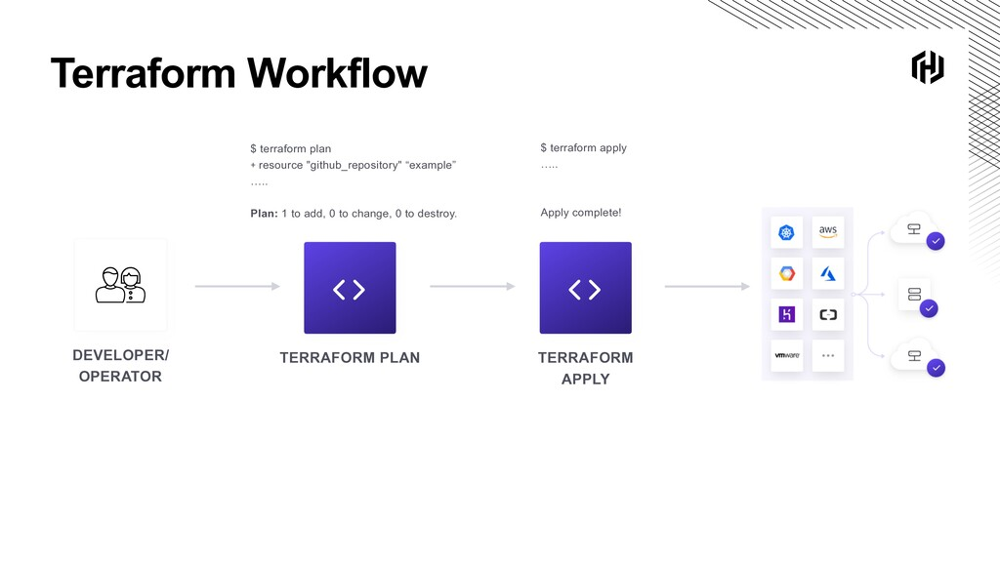
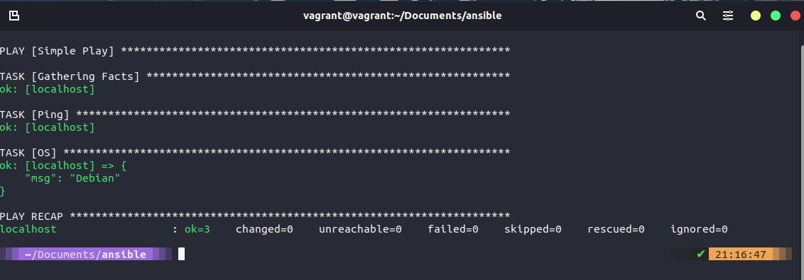

## Learn Infrastructure as Code

### Day56

#### 📌 IaC

1. 데브옵스 이전

🔻새로운 애플리케이션을 빌드하는 경우 대부분의 서버를 수동으로 준비해야했음

> 가상머신 배포 / 물리적 서버 및 운영 체제 설치

> 네트워킹 구성

> 라우팅 테이블 생성

> 소프트웨어 및 업데이트 설치

> 소프트웨어 구성

> 데이터베이스 설치

🔻 위의 초기 단계 이외에 서버를 유지 관리해야했음

> 버전 업데이트

> 새 릴리즈 배포

> 데이터 관리

> 애플리케이션 복구

> 서버 추가, 제거 및 확장

> 네트워크 구성

🔻 테스트 및 개발 환경의 복잡성 추가

2. IaC

✔️ IaC를 사용하면 위의 모든 작업을 처음부터 끝까지 <span style="color:indianred">자동화</span> 가능

**IaC**

1. 물리머신, 가상머신, 클라우드 VM, 클라우드 PaaS 등의 시스템을 잃을 경우 전체 환경을 재구축하는데 도움이 됨

2. 인프라를 자동으로 프로비저닝하는 개념으로, 서버에 문제가 발생하면 서버를 폐기하고 새 서버를 스핀업하는 작업 수행하는 등 코드에 정의된 대로 정확하게 작동

#### 📌 인프라 프로비저닝

**Terraform**

인프라의 모양을 코드로 정의한 다음 배포할 수 있으며, 인프라를 관리하고 애플리케이션을 처음 배포할 수 있지만 그 시점에서는 애플리케이션을 추적할 수 없음

=> 따라서 Terraform보다 Ansible과 같은 도구가 더 잘 작동할 수 있음

소프트웨어 초기 설치 및 구성

✔️ 새 서버 스핀업

✔️ 네트워크 구성

✔️ 로드 밸런서 생성

✔️ 인프라 수준에서 구성

#### 📌 프로비저닝된 인프라 구성

- 서버에 애플리케이션 설치

- 애플리케이션을 배포할 서버 준비

#### 📌 애플리케이션 배포

- 애플리케이션 배포 및 관리

- 유지 관리 단계

- 소프트웨어 업데이트

- 재구성

#### 📌 IaC 도구의 차이점

1. 선언적 방식과 절차적 방식

1) 선언적 방식

- 결과 선언: 원하는 시스템 상태와 리소스 정의

- 서버 2개

2. 절차적 방식

- 단계별 지침: 특정 구성을 달성하는데 필요한 명령 정의

- 서버 생성 > 서버 추가 > 변경

2. 변경 가능(반려동물) vs 변경 불가 (가축)

1) 변경 가능

- 대체 대신 변경

- 일반적으로 수명이 김

- But 각 서버와 모든 스위치를 개별적으로 처리해야하기에 문제 식별 및 솔루션 생성에 오랜 시간 소요됨

2. 변경 불가

- 변경 대신 교체

- 수명이 짧을 수 있음

- But 인프라의 일관성을 통해 애플리케이션을 훨씬 더 빠르고 안정적으로 구축하고 배포 가능

📢 요약하면, <span style="color:indianred">IaC(Infrastructure)</span> 라는 서버를 자동화시키는 개념이 발생하고 그 도구의 예시가 <span style="color:indianred">Terraform</span>. 프로비저닝이란 IT 인프라를 생성하고 설정하는 프로세스로, 배포하는 과정에서 초기 단계

📢 IaC에서는 네트워크, 가상머신, 로드밸런서, 연결 토폴로지가 코딩되어 애플리케이션 개발에 사용되는 환경을 표준화하며, DevOps는 코딩되면 변화하는 수요에 맞춰 인프라를 빠르게 시작하고 해체하며 조정할 수 있어 소프트웨어 개발 및 테스트, 구현이 빠르고 쉬워짐

### Day57

#### 📌 Terraform 소개

1. Terraform

- 인프라를 안전하고 효율적으로 구축, 변경, 버전 관리할 수 있는 도구

- 수백 개의 클라우드 서비스를 관리하기 위한 일관된 CLI workflow를 제공하는 코드 소프트웨어 도구이자 오픈 소스 인프라. 클라우드 API를 `선언적 구성 파일`로 코드화

- 복잡한 인프라 환경을 프로비저닝할 수 있는 기능을 제공하는 CLI. 로컬 또는 원격(클라우드)에 존재하는 복잡한 인프라 요구 사항을 정의할 수 있음. 처음에 구축할 수 있을 뿐만 아니라 해당 리소스의 수명 기간동안 유지 관리 및 업데이트 가능

2. Terraform 개요

(1) Write

-> Terraform을 사용하면 환경을 구축할 선언적 구성 파일 생성 가능

-> 해당 파일은 블로그 인수, 표현식을 사용하여 리소스를 간결하게 설명할 수 있는 <span style="color:indianred">해시코프 구성 언어(HCL)</span>을 사용하여 작성

(2) Plan

-> 생성한 구성 파일을 확인하기 위해 Terraform cli의 특정 기능을 사용하여 배포하거나 변경하기 전에 테스트하는 기능

-> Terraform은 인프라를 위한 지속적인 도구이기에 인프라를 변경하려면 테라폼을 통해 코드에 변경 사항이 존재하도록 해야함

(3) Apply

-> Terraform 내에서 사용 가능한 provider에 이 구성을 적용할 수 있음

ex. AWS, Azure, Google Cloud Platform, Kubernetes, Alibaba Cloud, Oracle Cloud Infrastructure

-> Terraform에서 사용가능한 모듈이 존재하고 공개적으로 생성 및 공유되어 있으므로 새로 만들 필요없이 동일하게 사용하면 됨

3. Terraform workflow



4. Terraform vs Vagrant

- Terraform과 Vagrant 해시코프 오픈소수 도구

✔️ Terraform : 인프라 구축을 위한 도구

✔️ Vagrant : 개발 환경 관리에 중점을 둔 도구

#### 📌 Terraform 설치

- Terraform은 cross-platform이므로 아래 웹사이트에서 코드 작성을 통해 설치 가능

https://developer.hashicorp.com/terraform/tutorials/aws-get-started/install-cli

- arkade(필요한 도구, 앱, 클리스를 시스템에 설치할 수 있는 도구)를 사용하여 설치가 가능한데 `arkade get terraform` 명령어를 통해 테라폼 업데이트 가능

### Day58

#### 📌 HashiCorp 구성 언어 (HCL)

- 일반적으로 Terraform에서 사용하는 인프라 플랫폼은 아니지만 본 실습에서는 VirtualBox 사용할 것

- 일반적으로 퍼블릭 클라우드(AWS, Google Microsoft Azure) 뿐만 아니라 가상화 환경(VMware, Microsoft Hyper-V, Nutanix AHV)에도 인프라를 배포하는데 Terraform 사용

- Terraform에는 `code`와 `state`라는 두 가지 핵심 존재 + 배포하고자하는 환경인 `Terraform 공급자` (AWS 공급자, Azure 공급자 등을 사용하여 실행)

⭐️ 기본 Terraform 사용법

✔️ `.tf` 파일이 어떻게 구성되는지 확인

✔️ 예제: <span style="color:indianred">AWS에 리소스를 배포</span>하는 코드 => 시스템에 AWS CLI 설치하고 계정에 맞게 구성

1. 공급자

✔️ `.tf` 파일 구조의 최상단에는 `main.tf`라 불리는 파일 존재. 해당 파일에서 공급자 정의

=> AWS 공급자 소스는 `hashicorp/aws`이며 이는 공급자가 HashiCorp에서 직접 유지 관리하거나 게시했음을 의미

```
terraform {
  required_providers {
    aws = {
      source  = "hashicorp/aws"
      version = "~> 3.0"
    }
  }
}
```

✔️ 기본적으로 Terraform 레지스트리에서 사용할 수 있는 제공자(https://registry.terraform.io/)를 참조하게 되며, 제공자를 작성하여 로컬에서 사용하거나 Terraform 레지스트리에 자체 게시할 수 있음

✔️ 프로비저닝할 AWS의 region을 결정하기 위해 추가 가능

```
provider "aws" {
  region = "ap-southeast-1" //리소스를 배포해야 하는 지역
}
```

2. Terraform resource

✔️ EC2, 로드밸런서, VPC 등과 같은 하나 이상의 인프라 개체를 설명하는 Terraform 구성 파일의 구성요소

✔️ resource 블록은 지정된 유형("aws_instance")의 리소스를 지정된 로컬 이름("90daysofdevops")으로 선언

✔️ resource 유형과 이름은 함께 지정된 resource의 식별자 역할

✔️ `yum` 업데이트 실행 + ec2 인스턴스에 `httpd`(오픈 소스 기반 웹 서버) 설치

```
resource "aws_instance" "90daysofdevops" {
  ami               = data.aws_ami.instance_id.id
  instance_type     = "t2.micro"
  availability_zone = "us-west-2a"
  security_groups   = [aws_security_group.allow_web.name]
  user_data         = <<-EOF
                #! /bin/bash
                sudo yum update
                sudo yum install -y httpd
                sudo systemctl start httpd
                sudo systemctl enable httpd
                echo "
<h1>Deployed via Terraform</h1>

" | sudo tee /var/www/html/index.html
        EOF
  tags = {
    Name = "Created by Terraform"
  }
}
```

✔️ 전체 `main.tf`

=> 아래 코드 설명) AWS에서 웹 서버를 EC2 인스턴스로 배포

```
terraform {
  required_providers {
    aws = {
      source  = "hashicorp/aws"
      version = "~> 3.27"
    }
  }

  required_version = ">= 0.14.9"
}

provider "aws" {
  profile = "default"
  region  = "us-west-2"
}

resource "aws_instance" "90daysofdevops" {
  ami           = "ami-830c94e3"
  instance_type = "t2.micro"
  availability_zone = "us-west-2a"
    user_data         = <<-EOF
                #! /bin/bash
                sudo yum update
                sudo yum install -y httpd
                sudo systemctl start httpd
                sudo systemctl enable httpd
                echo "
<h1>Deployed via Terraform</h1>

" | sudo tee /var/www/html/index.html
        EOF
  tags = {
    Name = "Created by Terraform"

  tags = {
    Name = "ExampleAppServerInstance"
  }
}
```

✔️ 다른 예제: Terraform 모듈 사용

```
terraform {
  # 이 모듈은 현재 Terraform 0.13.x에서만 테스트 중입니다. 그러나 더 쉽게 업그레이드할 수 있도록 다음과 같이 설정하고 있습니다.
  # 0.12.26을 최소 버전으로 설정했는데, 이 버전은 소스 URL이 있는 required_providers에 대한 지원이 추가되었기 때문입니다.
  # 0.13.x 코드와 호환됩니다.
  required_version = ">= 0.12.26"
}

# website::tag::1:: 가장 간단한 Terraform 모듈: "Hello, World!"를 출력하기만 하면 됩니다.
output "hello_world" {
  value = "Hello, 90DaysOfDevOps from Terraform"
}
```

- 해당 파일을 IaC 폴더 안의 Hello-world 폴더에서 찾을 수 있지만 Terraform 코드를 사용하기 위해서는 실행해야하는 과정이 있기에 바로 작동하지 않음

✔️ Terraform 모듈 사용하기 전 Terraform 코드 사용하기 위해 실행해야하는 과정

1. 터미널에서 main.tf가 생성된 폴더로 이동 -> 해당 폴더에서 `terraform init` 실행

- terraform 코드가 있는 모든 디렉토리에서 또는 terraform 코드 실행하기 전 해당 작업 수행해야만 함. 구성 디렉토리를 초기화하면 구성에 정의된 공급자를 다운로드하여 설치 (아래의 모듈 사용 예제에는 공급자가 없지만 위의 예제에는 AWS 공급자 다운로드해야함)

- 본 명령어를 실행할 때 폴더 트리를 전후로 살펴보고 어떤 일이 발생하고 제공자와 모듈을 어디에 저장하는지 확인

2. `terraform plan`

- 실행 계획을 생성하여 Terraform이 인프라에 적용하려는 변경 사항을 미리 볼 수 있게 해줌

- 현재 시점에서 리포지토리 초기화를 완료하고 필요한 경우 제공자를 다운로드했으며 테스트 워크스루를 실행하여 원하는대로 표시되는지 확인 => 코드 실행 및 배포 가능

3. `terraform apply`

- 작업을 수행할 수 있으며, 해당 명령에는 안전 조치가 내장되어 있어 앞으로 일어날 일에 대한 계획 보기가 제공되므로 계속할 것인지에 대한 응답 보장

- Enter a value에 yes를 입력하면 코드가 배포되며 코드에서 정의한 출력이 나타남

4. `terraform destroy`

- 무언가를 배포한 후 배포한 모든 것을 제거할 경우 사용

🔥 Terraform CLI

- `terraform init` : 프로바이더로 프로젝트 폴더 준비

- `terraform plan` : 코드 기반으로 명령 중 생성 및 변경될 내용 표시

- `terraform apply` : 코드에 정의된 리소스 배포

- `terraform destroy` : 프로젝트에서 생성한 리소스 파괴

🔥 코드 파일에서 중요한 측면

- `providers` : API를 통해 Terraform이 최종 플랫폼과 대화하는 방법

- `resources` : 우리가 코드로 배포하고자 하는 것

3. Terraform state

✔️ 디렉토리 내부에 생성되는 terraform 상태를 표현하는 JSON 파일

✔️ 민감한 데이터를 보여줄 수 있으므로 GitHub에 업로드하기 전 .tfstate 파일을 .gitignore 폴더에 넣는 것이 좋음

```
{
  "version": 4,
  "terraform_version": "1.1.6",
  "serial": 1,
  "lineage": "a74296e7-670d-0cbb-a048-f332696ca850",
  "outputs": {
    "hello_world": {
      "value": "Hello, 90DaysOfDevOps from Terraform",
      "type": "string"
    }
  },
  "resources": []
}
```

✔️ 기본적으로 상태 파일은 프로젝트 코드와 같은 디렉토리에 존재하지만 옵션으로 원격으로 저장할 수 있으며, 다른 옵션으로는 유료 관리형 서비스인 Terraform Cloud 존재

- 원격 위치에 상태를 저장하는 경우의 장점: 민감한 데이터 암호화 / 협업 / 자동화

- 단점: 복잡성 증가

### Day59

#### 📌 Terraform 및 변수를 사용하여 VM 생성

- VirtualBox에서 Terraform을 사용하는 것은 좋은 예시가 아니지만 데모 목적이므로 진행

- VirtualBox 내에서 Terraform을 사용하여 VM 생성: 원하는 상태 구성 코드를 만든 다음 VirtualBox 공급자에 대해 실행

1. VirtualBox에서 가상 머신 생성하기 (1)

- VirtualBox라는 새 폴더 생성 + VirtualBox.tf 파일 생성 + 리소스 정의

- 아래 코드를 통해 VirtualBox에 2개의 VM 생성

참고 https://registry.terraform.io/providers/terra-farm/virtualbox/latest/docs/resources/vm

```
terraform {
  required_providers {
    virtualbox = {
      source = "terra-farm/virtualbox"
      version = "0.2.2-alpha.1"
    }
  }
}

# 현재 공급자 자체에 대한 구성 옵션이 없습니다.

resource "virtualbox_vm" "node" {
  count     = 2
  name      = format("node-%02d", count.index + 1)
  image     = "https://app.vagrantup.com/ubuntu/boxes/bionic64/versions/20180903.0.0/providers/virtualbox.box"
  cpus      = 2
  memory    = "512 mib"

  network_adapter {
    type           = "hostonly"
    host_interface = "vboxnet1"
  }
}

output "IPAddr" {
  value = element(virtualbox_vm.node.*.network_adapter.0.ipv4_address, 1)
}

output "IPAddr_2" {
  value = element(virtualbox_vm.node.*.network_adapter.0.ipv4_address, 2)
}

```

2. VirtualBox에서 가상 머신 생성하기 (2)

- `terraform init`을 통해 VirtualBox용 공급자 다운로드

- 이때 시스템에도 VirtualBox가 설치되어 있어야 함

3. VirtualBox에서 가상 머신 생성하기 (3)

- `terraform plan`을 통해 실행하여 코드가 무엇을 생성하는지 확인

4. VirtualBox에서 가상 머신 생성하기 (4)

- `terraform apply`를 통해 완성된 프로세스 표시

5. 확인

- VirtualBox에서 2개의 가상머신이 생성된 것 확인 가능

6. 구성 변경

- 배포에 다른 노드 추가 후 `terraform apply` 하면 VirtualBox에서 3개의 노드가 실행되는 것을 볼 수 있음

7. 삭제

- `terraform destroy`를 통해 머신 제거

8. 변수 및 출력

- hello-world 예제 실행할 때 언급된 출력에 사용할 수 있는 많은 변수 존재. 변수 정의하는 방법

✔️ `terraform plan` 또는 `terraform apply` 명령을 사용하여 변수를 수동으로 입력할 수 있음

✔️ 블록 내의 .tf 파일에 변수 정의 가능

✔️ `TF_VAR_NAME` 형식을 사용하여 시스템 내에서 환경 변수를 사용할 수 있음

✔️ 프로젝트 폴더에 terraform.tfvars 파일 사용 선호

✔️ \*auto.tfvars 파일 옵션

✔️ `-var` 또는 `-var-file`을 사용하여 `terraform plan` 또는 `terraform apply`을 실행할 때 정의 가능

- state 파일에 포함되는 민감한 정보를 변수로 정의할 수 있음

```
variable "some resource"  {
    description = "something important"
    type= string
    sensitive = true

}
```

### Day60

- Day59에서는 Terraform을 사용하여 로컬 무료 VirtualBox 환경에 가상 머신을 프로비저닝. 본 섹션에서는 몇 가지 구성이 포함된 Docker 컨테이너를 로컬 Docker 환경에 배포

#### 📌 Docker 데모

1. 아래 코드를 통해 간단한 웹 앱을 Docker에 배포하고 게시하여 네트워크에서 사용할 수 있도록 함

- nginx 사용 + localhost와 포트 8000 사용

1. .tf 파일 생성 및 리소스 정의

```
terraform {
  required_providers {
    docker = {
      source  = "kreuzwerker/docker"
      version = "2.16.0"
    }
  }
}

provider "docker" {}

resource "docker_image" "nginx" {
  name         = "nginx:latest"
  keep_locally = false
}

resource "docker_container" "nginx" {
  image = docker_image.nginx.latest
  name  = "tutorial"
  ports {
    internal = 80
    external = 8000
  }
}
```

2. `terraform init`

- 로컬 머신에 프로바이더 다운로드

3. `terraform apply` 실행 후 `docker ps` 실행

- 컨테이너 실행

4. 브라우저에서 `localhost:8000`으로 이동

- nginx 컨테이너에 액세스 확인

#### 📌 더 복잡한 Docker

- docker-compose로 만든 워드프레스와 MySQL용 docker-compose 파일을 가져와 Terraform에 삽입

1. .tf 파일 생성 및 리소스 정의

```
terraform {
  required_providers {
    docker = {
      source  = "kreuzwerker/docker"
      version = "2.16.0"
    }
  }
}

provider "docker" {}

variable wordpress_port {
  default = "8080"
}

resource "docker_volume" "db_data" {
  name = "db_data"
}

resource "docker_network" "wordpress_net" {
  name = "wordpress_net"
}

resource "docker_container" "db" {
  name  = "db"
  image = "mysql:5.7"
  restart = "always"
  network_mode = "wordpress_net"
  env = [
     "MYSQL_ROOT_PASSWORD=wordpress",
     "MYSQL_PASSWORD=wordpress",
     "MYSQL_USER=wordpress",
     "MYSQL_DATABASE=wordpress"
  ]
  mounts {
    type = "volume"
    target = "/var/lib/mysql"
    source = "db_data"
    }
}

resource "docker_container" "wordpress" {
  name  = "wordpress"
  image = "wordpress:latest"
  restart = "always"
  network_mode = "wordpress_net"
  env = [
    "WORDPRESS_DB_HOST=db:3306",
    "WORDPRESS_DB_USER=wordpress",
    "WORDPRESS_DB_NAME=wordpress",
    "WORDPRESS_DB_PASSWORD=wordpress"
  ]
  ports {
    internal = "80"
    external = "${var.wordpress_port}"
  }
}
```

2. `terraform init`

- 로컬 머신에 필요한 provisioners 다운로드

3. `terraform apply` 실행 후 `docker ps` 실행

- 새로 생성된 컨테이너 확인 가능

4. 브라우저에서 `localhost:8080`으로 이동

- WordPress 프론트엔드로 이동 가능. WordPress 게시물이 MySQL 데이터베이스에 저장

#### 📌 Provisioners

- 어떤 것이 선언적일 수 없는 경우 이를 배포에 파싱할 수 있는 방법 제공

- 다른 대안이 없고 코드에 복잡성을 추가해야하는 경우 아래 코드와 유사하게 실행하여 수행

- 원격 실행 Provisioners는 원격 리소스가 생성된 후 원격 리소스에서 스크립트 호출

- file / local-exec / remote-exec / vendor (ansible, chef, puppet)

```
resource "docker_container" "db" {
  # ...

  provisioner "local-exec" {
    command = "echo The server's IP address is ${self.private_ip}"
  }
}
```

#### 📌 Module

- Module : 함께 사용되는 여러 리소스를 위한 컨테이너. 동일한 디렉토리에 있는 .tf 파일 모음으로 구성

- 인프라 리소스를 분리할 수 있는 좋은 방법이며 이미 만들어진 타사 모듈을 가져올 수 있어 새로 만들 필요가 없음

ex. 동일한 프로젝트를 사용하여 일부 VM, VPC, 보안 그룹을 구축한 다음 Kubernetes 클러스터도 구축하려는 경우, 리소스를 모듈로 분할하여 리소스와 그룹화 위치를 더 잘 정의하길 원함

### Day61

- 지금까지 가상 머신, Docker 컨테이너에서 정의한 다음 배포해보았고 본 섹션에서는 Terraform을 사용하여 Kubernetes에서 지원하는 리소스와 상호 작용하는 방법을 살펴볼 것

- Terraform을 사용하여 Kubernetes 클러스터 내의 객체와 상호작용할 수 있는데, 이는 Kubernetes 공급자를 사용하거나 Helm 공급자를 사용하여 차트 배포를 관리할 수 있음

- Kubernetes 환경에서 Terraform 사용 시의 이점

✔️ 통합 workflow : 클러스터 배포에 Terraform을 사용했다면, 동일한 workflow와 도구를 사용하여 Kubernetes 클러스터 내에 배포 가능

✔️ 라이프사이클 관리 : Terraform은 단순한 프로비저닝 도구가 아니라 변경, 업데이트, 삭제 가능

#### 📌 간단한 Kubernetes 데모

- Kubernetes 클러스터에 nginx 배포 + 데모 목적으로 Minikube 사용

1. 공급자 정의 + kubeconfig 파일 가리키고 nginx 네임스페이스 생성 후 2개의 복제본과 서비스 포함해 배포

```
terraform {
  required_providers {
    kubernetes = {
      source  = "hashicorp/kubernetes"
      version = ">= 2.0.0"
    }
  }
}
provider "kubernetes" {
  config_path = "~/.kube/config"
}
resource "kubernetes_namespace" "test" {
  metadata {
    name = "nginx"
  }
}
resource "kubernetes_deployment" "test" {
  metadata {
    name      = "nginx"
    namespace = kubernetes_namespace.test.metadata.0.name
  }
  spec {
    replicas = 2
    selector {
      match_labels = {
        app = "MyTestApp"
      }
    }
    template {
      metadata {
        labels = {
          app = "MyTestApp"
        }
      }
      spec {
        container {
          image = "nginx"
          name  = "nginx-container"
          port {
            container_port = 80
          }
        }
      }
    }
  }
}
resource "kubernetes_service" "test" {
  metadata {
    name      = "nginx"
    namespace = kubernetes_namespace.test.metadata.0.name
  }
  spec {
    selector = {
      app = kubernetes_deployment.test.spec.0.template.0.metadata.0.labels.app
    }
    type = "NodePort"
    port {
      node_port   = 30201
      port        = 80
      target_port = 80
    }
  }
}
```

2. `terraform init`

- `kubectl get ns`를 통해 `terraform apply` 실행 전 네임스페이스가 없는 것 확인

3. `terraform apply`

- Kubernetes 클러스터 내에 3개의 새로운 리소스, 네임스페이스, 배포 및 서비스 생성

- `kubectl get ns`를 통해 배포된 리소스 확인

- Minikube를 사용하기에 도커 네트워킹으로 인그레스를 시도할 때 한계 존재. `kubectl port-forward -n nginx svc.nginx 30201:80` 명령 후 `localhost:30201`로 브라우저 열면 nginx 페이지 확인 가능

#### 📌 여러 환경

- 실행한 데모를 특정 프로덕션, 스테이징 및 개발 환경이 동일하게 보이고 코드를 활용하는 방법

✔️ `terraform workspaces` : 단일 백엔드 내의 여러 개의 명명된 섹션

- 장점: 쉬운 시작 / 편리한 terraform.workspace 표현식 / 코드 중복 최소화

- 단점: 인적 오류가 발생하기 쉬움(TF를 사용해 제거하려고 노력 중) / 동일한 백엔드 내에 저장된 상태 / 코드베이스가 배포 구성을 명확하게 보여주지 않음

✔️ 파일 구조 : 디렉토리 레이아웃은 분리를 제공하고 모듈은 재사용 제공

- 장점: 백엔드 격리 (보안 향상+인적 오류 가능성 감소) / 배포된 상태를 완벽하게 나타내는 코드 베이스

- 단점: 프로비저닝 환경에 여러 terraform 적용 필요 / 코드 중복이 더 많지만 모듈을 사용해 최소화 가능

### Day62

#### 📌 테스트, 도구 및 대안

1. Code Rot

- 애플리케이션 코드와 달리 코드로서의 인프라는 한 번 사용되었다가 오랫동안 사용하지 않을 수도 있음

- Terraform을 사용하여 AWS에 VM 환경을 배포하려고 하는데, 처음에 완벽하게 작동하고 환경이 갖춰졌지만 이 환경이 자주 변경되지 않아 코드가 중앙 위치에 저장되기를 바라지만 코드가 변경되지 않는 상태를 그대로 유지한다고 가정

=> 인프라에 변화가 생긴 경우, 대역 외 변경 사항 / 고정되지 않은 버전 / 더 이상 사용되지 않는 종속성 / 적용되지 않는 변경 사항

2. 테스트

- 모든 영역이 정상적으로 작동하는지 확인하는 기능

|       Command        |                            Description                            |
| :------------------: | :---------------------------------------------------------------: |
|   `terraform fmt`    |       Terraform 구성 파일을 표준 형식과 스타일로 다시 작성        |
| `terraform validate` |     디렉토리에 있는 구성 파일의 유효성을 검사하여 구성만 참조     |
|   `terraform plan`   |    실행 계획을 생성하여 terraform이 계획한 변경 사항을 미리 봄    |
|  Custom validation   | 입력 변수가 예상과 일치하는지 확인하기 위한 입력 변수 유효성 검사 |

1. Terraform 외부에서 사용할 수 있는 테스트 도구

- tflint : 가능한 오류 찾기 / 더이상 사용되지 않는 구문과 선언에 대해 경고 / 모범 사례와 명명 규칙 적용

2. 검사 도구

- checkov : 클라우드 인프라 구성을 스캔하여 배포하기 전에 잘못된 구성 찾기

- tfsec : terraform 코드에 대한 정적 분석 보안 스캐너

- terrascan : IaC를 위한 정적 코드 분석기

- terraform-compliance : IaC에 대한 네거티브 테스트 기능 지원

- snyk : terraform 코드에서 잘못된 구성과 보안 문제 스캔

3. 관리형 클라우드 제품

- Terraform Sentinel

3. 자동화된 테스트

- Terratest

- Terraform 클라우드

- Terragrunt

- Atlantis

4. 대안

- `Pulumi` : Terraform과 Pulumi 원하는 인프라 상태를 나타내는 코드 모델로 원하는 상태 인프라 제공. But Pulumi는 HCL과 달리 Python, TypeScript, Javascript, Go, .NET과 같은 범용 언어 허용

## Automate Configuration Management

### Day63

#### 📌 구성 관리

1. 구성 관리 : 애플리케이션, 시스템, 서버를 원하는 상태로 유지하는 프로세스

2. 구성 관리 사용 이유

- 구성 관리 도구를 사용하면 시스템에 장애가 발생하거나 서버가 다운되는 경우, 시스템 관리자가 각 서버를 빠르고 효과적으로 설정하는 방법에 대한 지침을 푸시

3. 구성 관리 도구

1) Chef

- 인프라 자동화를 통해 모든 환경, 모든 규모에서 구성이 일관되게 적용되도록 보장

- Ruby와 Erlang으로 작성된 OpsCode에서 개발한 오픈 소스 도구

- 장점: 강력한 버전 제어를 제공하는 Git과 잘 통합됨

- 단점: 학습 곡선이 가파르며 상당한 시간이 필요 / 메인 서버에서 제어할 수 있는 권한이 많지 않음

- 아키텍처: 서버/클라이언트

- 설정 용이성: 보통

- 언어: 절차적 - 작업 수행 방법 지정

2. Puppet

- 자동 배포를 지원하는 구성 관리 도구

- 장점: 지원을 위한 대규모 커뮤니티 존재 / 잘 발달된 대규모 커뮤니티

- 단점: 고급 작업을 수행하려면 Ruby 언어에 대한 지식 필요 / 메인 서버에 대한 제어 권한이 많지 않음

- 아키텍처: 서버/클라이언트

- 설정 용이성: 보통

- 언어: 선언적 - 수행할 작업만 지정 가능

3. Ansible

- 구성 관리, 클라우드 프로비저닝, 배포 및 오케스트레이션을 자동화하는 IT 자동화 도구

- YAML로 작성

- 장점: 원격 노드에 에이전트가 필요하지 않음 / YAML은 배우기 쉬움

- 단점: 성능 속도가 다른 도구보다 느린 경우 많음 / YAML은 Ruby만큼 강력하지는 않지만 학습 곡선이 적음

- 아키텍처: 클라이언트 전용

- 설정 용이성: 매우 쉬움

- 언어: 절차적 - 작업 수행 방법 지정

4. SaltStack

- 구성 관리와 원격 실행을 자동화하는 CLI 기반 도구

- Python 기반이며 명령어는 YAML 또는 해당 DSL로 작성

- 확장성과 복원력을 최우선으로 고려하는 환경에 적합

- 장점: 가동 및 실행 시 사용이 간편 / 우수한 보고 메커니즘

- 단점: 설정 단계가 까다로움 / 다른 서비스보다 훨씬 덜 개발된 새로운 웹 UI 존재

- 아키텍처: 서버/클라이언트

- 설정 용이성: 보통

- 언어: 선언적 - 수행할 작업만 지정 가능

#### 📌 Ansible과 Terraform 비교

|                   |                  Ansible                   |                   Terraform                    |
| :---------------: | :----------------------------------------: | :--------------------------------------------: |
|       유형        |               구성 관리 도구               |              오케스트레이션 도구               |
|      인프라       |          변경 가능한 인프라 지원           |           변경 불가능한 인프라 지원            |
|       언어        |                절차적 언어                 |                  선언적 언어                   |
|    프로비저닝     | 부분 프로비저닝(VM,네트워크,스토리지) 제공 | 광범위한 프로비저닝(VM,네트워크,스토리지) 제공 |
|      패키징       |  패키징 및 템플릿에 대한 완벽한 지원 제공  |     패키징 및 템플릿에 대한 부분 지원 제공     |
| 라이프사이클 관리 |       라이프사이클 관리 기능 존재 X        |     라이프사이클 및 상태 관리에 크게 의존      |

### Day64

#### 📌 Ansible 특징

1. RedHat에서 제공

2. 에이전트가 없으며 SSH를 통해 연결하고 명령 실행

3. 크로스 플랫폼(Linux 및 macOS, WSL2) 및 오픈 소스(엔터프라이즈용 유료 옵션 존재)

4. 다른 모델에 비해 구성을 push

#### 📌 Ansible 설치

- Ansible은 에이전트가 없는 자동화 도구이며, 이 도구는 "Control Node"라고 하는 시스템에 배포되고 이 Control Node에서 SSH를 통해 머신 및 기타 장치(ex.네트워크) 관리

1. Windows OS를 Control Node로 사용할 수 없으므로 Linux 섹션에서 만든 Linux VM을 Control Node로 사용

- 아래 명령어로 설치

```
sudo apt update
sudo apt install software-properties-common
sudo add-apt-repository --yes --update ppa:ansible/ansible
sudo apt install ansible
```

2. Control Node에 ansible이 설치되어 있어야 하며, `ansible --version`을 실행하여 확인 가능

3. 로컬 머신에 `ansible localhost -m ping`

- Ansible 모듈 사용 명령어로, 여러 시스템에서 하나의 작업을 빠르게 수행할 수 있는 방법

- ansible 기능 확인

- 실제 모듈 사용법은 `ansible webservers -m service -a "name=httpd state=started"`와 같이 모든 웹서버에 httpd 서비스가 실행 중인지 여부를 알려주는 것

#### 📌 호스트

⚡️ 환경의 다른 node 제어하는 방법

- 위에서 localhost를 사용하여 시스템에 대한 핑 모듈을 실행하는 방법은 네트워크에 다른 컴퓨터를 지정할 수 없음

ex. VirtualBox가 실행중인 Windows 호스트에는 IP 10.0.0.1의 네트워크 어댑터가 있어 핑으로 연결할 수 있지만 ansible을 사용해 해당 작업을 수행할 수는 없음

=> 자동화할 호스트 또는 Node를 지정하려면 이를 정의해야함

1. `cd /etc/ansible`

- 시스템의 /etc/ansible 디렉토리로 이동하여 정의

- 편집하려는 파일은 hosts 파일이며, 텍스트 편집기를 통해 hosts 정의 가능

2. 텍스트 편집기를 통해 hosts 파일 편집

- 아래로 스크롤해 [windows]라는 새 그룹을 만들고 해당 호스트에 대한 `10.0.0.1` IP 주소 추가 후 파일 저장

- `ansible windows -m ping`을 실행하면 SSH를 통한 연결에 실패하여 연결할 수 없다는 메세지 표시 => Ansible이 시스템에 연결하려면 SSH를 사용할 수 있어야 함

3. hosts 파일에 Linux 시스템 그룹에 액세스하기 위한 자격 증명 추가

- [windows] 아래에 [Linux] 10.0.2.15 추가 + [linux:vars] ansible_user=vagrant / ansible_password=vagrant 추가

- `ansible Linux -m ping` 실행 => 성공

✔️ 구성을 자동화하려는 대상 시스템인 Node 요구 사항 존재 : Ansible을 위한 어떤 것도 설치하지 않음. Ansible은 SSH를 통해 연결하고 SFTP를 통해 모든 것 전송 (원하는 경우 SSH를 구성한 경우 SCP 대 SFTP 사용 가능)

#### 📌 Ansible 명령

✔️ Ansible을 사용하면 많은 adhoc 명령 실행 가능. 이 명령을 시스템 그룹에 대해 실행하여 해당 정보 가져올 수 있음

- adhoc 명령은 선언적 모델을 사용하여 지정된 최종 상태에 도달하는데 필요한 작업을 계산하고 실행. 시작하기 전에 현재 상태를 확인하고 현재 상태가 지정된 최종 상태와 다르지 않으면 아무 작업 수행 X

✔️ 명령을 반복하거나 이러한 명령을 실행하기 위해 개별 시스템에 로그인해야 하는 경우 Ansible이 도움이 될 수 있음

ex. `ansible linux -a "cat /etc/os-release"` 명령은 Linux 그룹에 추가하는 모든 시스템에 대한 모든 운영 체제 세부 정보 출력

### Day65

#### 📌 Ansible Playbook

✔️ Ansible의 경우 하나의 명령으로 여러 서버를 실행하여 간단한 명령을 수행하고, 각 서버에 개별적으로 연결해야 하는 번거로움을 줄일 수 있다는 점이 가장 큰 장점

✔️ Ansible Playbook을 사용하면 서버 그룹을 가져와서 해당 그룹에 대한 구성 및 설치 작업을 수행할 수 있음

#### 📌 Ansible Playbook 형식

1. Playbook

: YAML(마크업 언어가 아님)로 작성되어 있음

**Playbook > Play > Task**

ex. playbook.yml

```
- name: Simple Play
  hosts: localhost
  connection: local
  tasks:
    - name: Ping me
      ping:
    - name: print os
      debug:
        msg: "{{ ansible_os_family }}"
```

2. playbook 실행

1) `ansible-playbook simple_play.yml` 명령어 실행

2) 결과
   

3) 설명

✔️ 첫번째 TASK 'gathering facts'

=> 원격 호스트에 대한 유용한 변수를 수집하기 위해 Playbook에서 자동 호출

✔️ 두번째 TASK 'Ping'

=> 원격 또는 로컬 호스트에 대한 연결 성공시 `pong`을 반환하는 파이썬 스크립트

✔️ 세번째 TASK

=> 첫번째 TASK로 정의한 세번째 TASK는 OS를 알려주는 메시지 인쇄를 비활성하지 않은 한 실행됨

=> 조건문을 사용하고 있으므로 모든 유형의 운영 체제에 대한 Playbook을 실행할 수 있으며 그러한 경우 OS 이름 반환. 위 출력은 아래의 Task를 추가한 경우 나타나는 출력

```
tasks:
  - name: "shut down Debian flavoured systems"
    command: /sbin/shutdown -t now
    when: ansible_os_family == "Debian"
```

#### 📌 Vagrant로 환경 설정하기

- Vagrant를 사용하여 Node 환경 설정

- `vagrant up` 명령을 사용해 VirtualBox에서 머신 스핀업하면 메모리 추가와 각 머신에 대한 private_network 주소 정의 가능

```
Vagrant.configure("2") do |config|
  servers=[
    {
      :hostname => "db01",
      :box => "bento/ubuntu-21.10",
      :ip => "192.168.169.130",
      :ssh_port => '2210'
    },
    {
      :hostname => "web01",
      :box => "bento/ubuntu-21.10",
      :ip => "192.168.169.131",
      :ssh_port => '2211'
    },
    {
      :hostname => "web02",
      :box => "bento/ubuntu-21.10",
      :ip => "192.168.169.132",
      :ssh_port => '2212'
    },
    {
      :hostname => "loadbalancer",
      :box => "bento/ubuntu-21.10",
      :ip => "192.168.169.134",
      :ssh_port => '2213'
    }

  ]

config.vm.base_address = 600

  servers.each do |machine|

    config.vm.define machine[:hostname] do |node|
      node.vm.box = machine[:box]
      node.vm.hostname = machine[:hostname]

      node.vm.network :public_network, bridge: "Intel(R) Ethernet Connection (7) I219-V", ip: machine[:ip]
      node.vm.network "forwarded_port", guest: 22, host: machine[:ssh_port], id: "ssh"

      node.vm.provider :virtualbox do |v|
        v.customize ["modifyvm", :id, "--memory", 2048]
        v.customize ["modifyvm", :id, "--name", machine[:hostname]]
      end
    end
  end

end
```

- 리소스가 제한되어 있는 경우 `vagrant up web01 web02`를 실행하여 여기서 사용 중인 웹서버만 불러옴

#### 📌 Ansible 호스트 구성

1. 우분투 데스크톱을 컨트롤로 사용하고 ansible hosts 파일에 새 Node 그룹 추가

- hosts 파일을 인벤토리로 생각할 수 있으며 `-i filename`을 사용하여 ansible 명령의 일부로 호출되는 또 다른 인벤토리 파일을 사용할 수 있음

- 기본 호스트 파일에 아래 코드 추가

```
[control]
ansible-control

[proxy]
loadbalancer

[webservers]
web01
web02

[database]
db01
```

2. `ansible nodes -m command -a hostname`

- Node에 대해 명령을 실행할 수 있는지 확인. 연결이 있는지 테스트하고 호스트 이름 다시 보고

- 연결을 보장하기 위해 /etc/hosts 파일 내의 Ubuntu 제어 Node에 해당 Node와 IP 추가

```
192.168.169.140 ansible-control
192.168.169.130 db01
192.168.169.131 web01
192.168.169.132 web02
192.168.169.133 loadbalancer
```

3. 제어 Node와 서버 Node 사이의 SSH 키 설정

- SSH를 설정하고 Node 간에 공유하려면 아래 단계 따라야 함

1. 비밀번호(vagrant)를 묻는 메시지가 표시되면 y를 몇 번 눌러야 수락할 수 있음

2. `ssh-keygen` > `ssh-copy-id localhost`

3. 모든 VM이 켜져있다면 `ssh-copy-id web01 && ssh-copy-id web02 && ssh-copy-id loadbalancer && ssh-copy-id db01` 실행 => 비밀번호 입력하라는 메세지 표시 (비밀번호 `vagrant`)

4. 모든 VM을 실행하지 않고 웹서버만 실행하고 있으므로 `ssh-copy-id web01 && ssh-copy-id web02` 발급

5. Playbook 실행 전 그룹과 연결 테스트

`ansible webservers -m ping`

#### 📌 Ansible Playbook

- 위의 Ansible Playbook은 웹 서버를 구성하는 것으로, 호스트 파일에서 [webservers] 그룹 아래에 웹 서버를 그룹화함

- Playbook 실행 전 web01과 web02에 apache가 설치되어 있는지 확인 => SSH로 접속

- 설치되어 있지 않으므로 아래 Playbook 실행

- Playbook

1. `host: webserver` 는 이 Playbook을 실행할 그룹이 웹서버 그룹임을 의미

2. `become: yes`는 Playbook을 실행하는 사용자가 원격 시스템에서 루트가 됨을 의미. 루트 비밀번호를 입력하라는 메시지 표시

3. `vars` 는 웹서버 전체에서 원하는 몇가지 환경 변수 정의

4. Task1은 apache가 최신 버전을 실행 중인지 확인

5. Task2는 template 폴더에 있는 소스에서 ports.conf 파일을 작성하는 것

6. Task3은 기본 index.html 파일을 생성하는 것

7. Task4는 apache가 실행 중인지 확인하는 것

8. Handler는 알림을 받을 때만 실행되는 태스크

```
- hosts: webservers
  become: yes
  vars:
    http_port: 8000
    https_port: 4443
    html_welcome_msg: "Hello 90DaysOfDevOps"
  tasks:
  - name: ensure apache is at the latest version
    apt:
      name: apache2
      state: latest

  - name: write the apache2 ports.conf config file
    template:
      src: templates/ports.conf.j2
      dest: /etc/apache2/ports.conf
    notify:
    - restart apache

  - name: write a basic index.html file
    template:
      src: templates/index.html.j2
      dest: /var/www/html/index.html
    notify:
    - restart apache

  - name: ensure apache is running
    service:
      name: apache2
      state: started

  handlers:
    - name: restart apache
      service:
        name: apache2
        state: restarted
```

#### 📌 Playbook 실행

1. `ansible-playbook playbook1.yml` 명령어로 실행

2. Node(web01)로 이동해 소프트웨어 설치 확인

`apache2 -v`

3. 웹 브라우저 이동

- 두 개의 독립형 웹 서버를 배포했으므로 정의한 각각의 IP로 이동해 새 웹 사이트 가져올 수 있음

### Day66

#### 📌 Playbook : Task, Handler 분리

- 추가 자동화 및 배포를 시작하기 전에 Playbook을 간결하고 깔끔하게 유지하는 기능과 Task와 Handler를 하위 폴더로 분리하는 방법

1. Task를 폴더 내의 해당 파일에 복사

```
- name: ensure apache is at the latest version
  apt: name=apache2 state=latest

- name: write the apache2 ports.conf config file
  template:
    src=templates/ports.conf.j2
    dest=/etc/apache2/ports.conf
  notify: restart apache

- name: write a basic index.html file
  template:
    src: templates/index.html.j2
    dest: /var/www/html/index.html
  notify:
  - restart apache

- name: ensure apache is running
  service:
    name: apache2
    state: started
```

2. Handler도 복사

```
- name: restart apache
  service:
    name: apache2
    state: restarted
```

3. Playbook 이름을 `playbook2.yml`로 지정한 후 해당 파일 가리킴

#### 📌 Role과 Ansible Galaxy

- 현재까지 4개의 VM을 배포했으며 이 중 2개의 VM을 웹 서버로 구성

- 데이터베이스 서버와 로드 밸런서 또는 프록시 등 좀 더 구체적인 기능 존재

1. `ansible-galaxy`

- 공유 리포지토리에서 Ansible Role을 관리

- `ansible-galaxy`를 사용해 웹서버에 대한 세부 정보를 넣을 apache2의 Role 생성

2. `ansible-galaxy init roles/apache2`

- 폴더 구조 생성

3. `tree`

4. 기존 작업과 template을 새 구조의 관련 폴더로 이동

- 복사하여 붙여넣으면 파일을 쉽게 옮길 수 있지만, tasks/main.yml을 변경하여 이 파일이 apache2_install.yml을 가리키도록 해야함

5. 새로운 Role을 참조하도록 Playbook 변경

```
- hosts: webservers
  become: yes
  vars:
    http_port: 8000
    https_port: 4443
    html_welcome_msg: "Hello 90DaysOfDevOps - Welcome to Day 66!"
  roles:
    - apache2
```

6. 새 Playbook 이름인 `ansible-playbook playbook3.yml`로 Playbook 다시 실행하면 deprecated 발생

=> tasks/main.yml의 include 옵션을 import_tasks로 변경

7. `ansible-galaxy`를 사용하면서 Role 추가

- common: 모든 서버용 (`ansible-galaxy init roles/common`)

- nginx: 로드밸런서용 (`ansible-galaxy init roles/nginx`)

### Day67

✔️ 지금까지는 apache2 Role만 사용했고 웹 서버를 처리하기 위해 작동하는 playbook2.yml이 존재

✔️ `vagrant up loadbalancer`를 실행하여 로드 밸런서 / 프록시로 사용할 다른 Ubuntu 시스템 등장

✔️ hosts 파일에 이 새 시스템을 이미 정의했지만, 사용할 수 있을 때까지 ssh 키가 구성되지 않았으므로 시스템이 가동되고 준비되면 `ssh-copy-id loadbalancer` 실행

#### 📌 Common Role

- Common Role 폴더 구조의 작업 폴더에는 main.yml 존재 : 이 YAML에서 install_tools.yml 파일로 가리켜야하며 `- import_tasks: install_tools.yml` 추가

- 이전에는 `include`였으나 곧 사용되지 않을 예정이므로 import_tasks 사용

```
- name: "Install Common packages"
  apt: name={{ item }} state=latest
  with_items:
   - neofetch
   - tree
   - figlet
```

- playbook에서 각 호스트 블록에 대한 Common Role 추가

```
- hosts: webservers
  become: yes
  vars:
    http_port: 8000
    https_port: 4443
    html_welcome_msg: "Hello 90DaysOfDevOps - Welcome to Day 66!"
  roles:
    - common
    - apache2
```

#### 📌 Nginx Role

- 로드밸런서 VM에 nginx를 설치하고 구성

- playbook에 호스트 블록 추가 => Common Role과 nginx Role 포함

```
- hosts: webservers
  become: yes
  vars:
    http_port: 8000
    https_port: 4443
    html_welcome_msg: "Hello 90DaysOfDevOps - Welcome to Day 66!"
  roles:
    - common
    - apache2

- hosts: proxy
  become: yes
  roles:
    - common
    - nginx
```

#### 📌 업데이트된 playbook 실행

1. `anible-playbook playbook4.yml`로 playbook4.yml 실행

2. 웹 서버와 로드밸런서가 구성되었으므로 로드밸런서의 IP주소로 이동할 수 있어야 함

- 브라우저가 정상적으로 나타나지 않은 경우 웹 서버 IP 주소로 업데이트

```
    upstream webservers {
        server 192.168.169.131:8000;
        server 192.168.169.132:8000;
    }

    server {
        listen 80;

        location / {
                proxy_pass http://webservers;
        }
    }
```

3. `ansible loadbalancer -m command -a neofetch`로 일반적인 도구 설치 확인

### Day68

#### 📌 Tag

- 환경에 매우 크고 긴 playbook이 있는 경우 tag을 통해 작업을 분리할 수 있음

1. tag 사용

```
- hosts: webservers
  become: yes
  vars:
    http_port: 8000
    https_port: 4443
    html_welcome_msg: "Hello 90DaysOfDevOps - Welcome to Day 66!"
  roles:
    - common
    - apache2
  tags: web

- hosts: proxy
  become: yes
  roles:
    - common
    - nginx
  tags: proxy
```

2. `ansible-playbook playbook5.yml --list-tags`를 통해 확인

- playbook에서 정의한 Tag를 보여줌

3. `ansible-playbook playbook5.yml --tags proxy`를 통해 프록시 타겟팅

⚡️ `tag: always`는 Tag가 지정된 항목이 있으면 ansible-playbook 명령을 실행할 때 항상 실행되도록 보장

⚡️ `ansible-playbook playbook5.yml --tags proxy,web`와 같이 여러 Tag를 함께 묶을 수도 있음

#### 📌 Variable

- Ansible에는 <span style="color:indianred">User created</span>와 <span style="color:indianred">Ansible Facts</span> 두 가지 유형의 variable 존재

#### 📌 Ansible Facts

- playbook을 실행할 때마다 "Gathering facts"라는 정의되지 않은 작업이 있는데, 이러한 Variable 또는 fact를 사용하여 자동화 작업 수행 가능

1. `ansible proxy -m setup`을 통해 JSON 형식의 출력 보기

- 명령에 대한 모든 종류의 정보 볼 수 있음 : IP 주소, 아키텍처, 바이오스 버전

#### 📌 User created

- User created Variable은 우리가 직접 만든 Variable. playbook의 `vars:`에 존재하는 3개의 Variable

```
- hosts: webservers
  become: yes
  vars:
    http_port: 8000
    https_port: 4443
    html_welcome_msg: "Hello 90DaysOfDevOps - Welcome to Day 68!"
  roles:
    - common
    - apache2
  tags: web

- hosts: proxy
  become: yes
  roles:
    - common
    - nginx
  tags: proxy
```

#### 📌 Inventory 파일

- 지금까지는 호스트를 결정하기 위해 /etc/ansible 폴더의 기본 호스트 파일 사용

- 서버와 노드의 다양한 Inventory에 대해 여러 개의 파일 생성 가능 => `ansible-playbook -i dev playbook.yml` 사용해 호출

- 호스트 파일 내의 Variable 정의한 후 출력 또는 playbook의 다른 곳에서 해당 variable 활용 가능

#### 📌 Database 서버 배포

1. `vagrant up db01` > `ssh-copy-id db01`

- SSH 키를 복사하여 액세스

2. `ansible-galaxy init roles/mysql`

- "MySQL" 이라는 새 Role에 대한 폴더 구조 생성

```
- hosts: webservers
  become: yes
  roles:
    - common
    - apache2
  tags:
    web

- hosts: proxy
  become: yes
  roles:
    - common
    - nginx
  tags:
    proxy

- hosts: database
  become: yes
  roles:
    - common
    - mysql
  tags: database
```

3. 코드 추가

1) Handlers - main.yml

```
# handlers file for roles/mysql
- name: restart mysql
  service:
    name: mysql
    state: restarted
```

2. Tasks - install_mysql.yml, main.yml & setup_mysql.yml

install_mysql.yml
: MySQL 설치 및 서비스 실행 확인

```
- name: "Install Common packages"
  apt: name={{ item }} state=latest
  with_items:
   - python3-pip
   - mysql-client
   - python3-mysqldb
   - libmysqlclient-dev

- name: Ensure mysql-server is installed latest version
  apt: name=mysql-server state=latest

- name: Installing python module MySQL-python
  pip:
    name: PyMySQL

- name: Ensure mysql-server is running
  service:
    name: mysql
    state: started
```

main.yml
: 파일에서 작업을 가져오도록 제안하는 포인터 파일

```
# tasks file for roles/mysql
- import_tasks: install_mysql.yml
- import_tasks: setup_mysql.yml
```

setup_mysql.yml
: Database와 Database 사용자 생성

```
- name: Create my.cnf configuration file
  template: src=templates/my.cnf.j2 dest=/etc/mysql/conf.d/mysql.cnf
  notify: restart mysql

- name: Create database user with name 'devops' and password 'DevOps90' with all database privileges
  community.mysql.mysql_user:
    login_unix_socket: /var/run/mysqld/mysqld.sock
    login_user: "{{ mysql_user_name }}"
    login_password: "{{ mysql_user_password }}"
    name: "{{db_user}}"
    password: "{{db_pass}}"
    priv: '*.*:ALL'
    host: '%'
    state: present

- name: Create a new database with name '90daysofdevops'
  mysql_db:
    login_user: "{{ mysql_user_name }}"
    login_password: "{{ mysql_user_password }}"
    name: "{{ db_name }}"
    state: present
```

3. group_vars/all/common_variables.yml

```
http_port: 8000
https_port: 4443
html_welcome_msg: "Hello 90DaysOfDevOps - Welcome to Day 68!"

mysql_user_name: root
mysql_user_password: "vagrant"
db_user: devops
db_pass: DevOps90
db_name: 90DaysOfDevOps
```

4. template/my.cnf.j2

```
[mysql]
bind-address = 0.0.0.0
```

#### 📌 playbook 실행

1. `ansible-playbook playbook7.yml`

=> 모든 작업이 포함된 playbook 실행

2. `ansible-playbook playbook7.yml --tags database`

=> Database 그룹에 배포하여 새 구성 파일만 실행하도록 선택 가능

3. `ssh db01`을 통해 db01 서버에서 작동하는지 확인

4. `sudo /usr/bin/mysql -u root -p`를 통해 MySQL에 연결

5. `select user, host from mysql.user;`로 DevOps라는 사용자가 생성되었는지 확인

6. `SHOW DATABASES;`로 생성된 DB 확인

### Day69

#### 📌 기타 모든 Ansible - 자동화 컨트롤러(타워), AWX, Vault

1. Ansible 자동화 컨트롤러 + AWX

- AWX : 사용자 환경 내에서 Ansible 프로젝트를 더 잘 제어할 수 있도록 지원

- Ansible 자동화 컨트롤러 : Ansible 자동화 플랫폼의 컨트롤 플레인

2. Ansible Vault

3. Ansible Galaxy

4. Ansible 테스트
