## Store & Protect Your Data

### Day 84

#### 📌 데브옵스와 데이터

✔️ 데이터와 관련한 인력을 포함시켜야함 : DBA, 데이터 서비스의 백업에 관심 있는 사람

✔️ 데이터와 관련된 다양한 데이터 유형, 도메인 및 경계를 식별해야함 : 데이터베이스 관리자, 스토리지 엔지니어만 사일로 방식(기업 내부에서 발생한 데이터가 각자 분리되어 간극이 생긴 상태) 처리되는 것이 아니라 전체 팀이 더 적합한 조치를 취할 수 있음

#### 📌 데이터 관리 101

✔️ Data Management Body of Knowledge에 따르면 `데이터 관리`는 "데이터 및 정보 자산의 가치를 제어,보호,제공 및 향상시키는 계획, 정책, 프로그램 및 관행을 개발, 실행 및 감독하는 것"

- 데이터는 비즈니스의 가장 중요한 측면

- 데이터 품질은 매우 중요

- 적시에 적절한 데이터를 액세스해야 함

- 데이터 관리는 DevOps의 조력자가 되어야 함 : 데이터 관리 요구 사항을 주기에 포함시켜 데이터의 가용성 뿐 아니라 데이터 포인트에 대한 다른 중요 정책 기반 보호와 함께 완전히 테스트된 복구 모델도 포함시켜야함

#### 📌 DataOps

✔️ DevOps와 DataOps 모두 기술 개발 및 운영의 모범 사례를 적용하여 품질을 개선하고, 속도를 높이고, 보안 위협을 줄이고, 고객을 만족시키고, 숙련된 전문가에게 의미있고 도전적인 업무 제공

✔️ DevOps와 DataOps는 가능한 한 많은 프로세스를 자동화하여 제품 제공을 가속화하는 것을 목표로 함

✔️ DataOps의 목표는 탄력적인 데이터 파이프라인과 데이터 분석을 통한 신뢰할 수 있는 인사이트를 주는 것

✔️ DataOps에 중점을 두는 일반적인 상위 영역은 머신러닝, 빅데이터, 인공지능을 포함한 데이터 분석

#### 📌 데이터 관리는 정보 관리

✔️ 이 섹션에서는 머신러닝이나 인공지능을 다루지 않고, 데이터 보호 관점에서의 데이터 보호에 초첨

✔️ 데이터와 관련된 핵심 영역

- `정확성` :프로덕션 데이터가 정확한지 확인, 백업 형태의 데이터도 잘 작동하는지 확인, 복구에 대해 테스트하여 장애나 사유가 발생할 경우 빠르게 가동할 수 있는지

- `일관성` :데이터 서비스가 여러 위치에 걸쳐 있는 경우, 프로덕션의 모든 데이터 위치에서 일관성을 유지하여 정확한 데이터를 얻을 수 있어야함, 특히 백업과 복제본 등을 위해 데이터의 깨끗한 사본을 생성할 수 있도록 일관성을 보장해야함

- `보안` : 적절한 사람만 데이터에 액세스할 수 있도록 하는 것이 가장 중요하며, 데이터 보호로 이어져 필요한 사람만 백업에 액세스하고 복원할 수 있도록 해야 함

**더 나은 데이터 = 더 나은 의사 결정**

### Day 85

✔️ 데이터베이스는 우리 환경에서 가장 흔히 접하는 데이터 서비스

✔️ 올바른 데이터 서비스를 선택하는 것은 애플리케이션 성능과 확장성 측면에서 매우 중요

#### 📌 Key-value 데이터베이스

✔️ 간단한 Key-value 방식을 사용하여 데이터를 저장하는 비관계형 데이터베이스의 한 유형

✔️ Key가 고유 식별자 역할을 하는 key-value 쌍의 모음으로 데이터 저장

✔️ key와 value는 단순한 객체부터 복잡한 객체까지 어떤 형태도 가능

✔️ 고도의 파티셔닝이 가능하며 다른 유형의 데이터베이스에서는 달성할 수 없는 규모로 수평 확장 가능

✔️ Ex. Redis

- 인메모리 데이터 구조 저장소로, 분산형 인메모리 Key-value 데이터베이스, 캐시 및 메세지 브로커로 사용되며 내구성을 옵션으로 선택할 수 있음

- string, list, map, 집합, 정렬된 집합, HyperLogLogs, bitmaps, streams, spartial index 등 다양한 종류의 추상 데이터 구조 지원

✔️ 데이터베이스가 빠르지만 공간에 제약 존재

✔️ 쿼리나 조인이 없어 데이터 모델링 옵션이 매우 제한적

⚡️ Best for: 캐싱, Pub/Sub, 리더보드, 쇼핑 카트 => 일반적으로 다른 영구 데이터 레이어 위에 `캐시`로 사용됨

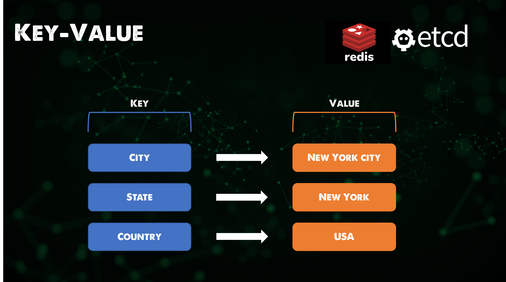

#### 📌 Wide-column 데이터베이스

✔️ 데이터 저장소를 여러 서버 또는 데이터베이스 노드에 분산할 수 있는 유연한 컬럼으로 구성하고, 다차원 매핑을 사용하여 컬럼, 행, 타임스탬프로 데이터를 참조하는 NoSQL 데이터베이스

✔️ Ex. Cassandra

- 무료 오픈소스, 분산형, 광역 열 저장소, NoSQL 데이터베이스 관리 시스템

- 여러 상품 서버에서 대량의 데이터를 처리하도록 설계되어 단일 장애 지점 없이 고가용성 제공

✔️ 스키마가 없어 비정형 데이터를 처리할 수 없지만 일부 워크로드에는 이점으로 작용할 수 있음

⚡️ Best for: 시계열, 과거 기록, 많은 쓰기 및 적은 읽기

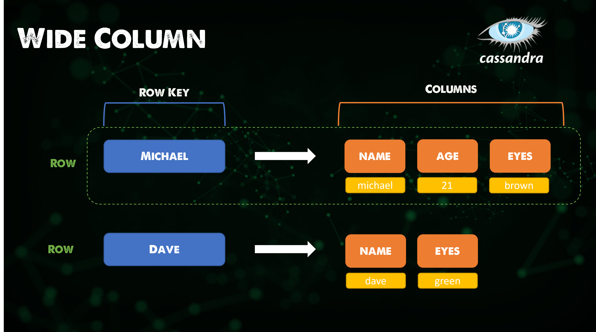

#### 📌 문서 데이터베이스

✔️ 문서 지향 데이터베이스 또는 문서 저장소라고도 하며, 문서에 정보를 저장하는 데이터베이스

✔️ Ex. MongoDB

- 소스 사용이 가능한 크로스 플랫폼 문서 지향 데이터베이스 프로그램

- NoSQL 데이터베이스 프로그램으로 분류되는 MongoDB는 선택적 스키마와 함께 JSON과 유사한 문서 사용

✔️ NoSQL 문서 데이터베이스를 사용하면 복잡한 SQL 코드를 사용하지 않고도 간단한 데이터 저장 가능

✔️ 안정성 저하 없이 빠르게 저장 가능

⚡️ Best for: 대부분의 애플리케이션, 게임, 사물 인터넷

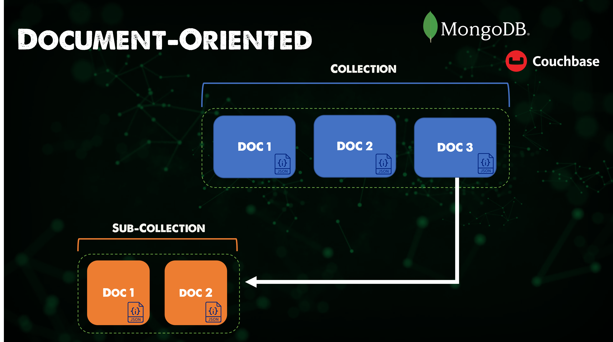

#### 📌 관계형 데이터베이스

✔️ 데이터의 관계형 모델에 기반한 디지털 데이터베이스

✔️ 많은 관계형 데이터베이스 시스템에는 데이터베이스를 쿼리하고 유지 관리하기 위해 SQL을 사용할 수 있는 옵션 존재

✔️ Ex. MySQL, Maria DB 등

✔️ `ACID`(원자성, 일관성, 격리성, 내구성)은 데이터 유효성을 보장하기 위한 데이터베이스 트랜잭션의 일련의 속성

- 트랜잭션이란 데이터베이스 맥락에서 ACID 속성을 충족하는 일련의 데이터베이스 작업

- ex. 한 은행 계좌에서 다른 은행 계좌로 자금을 이체하는 경우, 한 계좌에서 인출하고 다른 계좌에 입금하는 등 여러가지 변경 사항이 포함되더라도 이는 단일 트랜잭션에 해당

⚡️ Best for: 대부분의 애플리케이션에 주로 사용 (최고X 많이 사용되었다는 의미)

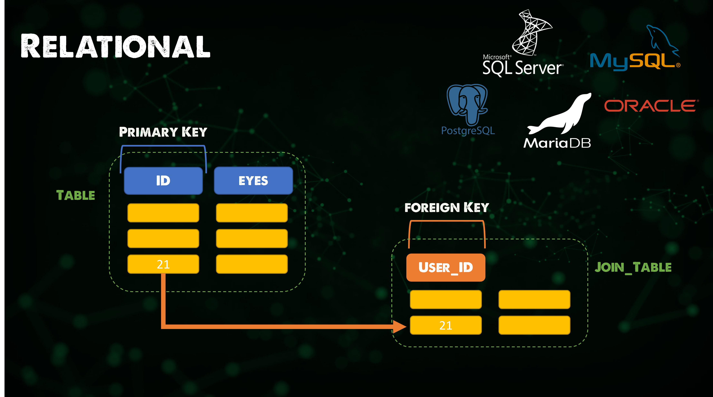

#### 📌 그래프 데이터베이스

✔️ 테이블이나 문서 대신 노드와 관계를 저장

✔️ 데이터는 사전 정의된 모델에 제한되지 않고 저장되므로 매우 유연한 방식으로 데이터를 사고하고 사용 가능

✔️ Ex. Neo4j

- 네이티브 그래프 저장 및 처리 기능을 갖춘 ACID 호환 트랜잭션 데이터베이스

⚡️ Best for: 그래프, 지식 그래프, 추천 엔진

#### 📌 검색 엔진 데이터베이스

✔️ 데이터 콘텐츠 검색 전용으로 사용되는 비관계형 데이터베이스의 한 유형

✔️ 인덱스를 사용해 데이터 간에 유사한 특성을 분류하고 검색 기능을 용이하게 함

✔️ Ex. Elasticsearch

- Lucence 라이브러리를 기반으로 하는 검색 엔진

- HTTP 웹 인터페이스와 스키마가 없는 JSON 문서를 갖춘 분산형 멀티테넌트 지원 전체 텍스트 검색 엔진 제공

⚡️ Best for: 검색 엔진, Typeahead, 로그 검색

#### 📌 Multi-model

✔️ 단일 통합 백엔드에 대해 여러 데이터 모델을 지원하도록 설계된 데이터베이스 관리 시스템

✔️ 대부분의 데이터베이스 관리 시스템은 데이터를 구성, 저장 및 조작하는 방법을 결정하는 단일 데이터 모델 중심으로 구성

✔️ 문서, 그래프, 관계형, Key-value 모델은 Multi-model 데이터베이스에서 지원할 수 있는 데이터 모델의 예시

✔️ Ex. Fauna

- 네이티브 GraphQL을 통해 안전하고 확장가능한 클라우드 API로 제공되는 유연하고 개발자 친화적인 트랜잭션 데이터베이스

⚡️ Best for: 데이터 모델 선택에 얽매이지 않는 경우, ACID 준수, 빠름, 프로비저닝 오버헤드 없음, 데이터를 어떻게 소비하고 클라우드에 무거운 작업을 맡기고 싶은 경우

### Day 86

#### 📌 Backup

✔️ 인프라 장애에 대한 복원력을 확보해야할 뿐 아니라 장애 시나리오가 발생할 경우 안전한 위치에 중요한 데이터의 사본 필요

✔️ 정보 기술에서 `백업`(또는 데이터 백업)은 데이터 손실이 발생한 후 원본을 복원하는 데 사용할 수 있도록 컴퓨터 데이터의 복사본을 다른 곳에 저장하는 것 또는 이러한 과정

#### 📌 3-2-1 백업 방법론

✔️ 데이터를 보호해야 하는 이유

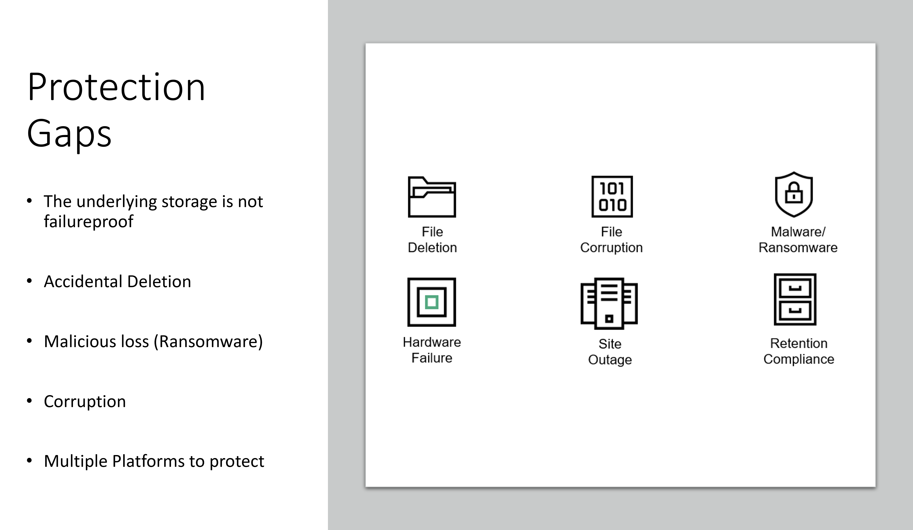

✔️ 데이터의 첫 번째 복사본 또는 백업은 가능한 한 프로덕션 시스템에 가깝게 저장

- 가장 흔한 복구는 실수로 삭제하는 경우이므로 복구 속도 고려

✔️ 이후 다른 집, 건물, 데이터 센터 또는 퍼블릭 클라우드 등 두 번째 위치로 데이터 사본

✔️ 데이터 복사본 3개 중 2개의 사본을 서로 다른 media type에 로컬로 저장하고, 나머지 1개는 offsite에 원격으로 저장되어야함

#### 📌 백업 시나리오

✔️ 일부 데이터를 보호하는 시나리오: 로컬 컴퓨터에서 일부 파일 보호

✔️ 집에 로컬로 있는 NAS (저장)장치뿐만 아니라 클라우드의 Object Storage 버킷에도 보호되도록 하고 싶음

✔️ 백업을 암호화, 중복 제거 및 압축하는 동시에 여러 위치로 백업을 보낼 수 있는 오픈 소스 백업 도구인 `Kopia`(KopiaUI-Setup-0.10.6.exe) 도구 사용

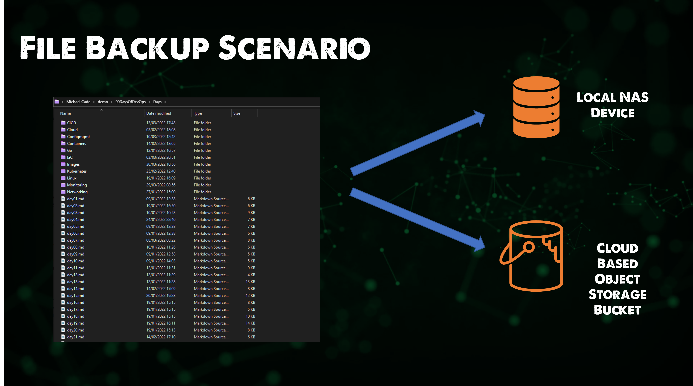

#### 📌 Kopia 설치

✔️ <https://github.com/kopia/kopia/releases> 에서 `KopiaUI-Setup-0.10.6.exe`다운로드

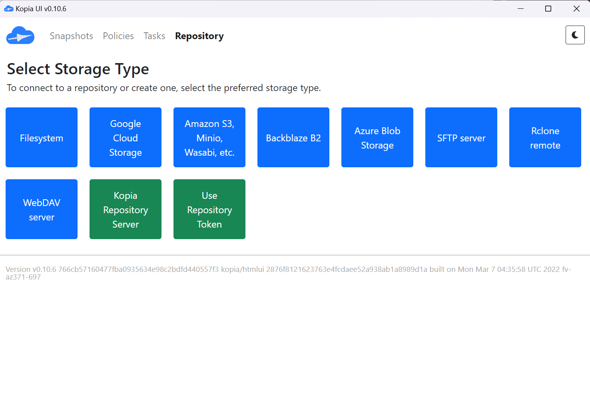

#### 📌 로컬 NAS 설정

✔️ 로컬 NAS 네트워크 설정
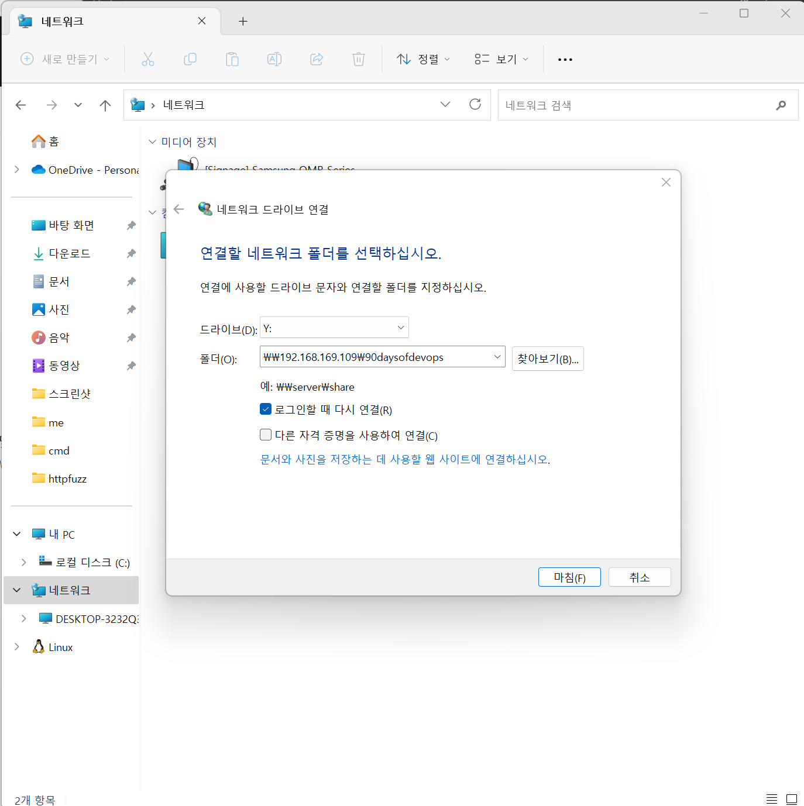
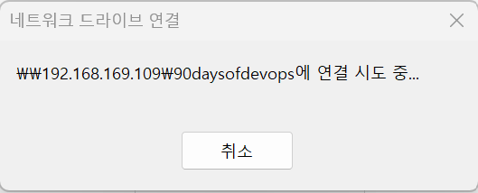

네트워크 연결이 안되는오류발생

참고해서 해결

<https://kb.synology.com/ko-kr/DSM/help/DSM/Tutorial/store_with_windows?version=6>
<https://kb.synology.com/ko-kr/DSM/tutorial/How_to_map_shared_folder_Windows_PC>
<https://kb.synology.com/ko-kr/DSM/tutorial/What_can_I_do_if_my_Synology_NAS_does_not_show_up_in_Network_in_Windows_File_Explorer>

#### 📌 레포지토리 설정

✔️ 로컬 NAS 장치를 사용해 레포지토리 설정하고 SMB를 사용하여 작업 수행 (NFS 사용할 수도 있음)

- NAS IP 주소 설정

- Kopia 메인에서 Filesystem 선택 > Directory Path `\\192.168.169.109\90daysofdevops` 입력

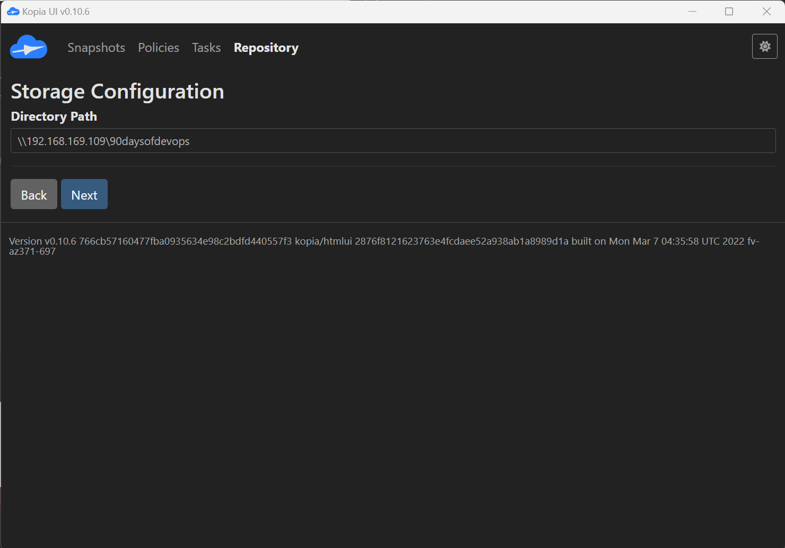

> 🗝️ NAS(Network Attached Storage): 중앙 집중식 파일 서버로, Wi-Fi 또는 이더넷 케이블을 통해 TCP/IP 네트워크에서 파일을 저장하고 공유할 수 있음

> 🗝️ NFS & SMB: 원격 파일 공유 프로토콜 서버로, 클라이언트 컴퓨터들이 원격 서버에 있는 파일에 접근하고 로컬 파일처럼 읽고 쓸 수 있게 됨. `리눅스-리눅스의 경우 NFS`이고, `윈도우-윈도우 또는 리눅스-윈도우의 경우 SMB` 방식 사용

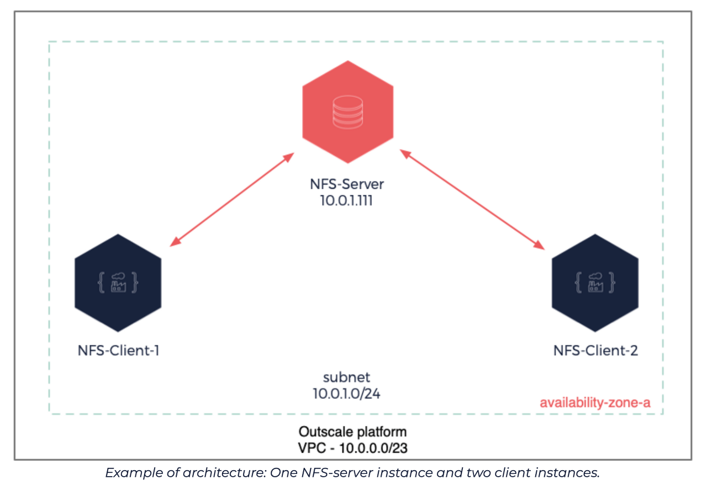

✔️ 비밀번호 정의

- 해당 비밀번호는 레포지토리 콘텐츠를 암호화하는데 사용됨

- 레파지토리 구성 완료

✔️ 임시 스냅샷을 트리거하여 레포지토리에 데이터 쓰기 가능

✔️ 스냅샷할 대상의 경로를 입력해 `90DaysOfDevOps` 폴더의 복사본 생성

✔️ 스냅샷 보존 정의 가능

✔️ 제외하려는 파일이나 파일 형식이 있을 경우 제외

✔️ scheduling을 포함한 다양한 설정을 원하는 경우 정의 가능

✔️ 스냅샷을 선택하면 데이터가 레포지토리에 기록

#### 📌 S3로 오프사이트 백업

⚡️ 로컬 및 오프사이트의 복사본을 오브젝트 스토리지에 저장하는 것이 목표

✔️ 데이터 전송을 위해 오브젝트 스토리지로 Google Cloud Storage 선택

- Google Cloud 로그인 및 스토리지 버킷 생성

✔️ 레포지토리에 대한 구성 교체: 새 레포지토리 추가(생성)

- 생성한 구글 클라우드 스토리지 버킷의 이름이 `90daysofdevops`

`"C:\Program Files\KopiaUI\resources\server\kopia.exe" --config-file=C:\Users\micha\AppData\Roaming\kopia\repository.config repository create gcs --bucket 90daysofdevops`

✔️ 스냅샷을 생성하여 새로 생성한 레포지토리로 전송

`"C:\Program Files\KopiaUI\resources\server\kopia.exe" --config-file=C:\Users\micha\AppData\Roaming\kopia\repository.config kopia snapshot create "C:\Users\micha\demo\90DaysOfDevOps"`

✔️ 구글 클라우드 스토리지에서 90daysofdevops 저장 확인 가능

#### 📌 복원

✔️ 새로운 위치로 사본 복원 

- 현재 구성된 레포지토리(구글 클라우드 스토리지)에 있는 스냅샷 나열

`"C:\Program Files\KopiaUI\resources\server\kopia.exe" --config-file=C:\Users\micha\AppData\Roaming\kopia\repository.config snapshot list`

- 스냅샷 마운트

`"C:\Program Files\KopiaUI\resources\server\kopia.exe" --config-file=C:\Users\micha\AppData\Roaming\kopia\repository.config mount all Z:`

또는 

`kopia snapshot restore kdbd9dff738996cfe7bcf99b45314e193`

### Day 87

⚡️ 지난 섹션까지는 로컬 NSA와 클라우드 기반 오브젝트 스토리지(GCS)에 데이터 백업(Kopia 사용)

#### 📌 Kubernetes 클러스터 설정

✔️ Minikube 클러스터와 몇 가지 애드온 활용

- addons로 `volumesnapshots`와 `csi-hostpath-driver` 사용

`minikube start --addons volumesnapshots,csi-hostpath-driver --apiserver-port=6443 --container-runtime=containerd -p 90daysofdevops --kubernetes-version=1.21.2`

✔️ volumesnapshotsclass 리소스에 Kasten K10 annotation 추가

- volumesnapshotclass는 Kubernetes에서 storage snapshot을 생성하기 위한 리소스

```
kubectl annotate volumesnapshotclass csi-hostpath-snapclass \
    k10.kasten.io/is-snapshot-class=true
```

✔️ 기본 저장 클래스를 hostpath로 변경

```
kubectl patch storageclass csi-hostpath-sc -p '{"metadata": {"annotations":{"storageclass.kubernetes.io/is-default-class":"true"}}}'

kubectl patch storageclass standard -p '{"metadata": {"annotations":{"storageclass.kubernetes.io/is-default-class":"false"}}}'
```

#### 📌 Kasten K10 배포

✔️ Kasten Helm 레포지토리 추가

- kasten 이라는 이름으로 해당 Helm 차트 레포지토리 추가

`helm repo add kasten https://charts.kasten.io/`

✔️ 네임스페이스를 생성하고 K10 배포

```
helm install k10 kasten/k10 --namespace=kasten-io --set auth.tokenAuth.enabled=true --set injectKanisterSidecar.enabled=true --set-string injectKanisterSidecar.namespaceSelector.matchLabels.k10/injectKanisterSidecar=true --create-namespace
```

✔️ pod 생성 확인

`kubectl get pods =n kasten-io -w`

✔️ 포트포워딩을 통해 K10 대시보드 접속 후 새 터미널에 아래 명령어 실행

`kubectl --namespace kasten-io port-forward service/gateway 8080:8000`

- 브라우저에 `http://127.0.0.1:8080/k10/#/` 입력

✔️ 대시보드 인증을 위해 토큰 정보 확인

```
TOKEN_NAME=$(kubectl get secret --namespace kasten-io|grep k10-k10-token | cut -d " " -f 1)
TOKEN=$(kubectl get secret --namespace kasten-io $TOKEN_NAME -o jsonpath="{.data.token}" | base64 --decode)

echo "Token value: "
echo $TOKEN
```

✔️ 브라우저 접속

- 위 토큰을 가져와 입력 후  

### Day 88

### Day 89

### Day 90

## DevSecOps

### Day 2

#### 📌 DevSecOps

✔️ `DevSecOps`란 개발, 보안 및 운영 팀을 하나로 모아 안전한 소프트웨어 애플리케이션을 구축하고 유지 관리하는 것을 목표로 하는 소프트웨어 개발 접근 방식

✔️ 소프트웨어 업데이트와 기능을 더 빠르고 자주 제공하는 것을 목표로하는 지속적인 통합, 지속적인 제공 및 지속적인 배포가 원칙

✔️ 보안이 처음부터 소프트웨어 개발 수명 주기(SDLC)에 내장되어 있음

#### 📌 DevSecOps vs DevOps

✔️ DevOps : 소프트웨어 릴리스의 속도, 안정성 및 품질 향상을 목표로 함

✔️ DevSecOps : 처음부터 소프트웨어 개발 프로세스에 `보안` 조치 구축

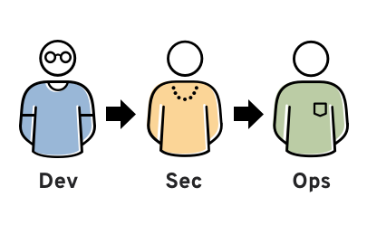

#### 📌 자동화된 보안

✔️ `자동화된 보안`이란 사람의 개입 없이 보안 작업을 수행하는 기술을 사용하는 것 => 보안 프로세스를 보다 효율적이고 효과적으로 만들고 보안 인력의 업무량을 줄여줌

#### 📌 규모에 따른 보안 (컨테이너 및 마이크로서비스)

✔️ 컨테이너화와 마이크로서비스를 통해 구현된 규모와 동적 인프라가 등장하면서 정적 보안 정책만 가질 수는 없음 => 자동화된 보안 필요

✔️ 환경 및 데이터 보안

- 환경 표준화 및 자동화 : 각 서비스에는 무단 연결 및 액세스를 최소화할 수 있는 최소한의 권한이 존재해야함

- 사용자 ID 및 액세스 제어 기능 중앙 집중화 : 인증은 여러 지점에서 시작되므로 마이크로 서비스 보안을 위해서는 엄격한 액세스 제어 및 중앙 집중식 인증 메커니즘이 필요

- 마이크로서비스를 실행하는 컨테이너를 서로 및 네트워크로부터 격리 : 전송 중인 데이터와 미사용 데이터 모두 포함

- 앱과 서비스 간 데이터 암호화 : 통합 보안 기능을 갖춘 컨테이너 오케스트레이션 플랫폼은 무단 액세스 가능성을 최소화하는데 도움이 됨

- 보안 API 게이트웨이 도입 : 보안 API는 승인 및 라우팅 가시성을 높이며, 노출되는 API를 줄임으로써 외부로부터의 공격을 줄일 수 있음

#### 📌 사이버 보안과 DevSecOps

✔️ `사이버 보안`은 디지털 공격, 도난, 손상으로부터 컴퓨터 시스템과 네트워크를 보호하는 관행

✔️ `DevSecOps`는 개발, 보안 및 운영 방식의 조합

✔️ 사이버 보안과 DevSecOps의 차이점

- 초점: 사이버 보안은 주로 외부 위협으로부터 시스템을 보호하는 데 중점을 두는 반면, DevSecOps는 보안을 개발 프로세스에 통합하는 데 중점

- 범위: 사이버 보안은 네트워크 보안, 데이터 보안, 애플리케이션 보안 등을 포함하여 광범위한 반면, DevSecOps는 그 중 소프트웨어 개발 및 배포의 보안을 향상시키는 데 중점

- 접근 방식: 사이버 보안은 일반적으로 개발 프로세스가 완료된 후 보안 조치를 구현하는 작업을 포함하는 반면, DevSecOps는 처음부터 보안을 개발 프로세스에 통합하는 작업

- 협업: 사이버 보안에는 IT 팀과 보안팀 간의 협업이 포함되지만, DevSecOps는 개발, 보안 및 운영 팀 간의 협업이 포함됨

### Day 3

#### 📌 Attacker (공격자)

✔️ Attacker의 모든 공격이 동일하지 않고 동기도 동일하지 않지만, `데이터`를 공격할 가능성이 높음

#### 📌 Attack Maps

✔️ Attack Maps는 컴퓨터 네트워크에 대한 공격을 시각적으로 표현한 것으로, 공격의 단계, 공격자가 사용하는 도구 및 기술, 네트워크 진입 및 퇴출 지점을 시각화 => 공격의 세부 정보를 분석하고 취약점을 식별할 수 있어 향후 공격에 대한 방어 계획을 세울 수 있음

✔️ 홈 네트워크 또는 비즈니스에 대한 Attack Maps 생성

- 사용 중인 모든 통신 흐름과 기술을 포함하여 앱의 그래픽 표현을 나타냄

- 잠재적인 취약점 및 공격 영역 목록

- 앱 내 각 연결/상호작용에 대한 기밀성, 무결성 및 가용성 고려

- 공격/취약점 매핑

✔️ 아래 맵을 통해 애플리케이션이 데이터를 저장하거나 잘못된 데이터를 저장하는 것을 방지하기 위해 서비스 거부 또는 일부 악의적인 내부 공격과 S3 버킷에 대한 액세스가 존재한다고 고려

✔️ 아래 Attack Maps를 테스트하고 피드백을 제공하여 보안이 강화되도록 해야 함 => Continuous Response(지속적 응답)

✔️ 보안 상태 개선

- 양호 : 공격을 줄이기 위해 소프트웨어에 내장되어야 하는 보안 설계 제약 조건과 제어 식별

- 더 좋음 : 소프트웨어 주기 후반에 발견되는 문제에 대한 우선순위를 지정하고 보안 구축

- 최고 : 문제 감지, 단위 테스트, 보안 테스트, 블랙박스 테스트를 위한 스크립트 배포에 자동화 구축

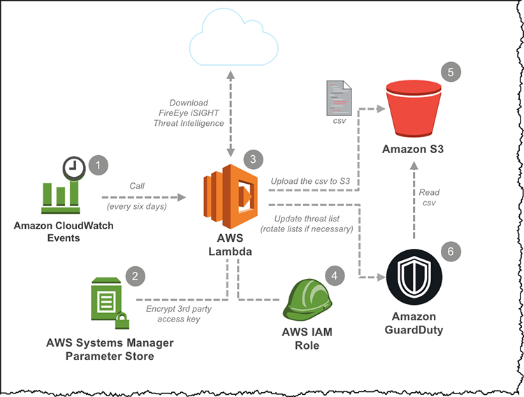

### Day 4

#### 📌 Red Team vs Blue Team

✔️ Red Team은 공격자의 역할, Blue Team은 방어자의 역할을 하여 조직의 보안 강화

- Red Team: 코드나 인프라의 취약점을 찾고 사이버 보안 방어를 돌파하려고 시도

- Blue Team: 이러한 공격을 방어하고 사고 발생 시 대응

✔️ 이점

- 취약점 확인

- 네트워크 보안 강화

- 공격 탐지 및 격리 경험 쌓기

- 상세한 대응 계획 수립

- 회사 전반의 보안 인식 제고

✔️ Red Team

- NIST "잠재적인 적의 공격이나 기업의 보안 태세에 대한 악용 능력을 모방하도록 승인되고 조직된 그룹"

- 목표 : 소프트웨어 개발을 이해하여 응용 프로그램의 약점을 식별한 다음 프로그램을 작성하여 액세스하고 악용하는 것

✔️ Blue Team

- NIST "모의 공격자 그룹에 맞서 보안 태세를 유지함으로써 기업의 정보 시스템 사용을 방어하는 역할을 담당하는 그룹"

- 현재 비즈니스의 보안 태세를 분석한 후 외부 공격을 막기 위해 개선 조치 취함

- 모니터링 도중 공격이 발생할 경우 이에 대응하는 지속적인 모니터링에 집중

#### 📌 사이버 보안 컬러 휠

✔️ 사이버 보안의 중요성이 커지면서 red team과 blue team 이상의 보안 필요

✔️ Yellow Team : 보안 시스템과 애플리케이션을 개발하는 빌더, 소프트웨어 엔지니어 및 개발자

✔️ 레드, 블루, 옐로우 팀이 도입되면서 공격자, 방버자, 코더 간의 기술을 혼합하는데 전념하는 보조 컬러 팁을 가질 수 있음

- `퍼플팀` : Blue team과 Red team 선택. 방어와 공격을 통합하고 팀 간에 협력하고 지식을 고유하면 전반적으로 더 나은 자세를 제공할 수 있음

- `그린팀` : Green team은 blue team으로부터 통찰력을 얻고, Yellow team과 긴밀히 협력하여 보다 효율적으로 작업

- `오랜지팀` : Orange team은 Red team과 협력하여 배운 내용을 Yellow team에 전달하여 코드에 더 나은 부안 구축

### Day 5

#### 📌 오픈소스 보안

1. `오픈 소스`는 사람들이 자유롭게 사용, 수정, 공유할 수 있는 공개 도메인의 소프트웨어

✔️ 오픈 소스의 채택이 급증한 이유는 사내에서 개발된 독점 코드를 강화하는 속도가 빨라 시장 출시 기간을 단축할 수 있기 때문

2. 오픈 소스 보안

✔️ `오픈 소스 보안`은 오픈 소스 소프트웨어를 사용하는 컴퓨터 시스템과 네트워크의 안전과 보안을 보장하는 관행

✔️ 오픈 소스 소프트웨어는 무료로 사용할 수 있어 널리 사용할 수 있고 보안 향상에 도움이 되지만, 책임감 있게 사용하고 모든 취약점을 해결하여 보안을 유지하는 것이 중요

3. OSS (Open-Source Security) 보안 고려 사항

✔️ Assess(평가) : 프로젝트 상태를 살펴보고, 저장소가 얼마나 활동적이며, 관리자의 반응이 얼마나 되는가

- 보안 모델, 코드 검토, 데이터 유효성 검사 및 보안 테스트 범위 확인 가능

✔️ Adopt(채택) : 소프트웨어 내에서 또는 자체 스택 내의 독립형 앱으로 이를 수행하는 경우 보안 고려 사항에 대한 사내 정책 채택

- 내부적으로 프로젝트를 간과하고 커뮤니티를 지원할 사람에 대한 정책 마련

✔️ Act(행동) : 보안을 유지하고 개선하기 위해 조치를 취해야 함

- 사용자로서 프로젝트를 수행하고 지원해야함

#### 📌 Log4j 취약점

✔️ Log4j는 Java 내에서 로깅을 위해 사용하는 일반적인 라이브러리로, 취약점은 수백만개의 Java 기반 응용 프로그램에 영향을 미침

✔️ 악의적인 공격자는 애플리케이션 내에서 해당 취약점을 이용하여 시스템에 액세스 가능

- 수백만 개의 응용 프로그램이 이 패키지에 사용됨

- 악의적인 행위자는 이를 활용하여 환경을 액세스하거나 악성 코드를 심을 수 있음

### Day 6

#### 📌 나쁜 코딩 관행

✔️ Github에 코드를 복사 붙여넣기 하는 것은 매우 쉽지만, 아래 사항을 고려해야 함

- 코드에 포함된 패키지 전체를 확인하는가

- 사용자/유지 관리자를 신뢰하는가

- 코드 입력의 유효성을 검사하는가

- 하드코딩된 secret과 환경 또는 secret 관리를 하는가

- 검증 없이 코드를 신뢰하는가

- 공개 저장소에 secret이 포함되어있는가

#### 📌 OWASP - 개방형 웹 애플리케이션 보안 프로젝트

✔️ OWASP : 소프트웨어 보안을 향상시키기 위해 노력하는 비영리 재단

#### 📌 실습 : 약한 앱 구축

✔️ 환경: 로컬 VirtualBox VM에 배포 + vagrantfile 사용 (아래 애플리케이션 사용)

<https://github.com/devsecops/bootcamp/blob/master/Week-2/README.md>

✔️ vagrantfile 생성
`vagrantfile`

```
Vagrant.configure("2") do |config|
  config.vm.box = "centos/7"
  config.vm.provider :virtualbox do |v|
   v.memory  = 8096
   v.cpus    = 4
end
end
```

✔️ 가상머신 시작 및 vagrantfile 연결

```
vagrant up
vagrant ssh
```

✔️ 사용할 db 설치 및 시작

```
sudo yum -y install mariadb mariadb-server mariadb-devel
sudo systemctl start mariadb.service
```

✔️ 필요한 패키지 설치: links, epel-release, node js

```
sudo yum -y install links
sudo yum install --assumeyes epel-release
sudo yum install --assumeyes nodejs
```

✔️ RVM(Ruby) 설치

```
curl -L https://get.rvm.io | bash -s stable
source /home/vagrant/.rvm/scripts/rvm
rvm install ruby-2.7
```

✔️ Ruby on Rails 애플리케이션을 위한 패키지 설치: Rails gen, git, epel 저장소, redis db

```
gem install rails
sudo yum install git
sudo yum install epel-release
sudo yum install redis
```

✔️ 애플리케이션 생성: myapp이라는 Rails 애플리케이션
`rails new myapp --skip-turbolinks --skip-spring --skip-test-unit -d mysql `

- 데이터베이스와 스키마 생성

```
cd myapp
bundle exec rake db:create
bundle exec rake db:migrate
```

✔️ 애플리케이션 실행
`bundle exec rails server -b 0.0.0.0`

✔️ 기본 모델 구축

- Rails 애플리케이션 내에서 Scaffold 생성 후 데이터 마이그레이션(db 스키마 업데이트)

```
bundle exec rails generate scaffold Bootcamp name:string description:text dates:string
bundle exec rake db:migrate
```

- Rails 애플리케이션 루트 경로를 아래 이름으로 설정

```
root bootcamps#index
```

- Rails 애플리케이션 내의 뷰파일 수정: bootcamp와 객체 descript 속성 값 출력 가능

```
<p>
  <strong>Description:</strong>
  <%=raw @bootcamp.description %>
</p>
```

🚫 `cross-site scripting (XSS)` 발생 가능
XSS란 악의적인 사용자가 웹 페이지에 악성 스크립트를 삽입해 해당 스크립트가 다른 사용자들에게 실행되도록 하는 공격하는 보안 취약점
이를 사용해 다른 사용자의 신원 데이터(쿠키, 세션 토큰 등)를 훔침

✔️ 검색 기능 만들기 : XSS 방지를 위한 테스트

- 사용자가 악성 스크립트를 입력해도 Ruby on Rails에서 뷰에서 출력되는 모든 변수를 HTML escape 처리해 악성 스크립트가 그대로 출력되지 않음.

`app/controllers/bootcamps_controller.rb`의 index 메소드에 로직 추가

```
def index
  @bootcamps = Bootcamp.all
  if params[:search].to_s != ''
    @bootcamps = Bootcamp.where("name LIKE '%#{params[:search]}%'")
  else
    @bootcamps = Bootcamp.all
  end
end
```

`app/views/bootcamps/index.html.erb`에 검색 필드 추가

```
<h1>Search</h1>
<%= form_tag(bootcamps_path, method: "get", id: "search-form") do %>
  <%= text_field_tag :search, params[:search], placeholder: "Search Bootcamps" %>
  <%= submit_tag "Search Bootcamps"%>
<% end %>

<h1>Listing Bootcamps</h1>
```

- 단, controller에서 특정 SQL 구문을 넣는 경우 데이터베이스 조작이 가능해질 수 있으므로 `Parameterized Queries` 또는 `Prepared Statements`와 같은 방법 사용해 안전하게 쿼리 작성해야함

### TMI : 데이터베이스 쿼리에 변수를 안전하게 삽입하는 SQL 쿼리 방법

✔️ 해당 기법은 주로 SQL Injection 공격을 방지하기 위해 사용

1. Parameterized Query

✔️ 개념: 사용자 입력을 쿼리로 전송하는 것이 아니라 문자열 인수로 전달

✔️ 사용자가 DB Query 수행 권한을 가지지 않기에 SQL Injection 공격 예방 가능

ex)

Parameterized Query

```
public Item findOneByName(String name) {
    return em.createQuery("select i from Item i where i.name = :name", Item.class)
            .setParameter("name", name)
            .getSingleResult();
}
```

2. Prepared Statement

✔️ 개념: 일반 MySQL statement와 달리 placeholder `?`를 사용해서 문자열로 변환하여 parameter를 넘김

✔️ 장점

- 속도: 같은 형태의 value만 다른 반복적인 query의 경우 속도 빠름 / Query의 compile time을 아낄 수 있음

- 보안: SQL Injection에 대응 가능 / Query Template을 보내는 프로토콜과 Value를 보내는 프로토콜이 다름 / 하나를 변조해서 같은 SQL문 조작 불가능

✔️ 단점

- 하나의 Query를 단독으로 수행하는 경우, 두 번의 전송이 필요하기에 일반 Statement보다 느림

✔️ 일반 MySQL과 Prepared Statement

|      구분      |   Statement   |  Prepared Statement  |
| :------------: | :-----------: | :------------------: |
|  Query문 파싱  |     매번      |        1번만         |
|    Protocol    | Text Protocol |   Binary Protocol    |
| WARNING, ERROR |     지원O     |        지원X         |
| 프로토콜 전송  |      1회      | 2회(최초), 1회(이후) |
| SQL Injection  |     노출      |         방어         |

ex)

일반 MySQL
`SELECT * FROM users WHERE username = 'bob' AND password = 'password';`

Prepared Statement

```
PREPARE statement FROM 'SELECT * FROM users WHERE username = ? AND password = ?';
EXECUTE statement USING @username, @password;
```
