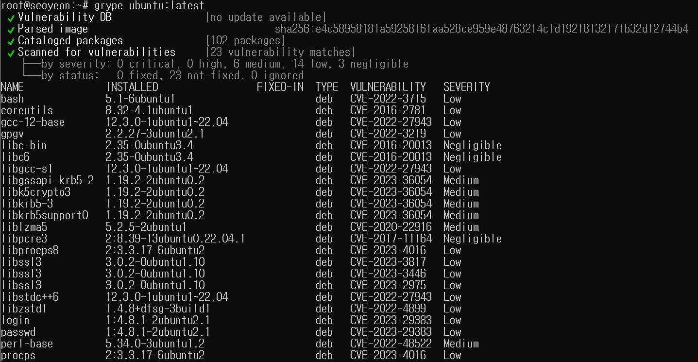
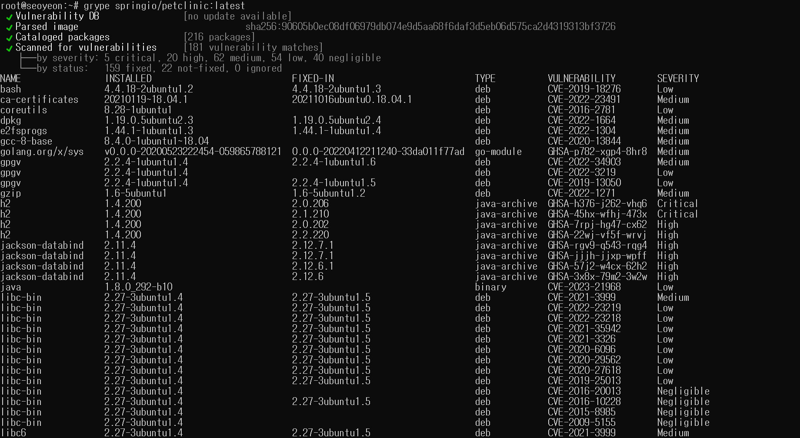
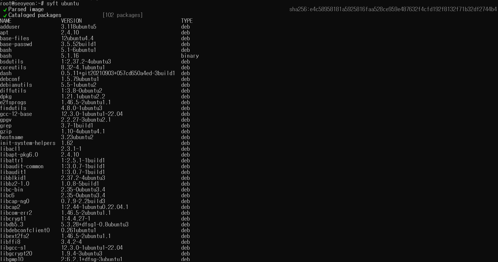
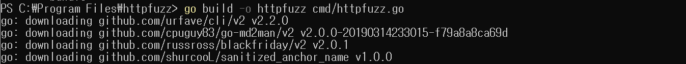
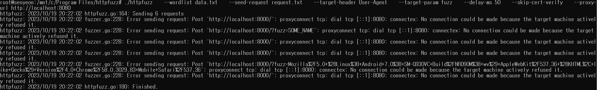

## Continuous Build, Integration, Testing

### Day 14

#### 📌 컨테이너 이미지

✔️ 컨테이너 이미지 구성: image manifest, file system, image configuration

✔️ 컨테이너를 사용할 때 컨테이너 이미지에 보안적 문제가 있는 경우가 많음 => 보안적 문제를 야기하는 취약점이 존재하는지 확인할 수 있는 방법이 `컨테이너 이미지 스캔`

#### 📌 컨테이너 이미지 스캔

✔️ 이미지 스캐닝: 컨테이너 내부를 살펴보고, 설치된 패키지 목록(Linux,Java,Go,Javascript)을 가져오고, 알려진 취약점이 있는 데이터베이스와 패키지 목록을 상호 참조 => 각 패키지를 처리하고 결국 주어진 컨테이너 이미지에 대한 취약점 목록 생성

✔️ 가장 인기있는 이미지 스캐너는 `Trivy`와 `Grype`

✔️ grype 사용예제-1

- grype 설치 후 `grype ubuntu:latest` 실행

- ubuntu:latest 컨테이너 이미지 스캔 결과 취약점 확인 가능

- 실행 결과의 Severity는 심각도, Fixed-in은 해당 패키지의 최신 버전에서 취약점이 수정되었는지 유무 확인 가능



⚡️ ubuntu:latest는 Ubuntu 공식 컨테이너 이미지의 최신 버전으로 정기적으로 업데이트되기 때문에 보통 취약점 존재 X => 오래된 이미지, 임의의 이미지, 대기업에서 지원하지 않는 이미지 또는 자신이 관리하지 않는 이미지의 경우는 그렇지 않을 수 있음

✔️ grype 사용예제-2

- `grype springio/petclinic:latest` 실행

- Severity에서 `Critical`이 많이 존재 & 그 중 많은 취약점이 해당 종속성의 최신 버전으로 수정됨이 보여짐



⭐️ 이미지 스캐닝을 통해 감지하는 취약점은 보안 연구원이 발견하여 CVE가 할당된 취약점으로, 스캐닝을 통해 나타나지 않은 경우에도 취약점이 존재할 수 있음

⭐️ 취약점을 완화하는 방법은 downgrade하는 것만큼 쉬울 수 있지만, 버전 충돌로 인해 코드를 변경해야 할 수도 있기에 까다로울 수도 있음

#### 📌 CVE

✔️ 스캐너 결과 `CVE-`로 시작하는 내용 존재

✔️ CVE는 취약점을 추적하고 쉽게 검색할 수 있도록 만들어진 고유 표기

✔️ `CVE-해당년도-취약점번호`의 형식으로 이루어진 식별자 부여되며 옆에 존재하는 Severity는 0-10 사이의 숫자 또는 NONE,LOW,MEDIUM,HIGH,CRITICAL 중 하나의 등급으로 표시됨

### Day 15

#### 📌 SBOM (Software Bill Of Material)

✔️ `SBOM`은 응용 프로그램이나 시스템을 구성하는 모든 구성 요소 목록을 나타내며, 소프트웨어를 구축하는데 사용되는 모든 컴포넌트의 버전, 출처 등에 대한 정보 제공

✔️ SBOM의 목적은 사용자에게 소프트웨어 제품에 포함된 내용을 제공하고 보안 또는 법적 이유로 해로울 수 있는 구성 요소를 피할 수 있도록 함

✔️ Container Image의 SBOM에는 아래 내용이 포함

- 컨테이너에 설치된 Linux 패키지 및 라이브러리

- 컨테이너에서 실행되는 애플리케이션용으로 설치된 언어 패키지 (ex. Python 패키지, Go 패키지)

✔️ `Syft`란 Container Image에서 SBOM을 추출하는 도구 중 하나

- 설치
  `curl -sSfL https://raw.githubusercontent.com/anchore/syft/main/install.sh | sh -s -- -b /usr/local/bin`

- syft를 사용해 컨테이너 이미지에 대한 SBOM 생성
  `syft ubunt`
  

⭐️ 위 SBOM에는 컨테이너 이미지 내부에 설치된 패키지와 라이브러리, 해당 유형과 버전도 존재 => SBOM을 `취약성 데이터베이스`와 상호 참조하여 `컨테이너 내부의 취약성 확인 가능`

#### 📌 취약점 데이터베이스

✔️ 취약성 데이터베이스는 소프트웨어, 하드웨어 및 기타 시스템의 취약성에 대한 정보 모음

✔️ 일반적으로 취약성의 특성에 대한 세부 정보 포함. ex. 취약성 유형, 취약성 심각도, 취약성의 잠재적인 영향

✔️ 취약성을 악용하는 방법, 해당 취약성에 대해 사용 가능한 패치 또는 수정 사항에 대한 정보도 포함될 수 있음

⚡️ 다운로드할 수 있는 API 또는 원시 데이터를 제공하고 `SBOM` 패키지와 `취약성 정보`를 상호 참조해 패키지에 주의해야할 취약점이 존재하는지 확인

#### 📌 CVSS (Common Vulnerability Scoring System)

✔️ CVSS는 공통 취약성 점수 시스템으로, 취약점의 주요 특성을 포착하고 심각도를 반영하는 수치 점수를 생성하는 방법 제공

✔️ 얼마나 쉽게 악용할 수 있는지, 얼마나 많은 피해를 입힐 수 있는지에 따라 취약점의 순위를 객관적으로 평가

✔️ CVSS 기준 : 아래 8개의 조합에 따라 0-10 사이의 CVSS 점수가 결정됨

- `Attack Vector (공격벡터)` : 취약점 악용이 가능한 상황 반영 => 네트워크(N), 인접(A), 로컬(L), 물리적(P)

- `Attack Complexity (공격 복잡성)` : 취약점을 악용하기 위해 존재해야 하는 공격자의 통제 범위를 벗어난 조건 설명 => 낮음(L), 높음(H)

- `Priviledges Required (필요한 권한)` : 취약점을 성공적으로 악용하기 전에 공격자가 보유해야 하는 권한 수준 => 없음(N), 낮음(L), 높음(H)

- `User Interaction (사용자 상호작용)` : 공격자가 아닌 사용자가 취약한 구성 요소의 성공적인 손상에 참여해야 한다는 요구사항 => 없음(N), 필수(R)

- `Scope (범위)` : 하나의 소프트웨어 구성 요소에 있는 취약점이 그 수단이나 권한을 넘어서 리소스에 영향을 미치는 능력 => 변경되지 않음(U), 변경됨(C)

- `Confidentiality (기밀성)` : 성공적으로 악용된 취약점으로 인해 소프트웨어 구성 요소가 관리하는 정보 리소스의 기밀성에 미치는 영향 => 없음(N), 낮음(L), 높음(H)

- `Integrity (진실성)` : 성공적으로 악용된 취약점이 무결성에 미치는 영향 => 없음(N), 낮음(L), 높음(H)

- `Availability (유효성)` : 취약점 악용에 성공하여 영향을 받는 구성 요소의 가용성에 미치는 영향 => 없음(N), 낮음(L), 높음(H)

### Day 16

#### 📌 Fuzzing

✔️ Fuzzing (=Fuzz test)은 유효하지 않거나 예상치 못한 데이터 또는 무작위 데이터를 컴퓨터 프로그램에 입력으로 제공하는 소프트웨어 테스트 기술

✔️ Fuzzing의 목표는 프로그램이 충돌하거나 의도하지 않은 동작을 나타내도록하여 `프로그램의 보안 취약성`과 `버그를 식별`하는 것

✔️ 수동으로 수행하거나 테스트 라이브러리/프레임워크를 사용하여 입력을 작성해 수행

✔️ Ex

- `string`을 유일한 인수로 받아들이는 Go 함수

- 제공된 입력이 단 하나의 조건(fuzz)에서만 함수 충돌

```
func DontPanic(s string) {
    if len(s) == 4 {
        if s[0] == 'f' {
            if s[1] == 'u' {
                if s[2] == 'z' {
                    if s[3] == 'z' {
                        panic("error: wrong input")
                    }
                }
            }
        }
    }
}
```

✔️ 위 코드에 관한 fuzz test 단계

퍼징 라이브러리가 작은 문자열부터 시작해 크기를 늘리는 문자열 제공

-> `if len(s) == 4`에 따라 길이가 4인 문자열을 제공하면 테스트 범위의 변경 사항을 true로 확인하고 이 길이의 입력 계속 생성

-> `if s[0] == 'f'`에 따라 해당 테스트 범위에서 또 다른 변경 사항을 발견해 true로 인식

-> `if s[1]=='u'`와 `if s[2]=='z'`, `if s[3]=='z'`에 대해서도 동일한 작업 반복

-> 입력으로 fuzz가 제공되면 함수는 panic을 실행 후 테스트 실패

-> Fuzzing 성공!

✔️ 코드 충돌을 일으킨 입력을 저장하고 매번 실행하여 Fuzzing을 통해 발견한 원래 오류가 코드에 다시 도입되지 않도록 하는 것도 좋음 => Fuzzing의 프레임워크 기능일 수 있음

#### 📌 Fuzzing만으로 충분하지 않는 경우

✔️ 코드에 실패하는 입력이 너무 구체적이고 도움이 될 만한 단서가 없는 경우 Fuzzing 라이브러리는 해당 입력을 추측하지 못함

ex1. 입력이 너무 구체적인 경우

```
func DontPanic(s input) {
    if (len(s) == 4) && s[0] == 'f' && s[1] == 'u' && s[2] == 'z' && s[3] == 'z' {
        panic("error")
    }
}
```

ex2. 도움이 될 만한 단서가 없는 경우

```
func DontPanic(s input) {
    if s == "fuzz" {
        panic("error")
    }
}
```

⚡️ Fuzzing은 코드의 예외 사항과 특수 사례를 감지하는 좋은 방법이지만, 100% 올바른 코드를 위한 만능은 아님을 이해해야함

### Day 17

✔️ Fuzz test(퍼지 입력을 사용한 단위 테스트)는 단순한 단위 테스트 그 이상으로, 이를 사용하여 서버로 전송된 요청을 fuzzing하여 웹 애플리케이션 테스트 가능

✔️ 도구: `Burp Intruder`, `SmartBear`, `httpfuzz`

#### 📌 Fuzzing Advanced

✔️ `httpfuzz` (Burp Intruder에서 영감 받은 유사 기능 제공. Go로 작성된 간단한 오픈 소스 CLI) 사용

✔️ 사용: 요청(퍼지 데이터에 대한 자리 표시자를 정의), 단어 목록(퍼지 템플릿)에 대한 템플릿을 제공한 후 `httpfuzz` 요청 렌더링해 서버로 전송

1. 요청에 대한 템플릿 정의

- JSON 본문이 있는 경로에 대한 HTTP POST 요청

- "`" 기호는 우리가 제공하는 데이터로 대체될 자리 표시자 정의

- httpfuzz 헤더, 경로 및 URL 매개변수 퍼징 가능

`request.txt` 이름의 파일 생성

```
POST / HTTP/1.1
Content-Type: application/json
User-Agent: PostmanRuntime/7.26.3
Accept: */*
Cache-Control: no-cache
Host: localhost:8000
Accept-Encoding: gzip, deflate
Connection: close
Content-Length: 35

{
    "name": "`S9`",
}
```

2. 요청에 포함될 입력 단어 목록 제공

`data.txt` 이름의 파일 생성

```
SOME_NAME
Mozilla/5.0 (Linux; Android 7.0; SM-G930VC Build/NRD90M; wv) AppleWebKit/537.36 (KHTML, like Gecko) Version/4.0 Chrome/58.0.3029.83 Mobile Safari/537.36
```

3. 도구 실행

- 바이너리로 배포되지 않으므로 소스에서 빌드

- 저장소 복제 후 `go build -o httpfuzz cmd/httpfuzz.go`



- 바이너리가 존재하므로 실행

: `--target-header User-Agent`에서 httpfuzz 헤더 대신 제공된 입력인 User-Agent 사용하도록

: `--target-param fuzz`에서 httpfuzz 제공된 입력을 URL 매개변수 fuzz 값으로 사용하도록

: 즉, 2개의 입력(SOME_NAME, Mozilla...)이 3개의 위치(본문 Name, 헤더 User-Agent, fuzz 매개변수)에 각각 배치되어 총 httpfuzz 6개의 요청을 생성해 서버로 전송

```
./httpfuzz \
   --wordlist data.txt \
   --seed-request request.txt \
   --target-header User-Agent \
   --target-param fuzz \
   --delay-ms 50 \
   --skip-cert-verify \
   --proxy-url http://localhost:8080 \
```

4. 실행 후 서버에 무엇이 들어오는지 볼 수 있도록 기록하는 웹 서버 작성

```
$ ./httpfuzz \
   --wordlist data.txt \
   --seed-request request.txt \
   --target-header User-Agent \
   --target-param fuzz \
   --delay-ms 50 \
   --skip-cert-verify \
   --proxy-url http://localhost:8080 \

httpfuzz: httpfuzz.go:164: Sending 6 requests
```

5. 서버 로그 확인

- 6개의 HTTP 요청 수신 확인 가능

```
-----
Got request to http://localhost:8000/
User-Agent header = [SOME_NAME]
Name = S9
-----
Got request to http://localhost:8000/?fuzz=SOME_NAME
User-Agent header = [PostmanRuntime/7.26.3]
Name = S9
-----
Got request to http://localhost:8000/
User-Agent header = [PostmanRuntime/7.26.3]
Name = SOME_NAME
-----
Got request to http://localhost:8000/
User-Agent header = [Mozilla/5.0 (Linux; Android 7.0; SM-G930VC Build/NRD90M; wv) AppleWebKit/537.36 (KHTML, like Gecko) Version/4.0 Chrome/58.0.3029.83 Mobile Safari/537.36]
Name = S9
-----
Got request to http://localhost:8000/?fuzz=Mozilla%2F5.0+%28Linux%3B+Android+7.0%3B+SM-G930VC+Build%2FNRD90M%3B+wv%29+AppleWebKit%2F537.36+%28KHTML%2C+like+Gecko%29+Version%2F4.083+Mobile+Safari%2F537.36
User-Agent header = [PostmanRuntime/7.26.3]
Name = S9
-----
Got request to http://localhost:8000/
User-Agent header = [PostmanRuntime/7.26.3]
Name = Mozilla/5.0 (Linux; Android 7.0; SM-G930VC Build/NRD90M; wv) AppleWebKit/537.36 (KHTML, like Gecko) Version/4.0 Chrome/58.0.3029.83 Mobile Safari/537.36
```

6. 인터페이스 구현

- 각 HTTP 요청에 대한 응답이 도착하면 그 응답의 status code를 로깅하는 플러그인 작성

```
// Listener must be implemented by a plugin to users to hook the request - response transaction.
// The Listen method will be run in its own goroutine, so plugins cannot block the rest of the program, however panics can take down the entire process.
type Listener interface {
    Listen(results <-chan *Result)
}
```

```
package main

import (
    "bytes"
    "io/ioutil"
    "log"

    "github.com/joncooperworks/httpfuzz"
)

type logResponseCodePlugin struct {
    logger *log.Logger
}

func (b *logResponseCodePlugin) Listen(results <-chan *httpfuzz.Result) {
    for result := range results {
        b.logger.Printf("Got %d response from the server\n", result.Response.StatusCode)
    }
}

// New returns a logResponseCodePlugin plugin that simple logs the response code of the response.
func New(logger *log.Logger) (httpfuzz.Listener, error) {
    return &logResponseCodePlugin{logger: logger}, nil
}
```

7. 플러그인 빌드

`go build -buildmode=plugin -o log exampleplugins/log/log.go`

8. 플래그를 통해 연결

```
$ ./httpfuzz \
   --wordlist data.txt \
   --seed-request request.txt \
   --target-header User-Agent \
   --target-param fuzz \
   --delay-ms 50 \
   --skip-cert-verify \
   --proxy-url http://localhost:8080 \
   --post-request log

httpfuzz: httpfuzz.go:164: Sending 6 requests
httpfuzz: log.go:15: Got 200 response from the server
httpfuzz: log.go:15: Got 200 response from the server
httpfuzz: log.go:15: Got 200 response from the server
httpfuzz: log.go:15: Got 200 response from the server
httpfuzz: log.go:15: Got 200 response from the server
httpfuzz: log.go:15: Got 200 response from the server
```

## 실습 오류

Q. 프록시서버 오류 발생하는데 해결법 아시는분 계신가유 ㅠㅠ



## TMI

도커 컨테이너 이미지 보안 취약점 스캔
<https://guide.ncloud-docs.com/docs/container-ncr-1-5>
