## AWS

### Day 49 : AWS Cloud Overview

#### 📌 AWS

✔️ AWS 클라우드(AWS Cloud)는 아마존 웹 서비스(AWS)가 제공하는 클라우드 컴퓨팅 플랫폼으로 컴퓨팅, 스토리지, 네트워킹, 데이터베이스, 분석, 머신러닝, 보안 등 광범위한 서비스 제공

✔️ AWS 클라우드를 사용하면 기업은 사용한만큼 비용을 지불하고, 필요에 따라 리소스를 확장하거나 축소할 수 있음

#### 📌 Flexibility

✔️ AWS 클라우드의 주요 이점으로 요구 사항에 가장 적합한 서비스를 선택하고 사용한만큼 비용 지불

⭐️ 인프라에 막대한 초기 투자 없이도 필요한 리소스에 액세스할 수 있도록 하기에 이상적

#### 📌 Security

✔️ 데이터와 리소스를 보호하기 위한 다양한 보호 조치를 갖춤

- 암호화, 자격 증명 및 액세스 관리, 네트워크 보안

✔️ 데이터가 안전하고 관련 규정을 준수하도록 보장하기 위해 다양한 규정 준수 프로그램 마련

- HIPAA, PCI DSS 및 GDPR

#### 📌 EC2 (Amazon Elastic Compute Cloud)

✔️ 클라우드에서 가상 서버를 쉽게 시작하고 관리할 수 있으므로 필요에 따라 리소스를 쉽게 확장하거나 축소할 수 있음

✔️ 다양한 인스턴스 유형과 크기 중 선택할 수 있으며 사용한 리소스에 대해서만 비용 지불

#### 📌 S3 (Amazon Simple Storage Service)

✔️ 인터넷 어디에서나 대량의 데이터를 저장하고 검색할 수 있는 객체 스토리지 서비스

✔️ 확장성과 내구성, 보안이 뛰어나 클라우드에서 데이터를 저장하고 관리하는데 이상적인 솔루션이 됨

#### 📌 Database

✔️ 아래 서비스를 사용하면 인프라나 확장에 대해 걱정할 필요 없이 클라우드에서 복잡한 애플리케이션을 쉽게 구축하고 관리할 수 있음

- 데이터베이스 관리를 위한 `RDS` (Amazon Relational Database Service)

- 데이터 웨어하우징 및 분석을 위한 `Amazon Redshift`

- 검색 및 분석을 위한 `Amazon Elasticsearch Service`

⭐️ 전반적으로 AWS 클라우드는 광범위한 서비스와 도구를 제공하는 강력하고 유연한 클라우드 컴퓨팅 플랫폼

### Day 50 : Get a Free Tier Account & Enable Billing Alarms

#### 📌 프리티어 계정 가입

✔️ 1. AWS 웹사이트로 이동

- 아래의 AWS 웹사이트에 액세스 후 "AWS 계정 생성" 클릭

<https://aws.amazon.com/ko/>

✔️ 2. AWS 계정 생성

- 계정이 있는 경우 로그인, 없는 경우 회원가입

✔️ 3. 계정 정보 제공

- 비밀번호, 이름, 회사명, 전화번호 등 정보 입력 후 "Continue" 클릭

✔️ 4. 결제 정보 제공

- Pre tier 계정에 가입하려면 결제 정보 제공해야함 => 신원 확인 및 사기 방지를 위함으로 Pre Tier 기간동안 요금 부과 X

✔️ 5. 지원 수준 선택

- 필요에 따라 선택하지만, 무료 프리티어를 원하는 경우 Basic support 선택

### Day 52 : Identity and Access Management (IAM)

⚡️ AWS의 데이터와 리소스 보안 관리를 위한 가장 중요한 도구 중 하나가 IAM

#### 📌 AWS IAM

✔️ `사용자와 AWS 리소스에 대한 액세스를 관리`할 수 있는 웹서비스

- IAM을 사용하면 `리소스에 액세스할 수 있는 사람`, `수행할 수 있는 작업`, `액세스할 리소스` 제어 가능

✔️ 세분화된 액세스 제어를 제공하여, 세부적인 수준에서 특정 리소스에 대한 권한을 부여하거나 거부할 수 있음

✔️ 리소스 보호에 필수적인 도구

- 없을 경우 AWS 계정에 액세스할 수 있는 사람은 누구나 모든 리소스에 무제한으로 액세스 가능

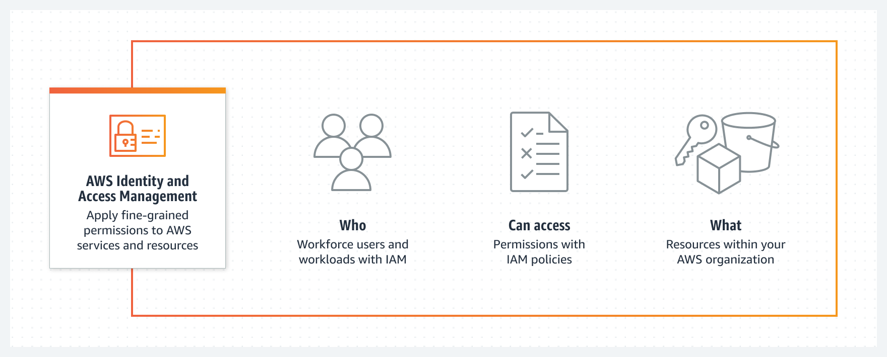

✔️ IAM을 사용하면 여러 AWS 계정을 생성 및 관리 가능

- 대규모 조직이 항상 서로 일정 수준의 상호작용이 필요한 많은 계정을 보유하기에 필수적

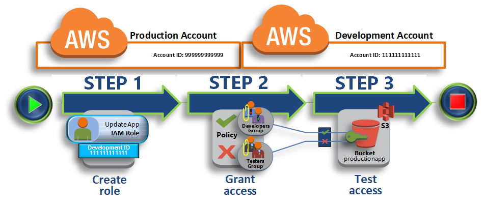

#### 📌 IAM 시작

✔️ 1. AWS 계정 생성

✔️ 2. IAM 설정

- IAM 콘솔로 이동하여 IAM 설정 가능

  - 콘솔에서 IAM 사용자, 그룹, 역할 및 정책 관리

✔️ 3. IAM 사용자 설정

- IAM 사용자 생성

  - IAM 사용자는 AWS 리소스에 액세스해야하는 사람이나 서비스를 나타내는 IAM에서 생성한 엔티티

  - IAM 사용자 생성 시 사용자가 가져야하는 권한 지정 가능

✔️ 4. IAM 그룹 생성

- IAM 그룹은 IAM 사용자의 모음

  - IAM 그룹 생성 시 그룹이 가져야하는 권한 지정 가능

  - "IAM Basics"와 "IAM User Guide: Getting Started" 참고

  <https://www.youtube.com/watch?v=iF9fs8Rw4Uo&feature=youtu.be>

  <https://docs.aws.amazon.com/IAM/latest/UserGuide/getting-started.html>

✔️ 5. IAM 그룹에 권한 할당

- 생성된 IAM 그룹에 권한 할당 가능

  - 그룹이 가져야하는 권한을 정의하는 IAM 정책 생성 작업 포함

  - 정책을 그룹에 연결

  - "IAM Tutorial & Deep Dive"와 "IAM Tutorial" 참고

  <https://www.youtube.com/watch?v=ExjW3HCFG1U>

  <https://docs.aws.amazon.com/IAM/latest/UserGuide/tutorial_cross-account-with-roles.html>

✔️ 6. IAM 사용자 테스트

- IAM 사용자를 테스트하여 올바른 권한이 있는지 확인

  - 테스트를 위해 IAM 사용자의 자격 증명을 사용하여 AWS Management Console에 로그인하고 사용자가 수행할 수 있어야 하는 작업 수행 가능

⭐️ AWS IAM은 `리소스에 액세스할 수 있는 사람`, `수행할 수 있는 작업`, `액세스할 리소스`를 제어할 수 있어 `리소스 보호`에 필수적인 도구

### Day 53 : AWS Systems Manager

#### 📌 AWS Systems Manager

✔️ AWS Systems Manager는 사용자가 AWS 및 온프레미스 리소스 모두에서 운영 작업을 관리하고 자동화할 수 있게 해주는 완전관리형 서비스

- AWS 리소스, 가상머신 및 애플리케이션을 관리하기 위한 중앙 집중식 플랫폼 제공 => DevOps 전문가는 `운영 작업을 자동화`하고 `규정 준수를 유지`하며 `운영 비용 절감` 가능

> 온프레미스(On-premise): 기업의 서버를 클라우드와 같이 '가상의 공간'이 아니라 자체적으로 보유하고 있는 서버에 직접 설치하고 운영하는 방식. (<-> 클라우드와 대비되는 개념)

✔️ 사용자는 패치 관리 자동화, OS 및 애플리케이션 배포 자동화, Amazon 머신 이미지(AMI) 생성 및 관리, 리소스 활용도 모니터링 등의 작업 수행 가능

- 실행 명령, 상태 관리자, 인벤토리 및 유지 관리 기간을 포함하여 인스턴스 구성 및 관리를 위한 도구 세트 제공

✔️ 운영 데이터에 대한 통합 보기를 제공

- 사용자는 EC2 인스턴스, 온프레미스 서버 및 AWS 서비스를 비롯한 `AWS 인프라 전체에서 운영 데이터를 시각화하고 모니터링 가능`

- 사용자가 문제를 더 빠르게 식별하고 해결하여 운영 효율성을 향상하고 가동 중지 시간을 줄일 수 있음

#### 📌 AWS System Manager 시작하는 법

✔️ 1단계: AWS System Manager 콘솔로 이동

- 콘솔에서 "Get Started with Systems Manager" 클릭 > 원하는 지역 선택 > "시작하기"

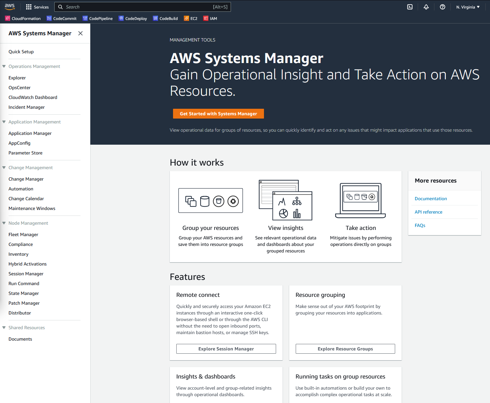

✔️ 2단계: 구성 유형 선택

- `관리할 리소스 선택`해 AWS Systems Manager 구성

- 예시로 "Patch Manager" 선택

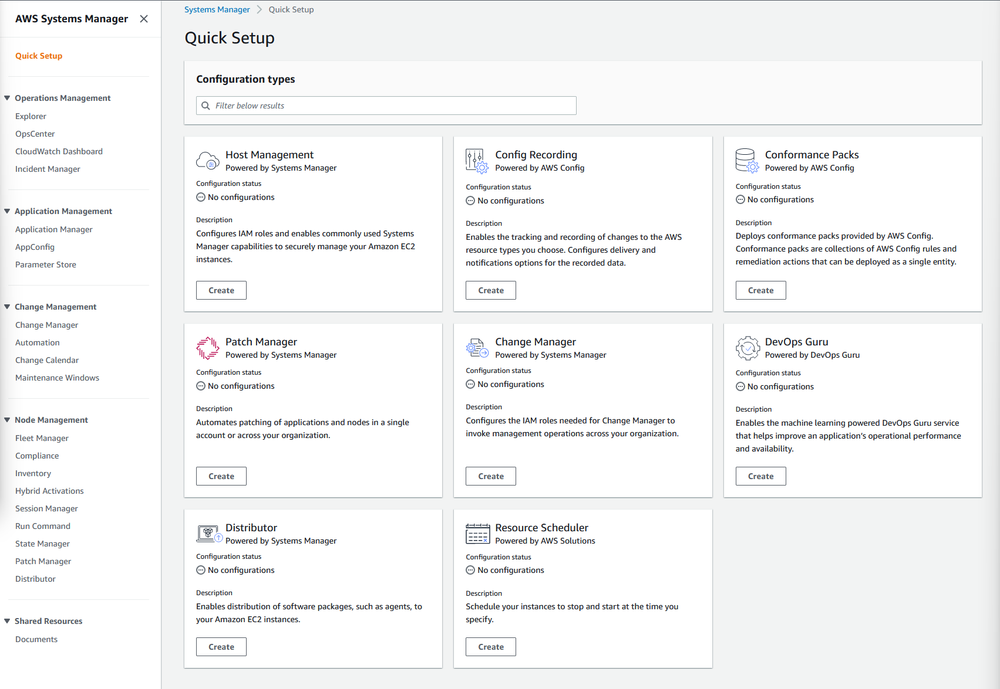

✔️ 3단계: 구성 옵션 지정

- Systems Manager config에 적용할 고유 매개변수 세트 설정

- 본 단계에서 `리소스 그룹`을 만들어 리소스 구성

  - 리소스 그룹이란 공통 속성을 공유하는 리소스의 모음으로 이를 통해 종합적으로 정책과 작업을 함께 적용할 수 있음


✔️ 4단계: 리소스 배포, 검토 및 관리

- 리소스 그룹 생성 후 AWS System Manager 콘솔에서 리소스를 보고 관리할 수 있음

- 자동화 workflow를 생성, 패치 관리, 리소스에 대한 기타 작업 수행 가능

⭐️ AWS System Manager를 통해 `리소스의 운영을 자동화`할 수 있고 `AWS 인프라 전체에서 운영 데이터를 시각화하고 모니터링`이 가능해져 사용자가 문제를 더 빠르게 식별하고 해결하여 `운영 효율성을 향상`하고 `가동 중지 시간을 줄일 수 있음`

### Day 54 : AWS CodeCommit

#### 📌 AWS CodeCommit

✔️ 개발자가 private Git 레포지토리를 쉽게 호스팅하고 관리할 수 있도록 하는 완전 관리형 소스 제어 서비스

- AWS CodeCommit을 통해 팀이 공동으로 작업한 코드를 클라우드에 안전하게 저장, 액세스를 안전하게 제어할 수 있고 암호화 및 자동 백업 지원

- "CodeCommit vs GitHub" 리소스 참조

  - AWS CodeCommit의 목표는 `여러 파일 전체에 걸쳐 일괄 변경 사항을 처리하고 개발자가 이를 비공개로 저장하고 관리하는데 도움을 주는 것`

  - GitHub의 목표는 `여러 공동 작업자 코드가 가질 수 있는 모든 충돌 변경 사항을 처리하는 도구를 제공해 더 효과적으로 공동 작업을 수행할 수 있도록 함`

  - AWS CodeCommit은 `사용 가능한 광범위한 private repository를 찾는 사람`에게 적합하고, GitHub는 `협업 솔루션을 찾는 사람`에게 적합

  <https://appwrk.com/aws-codecommit-vs-github>

✔️ 개발자는 강력한 코드 리뷰 및 workflow 도구를 사용하여 Git 레포지토리를 쉽게 생성, 관리 및 협업 가능

- AWS CodePipeline 및 AWS CodeBuild와 같은 다른 AWS 서비스와 원활하게 통합되므로 완전히 자동화된 방식으로 애플리케이션을 구축하고 배포할 수 있음

✔️ AWS CodeCommit의 주요 기능

- 코드 리뷰와 pull request를 지원하는 Git 기반 레포지토리

- 안전한 액세스 제어를 위해 AWS IAM(Identity and Access Management)와 통합 가능 => 큰 장점

- 저장 및 전송 중인 데이터 암호화

- 자동 백업 및 장애 조치 기능 => 확장성과 가용성이 뛰어남

- 다른 AWS 개발자 도구와 통합 가능. ex. AWS CodePipeline, AWS CodeBuild

⭐️ 전반적으로 `코드에 대해 협력`하고, `레포지토리를 안전하게 관리`하고, `개발 workflow를 간소화`해야하는 팀을 위한 강력한 도구

⭐️ CodeCommit을 효과적으로 활용하려면 Git 사용법을 아는 것이 좋음

### Day 55 : AWS CodePipeline

#### 📌 AWS CodePipeline

✔️ CodePipeline은 IaC 또는 소프트웨어 릴리즈 프로세스를 자동화할 수 있는 완전관리형 지속적 전달 서비스

- 코드 변경 사항을 지속적이고 안정적으로 빌드, 테스트 및 배포하는 pipeline 생성 가능

- 이를 통해 `더 빠른 릴리즈 주기를 달성`하고, `개발 및 운영 팀 간의 협업을 개선`하고, `소프트웨어 릴리즈의 전반적인 품질과 안정성을 향상`시킬 수 있음

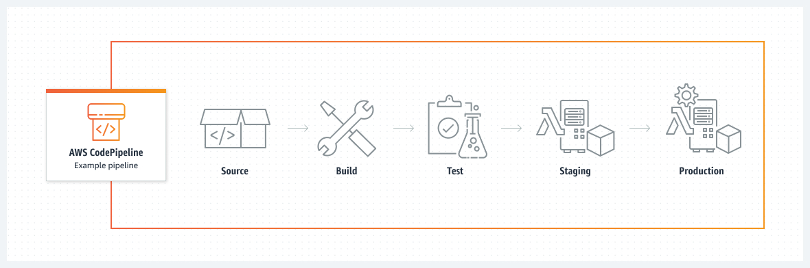

✔️ AWS CodePipeline과 통합되는 다른 AWS 서비스

- Source Action Integrations

- Build Action Integrations

- Test Action Integrations

- Deploy Action Integrations

- Approval Action Integrations

- Invoke Action Integrations

✔️ AWS 서비스 이외의 GitHub, Jenkins, Bitbucket과 같은 타사 도구와도 통합 가능

✔️ CodePipeline을 사용하여 여러 AWS 계정 및 region에서 애플리케이션 업데이트 관리 가능

#### 📌 AWS CodePipeline 시작

✔️ 1단계: IAM role 생성

- 파이프라인을 실행하는데 필요한 AWS 리소스에 액세스할 수 있도록 허용하는 IAM role 생성

✔️ 2단계: CodePipeline 파이프라인 생성

- AWS CodePipeline 콘솔로 이동하여 CodePipeline 생성

- 코드의 소스 위치, 사용할 빌드 공급자, 사용할 배포 공급자 등에 따라 IAM role 지정

✔️ 3단계: 코드 변경 사항 테스트 및 배포

- CodePipeline 파이프라인을 생성한 후 코드 변경 사항을 자동으로 구축, 테스트하고 환경에 배포

- AWS CodePipeline 콘솔에서 파이프라인의 진행 상황 모니터링 가능

⭐️ AWS CodePipeline을 통해 `다양한 도구와의 통합이 가능`하며, 코드 변경 사항을 지속적이고 안정적으로 빌드, 테스트 및 배포하는 pipeline 생성하여 `더 빠른 릴리즈 주기를 달성`하고, `개발 및 운영 팀 간의 협업을 개선`하고, `소프트웨어 릴리즈의 전반적인 품질과 안정성을 향상`시킬 수 있음

## Red Hat OpenShift

### Day 56 : What does Red Hat OpenShift bring to the party? An Overview

#### 📌 Vanilla vs Enterprise Kubernetes

✔️ Vanilla Kubernetes

- 공식 Kubernetes 프로젝트에서 제공하는 오픈 소스 버전

- 사용자가 직접 Kubernetes 클러스터를 설치하고 관리해야 함

- 커스터마이징과 확장이 가능하며 다양한 플러그인과 도구 사용 가능

- 클라우드 제공 업체들이 바닐라 쿠버네티스를 기반으로 한 클라우드 서비스 제공

✔️ Enterprise Kubernetes

- 기업용 솔루션 및 상용 제품으로서, 바닐라 쿠버네티스를 기반으로 한 추가 기능과 지원 서비스 제공

- 고급 보안, 모니터링, 스케일링, 로깅, 자동화 등의 기능 강화

- 단순화된 배포, 구성, 관리 기능 포함

- 엔터프라이즈 쿠버네티스 플랫폼은 다양한 클라우드 공급자에 대한 지원을 제공하며 멀티 클러스터 관리, 클라우드 네이티브 스토리지 및 네트워킹, 자동화된 규정 준수 검사와 같은 기능이 추가되는 경우가 많음

#### 📌 Enterprise Kubernetes

✔️ Enterprise Kubernetes를 제공하는 주요 공급업체: `Red Hat OpenShift`, `Google Anthos`, `Amazon EKS`, `Microsoft Azure Kubernetes Service` 및 `VMware Tanzu`

✔️ Red Hat OpenShift와 같은 엔터프라이즈 쿠버네티스 선택 이유

- 자동화 및 엔터프라이즈급 보안

  - Red Hat OpenShift는 기본 인프라의 보안을 보장하면서 애플리케이션을 빠르고 쉽게 배포, 관리, 확장하는데 도움이 되는 자동화된 플랫폼 제공

- 오픈 소스

  - Red Hat OpenShift는 Kubernetes, Docker, Red Hat Enterprise Linux와 같은 오픈 소스 기술을 기반으로 구축 => 애플리케이션을 항상 최신 기술로 최신 상태 유지 가능

- 지속적인 통합 및 제공

  - 안전하고 안정적인 방식으로 애플리케이션을 쉽게 배포하고 관리할 수 있도록 해주는 지속적인 통합 및 제공을 위한 통합 도구 세트

- 확장성 및 고가용성

  - 다운타임 없이 대량의 트래픽과 데이터를 처리할 수 있는 가용성과 확장성이 뛰어난 플랫폼 제공

- 비용 절감

  - 클라우드에서 애플리케이션을 실행하기 위한 비용에 관한 효율적인 솔루션 제공. OpenShift의 자동화된 플랫폼을 활용하면 인프라 및 운영 비용 절감 가능

#### 📌 Red Hat OpenShift

✔️ 기본 기능

- 사전 빌드된 컨테이너 이미지 및 컨테이너 런타임 환경

- 통합된 오픈소스 플랫폼 및 컨테이너 런타임 환경

- 데이터베이스, 메세징, 스토리지 등의 광범위한 서비스 액세스

- 맞춤형 애플리케이션 배포를 위한 플랫폼

- 웹 기반 사용자 인터페이스, 명령줄 도구 및 API

- 모니터링 및 로깅 기능

- 보안 및 리소스 격리

- 자동화된 빌드 및 배포 파이프라인

- 지속적인 통합 및 지속적 전달(CI/CD) 기능

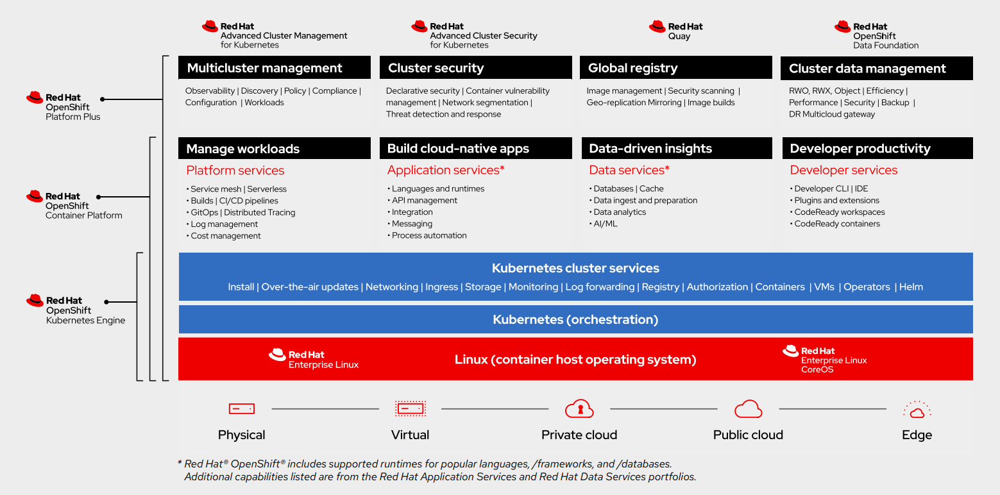

✔️ 어디에 배포할 수 있는가

- 자체 데이터센터 내에서 베어메탈 또는 하이퍼바이저 등 생각할 수 있는 대부분의 플랫폼 뿐 아니라 자체 관리 또는 Red Hat에서 관리하는 클라우드 제품까지 확장 가능

- 클라우드 서비스 에디션
  
  - AWS, Azure, IBM Cloud, Red Hat Dedicated 

- 자체 관리 버전

  - AWS, GCP, Microsoft Azure, Microsoft Azure Stack Hub 등 

✔️ 평가판에 액세스

- OpenShift는 3가지 옵션 제공

  - `Developer Sandbox` : 30일동안 즉시 사용할 수 있는 호스팅된 OpenShift 인스턴스

  - `Managed Service` : 사용할 완전 관리형 Red Hat OpenShift 전용 인스턴스로, AWS 또는 GCP 클라우드 계정을 제공해야 배포 가능. 60일 평가판

  - `Self-Managed` : 위에 지정된 플랫폼에 직접 OpenShift 배포. 60일 평가판

### Day 57 : Understanding the OpenShift Architecture, Installation Methods and Process

⚡️ Red Hat OpenShift 아키텍처

#### 📌 기본 운영 체제 - Red Hat CoreOS

✔️ Red Hat OpenShift의 기본 운영 체제인 Red Hat CoreOS (RHCOS)는 Red Hat OpenShift 환경의 일부로만 사용하도록 지원 => 즉, 범용 Linux로 사용하기 위해 인스턴스를 회전시킬 수는 없음

✔️ RHCOS는 Red Hat OpenShift Plane 노드(마스터 노드)에 대해 지원하는 유일한 운영 체제 => 컴퓨팅 플레인 노드의 경우 RHCOS를 운영체제로 하거나 RHEL을 배포하도록 선택알 수 있음

✔️ RHCOS는 구성 관점에서 최소한의 사용자 상호 작용 플랫폼으로 설계되어 있으며 인스턴스는 Red Hat OpenShift 플랫폼 자체에서 관리되므로 모든 구성은 Kubernetes 개체를 통해 제어됨

✔️ 요약하면 RHCOS는 특별히 설계된 클라우드 네이티브 운영 체제로 아래 기능 제공

- Ignition (머신의 첫번째 부팅 구성)

- Kubernetes 기본 컨테이너 런타임 구현인 CRI-O

- 컨테이너 시작 및 모니터링을 위한 Kubernetes 노드 에이전트인 Kubelet


#### 📌 제품 아키텍처

✔️ 기본적으로 Red Hat OpenShift는 오픈소스 플랫폼인 Kubernetes를 기반으로 구축되어있으며, 기본 플랫폼에서 배운 모든 구성 요소가 Red Hat OpenShift 플랫폼에서 명확하게 정의되어있고 사용 가능

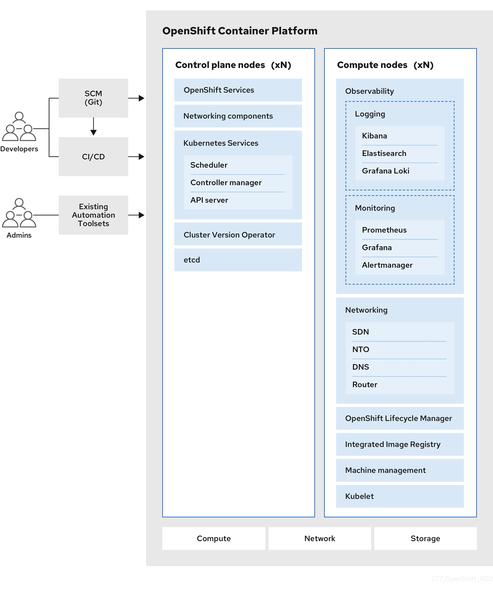

✔️ Kubernetes 위의 Red Hat은 아래 엔터프라이즈 소스 제공

- 다양한 클라우드 또는 온프레미스 데이터 센터에 배포 가능

- Red Hat Enterprise Linux에서 Red Hat 기술 통합

- 오픈 소스 개발 모드 => 공개 소프트웨어 저장소에서 소스 코드 사용 가능

✔️ 완전한 엔터프라이즈 지원 Kubernetes 플랫폼을 제공하기 위해 아래 구성 요소 위에 계층화됨

- RHCOS를 기반으로 하는 사용자 정의 운영체제

- 클러스터 플랫폼 수준에서 설치 및 수명주기 관리가 단순화됨

- 운영자는 플랫폼 기반 역할을 하여 운영체제 및 제어 플레인 애플리케이션을 업그레이드할 필요가 없어 수명 주기 관리가 단순해짐

- Red Hat Quay 컨테이너 이미지 레지스트리

- 기본 Kubernetes 플랫폼에 대한 기타 개선 사항

  - 소프트웨어 정의 네트워킹

  - Authentication

  - 로그 집계

  - 모니터링

  - 라우팅

✔️ 웹 콘솔이나 Red Hat OpenShift용 특정 CLI가 혼합된 사용자 정의 OpenShift CLI 도구를 통해 Cluster와 상호작용 가능

✔️ 바닐라 Kubernetes 플랫폼 대신 Red Hat OpenShift를 선택하는 이유

- 클러스터 생성 및 관리 단순화

- 애플리케이션 개발자가 애플리케이션을 모니터링하고 확장하는 기능과 같은 워크로드 수명주기 관리가 포함된 애플리케이션을 생성 및 배포할 수 있는 도구 내장

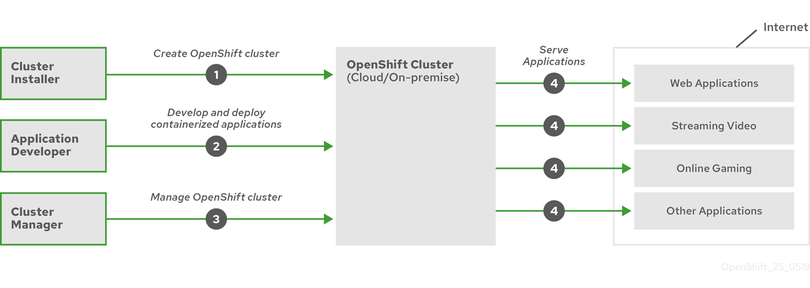

✔️ Operator란 무엇인가

- Operator는 기본적으로 Kubernetes 클러스터 내에서 실행되는 소프트웨어에서 일반적인 설치,구성 및 재구성,업데이트,백업,장애 조치, 복원 등의 활동을 구현하고 자동화

- Kubernetes 개념과 API 사용 => Kubernetes 네이티브 애플리케이션

- Operator를 사용하면 애플리케이션을 Pod, Deployment, Service, 또는 ConfigMap과 같은 기본 요소의 컬렉션으로 처리하는 대신 애플리케이션에 적합한 손잡이만 노출하는 단일 객체로 처리 가능

#### 📌 Red Hat OpenShift 설치 방법

⚡️ Red Hat OpenShift Container Platform (OCP)는 아래 유연성 제공

- 프로비저닝된 인프라와 이를 유지,관리하는 클러스터에 배포

- 준비하고 유지, 관리하는 인프라에 클러스터에 배포

⚡️ 클러스터에 대한 설치 방법/배포 방법에는 아래의 유형 존재

- 설치자 프로비저닝 인프라 (IPI)

- 사용자 프로비저닝 인프라 (UPI)

- 보조 설치 프로그램 (AI)을 통해 UPI의 유연성을 제공하는 에이전트 기반의 방법

⚡️ 위의 IPI, UPI는 Linux 및 MacOS 에만 제공되는 CLI 도구인 설치 프로그램에서 `openshift-install` 구동

⚡️ 설치 프로그램은 클러스터를 구축하는데 필요한 구성 요소 생성 => 클러스터란 부트스트랩, 마스터 및 작업자 시스템용 Ignition 파일

- 성공적인 클러스터 배포를 위해 설치에서 달성해야하는 대상에 대한 설치를 추가로 모니터링하고 필요한 문제 해결 로그를 수집하여 클러스터 배포가 실패한 경우 오류 처리 제공

- 이러한 부분을 시각화하기 위해 Red Hat OpenShift 문서는 아래 이미지 제공

  - 클러스터는 `install-config.yaml`라 불리는 파일을 생성하는 것. 이 파일은 아래 정보 포함

    - 클러스터 이름

    - 기본 도메인 (클러스터가 실행될 네트워크에 대한 FDQN)

    - 이미지 레지스트리에서 소프트웨어를 가져오기 위한 세부 정보 (Pull Secret)

    - SSH 키 (문제 해결을 위해 노드에 액세스)

    - 특정 인프라 플랫폼 세부 정보 (사용할 네트워크 및 스토리지 등의 로그인 세부 정보)

    - Control plane(Master)와 Compute plane(Worker) 노드에 사용할 인스턴스 유형과 같은 사용자 정의 워크로드 
  
  - 네트워킹 플랫폼과 같은 인프라 통합을 위해 부트스트래핑을 지원하도록 구성하는 `install-config.yaml`와 폴더의 루트 옆에 저장할 수 있는 `manifests` 추가 파일 존재

- 위의 파일이 모두 존재하면 `openshift-install` CLI 도구를 실행하여 부스트랩, 제어 플레인 및 컴퓨팅 플레인 노드에 대한 Ignition file 생성

  - 운영체제를 구성하고 상호 작용을 최소화하거나 전혀 사용하지 않고 일관된 Kubernetes 클러스터를 구축하는 프로세스를 시작하는 첫 부팅 정보 포함

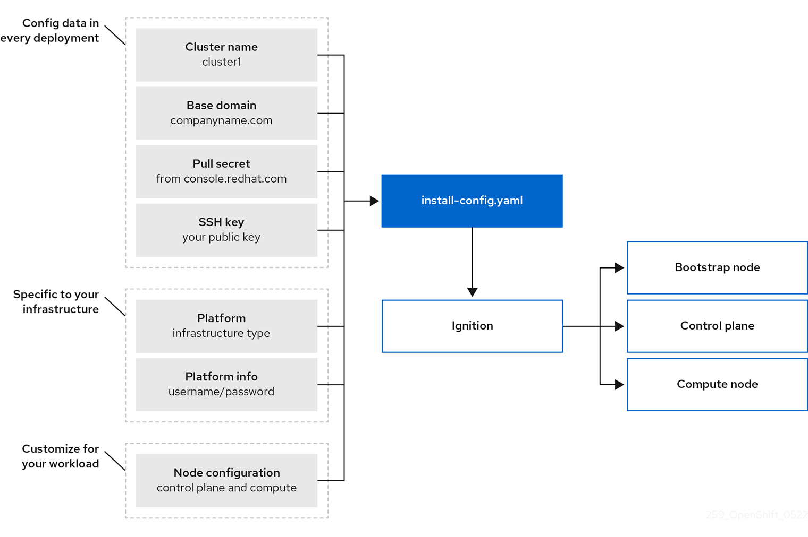 

✔️ 설치자 프로비저닝 인프라 (IPI)

- 기본 설치 방법이자 Red Hat 고객이 클러스터 설치를 시작할 때 선호하는 방법. 기본적으로 참조 아키텍처 배포 제공

- CLI `openshift-install`는 자체 설치 마법사 역할을 하여 선택한 플랫폼에 배포하는데 필요한 값에 대한 여러 쿼리 제공. 배포된 머신 수, 인스턴스 유형/크기, Kubernetes 서비스 네트워크의 CIDR 범위와 같은 고급 시나리오 지원하도록 정의 가능

- 설치 소프트웨어가 클러스터의 기본 인프라를 프로비저닝한다는 점이 중요

- IPI를 사용하면 프로비저닝된 클러스터는 수명주기 관리 관점에서 앞으로 클러스터와 프로비저닝된 인프라의 모든 측면을 계속 관리할 수 있는 추가 기능 가지게 됨

Ex. 클러스터의 컴퓨팅 플레인(master node) 노드 수를 확장하면 OpenShift Contaienr Platform은 기본 플랫폼(AWS, VMware, vSphere)과 상호작용하여 새 가상 머신 생성하고 이를 클러스터에 부트스트랩 가능

✔️ 사용자 프로비저닝 인프라 (UPI)

- UPI를 사용하면 사용자가 제공한 인프라에 OpenShift Container Platform 설치

- 설치 소프트웨어는 클러스터를 프로비저닝하는데 필요한 자산을 생성하는데 사용되지만, 수동으로 노드를 구축하고 노드를 온라인으로 전환하는 데 필요한 Ignition 제공

- 아래 클러스터 리소스를 지원하는 인프라 관리해야 함

  - 노드가 배포되거나 노드 기반으로 하는 모든 인프라 (Azure Stack Hub, vSphere, IBM Power, Bare Metal)

  - 로드 밸런서

  - DNS 레코드 및 필수 서브넷을 포함한 클러스터 네트워킹

  - 클러스터 인프라와 워크로드를 모두 위한 스토리지

- UPI 설치를 사용할 때 컴퓨팅 플레인 노드를 Red Hat Enterprise Linux 머신으로 배포할 수 있는 옵션 존재

✔️ 보조 설치 프로그램

- 지원 설치 프로그램은 일종의 UPI 방식 하이브리드지만, 설치 아티팩트 호스팅을 제공하고 부트스트랩 시스템이 필요하지 않음

- 기본적으로 라이브부팅 CD에서 노드를 프로비저닝/설치하고 노드를 불러오고 알려진 위치에서 호스팅된 나머지 파일을 가져오는데 필요한 구성

#### 📌 설치 과정

✔️ 임시 부트스트랩 머신은 IPI 또는 UPI를 사용하여 프로비저닝됨. 여기에는 OpenShift 클러스터 자체를 구축하는데 필요한 정보 포함. Control plane이 온라인 상태가 되면 Computing plane이 노드 생성 시작

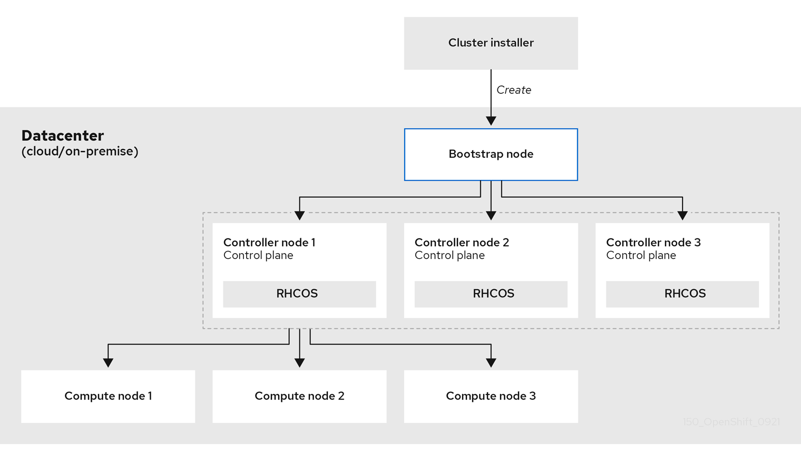

✔️ Control plane이 초기화되면 부트스트랩 머신 파괴. UPI 플랫폼을 수동으로 프로비저닝하는 경우 여러 프로비저닝 단계를 수동으로 완료

1. 부트스트랩 머신이 부팅되고 control plane 머신이 부팅하는데 필요한 원격 리소스 호스팅 시작

2. 부트스트랩 머신은 단일 노드 etcd 클러스터와 임시 Kubernetes control plane 시작

3. control plane은 부트스트랩 머신에서 원격 리소스를 가져오고 부팅 완료

4. 임시 control plane은 프로덕션 control plane 머신에 대한 프로덕션 control plane을 예약

5. CVO(Cluster Version Operator)가 온라인 상태가 되어 etcd Operator 설치. etcd Operator는 모든 컨트롤 플레인 노드에서 etcd 확장

6. 임시 control plane이 종료되고 생산 control plane으로 제어 전달

7. 부트스트랩 머신은 OpenShift Container Platform 구성 요소를 프로덕션 control plane에 주입

8. 설치 프로그램이 부트스트랩 시스템 종료

9. control plane은 computing node 설청

10. control plane은 일련의 연산자 형태로 추가 서비스 설치

✔️ 위 부트스트래핑 프로세스의 결과로 OpenShift Container Platform 클러스터가 실행되고 이후 클러스터는 지원되는 환경에서 컴퓨팅 머신 생성을 포함한 작업에 필요한 나머지 구성 요소를 다운로드하고 구성

### Day 58 : Deploying Red Hat OpenShift on VMware vSphere

⚡️ 이전 세션에서 배운 설치 소프트웨어를 통해 클러스터 배포의 일부로 필요한 인프라를 배포하는 IPI 방법 설명 => 이 방법을 통해 클러스터 배포에 대한 많은 제어권을 얻을 수 있음

⚡️ 해당 플랫폼으로 데이터 센터 및 퍼블릭 클라우드 환경에서 널리 사용할 수 있는 하이퍼바이저 가상화 플랫폼인 `VMware vSphere` 사용

#### 📌 전제조건

✔️ 설치 소프트웨어 실행을 위한 점프 호스트

✔️ 배포하려는 인프라 플랫폼을 지원하는 DNS 서버에 대한 액세스

✔️ Red Hat Cloud Console 웹사이트에서 private file/key 가져오기

- 계정 가입 시 이 중 하나를 얻을 수 있으며, 이 key를 사용하여 생성된 모든 클러스터는 60일동안 클러스터에 대한 평가판 활성화를 받음

✔️ 배포된 노드에 액세스하는데 사용되는 SSH key

#### 📌 점프 호스트 시스템 구성

⚡️ 현재 예시에서는 Ubuntu Server Virtual Machine 사용했지만, Linux 또는 MacOS X 배포판 사용 가능

✔️ OpenShift-install 도구 및 OpenShift-Client(OC) 커맨드라인 도구 다운로드

✔️ 파일 추출하고 /usr/bin/local 디렉토리에 복사

```
tar -zxvf openshift-client-linux.tar.gz
tar -zxvf openshift-install-linux.tar.gz

sudo cp openshift-install /usr/bin/local/openshift-install
sudo cp oc /usr/bin/local/oc
sudo cp kubectl /usr/bin/local/kubectl
```

✔️ 배포된 CoreOS VM에 연결할 수 있도록 점프 박스에서 사용 가능한 SSH 키 준비. `ssh-keygen`이 필요한 경우 사용하여 생성

✔️ VMware vCenter의 루트 인증서를 다운로드해 점프 호스트로 가져옴

`curl -O https://{vCenter_FQDN}/certs/download.zip`

✔️ 파일의 압축을 풀고 신뢰할 수 있는 저장소로 가져옴

```
unzip download.zip
cp certs/win/* /usr/local/share/ca-certificates
update-ca-certificates
```

✔️ 클러스터를 배포하기 위해 OpenShift-Install에 대한 올바른 권한을 사용하여 vCenter에 연결하려면 사용자 계정 필요

- 기존 계정 및 권한을 사용하지 않으려면 PowerCLI 스크립트를 사용하여 Red Hat 설명서를 기반으로 올바른 권한이 있는 역할을 생성할 수 있음

#### 📌 DNS 레코드 구성

✔️ 노드가 배포될 동일한 IP 주소 공간의 OpenShift 클러스터 네트워크에서 사용할 수 있으려면 아래 두 레코드가 필요

```
    {clusterID}.{domain_name}
        example: ocp412.veducate.local
    *.apps.{clusterID}.{domain_name}
        example: *.apps.ocp412.veducate.local
```

✔️ DNS가 Windows 서버인 경우 아래 링크의 스크립트 사용 가능

<https://github.com/saintdle/OCP-4.3-vSphere-Static-IP/tree/master/DNS>

✔️ 두 레코드에 대한 DNS 서버 설정은 아래 스크린샷과 같이 진행

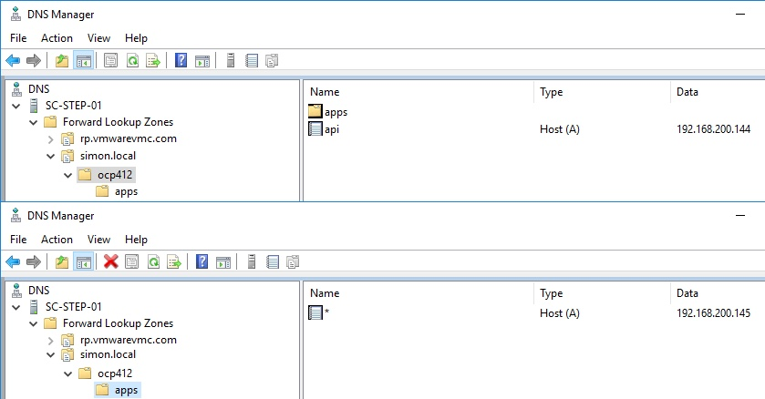

#### 📌 클러스터 배포를 위한 최소 리소스

```
    1 Bootstrap
        This machine is created automatically and deleted after the cluster build.
    3 Control Plane
    2 Compute Plane
```

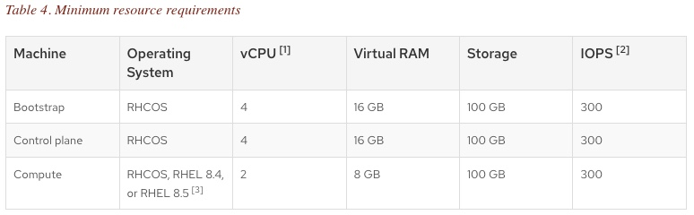

#### 📌 OpenShift 설치 도구 사용

✔️ 위에서 사전 요구 사항이 준비되었으므로 클러스터 배포 시작 가능

✔️ 도구를 사용하면 `OpenShift-Install` 클러스터를 생성할 때 세 가지 주요 command line 옵션 존재

- `openshift-install create cluster`

  - 마법사를 통해 install-config.yaml 파일을 생성한 다음 설치 프로그램 소프트웨어의 일부로 패키지된 테라폼을 사용해 자동으로 클러스터 생성

  - 아래 명령어를 실행하는 경우에도 이 명령을 실행하여 클러스터를 프로비저닝 가능

- `openshift-install create install-config`

  - 마법사를 통해 install-config.yaml 파일을 생성하고 이를 루트 디렉토리나 --dir=argument 로 지정한 디렉토리에 위치시킴

  - 위 명령을 실행하기 전 `create cluster`에서 install-config.yaml 파일을 수정하는 것이 지원됨

- `openshift-install create manifests`

  - 위 명령어를 진행한 경우 클러스터 프로비저닝을 제어하는 manifests 폴더가 생성됨. 대부분의 경우 이 명령은 UPI 설치에만 사용됨

  - 일부 플랫폼 통합은 IPI 설치를 지원하지만 manifest 폴더를 생성하고 이 폴더에 YAML 파일을 추가해 업로드함으로서 배포시 OpenShift가 로드 밸런서에 통합하는데 도움이 됨

✔️ `create ignition`과 같이 UPI 설치 방법을 수행할 때 사용되는 다른 명령어 존재 

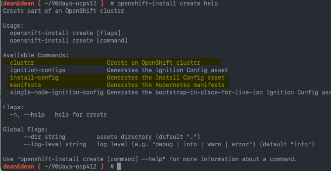

✔️ 클러스터 생성: `openshift-install create cluster`

- 마법사 형식으로 전환되며 사용하려는 SSH 키과 플랫폼을 vSphere로 선택

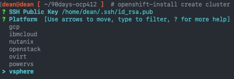

✔️ vCenter FQDN, 사용자 이름 및 비밀번호 입력한 다음 도구는 vCenter에 연결하고 배포할 수 있는 필수 데이터 저장소와 네트워크를 가져옴

✔️ 데이터 저장소와 네트워크 선택 후 주소 입력

`api.{cluster_name}.{base_domain} *.apps.{cluster_name}.{base_domain}`

🚫 설치 프로그램에서 버그 발생

- 해결법: `openshift-install create install-config`가 제공하는 IP 주소를 10.0.0.0/16 범위에서 실행한 다음 `openshift-install create` 클러스터를 실행하기 전에 `install-config.yaml` 파일을 수동으로 변경하여 사용가능한 install-config.yaml 파일을 읽고 클러스터를 생성하는 것 => 다른 마법사 X

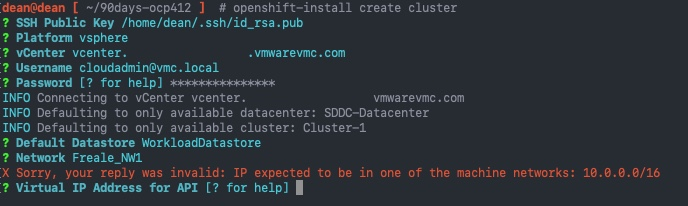

✔️ 인수를 실행하면 `create install-config` 이전과 동일한 마법사 실행

✔️ 마법사에서는 위 범위의 IP를 제공하고 기본 도메인과 클러스터 이름 설정. Red Hat Cloud 콘솔에서 Pull Secret 붙여넣기

✔️ `ls` 명령어를 통해 현재 디렉토리의 파일을 보면 `install-config.yaml` 확인 가능

✔️ `create cluster` 에는 일반 텍스트 비밀번호가 포함되어 있으므로 명령을 실행하기 전에 현재 파일을 저장하는 것이 좋음

✔️ 변경해야하는 라인 강조

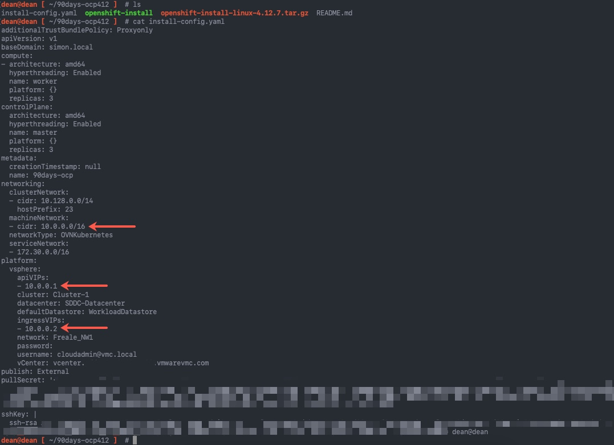

✔️ 네트워크

```
  machineNetwork:
  - cidr: 10.0.0.0/16
```

✔️ 노드가 실행될 네트워크 서브넷 변경. 플랫폼 세션의 경우 DNS 레코드에서 올바른 IP 주소 매핑해야 함

```
platform:
  vsphere:
    apiVIP: 192.168.200.192 <<<<<<< This is your api.{cluster_name}.{base_domain} DNS record
    cluster: Cluster-1
    folder: /vEducate-DC/vm/OpenShift/
    datacenter: vEducate-DC
    defaultDatastore: Datastore01
    ingressVIP: 192.168.200.193 <<<<<<< This is your *.apps.{cluster_name}.{base_domain} DNS record
```

✔️ `install-config.yaml`. compute와 control plane 세션 강조. 여기에서 가상머신에 대한 리소스 구성 설정 지정하며 문서에 지정된 최소값 이하로 변경할 수 없음 

```
apiVersion: v1
baseDomain: veducate.local
compute: 
- hyperthreading: Enabled 
  name: worker
  replicas: 1
  platform:
    vsphere: 
      cpus: 8
      coresPerSocket: 4
      memoryMB: 16384
      osDisk:
        diskSizeGB: 120
controlPlane: 
  hyperthreading: Enabled 
  name: master
  replicas: 3
  platform:
    vsphere: 
      cpus: 8
      coresPerSocket: 4
      memoryMB: 16384
      osDisk:
        diskSizeGB: 120
metadata:
  creationTimestamp: null
  name: ocp48
networking:
  clusterNetwork:
  - cidr: 10.128.0.0/14
    hostPrefix: 23
  machineNetwork:
  - cidr: 10.0.0.0/16
  networkType: OpenShiftSDN
  serviceNetwork:
  - 172.30.0.0/16
platform:
  vsphere:
    apiVIP: 192.168.200.192
    cluster: Cluster-1
    folder: /vEducate-DC/vm/OpenShift/
    datacenter: vEducate-DC
    defaultDatastore: Datastore01
    ingressVIP: 192.168.200.193
    network: "network_NW1"
    password: Password@!
    username: admin@veducate.local
    vCenter: vcenter.veducate.local
publish: External
pullSecret: '{"auths":{"cloud.openshift.com":{"auth":"bxxxxxx==","email":"openshift@veducate.co.uk"},"registry.redhat.io":{"auth":"Nxxx=","email":"openshift@veducate.co.uk"}}}'
sshKey: |
  ssh-rsa AAAABxxxxxx openshift@veducate
```

✔️ 파일이 올바르게 구성되었으므로 명령 실행 후 `install-config.yaml` 클러스터설치 진행. `openshift-install create cluster`에 `--log-level=` 명령을 추가하여 argument를 사용해 수정 가능

✔️ 아래는 수정자가 없는 일반 출력의 경우

```
dean@dean [ ~/90days-ocp412 ]  # ./openshift-install create cluster 
INFO Consuming Install Config from target directory 
INFO Creating infrastructure resources...         

INFO Waiting up to 20m0s (until 9:52AM) for the Kubernetes API at https://api.90days-ocp.simon.local:6443... 
INFO API v1.25.4+18eadca up                       
INFO Waiting up to 30m0s (until 10:04AM) for bootstrapping to complete... 
INFO Destroying the bootstrap resources...        
INFO Waiting up to 40m0s (until 10:30AM) for the cluster at https://api.90days-ocp.simon.local:6443 to initialize... 
INFO Checking to see if there is a route at openshift-console/console... 
INFO Install complete!                            
INFO To access the cluster as the system:admin user when using 'oc', run 'export KUBECONFIG=/home/dean/90days-ocp412/auth/kubeconfig' 
INFO Access the OpenShift web-console here: https://console-openshift-console.apps.90days-ocp.simon.local 
INFO Login to the console with user: "kubeadmin", and password: "ur6xT-gxmVW-WVUuD-Sd44J" 
INFO Time elapsed: 35m16s                         
```

#### 📌 설치 로그 보기

✔️ 설치를 실행한 디렉토리를 살펴보면 `openshift-install` 여러 개의 새 폴더와 파일이 생성됨

- 인증 폴더

  - 해당 폴더 내에 kubeconfig 파일 존재

- TLS 폴더

  - 로그를 수집하고 디버그하기 위한 노드의 저널 게이트웨이 서비스 인증서 포함

- Terraform 폴더

  - openshift-install 소프트웨어의 일부인 Terraform 구성 요소와 출력 Terraform 상태 파일에서 사용되는 `.tfvars`, `.tfstate` 등의 파일 존재

- Log 파일

  - 자세한 출력은 숨겨진 파일인 `.openshift_install.log`에 존재

  - 다양한 리소스를 생성하기 위한 Terraform 실행 및 설치에 대한 모든 세부 정보 포함

#### 📌 클러스터에 연결

⚡️ 바닐라 Kubernetes 환경과 같은 클러스터와 통신하려면 CLI 도구를 통해 또는 API와 직접 상호작용할 수 있음. But Red Hat OpenShift를 사용하면 웹 콘솔도 즉시 사용할 수 있음

⚡️ 웹 콘솔은 페르소나, 플랫폼 관리자 및 애플리케이션을 배포하는 개발자 모두를 위해 설계되었음

✔️ Openshift 클라이언트(oc) 및 Kubectl 사용

- oc를 사용할 때 ststem:admin 사용자로 클러스터에 액세스하려면 `export KUBECONFIG=/home/dean/90days-ocp412/auth/kubeconfig` 실행

- 환경변수로 설정되면 바닐라 Kubernetes 클러스터와 동일한 방식으로 클러스터와 상호작용 가능. OpenShift Client(oc) 도구를 사용할 때 즐겨 사용하는 모든 kubectl 명령이 여전히 동작. 명령의 첫 부분을 oc로 바꾸면 됨

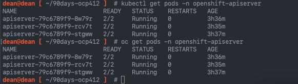

- oc login을 통해 Openshift 클러스터에 로그인 가능

#### 📌 OpenShift 콘솔 UI 사용

✔️ 클러스터에 대한 최종 액세스 지점은 UI를 통해 이루어지며, 다시 설치 소프트웨어의 출력이 이 콘솔에 액세스하기 위한 전체 FQDN 제공

```
INFO Access the OpenShift web-console here: https://console-openshift-console.apps.90days-ocp.simon.local 
INFO Login to the console with user: "kubeadmin", and password: "ur6xT-gxmVW-WVUuD-Sd44J" 
```

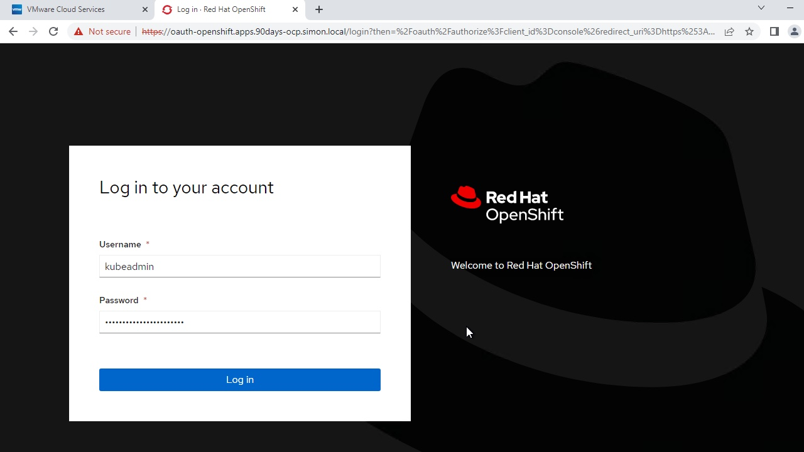

✔️ 로그인하면 아래와 같은 페이지가 나타남

- (1)에 액세스할 수 있는 페르소나 확인 가능. 현재 Administrator로 되어있지만 클릭시 Developer 모드로도 가능

- (2)에서 플랫폼 관리를 위한 모든 공통 영역을 쉽게 탐색하고, 라이브 클러스터의 세부 정보를 볼 수 있을 뿐 아니라 기존 구성을 변경하거나 새 구성을 커밋할 수 있음

- (3)에서 클러스터의 전반적인 상태, 서비스에 대한 연결, Insights 기능과 같은 Red Hat 클라우드 서비스 존재

- (4)에서 활동 로그를 볼 수 있음. 이중 하나를 클릭하면 관련 개체로 이동하여 자세한 내용을 볼 수 있으며 포드에 관한 것이라면 포드 내에서 실행되는 각 컨테이너의 로그 확인 가능

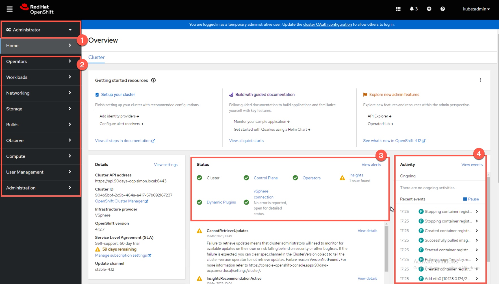

✔️ (1) 클릭시 Developer 모드로 전환

- 개발자 화면에서 시작 및 실행을 위한 풍부한 배포 옵션이 제공됨

- 서비스용 Kubernetes Operator, Helm 차트, 컨테이너에 구축할 수 있는 Git에서 Import code 가능

- 클러스터, 앱 샘플 배포, 개별 컨테이너 가져오기, 로컬 컴퓨터에서 콘텐츠 가져오기, 프로젝트에 액세스할 수 있는 사용자 제어 기능 

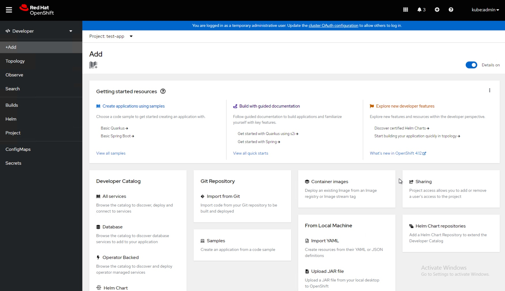

### Day 59 : Deploying applications and getting a handle on Security Constraints Context (SCC)

⚡️ 이번 세션에서는 새로 배포된 Red Hat OpenShift 클러스터에 샘플 MongoDB 애플리케이션을 배포하는 프로세스 안내 => 해당 프로세스는 SCC(보안 컨텍스트 제약 조건)로 인해 실패되므로 배포가 실패한 이유와 문제 해결 방법 및 OpenShift의 SCC에 대한 개요와 예제 제공

#### 📌 보안 컨텍스트 제약 조건(SCC) 이해

✔️ OpenShift 보안 컨텍스트 제약 조건은 관리자가 사용자 및 그룹 ID, SELinux 컨텍스트, 호스트 리소스 사용과 같은 컨테이너 런타임의 다양한 측면을 제어할 수 있는 보안 기능 => 즉, SCC는 컨테이너화도니 애플리케이션에 대해 허용되거나 허용되지 않는 보안 설정 결정

✔️ 기본적으로 OpenShift는 미리 정의된 여러 SCC(ex. restricted, anyuid, hostaccess)가 함께 제공됨

🚫 기본 SCC는 수정하면 안됨

- 기본 SCC를 수정하는 경우 일부 플랫폼 pod에 배포되거나 OpenShift Container Platform이 업그레이드될 때 문제가 발생할 수 있음

- 일부 클러스터 업그레이드 중에 기본 SCC 값이 기본값으로 재설정되어 해당 SCC에 대한 모든 사용자 정의가 삭제될 수 있음

- 기본 SCC를 수정하는 대신 필요에 따라 자체 SCC를 만들고 수정

✔️ `제한된(restricted) SCC`에서는 컨테이너가 루트 또는 권한 있는 액세스로 실행되는 것을 허용하지 않는 반면, `anyuid SCC`에서는 컨테이너가 모든 사용자 ID로 실행되는 것을 허용함

- 사용자 정의 SCC를 생성하고 이를 서비스 계정이나 사용자에게 부여함으로써 관리자는 애플리케이션 기능을 손상시키지 않고 원하는 보안 정책을 준수하도록 할 수 있음

✔️ 보안 컨텍스트 제약 조건을 통해 관리자는 다음을 제어할 수 있음

- Whether a pod can run privileged containers with the allowPrivilegedContainer flag

- Whether a pod is constrained with the allowPrivilegeEscalation flag

- The capabilities that a container can request

- The use of host directories as volumes

- The SELinux context of the container

- The container user ID

- The use of host namespaces and networking

- The allocation of an FSGroup that owns the pod volumes

- The configuration of allowable supplemental groups

- Whether a container requires to write access to its root file system

- The usage of volume types

- The configuration of allowable seccomp profiles

✔️ 보안 컨텍스트 제약 조건 구성 분석

⚡️ SCC는 포드가 액세스할 수 있는 보안 기능을 제어하는 설정 및 전략으로 구성됨. 이러한 설정은 아래 3가지 범주로 분류됨

- boolean으로 제어
  
  - 기본적으로 가장 제한적인 값으로 설정. 예를 들어 `AllowPrivilegedContainer`로 지정되지 않는 경우 항상 false로 설정

- 허용되는 세트에 의해 제어

  - 해당 값이 허용되는지 확인하기 위해 세트와 비교하여 검사

- 전략에 의해 통제

  - 가치를 창출하는 전략이 있는 항목은 다음을 제공: 가치를 생성하는 메커니즘, 지정된 값이 허용 가능한 값의 집합에 포함되도록 하는 메커니즘

✔️ CRI-O에는 포드의 각 컨테이너에 허용되는 아래와 같은 기본 기능 목록 존재

```
  default_capabilities = [
	  "CHOWN",
	  "DAC_OVERRIDE",
	  "FSETID",
	  "FOWNER",
	  "SETGID",
	  "SETUID",
	  "SETPCAP",
	  "NET_BIND_SERVICE",
	  "KILL",
  ]
```

✔️ 컨테이너는 기본 목록의 기능을 사용하지만 pod manifests 작성자(Kubernetes용 애플리케이션 YAML을 작성하는 사람)는 추가 기능을 요청하거나 일부 기본 동작을 제거하여 목록 변경 가능

- 클러스터에서 실행 중인 포드에 대해 허용되거나 거부되는 기능을 제어하려면 SCC의 `allowedCapabilities`, `defaultAddCapabilities` 및 `requiredDropCapabilities` 매개변수를 사용하여 포드의 해당 요청 제어

✔️ 기능이 포함된 pod 구성

```
apiVersion: v1
kind: Pod
metadata:
  name: security-context-demo-4
spec:
  containers:
  - name: sec-ctx-4
    image: gcr.io/google-samples/node-hello:1.0
    securityContext:
      capabilities:
        add: ["NET_ADMIN", "SYS_TIME"]
```

✔️ SCC 구성 예

1. 제한된 SCC (Restricted SCC)

- 모든 호스트 기능에 대한 액세스를 거부하고 네임스페이스에 할당된 UID 및 SELinux 컨텍스트를 사용하여 Pod 실행

- Restricted SCC v2

```
Ensures that pods cannot run as privileged

Ensures that pods cannot mount host directory volumes

Requires that a pod is run as a user in a pre-allocated range of UIDs

Requires that a pod is run with a pre-allocated MCS label

Allows pods to use any FSGroup

Allows pods to use any supplemental group

Ensures that no child process of a container can gain more privileges than its parent (AllowPrivilegeEscalation=False)
```

- `oc get scc restricted-v2 -o yaml`을 실행해 이 SCC 구성 얻을 수 있음

```
allowHostDirVolumePlugin: false
allowHostIPC: false
allowHostNetwork: false
allowHostPID: false
allowHostPorts: false
allowPrivilegeEscalation: true
allowPrivilegedContainer: false
allowedCapabilities: null
apiVersion: security.openshift.io/v1
defaultAddCapabilities: null
fsGroup:
  type: MustRunAs
groups: []
kind: SecurityContextConstraints
metadata:
  annotations:
    include.release.openshift.io/ibm-cloud-managed: "true"
    include.release.openshift.io/self-managed-high-availability: "true"
    include.release.openshift.io/single-node-developer: "true"
    kubernetes.io/description: restricted denies access to all host features and requires
      pods to be run with a UID, and SELinux context that are allocated to the namespace.
    release.openshift.io/create-only: "true"
  creationTimestamp: "2023-03-16T09:34:36Z"
  generation: 1
  name: restricted
  resourceVersion: "401"
  uid: 8ced4b4e-7fed-4369-a0b8-da40880f4a3d
priority: null
readOnlyRootFilesystem: false
requiredDropCapabilities:
- KILL
- MKNOD
- SETUID
- SETGID
runAsUser:
  type: MustRunAsRange
seLinuxContext:
  type: MustRunAs
supplementalGroups:
  type: RunAsAny
users: []
volumes:
- configMap
- downwardAPI
- emptyDir
- ephemeral
- persistentVolumeClaim
- projected
- secret
```

2. Privileged SCC

- 모든 권한 있는 호스트 기능에 대한 액세스를 허용하고 모든 사용자, 그룹, FSGroup 및 SELinux 컨텍스트로 실행할 수 있는 기능 허용

- Privileged SCC

```
Users to run privileged pods

Pods to mount host directories as volumes

Pods to run as any user

Pods to run with any MCS label

Pods to use the host’s IPC namespace

Pods to use the host’s PID namespace

Pods to use any FSGroup

Pods to use any supplemental group

Pods to use any seccomp profiles

Pods to request any capabilities
```

- `oc get scc privileged -o yaml`를 실행하여 이 SCC 구성 얻을 수 있음

```
allowHostDirVolumePlugin: true
allowHostIPC: true
allowHostNetwork: true
allowHostPID: true
allowHostPorts: true
allowPrivilegeEscalation: true
allowPrivilegedContainer: true
allowedCapabilities:
- '*'
allowedUnsafeSysctls:
- '*'
apiVersion: security.openshift.io/v1
defaultAddCapabilities: null
fsGroup:
  type: RunAsAny
groups:
- system:cluster-admins
- system:nodes
- system:masters
kind: SecurityContextConstraints
metadata:
  annotations:
    include.release.openshift.io/ibm-cloud-managed: "true"
    include.release.openshift.io/self-managed-high-availability: "true"
    include.release.openshift.io/single-node-developer: "true"
    kubernetes.io/description: 'privileged allows access to all privileged and host
      features and the ability to run as any user, any group, any fsGroup, and with
      any SELinux context.  WARNING: this is the most relaxed SCC and should be used
      only for cluster administration. Grant with caution.'
    release.openshift.io/create-only: "true"
  creationTimestamp: "2023-03-16T09:34:35Z"
  generation: 1
  name: privileged
  resourceVersion: "398"
  uid: 19a16cc2-ce1f-4037-b70e-49ba261cb599
priority: null
readOnlyRootFilesystem: false
requiredDropCapabilities: null
runAsUser:
  type: RunAsAny
seLinuxContext:
  type: RunAsAny
seccompProfiles:
- '*'
supplementalGroups:
  type: RunAsAny
users:
- system:admin
- system:serviceaccount:openshift-infra:build-controller
volumes:
- '*'
```

✔️ 위 YAML 파일의 일부 특정 항목

- allowedCapability

  - pod가 요청할 수 있는 기능 목록. 빈 목록은 어떤 기능도 요청할 수 없지만 특수 기호 *는 모든 기능을 허용한다는 의미

- defaultAddCapability: []

  - 모든 pod에 추가되는 추가 기능 목록

- fsGroup

  - FSGroup 전략은 보안 컨텍스트에 허용되는 값 지정

- groups

  - 이 SCC에 액세스할 수 있는 그룹

- requiredDropCapabilities

  - 포드에서 삭제할 기능 목록으로 모든 기능을 삭제하려면 ALL로 지정

- runAsUser

  - 보안 컨텍스트에 허용되는 값을 지정하는 runAsUser 전략 유형

- seLinuxContext

  - 보안 컨텍스트에 허용되는 값을 나타냄

- supplementalGroups

  - 보안 컨텍스트에 허용되는 보충 그룹 지정

- users

  - 이 SCC에 액세스할 수 있는 사용자

- volumes

  - 보안 컨텍스트에 허용되는 볼륨 유형으로, *는 모든 볼륨 유형의 사용을 허용

✔️ SCC의 사용자 및 그룹 필드는 SCC에 액세스할 수 있는 사용자를 제어하고, 기본적으로 클러스터 관리자, 노드 및 빌드 컨트롤러에는 권한 있는 SCC에 대한 액세스 권한이 부여되며 인증된 모든 사용자에게는 제한된 v2 SCC에 대한 액세스가 부여됨

#### 📌 샘플 애플리케이션 배포

✔️ kubernetes용 Pac-Man 애플리케이션의 기본 구성 요소의 일부인 MongoDB, PVC, Secret 배포

✔️ 구성 요소를 배치할 네임스페이스 생성

`oc create ns pacman`

✔️ YAML 파일 적용

`oc apply -f mongo-test.yaml`

`mongo-test.yaml`
```
apiVersion: apps/v1
kind: Deployment
metadata:
  labels:
    name: mongo
  name: mongo
  namespace: pacman
  annotations:
    source: "https://github.com/saintdle/pacman-tanzu"
spec:
  replicas: 1
  selector:
    matchLabels:
      name: mongo
  template:
    metadata:
      labels:
        name: mongo
    spec:
      initContainers:
      - args:
        - |
          mkdir -p /bitnami/mongodb
          chown -R "1001:1001" "/bitnami/mongodb"
        command:
        - /bin/bash
        - -ec
        image: docker.io/bitnami/bitnami-shell:10-debian-10-r158
        imagePullPolicy: Always
        name: volume-permissions
        resources: {}
        securityContext:
          runAsUser: 0
        terminationMessagePath: /dev/termination-log
        terminationMessagePolicy: File
        volumeMounts:
        - mountPath: /bitnami/mongodb
          name: mongo-db
      restartPolicy: Always
      schedulerName: default-scheduler
      securityContext:
        fsGroup: 1001
      serviceAccountName: default
      terminationGracePeriodSeconds: 30
      volumes:
      - name: mongo-db
        persistentVolumeClaim:
          claimName: mongo-storage
      containers:
      - image: bitnami/mongodb:4.4.8
        name: mongo
        env:
        - name: MONGODB_ROOT_PASSWORD
          valueFrom:
            secretKeyRef:
              key: database-admin-password
              name: mongodb-users-secret
        - name: MONGODB_DATABASE
          valueFrom:
            secretKeyRef:
              key: database-name
              name: mongodb-users-secret
        - name: MONGODB_PASSWORD
          valueFrom:
            secretKeyRef:
              key: database-password
              name: mongodb-users-secret
        - name: MONGODB_USERNAME
          valueFrom:
            secretKeyRef:
              key: database-user
              name: mongodb-users-secret
        ports:
        - name: mongo
          containerPort: 27017
        volumeMounts:
          - name: mongo-db
            mountPath: /bitnami/mongodb/
---
kind: PersistentVolumeClaim
apiVersion: v1
metadata:
  name: mongo-storage
  namespace: pacman
spec:
  accessModes:
    - ReadWriteOnce
  resources:
    requests:
      storage: 1Gi
---
apiVersion: v1
kind: Secret
metadata:
  name: mongodb-users-secret
  namespace: pacman
type: Opaque 
data:
  database-admin-name: Y2x5ZGU=
  database-admin-password: Y2x5ZGU=
  database-name: cGFjbWFu
  database-password: cGlua3k=
  database-user: Ymxpbmt5
```

🚫 적용시 아래와 같은 출력 표시

```
Warning: would violate PodSecurity "restricted:v1.24": allowPrivilegeEscalation != false (containers "volume-permissions", "mongo" must set securityContext.allowPrivilegeEscalation=false), unrestricted capabilities (containers "volume-permissions", "mongo" must set securityContext.capabilities.drop=["ALL"]), runAsNonRoot != true (pod or containers "volume-permissions", "mongo" must set securityContext.runAsNonRoot=true), runAsUser=0 (container "volume-permissions" must not set runAsUser=0), seccompProfile (pod or containers "volume-permissions", "mongo" must set securityContext.seccompProfile.type to "RuntimeDefault" or "Localhost")

deployment.apps/mongo created

secret/mongodb-users-secret created
```

#### 📌 배포 실패하는 이유

✔️ 제공된 Kubernetes 애플리케이션에는 다음 보안 컨텍스트가 있는 initContainer가 포함되어있음

```
securityContext:
  runAsUser: 0
```

✔️ 이 구성은 initContainer가 루트 사용자 (UID 0)로 실행을 시도하는 것을 의미. 그러나 `OpenShift의 기본 SCC는 보안상의 이유로 루트 사용자의 사용을 제한`

✔️ 따라서 기본 보안 컨텍스트 제약 조건을 위반하므로 배포 실패. OCP 4.11 이상에서 기본 SCC는 제한된 v2 정책

#### 📌 문제 해결 방법

✔️ OpenShift의 SCC 정책을 준수하도록 배포 구성을 수정해야 함

- 이를 달성하기 위해 여러가지 방법이 있지만, initContainer가 루트로 실행될 수 있도록 하는 사용자 정의 SCC 생성하는 방법 채택

1. 새 사용자 정의 SCC를 생성하고 mongo-custom-scc.yaml 파일에 아래 YAML 저장

```
apiVersion: security.openshift.io/v1
kind: SecurityContextConstraints
metadata:
  name: mongo-custom-scc
allowPrivilegedContainer: false
allowHostNetwork: false
allowHostPorts: false
allowHostPID: false
allowHostIPC: false
runAsUser:
  type: RunAsAny
seLinuxContext:
  type: MustRunAs
fsGroup:
  type: RunAsAny
supplementalGroups:
  type: RunAsAny
```

2. OpenShift 클러스터에 사용자 정의 SCC 적용

`oc apply -f mongo-custom-scc.yaml`

3. MongoDB 배포에서 사용하는 서비스 계정에 mongo-custom-scc SCC 부여

```
oc adm policy add-scc-to-user mongo-custom-scc system:serviceaccount:<namespace>:default

# In my environment, I run:
oc adm policy add-scc-to-user mongo-custom-scc system:serviceaccount:pacman:default
```

4. MongoDB 애플리케이션 다시 배포

- mongoDB 배포가 있는 네임스페이스로 변경

```
# oc scale deploy mongo -n pacman --replicas=0

deployment.apps/mongo scaled

# oc scale deploy mongo -n pacman --replicas=1

deployment.apps/mongo scaled
```

✔️ 실제로 첫 번째 호출 포트는 항상 컨테이너와 애플리케이션이 필요한 최소한의 권한으로 실행되어 루트로 실행할 필요가 없도록 해야함

✔️ 일종의 권한이 필요한 경우 `엄격한 RBAC` 및 `SCC 제어 정의`가 중요

### Day 60 : Looking at OpenShift Projects - Creation, Configuration and Governance

#### 📌 OpenShift 프로젝트 이해: Kubernetes 네임스페이스와의 차이점

⚡️ Red Hat OpenShift에는 Kubernetes 클러스터 관리를 단순화하고 향상하는 많은 기능이 추가되어있으며 그 기능 중 하나가 `OpenShift Project`

⚡️ OpenShift Project는 Kubernetes namespace와 유사하지만 엔터프라이즈 환경에 맞는 추가 이점 제공

✔️ OpenShift Project: 간략한 개요

- OpenShift Project는 Kubernetes namespace 위에 구축된 추상화 계층

- OpenShift cluster 내에서 리소스를 구성하고 관리하는 편리한 방법을 제공하며 아래와 같은 추가 기능 제공

  - 단순화된 다중 tenancy : project를 통해 사용자와 팀 간의 격리가 향상되어 각 그룹이 다른 그룹에 영향을 주지 않고 자체 환경 내에서 작업할 수 있음

  - 액세스 제어 : project는 역할 기반 액세스 제어(RBAC)를 촉진하여 관리자가 project 수준에서 사용자 권한을 정의하고 관리할 수 있도록 함

  - 리소스 할당량 및 한도 설정 : project는 개별 project에서 클러스터 리소스를 과도하게 사용하는 것을 방지하기 위해 리소스 할당량 및 한도 설정을 지원함

#### 📌 OpenShift 프로젝트 생성 및 구성

1. 새 Project 생성

- 아래 명령으로 설명과 이름이 포함된 my-sample-project라는 Project 생성

`$ oc new-project my-sample-project --description="My Sample OpenShift Project" --display-name="Sample Project"`

2. 프로젝트 간 전황

- 아래 명령어를 통해 프로젝트 전환 가능

`$ oc project my-sample-project`

3. 리소스 할당량 구성

- 프로젝트에 리소스 할당량을 적용하여 리소스 소비를 제한할 수 있음. 아래 내용을 포함하는 `resource-quota.yaml` 파일 생성

```
apiVersion: v1
kind: ResourceQuota
metadata:
  name: my-resource-quota
spec:
  hard:
    requests.cpu: "2"
    requests.memory: 2Gi
    limits.cpu: "4"
    limits.memory: 4Gi
```

#### 📌 프로젝트에 리소스 할당량 추가

4. 아래 명령으로 my-sample-project에 리소스 할당량을 적용하여 프로젝트의 총 CPU 및 메모리 소비 제한

`$ oc apply -f resource-quota.yaml -n my-sample-project`

5. 역할 기반 액세스 제어(RBAC) 구성

- 프로젝트에 대한 액세스 제어를 관리하기 위해 사용자에게 역할을 정의하고 할당할 수 있음

- ex. 아래 내용이 포함된 `development-role.yaml` 파일 생성
```
apiVersion: rbac.authorization.k8s.io/v1
kind: Role
metadata:
  name: developer
rules:
- apiGroups: [""]
  resources: ["pods", "services", "configmaps", "persistentvolumeclaims"]
  verbs: ["create", "get", "list", "watch", "update", "delete"]
```

- 아래 명령어로 프로젝트에 role 적용

`$ oc apply -f developer-role.yaml -n my-sample-project`

- 아래 명령어로 특정 사용자에게 개발자 역할 부여(my-sample-project의 my-user에게 개발자 역할 부여)

`$ oc policy add-role-to-user developer my-user -n my-sample-project`

#### 📌 프로젝트에 SCC 추가

1. 새 프로젝트를 만들고 해당 프로젝트 컨텍스트로 변경

```
$ oc new-project scc-ns-test

$ oc project ssc-ns-test
```

2. `nginx.yaml` 파일 생성

```
apiVersion: apps/v1
kind: Deployment
metadata:
  name: nginx-deployment
spec:
  selector:
    matchLabels:
      app: nginx
  replicas: 2 # tells deployment to run 2 pods matching the template
  template:
    metadata:
      labels:
        app: nginx
    spec:
      containers:
      - name: nginx
        image: nginx:1.14.2
        ports:
        - containerPort: 80
```

3. nginx deployment를 배포하고 실패 관찰

```
$ oc apply -f ngnix.yaml

Warning: would violate PodSecurity "restricted:v1.24": allowPrivilegeEscalation != false (container "nginx" must set securityContext.allowPrivilegeEscalation=false), unrestricted capabilities (container "nginx" must set securityContext.capabilities.drop=["ALL"]), runAsNonRoot != true (pod or container "nginx" must set securityContext.runAsNonRoot=true), seccompProfile (pod or container "nginx" must set securityContext.seccompProfile.type to "RuntimeDefault" or "Localhost")
deployment.apps/nginx-deployment created
```

4. 계속 진행하기 전 프로젝트 구성 검사

`$ oc get project scc-ns-test -o json`

결과
```
{
    "apiVersion": "project.openshift.io/v1",
    "kind": "Project",
    "metadata": {
        "annotations": {
            "openshift.io/description": "",
            "openshift.io/display-name": "",
            "openshift.io/requester": "system:admin",
            "openshift.io/sa.scc.mcs": "s0:c27,c4",
            "openshift.io/sa.scc.supplemental-groups": "1000710000/10000",
            "openshift.io/sa.scc.uid-range": "1000710000/10000"
        },
        "creationTimestamp": "2023-03-29T09:23:18Z",
        "labels": {
            "kubernetes.io/metadata.name": "scc-ns-test",
            "pod-security.kubernetes.io/audit": "restricted",
            "pod-security.kubernetes.io/audit-version": "v1.24",
            "pod-security.kubernetes.io/warn": "restricted",
            "pod-security.kubernetes.io/warn-version": "v1.24"
        },
        "name": "scc-ns-test",
        "resourceVersion": "11247602",
        "uid": "3f720113-1e30-4a3f-b97e-48f88735e510"
    },
    "spec": {
        "finalizers": [
            "kubernetes"
        ]
    },
    "status": {
        "phase": "Active"
    }
}
```

5. 기본으로 지정되는 여러 포드 보안 설정 존재

- 네임스페이스와 해당 워크로드에는 가장 제한적인 정책 적용되어있으므로

6. Deployment 삭제

`$ oc delete -f nginx.yaml`

7. SCC를 사용할 수 있도록 Project 구성을 변경하여 privileged 포드를 무차별 대입하여 실행할 수 있도록 함

- `oc patch` 명령을 통해 수정 사항을 전달: 명령 내에 변경 사항을 JSON 형식으로 전달하거나 JSON 또는 YAML 콘텐츠인 파일로 전달하는 두 가지 방식 존재

  - JSON 콘텐츠를 전달

  `$ oc patch namespace/scc-ns-test -p '{"metadata":{"labels":{"pod-security.kubernetes.io/audit":"privileged","pod-security.kubernetes.io/enforce":"privileged","pod-security.kubernetes.io/warn":"privileged","security.openshift.io/scc.podSecurityLabelSync":"false"}}}'`

  - JSON 또는 YAML 파일을 만든 다음 인수를 사용하여 적용

  ```
  metadata:
  labels:
    pod-security.kubernetes.io/audit: privileged
    pod-security.kubernetes.io/enforce: privileged
    pod-security.kubernetes.io/warn: privileged
    security.openshift.io/scc.podSecurityLabelSync: false
  ```

  `oc patch namespace/scc-ns-test  --patch-file ns-patch.yaml`

8. 프로젝트 검사를 통해 변경사항 적용 확인

`oc get project scc-ns-test -o json`

```
{
    "apiVersion": "project.openshift.io/v1",
    "kind": "Project",
    "metadata": {
        "annotations": {
            "openshift.io/description": "",
            "openshift.io/display-name": "",
            "openshift.io/requester": "system:admin",
            "openshift.io/sa.scc.mcs": "s0:c27,c4",
            "openshift.io/sa.scc.supplemental-groups": "1000710000/10000",
            "openshift.io/sa.scc.uid-range": "1000710000/10000"
        },
        "creationTimestamp": "2023-03-29T09:23:18Z",
        "labels": {
            "kubernetes.io/metadata.name": "scc-ns-test",
            "pod-security.kubernetes.io/audit": "privileged",
            "pod-security.kubernetes.io/audit-version": "v1.24",
            "pod-security.kubernetes.io/enforce": "privileged",
            "pod-security.kubernetes.io/warn": "privileged",
            "pod-security.kubernetes.io/warn-version": "v1.24",
            "security.openshift.io/scc.podSecurityLabelSync": "false"
        },
        "name": "scc-ns-test",
        "resourceVersion": "11479286",
        "uid": "3f720113-1e30-4a3f-b97e-48f88735e510"
    },
    "spec": {
        "finalizers": [
            "kubernetes"
        ]
    },
    "status": {
        "phase": "Active"
    }
}
```

9. 작업 중이던 nginx 인스턴스 또는 기타 컨테이너 재배포

### Day 61 : Understanding Authentication, Role-Based Access Control (RBAC) and Auditing in Red Hat OpenShift: Control and Secure Your Cluster

⚡️ 본 세션에서는 클러스터에 대한 액세스를 다른 사용자로 확장하는 방법에 대해 살펴볼 것

#### 📌 기본 AAA: 인증(Authentication), 권한 부여(Authorization), 회계(Accounting)

✔️ AAA는 인증, 권한 부여, 회계를 의미하며 이는 IT 시스템 보안 및 액세스 제어의 필수 구성 요소 

- AAA는 사용자 자신이 누구인지, 리소스에 액세스할 수 있는 올바른 권한을 가지고 있는지, 시스템 내에서 사용자의 활동을 추적하는지 확인

- Authentication(인증): 사용자가 IT 시스템에 접근하려고 할 때 `사용자의 신원을 확인하는 프로세스`

  - 사용자에게 사용자 이름 및 비밀번호와 같은 자격 증명을 제공하도록 요청하거나 MFA(다단계 인증) 및 SSO(Single Sign-On)와 같은 다른 메커니즘 사용 포함

- Authorization(권한 부여): 사용자가 인증(Authentication)된 후 Authorization에 따라 시스템 내에서 사용자가 갖는 액세스 수준 결정

  - 사용자가 액세스할 수 있는 리소스와 수행할 수 있는 작업 제어

  - 역할이나 권한을 정의하고 이를 사용자나 그룹에 할당하여 관리

- Accounting(회계): 감사라고도 부르며 IT 시스템 내에서 사용자 활동을 기록하고 모니터링하는 프로세스

  - 사용자가 로그인하는 시기, 사용자가 수행하는 작업, 액세스하는 리소스 등의 로깅 정보 포함

  - 보안, 규정 준수 및 문제 해결을 위해 필수적

✔️ 위 세가지 구성요소는 IT 관리자가 시스템에 대한 액세스를 관리하고 보호하는데 도움이 되는 AAA 프레임워크를 형성하여, 승인된 사용자만 리소스에 액세스할 수 있도록 하고 해당 작업이 감사 목적으로 기록되도록 함

#### 📌 Red Hat OpenShift에서의 AAA

✔️ Red Hat Openshift에서의 `Authenication(인증)`은 클러스터에 액세스하려고 시도하는 사용자 또는 시스템의 ID를 검증하는 프로세스

- 인증을 위해 LDAP, GitHub, GitLab, Google, Keystone과 같은 다양한 ID 공급자(IdP) 지원

- OpenShift 4의 인증 프로세스는 OAuth 토큰 관리 및 구성된 ID 공급자와의 상호작용을 담당하는 OAuth 서버에 의해 처리됨

✔️ `Authorization`은 `RBAC`을 통해 이루어지며 RBAC(역할 기반 액세스 제어)은 관리자가 클러스터 내 리소스에 대한 액세스를 관리하고 제어할 수 있도록 하는 Red Hat OpenShift의 필수 보안 기능

✔️ Red Hat OpenShift는 Kubernetes audit logging mechanism을 통해 `Accounting` 처리 

- accounting log는 kubernetes API 서버에 대한 요청을 기록하여 사용자, 리소스, 작업 및 결과에 대한 자세한 정보 제공

- accounting log는 사용자 행동을 이해하고 보안 사고를 감지하고, 규정 준수 요구 사항을 충족하는데 필수적

#### 📌 Authorization을 위한 Id 공급자 구성

⚡️ RBAC 구성을 살펴보기 전 OpenShift 클러스터에 사용자가 로그인할 수 있는 일종의 ID 공급자를 제공하는 것부터 시작. 이전에 사용한 것과 동일하게 부트스트랩에 의해 생성된 `kubeadmin` God 모드의 계정 사용

✔️ ID 공급자 지정

- 해당 ID 공급자를 설명하는 사용자 지정 리소스(CR) 생성하고 이를 클러스터에 추가

- 이번 예시에서는 간단한 바인드 인증을 사용하여 LDAPv3 서버에 대해 사용자 이름과 비밀번호의 유효성을 검사하도록 LDAP ID 공급자를 구성하는 방법 설명할 것

✔️ 요약하면 사용자가 OpenShift 클러스터에 로그인하면 OpenShift는 구성되어 제공되는 도메인 계정을 통해 도메인 컨트롤러에 접속하고 사용자 계정 조회 수행

✔️ 사용자 계정이 반환되면 제공되는 사용자 계정과 비밀번호를 사용하여 LDAP 공급자에 바인딩하려고 시도

- 바인딩이 성공하면 사용자는 OpenShift 클러스터에 인증됨

✔️ 실제 과정

1. 도메인 컨트롤러에서 조회에 사용할 OpenShift 클러스터용 사용자 계정을 생성하고 이 계정에 적절한 권한이 있는지 확인

- Windows Server 도메인 서비스의 경우, 이 사용자 계정은 표준 `domain users` 그룹의 구성원일 수 있음

- 아래 정보를 기록하고 준비하는 단계

  - LDAP 서버 URL (ex.ldap://ldap.example.com:389)

  - LDAP 서버의 바인딩 및 비밀번호 (ex. cn=admin, dc=example, dc=com 및 비밀번호)

  - 사용자 검색 기반 및 필터 (ex.ou=users, dc=example, dc=com 및 (uid=%u))

  - 그룹 검색 기반 및 필터 (ex.ou=groups, dc=example, dc=com 및 (member=%u))

> LDAP란 Lightweight Directory Access Protocol로 사용자가 조직, 구성원 등에 대한 데이터를 찾는데 도움이 되는 프로토콜

2. 사용자 조회를 위해 LDAP 서버 연결에 사용되는 도메인 계정 비밀번호인 `bindPassword`를 포함하는 secret 생성

```
$ oc create secret generic ldap-secret --from-literal=bindPassword=<secret> -n openshift-config 

# my example
oc create secret generic ldap-secret --from-literal=bindPassword=VMware1! -n openshift-config
```

3. OAuth 서비스에 LDAP 서버 및 연결 방법을 알려주는 구성 적용

- 안전하지 않은 LDAP 포트 389를 사용하고 있으므로 LDAP 서버에 CA 인증서를 저장하기 위한 추가 단계를 수행하지 않음

- 아래 파일을 `ldap-provider.yaml` 이름의 파일로 저장하고 사용자 세부 정보를 변경한 후 `oc apply -f ldap-provider.yaml` 명령어를 사용하여 클러스터에 적용

  - `attributes` : 첫 번째 비어있지 않은 속성 사용. 적어도 하나의 속성 필요. 만약 속성의 값이 하나도 없을 경우 authentication 실패. 

  - `bindDN` : 검색 단계에서 바인딩하는데 사용하는 DN. BindPassword가 정의된 경우 설정

  - `insecure` : ture인 경우 서버에 대한 TLS 연결이 이루어지지 않음. false인 경우 ldaps://URL은 TLS를 사용하여 연결되고 ldap://URL은 TLS로 업그레이드

  - `url` : 포트를 추가했는지, 검색 OU/CN 경로와 검색 필터 속성이 올바른지 확인. 이 예시에서는 sAMAccountName

```
apiVersion: config.openshift.io/v1
kind: OAuth
metadata:
  name: cluster
spec:
  identityProviders:
  - name: ldapidp 
    mappingMethod: claim 
    type: LDAP
    ldap:
      attributes:
        id: 
        - name
        name: 
        - cn
        preferredUsername: 
        - sAMAccountName
      bindDN: "CN=svc_openshift,OU=Services,OU=Accounts,DC=simon,DC=local" 
      bindPassword: 
        name: ldap-secret
      insecure: true
      url: "ldap://sc-step-01.simon.local:389/CN=Users,DC=simon,DC=local?sAMAccountName"
```

4. `oc login` 명령어로 CLI 명령이나 콘솔 UI를 통해 OpenShift 클러스터에 LDAP 사용자로 로그인 가능하며 `oc logout`으로 로그아웃 가능


#### 📌 Role-Based Access Control (RBAC. 역할 기반 액세스 제어)

✔️ RBAC은 사용자, 그룹 또는 서비스 계정에 역할을 할당하여 권한을 관리하는 방법

✔️ OpenShift에서의 role은 특정 리소스(API 개체)에 허용되는 작업을 정의하는 규칙 세트

✔️ 사용자 또는 그룹에 role을 부여하면 최소 권한 원칙에 따라 클러스터 리소스에 대한 액세스를 제어하여 사용자가 작업을 수행하는데 필요한 권한만 갖도록 보장

✔️ Red Hat OpenShift는 RBAC과 관련하여 Kubernetes의 기본 기능 사용. 하지만 이 영역은 프로젝트 및 파이프라인과 같이 OpenShift가 제공하는 엔터프라이즈 기능에 포함되므로 중요

#### 📌 Red Hat OpenShift의 RBAC

✔️ OpenShift에서 RBAC는 사용자, 그룹 및 서비스 계정에 할당할 수 있는 기본 role 제공 및 사용자 정의 role 제공을 통해 구현됨

✔️ OpenShift의 RBAC의 주요 구성 요소

- Roles : 사용자가 리소스에 대해 수행할 수 있는 작업을 포함한 권한 집합 정의하는 정책 모음. 이는 네임스페이스에 정의됨

- ClusterRoles : Role과 유사하지만 ClusterRoles는 특정 네임스페이스가 아닌 클러스터 전체에 적용 가능

- RoleBindings : Role을 사용자, 그룹 또는 서비스 계정과 연결하여 Role에 정의된 권한을 부여하는 개체

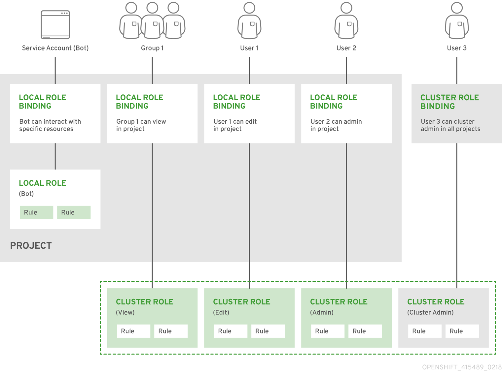

✔️ 사용자가 rbac-test-ns라는 새 프로젝트에서 애플리케이션을 배포하고 관리할 수 있도록 새 RBAC 설정하는 법

1. "rbac-test-ns" 프로젝트 생성

`$ oc new-project rbac-test-ns`

2. 애플리케이션 배포 및 관리에 필요한 Role을 부여하는 새로운 맞춤 Role 생성. 본 예시에서는 "app-mgr"이라는 role 생성

- `app-mgr-role.yaml` 작성

```
kind: Role
apiVersion: rbac.authorization.k8s.io/v1
metadata:
  name: app-mgr
  namespace: rbac-test-ns
rules:
- apiGroups: ["project.openshift.io"]
  resources: ["projects"]
  verbs: ["get"]
- apiGroups: [""]
  resources: ["pods", "services", "endpoints", "persistentvolumeclaims", "configmaps", "secrets"]
  verbs: ["get", "list", "watch", "create", "update", "patch", "delete"]
- apiGroups: ["apps"]
  resources: ["deployments", "replicasets", "statefulsets"]
  verbs: ["get", "list", "watch", "create", "update", "patch", "delete"]
```

- 생성한 yaml 파일 적용하여 custom role 생성 

`$ oc apply -f app-mgr-role.yaml`

3. custom role을 사용자에게 바인딩. 본 예시에서 사용자의 이름이 "johndoe"라고 가정

- `app-mgr-rolebinding.yaml` 작성

```
kind: RoleBinding
apiVersion: rbac.authorization.k8s.io/v1
metadata:
  name: app-mgr-binding
  namespace: rbac-test-ns
subjects:
- kind: User
  name: test
  apiGroup: rbac.authorization.k8s.io
roleRef:
  kind: Role
  name: app-mgr
  apiGroup: rbac.authorization.k8s.io
```

- yaml 파일 적용해 RoleBinding 생성 & 기존 role에 사용자 추가하는 대신 아래 명령줄 사용

```
$ oc adm policy add-role-to-user <role> <user> -n <project>

# For my example above, once I created the "app-mgr" role in the rbac-test-ns namespace I can run the following to create the roleBinding
oc adm policy add-role-to-user app-mgr test -n rbac-test-ns
```

- 아래 명령을 통해 누가 특정 리소스에 대해 작업을 수행할 수 있는지 확인 가능

```
oc adm policy who-can {verb} {resource}

# for example
oc adm policy who-can create pods -n rbac-test-ns

# below is the output (shortened) you can see my test user at the bottom
resourceaccessreviewresponse.authorization.openshift.io/<unknown> 

Namespace: rbac-test-ns
Verb:      create
Resource:  pods

Users:  system:admin
        system:serviceaccount:kube-system:daemon-set-controller
        system:serviceaccount:kube-system:job-controller
        .......
        system:serviceaccount:rbac-test-ns:deployer
        test
Groups: system:cluster-admins
        system:masters

```

✔️ 위 단계를 통해 "rbac-test-ns" 프로젝트에서 애플리케이션을 배포하고 관리하기 위해 사용자를 위한 새로운 RBAC 설정 성공

- 사용자는 "rbac-test-ns" 네임스페이스의 "app-mgr" role 범위 내에서 클러스터와 상호작용하여 배포를 생성하고, 서비스를 관리하고, 리소스를 구성할 수 있음

#### 📌 Red Hat OpenShift 4에서 Accounting이 작동하는 방식

✔️ Red Hat OpenShift의 Accounting의 주요 구성 요소

- Audit Policy : 기록해야하는 요청과 로그에 포함할 세부 정보 수준 결정. 각 유형의 리소스 및 작업에 대한 규칙을 지정하는 YAML 파일 사용하여 구성 가능

- Audit Backend : 감사 로그를 처리하고 저장하는 역할 담당. Red Hat OpenShift는 로그 백엔드와 웹훅 백엔드라는 두 가지 유형의 Audit Backend 지원. 로그 백엔드는 API 서버 노드의 파일에 로그를 기록하고, 웹훅 백엔드는 로그를 외부 HTTP(S) 엔드포인트로 전송

- Log Retention and Rotation : OpenShift는 로그가 과도한 디스크 공간을 소비하지 않도록 해당 메커니즘 제공. 최대 로그 파일 크기와 보관할 이전 로그 파일 수를 제어하도록 rotation 설정 구성 가능

✔️ 즉 OpenShift에서 감사 로깅을 활성화하고 구성하기 위해 관리자는 Audit Policy를 생성하고, Audit Backend를 구성하고, Log Retension과 Rotation 설정 지정 가능. 구성되면 로그를 사용하여 사용자의 활동을 모니터링하고, 보안문제를 식별하고, 규제 요구 사항을 준수할 수 있음

✔️ 서버로 들어오는 모든 요청을 캡쳐하므로 Audit log는 API 서버 수준에서 수행되며 기본적으로 Audit log는 각 제어 영역 노드에 저장됨

✔️ 각 Audit Log는 아래 필드 포함

- level: 이벤트가 생성된 audit level

- auditID: 각 요청에 대해 생성되는 고유한 audit Id

- stage: 이 이벤트 인스턴스가 생성되었을 때의 요청 처리 단계

- requestURI: requestURI는 클라이언트에서 서버로 전송

- verb: 요청과 연결된 Kubernetes 동사. 리소스가 아닌 요청의 경우 이는 소문자 HTTP 메소드

- user: 인증된 사용자 정보

- impersonatedUser: 선택사항. 요청이 다른 사용자를 사칭하는 경우 사칭된 사용자 정보

- sourceIPs: 선택사항. 요청이 시작된 소스 IP와 중간 프록스

- userAgent: 선택사항. userAgent 문자열은 클라이언트에 의해 보고되며 userAgent는 클라이언트에서 제공하므로 신뢰할 수 없음

- objectRef: 선택사항. 이 요청의 대상이 되는 개체 참조. 목록 유형 요청이나 리소스가 아닌 요청에는 적용되지 않음

- responseStatus: 선택사항. status 유형이 아닌 경우에도 응답 상태가 채워짐. 성공적인 응답의 경우 코드만 포함. 상태가 아닌 유형의 오류 응답의 경우 오류 메세지가 자동으로 채워짐

- requestObject: 선택사항. 요청의 API 개체는 JSON 형식. 버전 변환, 기본값 설정, 허용 또는 병합 전에 요청에 있는 그대로 기록됨. 리소스가 아닌 요청의 경우 생략되며 요청 수준 이상에서만 기록됨

- responseObject: 선택사항. API 개체는 JSON 형식으로 응답이 변환됨. 외부 유형으로 변환된 후 기록되며 JSON으로 직렬화됨. 리소스가 아닌 요청의 경우 생략되며 응답 수준에서만 기록됨

- requestReceivedTimestamp: 요청이 API 서버에 도달한 시간

- stageTimestamp: 요청이 현재 감사 단계에 도달한 시간

- annotation: 선택사항. 구조화되지 않은 key-value 맵은 인증, 승인 및 허용 플러그인을 포함하여 요청 제공 체인에서 호출되는 플러그인에 의해 설정될 수 있는 감사 이벤트와 함께 저장됨. 이 annotation은 감사 이벤트에 대한 것이며 제출된 metadata.annotations에 해당하지 않음

✔️ 공식 문서에 있는 Kubernetes API 서버의 출력 예시

`{"kind":"Event","apiVersion":"audit.k8s.io/v1","level":"Metadata","auditID":"ad209ce1-fec7-4130-8192-c4cc63f1d8cd","stage":"ResponseComplete","requestURI":"/api/v1/namespaces/openshift-kube-controller-manager/configmaps/cert-recovery-controller-lock?timeout=35s","verb":"update","user":{"username":"system:serviceaccount:openshift-kube-controller-manager:localhost-recovery-client","uid":"dd4997e3-d565-4e37-80f8-7fc122ccd785","groups":["system:serviceaccounts","system:serviceaccounts:openshift-kube-controller-manager","system:authenticated"]},"sourceIPs":["::1"],"userAgent":"cluster-kube-controller-manager-operator/v0.0.0 (linux/amd64) kubernetes/$Format","objectRef":{"resource":"configmaps","namespace":"openshift-kube-controller-manager","name":"cert-recovery-controller-lock","uid":"5c57190b-6993-425d-8101-8337e48c7548","apiVersion":"v1","resourceVersion":"574307"},"responseStatus":{"metadata":{},"code":200},"requestReceivedTimestamp":"2020-04-02T08:27:20.200962Z","stageTimestamp":"2020-04-02T08:27:20.206710Z","annotations":{"authorization.k8s.io/decision":"allow","authorization.k8s.io/reason":"RBAC: allowed by ClusterRoleBinding \"system:openshift:operator:kube-controller-manager-recovery\" of ClusterRole \"cluster-admin\" to ServiceAccount \"localhost-recovery-client/openshift-kube-controller-manager\""}}`

✔️ Audit log 확인 방법

1. 제어 영역 노드에서 사용 가능한 감사 로그 나열

```
$ oc adm node-logs --role=master --path=openshift-apiserver/

# Example output
90days-ocp-72ptq-master-0 audit-2023-03-18T13-32-30.141.log
90days-ocp-72ptq-master-0 audit-2023-03-20T18-52-05.290.log
90days-ocp-72ptq-master-0 audit-2023-03-22T23-59-32.898.log
90days-ocp-72ptq-master-0 audit-2023-03-25T05-18-17.982.log
90days-ocp-72ptq-master-0 audit-2023-03-27T10-18-07.255.log
90days-ocp-72ptq-master-0 audit-2023-03-29T15-39-12.983.log
90days-ocp-72ptq-master-0 audit.log
90days-ocp-72ptq-master-1 audit-2023-03-18T13-40-29.849.log
90days-ocp-72ptq-master-1 audit-2023-03-20T18-48-37.329.log
90days-ocp-72ptq-master-1 audit-2023-03-23T00-03-57.031.log
90days-ocp-72ptq-master-1 audit-2023-03-25T05-14-28.573.log
90days-ocp-72ptq-master-1 audit-2023-03-27T10-25-27.601.log
90days-ocp-72ptq-master-1 audit-2023-03-29T15-34-14.462.log
90days-ocp-72ptq-master-1 audit.log
90days-ocp-72ptq-master-2 audit-2023-03-18T13-15-35.530.log
90days-ocp-72ptq-master-2 audit-2023-03-20T18-22-40.880.log
90days-ocp-72ptq-master-2 audit-2023-03-22T23-18-33.055.log
90days-ocp-72ptq-master-2 audit-2023-03-25T04-18-56.637.log
90days-ocp-72ptq-master-2 audit-2023-03-27T09-44-50.243.log
90days-ocp-72ptq-master-2 audit-2023-03-29T14-39-01.789.log
90days-ocp-72ptq-master-2 audit.log
```

2. 특정 감사 로그 확인

```
$ oc adm node-logs <node_name> --path=openshift-apiserver/<log_name>

# Example command
$ oc adm node-logs 90days-ocp-72ptq-master-2 --path=openshift-apiserver/audit-2023-03-29T14-39-01.789.log
```

- 예제 출력
```
{"kind":"Event","apiVersion":"audit.k8s.io/v1","level":"Metadata","auditID":"5d08341a-8fa2-4fab-8e4a-4fb1c01d2d6e","stage":"ResponseStarted","requestURI":"/apis/template.openshift.io/v1/namespaces/openshift/templates?allowWatchBookmarks=true\u0026resourceVersion=9537849\u0026timeout=5m44s\u0026timeoutSeconds=344\u0026watch=true","verb":"watch","user":{"username":"system:serviceaccount:openshift-cluster-samples-operator:cluster-samples-operator","groups":["system:serviceaccounts","system:serviceaccounts:openshift-cluster-samples-operator","system:authenticated"],"extra":{"authentication.kubernetes.io/pod-name":["cluster-samples-operator-7f8d575897-s7566"],"authentication.kubernetes.io/pod-uid":["8a96caaf-1de9-4cef-915f-ace02c764e52"]}},"sourceIPs":["192.168.200.181","10.130.0.2"],"userAgent":"cluster-samples-operator/v0.0.0 (linux/amd64) kubernetes/$Format","objectRef":{"resource":"templates","namespace":"openshift","apiGroup":"template.openshift.io","apiVersion":"v1"},"responseStatus":{"metadata":{},"code":200},"requestReceivedTimestamp":"2023-03-27T09:44:50.239076Z","stageTimestamp":"2023-03-27T09:44:50.242747Z","annotations":{"authorization.k8s.io/decision":"allow","authorization.k8s.io/reason":"RBAC: allowed by RoleBinding \"shared-resource-viewers/openshift\" of Role \"shared-resource-viewer\" to Group \"system:authenticated\""}}
{"kind":"Event","apiVersion":"audit.k8s.io/v1","level":"Metadata","auditID":"e65876d9-6fca-422c-93a9-110921648d1b","stage":"ResponseComplete","requestURI":"/metrics","verb":"get","user":{"username":"system:serviceaccount:openshift-monitoring:prometheus-k8s","groups":["system:authenticated"]},"sourceIPs":["10.129.2.13"],"userAgent":"Prometheus/2.39.1","responseStatus":{"metadata":{},"code":200},"requestReceivedTimestamp":"2023-03-27T09:44:51.044096Z","stageTimestamp":"2023-03-27T09:44:51.065007Z","annotations":{"authorization.k8s.io/decision":"allow","authorization.k8s.io/reason":"RBAC: allowed by ClusterRoleBinding \"prometheus-k8s\" of ClusterRole \"prometheus-k8s\" to ServiceAccount \"prometheus-k8s/openshift-monitoring\""}}
```

- 사용자 상호 작용을 캡쳐하는 OpenShift OAuth API 서버 감사 로그 존재

  - 제어 영역 노드의 관련 로그 나열

```
oc adm node-logs --role=master --path=oauth-apiserver/

# Example output
90days-ocp-72ptq-master-0 audit-2023-03-22T20-22-19.424.log
90days-ocp-72ptq-master-0 audit-2023-03-29T08-44-53.926.log
90days-ocp-72ptq-master-0 audit.log
90days-ocp-72ptq-master-1 audit-2023-03-22T20-34-32.796.log
90days-ocp-72ptq-master-1 audit-2023-03-29T08-41-39.406.log
90days-ocp-72ptq-master-1 audit.log
90days-ocp-72ptq-master-2 audit-2023-03-22T20-08-20.762.log
90days-ocp-72ptq-master-2 audit-2023-03-29T08-10-51.942.log
90days-ocp-72ptq-master-2 audit.log
```

  - 특정 OAuth API 서버 로그 보기

```
$ oc adm node-logs <node_name> --path=oauth-apiserver/<log_name>

# Example command
$ oc adm node-logs 90days-ocp-72ptq-master-2 --path=oauth-apiserver/audit-2023-03-29T08-10-51.942.log
```

  - 예제 출력
```
{"kind":"Event","apiVersion":"audit.k8s.io/v1","level":"Metadata","auditID":"6472c130-436a-4454-9bf9-77b6066d8ce2","stage":"ResponseComplete","requestURI":"/apis/oauth.openshift.io/v1/oauthclients/console","verb":"get","user":{"username":"system:serviceaccount:openshift-console-operator:console-operator","groups":["system:serviceaccounts","system:serviceaccounts:openshift-console-operator","system:authenticated"],"extra":{"authentication.kubernetes.io/pod-name":["console-operator-7cc8457b5b-rpz7f"],"authentication.kubernetes.io/pod-uid":["4b73b593-9cde-4ae4-a8f7-00e7f7ee7902"]}},"sourceIPs":["192.168.200.181","10.129.0.2"],"userAgent":"console/v0.0.0 (linux/amd64) kubernetes/$Format","objectRef":{"resource":"oauthclients","name":"console","apiGroup":"oauth.openshift.io","apiVersion":"v1"},"responseStatus":{"metadata":{},"code":200},"requestReceivedTimestamp":"2023-03-22T23:35:00.970020Z","stageTimestamp":"2023-03-22T23:35:00.972703Z","annotations":{"authorization.k8s.io/decision":"allow","authorization.k8s.io/reason":"RBAC: allowed by ClusterRoleBinding \"console-operator\" of ClusterRole \"console-operator\" to ServiceAccount \"console-operator/openshift-console-operator\""}}
{"kind":"Event","apiVersion":"audit.k8s.io/v1","level":"Metadata","auditID":"db3d3280-fcb9-4368-b7db-17b97bcb9826","stage":"ResponseComplete","requestURI":"/apis/oauth.openshift.io/v1/oauthclients/console","verb":"get","user":{"username":"system:serviceaccount:openshift-console-operator:console-operator","groups":["system:serviceaccounts","system:serviceaccounts:openshift-console-operator","system:authenticated"],"extra":{"authentication.kubernetes.io/pod-name":["console-operator-7cc8457b5b-rpz7f"],"authentication.kubernetes.io/pod-uid":["4b73b593-9cde-4ae4-a8f7-00e7f7ee7902"]}},"sourceIPs":["192.168.200.181","10.129.0.2"],"userAgent":"console/v0.0.0 (linux/amd64) kubernetes/$Format","objectRef":{"resource":"oauthclients","name":"console","apiGroup":"oauth.openshift.io","apiVersion":"v1"},"responseStatus":{"metadata":{},"code":200},"requestReceivedTimestamp":"2023-03-22T23:35:00.976516Z","stageTimestamp":"2023-03-22T23:35:00.980651Z","annotations":{"authorization.k8s.io/decision":"allow","authorization.k8s.io/reason":"RBAC: allowed by ClusterRoleBinding \"console-operator\" of ClusterRole \"console-operator\" to ServiceAccount \"console-operator/openshift-console-operator\""}}
{"kind":"Event","apiVersion":"audit.k8s.io/v1","level":"Metadata","auditID":"b5a99a12-637a-4bb2-b733-1f3812ca76fe","stage":"ResponseComplete","requestURI":"/openapi/v2","verb":"get","user":{"username":"system:aggregator","groups":["system:authenticated"]},"sourceIPs":["10.128.0.2"],"responseStatus":{"metadata":{},"code":304},"requestReceivedTimestamp":"2023-03-22T23:35:21.077019Z","stageTimestamp":"2023-03-22T23:35:21.085460Z","annotations":{"authorization.k8s.io/decision":"allow","authorization.k8s.io/reason":"RBAC: allowed by ClusterRoleBinding \"cluster-status-binding\" of ClusterRole \"cluster-status\" to Group \"system:authenticated\""}}
```

- OAuth 서버 감사로그

  - 제어영역노드에서 사용가능한 로그 나열
```
oc adm node-logs --role=master --path=oauth-server/

# Example output
90days-ocp-72ptq-master-0 audit.log
90days-ocp-72ptq-master-1 audit.log
90days-ocp-72ptq-master-2 audit.log
```

  - 특정 로그 보기
```
$ oc adm node-logs <node_name> --path=oauth-server/<log_name>

# Example command
$ oc adm node-logs 90days-ocp-72ptq-master-2 --path=oauth-server/audit.log
```

  - 예제 출력
```
{"kind":"Event","apiVersion":"audit.k8s.io/v1","level":"Metadata","auditID":"0ae79d4b-a44e-4f16-aadf-a600f42a63d0","stage":"RequestReceived","requestURI":"/","verb":"head","user":{"username":"system:anonymous","groups":["system:unauthenticated"]},"sourceIPs":["10.131.0.2"],"userAgent":"Go-http-client/1.1","requestReceivedTimestamp":"2023-03-30T14:13:04.446550Z","stageTimestamp":"2023-03-30T14:13:04.446550Z"}
{"kind":"Event","apiVersion":"audit.k8s.io/v1","level":"Metadata","auditID":"0ae79d4b-a44e-4f16-aadf-a600f42a63d0","stage":"ResponseComplete","requestURI":"/","verb":"head","user":{"username":"system:anonymous","groups":["system:unauthenticated"]},"sourceIPs":["10.131.0.2"],"userAgent":"Go-http-client/1.1","responseStatus":{"metadata":{},"status":"Failure","message":"forbidden: User \"system:anonymous\" cannot head path \"/\"","reason":"Forbidden","details":{},"code":403},"requestReceivedTimestamp":"2023-03-30T14:13:04.446550Z","stageTimestamp":"2023-03-30T14:13:04.456751Z","annotations":{"authorization.k8s.io/decision":"forbid","authorization.k8s.io/reason":""}}
{"kind":"Event","apiVersion":"audit.k8s.io/v1","level":"Metadata","auditID":"a151df17-578c-415f-a83e-64753a0d16dc","stage":"RequestReceived","requestURI":"/oauth/authorize?client_id=openshift-challenging-client\u0026code_challenge=L56_-VuTMU7qF36WuKxF6mnA2nj_oEEETPsAdQ-w24I\u0026code_challenge_method=S256\u0026redirect_uri=https%3A%2F%2Foauth-openshift.apps.90days-ocp.simon.local%2Foauth%2Ftoken%2Fimplicit\u0026response_type=code","verb":"get","user":{"username":"system:anonymous","groups":["system:unauthenticated"]},"sourceIPs":["10.131.0.2"],"userAgent":"Go-http-client/1.1","requestReceivedTimestamp":"2023-03-30T14:13:04.489643Z","stageTimestamp":"2023-03-30T14:13:04.489643Z"}
```

### Day 62 : Compliance and Vulnerability Scanning provided by Red Hat OpenShift Operators

⚡️ 본 세션에서는 Red Hat OpenShift 내부의 두 가지 보안 영역인 `Compliance`와 `Vulnerability Scanning`에 대해 이야기 할 것

#### 📌 Compliance (규정 준수)

✔️ Kubernetes의 맥락에서의 compliance는 OpenShift 배포가 다양한 산업 표준, 규정 및 모범 사례를 준수하는 것을 의미. 의료,금융,정부 부문 등 규제 대상 산업에 종사하는 조직뿐 아니라 개인 정보 보호를 우선시하는 조직에게도 필수적

✔️ Kubernetes 기반 컨테이너 오케스트레이션 플랫폼인 OpenShift는 조직이 Compliance를 달성하고 유지하는데 도움이 되는 여러 기능과 도구 제공

- Security and access control(보안 및 액세스 제어): RBAC, 네트워크 정책, SCC(보안 컨텍스트 제약 조건)와 같은 강력한 보안 기능을 제공하여 클러스터 리소스에 대한 액세스를 관리하고 애플리케이션의 안전한 배포 및 운영 보장

- Auditing and monitoring(감사 및 모니터링): OpenShift에 내장된 감사 및 모니터링 기능을 사용하면 사용자 활동, 리소스 사용량 및 시스템 이벤트를 쉽게 추적할 수 있음. 이 정보로 보안 사고를 감지 및 대응하고, 규제 요구 사항을 충족하고, 문제를 해결

- Image and container security(이미지 및 컨테이너 보안): OpenShift 의 통합 컨테이너 레지스트리, 이미지 서명 및 이미지 스캐닝 기능은 컨테이너 이미지의 무결성과 보안을 보장하는데 도움이 됨. OpenShift는 리소스 제약 조건 및 pod 보안 정책을 통해 보안 모범 사례를 시행

- Encrypted communication(암호화된 통신): 클러스터 구성 요소 간은 물론 클러스터와 외부 클라이언트 간 보안 통신을 위해 TLS/SSL 지원. 이는 전송 중인 민감한 데이터를 보호하는데 도움이 됨

- Compliance Operator(규정 준수 운영자): 조직이 규정 준수 정책을 평가하고 시행하는데 도움이 되는 OpenShift 네이티브 도구를 규정 준수 운영자에게 제공. 규정 준수 운영자는 OpenSCAP 프레임워크를 활용하며 NIST, PCI-DSS, HIPAA 또는 GDPR과 같은 특정 규제 요구 사항이나 보안 표준을 충족하도록 구성할 수 있음

✔️ 위의 기능을 통해 조직은 애플리케이션 및 워크로드에 대해 안전하고 규정을 준수하는 에코시스템을 구축하여 최적의 성능과 업계 표준 준수를 보장할 수 있는 기회를 갖게 됨

✔️ 이 세션에서는 플랫폼 관리자가 클러스터에 대해 원하는 규정 준수 상태를 정의할 수 있도록 지원하는 `Compliance Operator(규정 준수 운영자)`에 중점을 둘 것. 이는 현재 상태와 목표 상태 간의 불일치에 대한 포괄적인 개요와 이러한 격차를 효과적으로 해결하기 위한 실행 가능한 통찰력 제공

✔️ `Compliance Operator`는 클러스터의 필수 규정 준수 상태를 설명하고 격차 개요와 이를 해결하는 방법을 보고하는 기능 제공. 규정 준수 운영자는 container platform의 Kubernetes API 리소스와 클러스터를 실행하는 노드의 규정 준수를 평가하고 NIST 인증 도구인 OpenSCAP를 사용하여 콘텐츠에서 제공하는 보안 정책을 검사하고 시행

✔️ Compliance Operator 설치

1. 특별히 관리되는 OpenShift 네임스페이스 생성. `openshift-compliance-namespace.yaml`을 생성하고 `oc apply -f openshift-compliance-namespace.yaml` 적용

```
apiVersion: v1
kind: Namespace
metadata:
  labels:
    openshift.io/cluster-monitoring: "true"
    pod-security.kubernetes.io/enforce: privileged 
  name: openshift-compliance
```

2. OperatorGroup 정의. `openshift-compliance-operator-group.yaml` 생성 후 `oc apply -f openshift-compliance-operator-group.yaml` 적용

```
apiVersion: operators.coreos.com/v1
kind: OperatorGroup
metadata:
  name: compliance-operator
  namespace: openshift-compliance
spec:
  targetNamespaces:
  - openshift-compliance
```

3. Operator에 대한 subscription 정의. `openshift-compliance-operator-subscription.yaml` 생성 후 `oc apply -f openshift-compliance-operator-subscription.yaml` 적용

```
apiVersion: operators.coreos.com/v1alpha1
kind: Subscription
metadata:
  name: compliance-operator-sub
  namespace: openshift-compliance
spec:
  channel: "release-0.1"
  installPlanApproval: Automatic
  name: compliance-operator
  source: redhat-operators
  sourceNamespace: openshift-marketplace
```

4. 아래 명령을 통해 Operator 설치 확인

```
$ oc get csv -n openshift-compliance
$ oc get deploy -n openshift-compliance
```

✔️ 프로필 및 규칙 검토

- `$ oc get -n openshift-compliance profiles.compliance` : 설치된 프로필 조회

- `$ oc get -n openshift-compliance -oyaml profiles.compliance ocp4-cis` : 프로필의 세부 정보 조회

- `$ oc get -n openshift-compliance rules ocp4-api-server-anonymous-auth -oyaml` : 정책을 구성하는 규칙 중 하나에 대한 설명 조회

✔️ 스캔 실행

- Operator가 설치되었으므로 두 가지 주요 구성 존재

  - ScanSettings: scansettings API에 대한 스키마로, 데이터를 저장하는 위치, 스캔을 수행하기 위해 플랫폼에서 실행되는 컨테이너에 대한 구성, 어떤 구성 요소가 적용되는지 등 스캔 실행을 위한 구성 제공. 검사하고 검사 실행 예약

  - ScanSettingsBinding: scansettingsbinding API에 대한 스키마. 선택한 구성 요소에 대해 실행하려는 규정 준수 프로필에 ScanSettings 구성을 바인딩하는데 사용됨

- 시스템에 대해 실행할 수 있는 규정 준수 연산자를 설치할 때 제공되는 기본 ScanSettings인 `default 존재` => `$ oc describe scansettings default -n openshift-compliance`로 확인 가능

- 위와 동일한 전제를 따르지만 스캔의 일부로 찾은 결과를 자동으로 해결하는 두 번째 ScanSettings인 `default-auto-apply` 제공

- CIS 벤치마크 프로필에 대한 ScanSettingsBindin 생성.

  - `compliance-scansettingbinding.yaml` 생성

```
apiVersion: compliance.openshift.io/v1alpha1
kind: ScanSettingBinding
metadata:
  name: cis-compliance
  namespace: openshift-compliance
profiles:
  - name: ocp4-cis-node
    kind: Profile
    apiGroup: compliance.openshift.io/v1alpha1
  - name: ocp4-cis
    kind: Profile
    apiGroup: compliance.openshift.io/v1alpha1
settingsRef:
  name: default
  kind: ScanSetting
  apiGroup: compliance.openshift.io/v1alpha1
```

- 규정 준수 평가 프로세스를 간소화하기 위해 해당 ComplianceScan 개체와 함께 ComplianceSuite 개체 생성

`$ oc get compliancescan -n openshift-compliance`

- 스캔은 스캔 단계를 통해 작동하고 DONE 상태가 되면 완료. 결과가 NON-COMPLIANT로 나타나며 스캔 결과를 검토하고 필요한 수정 사항을 적용하여 클러스터가 프로필을 준수하도록 할 수 있음 

`$ oc get compliancescan -n openshift-compliance`

- 전체 결과를 볼 수 있도록 첨부된 라벨을 캡처라혀고 하므로 첫번째 스캔을 더 자세히 살핌

`$ oc get compliancescan -n openshift-compliance ocp4-cis -o yaml`

- 아래 명령어를 통해 실패한 결과 나열

`$ oc get compliancecheckresults -n openshift-compliance -l 'compliance.openshift.io/check-status=FAIL'`

- 더 자세히 볼 수 있음

` oc get compliancecheckresults -n openshift-compliance ocp4-cis-audit-log-forwarding-enabled  -o yaml`

#### 📌 Red Hat Quay 컨테이너 보안 운영자

✔️ 취약점 스캔

- 오래된 소프트웨어 패키지, 잘못된 구성 또는 노출된 민감한 정보와 같은 알려진 보안 문제가 있는지 컨테이너 이미지를 검사하는 프로세스

- 취약점 스캐닝의 목표는 컨테이너 이미지가 Openshift 클러스터에 배포되기 전에 컨테이너 이미지의 잠재적인 보안 위험을 식별하고 해결하여 플랫폼의 전반적인 보안 상태를 강화하는 것

- OpenShift가 취약점 검색을 용이하게 하기위해 제공하는 기능과 도구

  - Intefrated container registry: 컨테이너 이미지를 저장하고 관리하기 위한 내장 컨테이너 레지스트리. 통합 레지스트리를 사용하면 이미지에서 취약점을 검색할 때 외부 레지스트리에 의존할 필요가 없으므로 보다 효율적이고 안전한 프로세스 가능

  - ImageStreams: 일반적으로 동일한 애플리케이션의 서로 다른 버전인 일련의 관련 컨테이너 이미지를 나타내는 추상화. 컨테이너 이미지를 추적하고 배포하는 과정을 단순화하여 여러 버전의 애플리케이션에 걸쳐 취약점 검색 및 해결을 더 쉽게 적용할 수 있도록 함

  - Image signing and trust: 신뢰할 수 있고 검증된 이미지만 클러스터에 배포할 수 있도록 하여 알려진 취약점이 있는 이미지의 배포를 방지하는데 도움이 됨

  - Third-party integrations: 외부 취약성 검색 도구 및 플랫폼과 쉽게 통합될 수 있음. 레지스트리에 저장된 컨테이너 이미지를 자동으로 스캔하고 식별된 취약점 및 제안된 수정 단계에 대한 자세한 보고서를 제공하도록 구성 가능

  - OpenShift Operators: 애플리케이션과 해당 구성 요소를 관리하는 자동화된 소프트웨어 확장인 Operator 지원. 클러스터 내에서 취약점 검색 도구를 배포 및 관리하는데 사용될 수 있으며 일관되고 자동화된 검색 프로세스 보장. Red Hat 자체 스캐너인 `Red Hat Quay Container Security Operator` 뿐 아니라 타사 스캐너를 구현할 수도 있음

- `Red Hat Quay Container Security Operator`

  - 전체 또는 지정된 네임스페이스의 Pod와 연결된 컨테이너 감시

  - 이미지의 레지스트리에서 이미지 스캐닝을 실행하는 경우 컨테이너가 가져온 컨테이너 레지스트리에서 취약성 정보를 쿼리

  - Kubernetes API의 ImageManifestVuln 개체를 통해 취약점 노출

✔️ Red Hat Quay Container Security Operator를 통해 취약점 조회

- 발견된 모든 취약점 조회

```
oc get vuln --all-namespaces
NAMESPACE                                          NAME                                                                      AGE
openshift-apiserver-operator                       sha256.01974e4c0e0d112e09bee8fe2625d565d3d62fa42013b38d7ce43d2d40f6057a   20h
openshift-apiserver                                sha256.13640b919950fc648219c528ee7ed30262bae856566fbd6c4cb5e15ffd457d6f   20h
openshift-apiserver                                sha256.8829aefa24dd606d2fe3ff86b97858c07acedae5f5eb3f044c20395762e7c02b   20h
openshift-authentication-operator                  sha256.31b617cec5c22e187cc22da606fc6998ea3529b1b6e8d80d1799c3dc9705997e   20h
openshift-authentication                           sha256.41e06255fc823c0082a74466b69ccfb672947b7075ea43a10e729c5f39314d00   20h
openshift-cloud-controller-manager-operator        sha256.a7856b6371fc4a7ade8a678daca149db6c6a55ee7137d9e308721d2d3bebf364   20h
openshift-cloud-credential-operator                sha256.1986315effe0f3ee415e86df3a87765268ed1da405c7a297c278e1d7030286a4   20h
...
openshift-vsphere-infra                            sha256.ddf81e535cf7a6b2775f3db690ec1e6eaa1c7427a0f9b98ce120d8ad06520440   20h
test-app                                           sha256.196ae9a1a33a2d32046a46739779ca273667f1d4f231f8a721e8064c3509405e   20h
```

- 특정 취약점의 세부 정보 검사

```
oc describe vuln -n {namespace} {sha ID of vuln}

# Example

oc describe vuln -n openshift-apiserver-operator sha256.01974e4c0e0d112e09bee8fe2625d565d3d62fa42013b38d7ce43d2d40f6057a
```

- 예제 출력

```
Name:         sha256.01974e4c0e0d112e09bee8fe2625d565d3d62fa42013b38d7ce43d2d40f6057a
Namespace:    openshift-apiserver-operator
Labels:       openshift-apiserver-operator/openshift-apiserver-operator-7bd84bd596-pgpct=true
Annotations:  <none>
API Version:  secscan.quay.redhat.com/v1alpha1
Kind:         ImageManifestVuln
Metadata:
  Creation Timestamp:  2023-03-30T19:01:40Z
  Generation:          17
  Resource Version:  13206497
  UID:               dbec02e5-e4c6-412f-b561-757237844d43
Spec:
  Features:
    Name:     pip
    Version:  9.0.3
    Vulnerabilities:
      Description:     Pip 21.1 updates its dependency 'urllib3' to v1.26.4 due to security issues.
      Metadata:        {"UpdatedBy": "pyupio", "RepoName": "pypi", "RepoLink": "https://pypi.org/simple", "DistroName": "", "DistroVersion": "", "NVD": {"CVSSv3": {"Vectors": "CVSS:3.1/AV:N/AC:L/PR:N/UI:N/S:U/C:L/I:L/A:N", "Score": 6.5}}}
      Name:            pyup.io-40291 (CVE-2021-28363)
      Namespace Name:  pyupio
      Severity:        Medium
      Description:     A flaw was found in python-pip in the way it handled Unicode separators in git references. A remote attacker could possibly use this issue to install a different revision on a repository. The highest threat from this vulnerability is to data integrity. This is fixed in python-pip version 21.1.
      Metadata:        {"UpdatedBy": "pyupio", "RepoName": "pypi", "RepoLink": "https://pypi.org/simple", "DistroName": "", "DistroVersion": "", "NVD": {"CVSSv3": {"Vectors": "CVSS:3.1/AV:N/AC:L/PR:L/UI:R/S:U/C:N/I:H/A:N", "Score": 5.7}}}
      Name:            pyup.io-42559 (CVE-2021-3572)
      Namespace Name:  pyupio
      Severity:        Medium
      Description:     Pip before 19.2 allows Directory Traversal when a URL is given in an install command, because a Content-Disposition header can have ../ in a filename, as demonstrated by overwriting the /root/.ssh/authorized_keys file. This occurs in _download_http_url in _internal/download.py.
      Metadata:        {"UpdatedBy": "pyupio", "RepoName": "pypi", "RepoLink": "https://pypi.org/simple", "DistroName": "", "DistroVersion": "", "NVD": {"CVSSv3": {"Vectors": "CVSS:3.1/AV:N/AC:L/PR:N/UI:N/S:U/C:N/I:H/A:N", "Score": 7.5}}}
      Name:            pyup.io-38765 (CVE-2019-20916)
      Namespace Name:  pyupio
      Severity:        High
    Name:              openssl-libs
    Version:           1:1.1.1k-7.el8_6
    Vulnerabilities:
      Description:  OpenSSL is a toolkit that implements the Secure Sockets Layer (SSL) and Transport Layer Security (TLS) protocols, as well as a full-strength general-purpose cryptography library.

Security Fix(es):

* openssl: X.400 address type confusion in X.509 GeneralName (CVE-2023-0286)

For more details about the security issue(s), including the impact, a CVSS score, acknowledgments, and other related information, refer to the CVE page(s) listed in the References section.
      Fixedby:         1:1.1.1k-8.el8_6
      Link:            https://access.redhat.com/errata/RHSA-2023:1441 https://access.redhat.com/security/cve/CVE-2023-0286
      Metadata:        {"UpdatedBy": "RHEL8-rhel-8.6-eus", "RepoName": "cpe:/o:redhat:rhel_eus:8.6::baseos", "RepoLink": null, "DistroName": "Red Hat Enterprise Linux Server", "DistroVersion": "8", "NVD": {"CVSSv3": {"Vectors": "CVSS:3.1/AV:N/AC:H/PR:N/UI:N/S:U/C:H/I:N/A:H", "Score": 7.4}}}
      Name:            RHSA-2023:1441: openssl security update (Important)
      Namespace Name:  RHEL8-rhel-8.6-eus
      Severity:        High
    Name:              urllib3
    Version:           1.24.2
    Vulnerabilities:
      Description:     Urllib3 1.26.5 includes a fix for CVE-2021-33503: When provided with a URL containing many @ characters in the authority component, the authority regular expression exhibits catastrophic backtracking, causing a denial of service if a URL were passed as a parameter or redirected to via an HTTP redirect.
      Metadata:        {"UpdatedBy": "pyupio", "RepoName": "pypi", "RepoLink": "https://pypi.org/simple", "DistroName": "", "DistroVersion": "", "NVD": {"CVSSv3": {"Vectors": "CVSS:3.1/AV:N/AC:L/PR:N/UI:N/S:U/C:N/I:N/A:H", "Score": 7.5}}}
      Name:            pyup.io-43975 (CVE-2021-33503)
      Namespace Name:  pyupio
      Severity:        High
      Description:     urllib3 before 1.25.9 allows CRLF injection if the attacker controls the HTTP request method, as demonstrated by inserting CR and LF control characters in the first argument of putrequest(). NOTE: this is similar to CVE-2020-26116.
      Metadata:        {"UpdatedBy": "pyupio", "RepoName": "pypi", "RepoLink": "https://pypi.org/simple", "DistroName": "", "DistroVersion": "", "NVD": {"CVSSv3": {"Vectors": "CVSS:3.1/AV:N/AC:L/PR:N/UI:N/S:C/C:L/I:L/A:N", "Score": 7.2}}}
      Name:            pyup.io-38834 (CVE-2020-26137)
      Namespace Name:  pyupio
      Severity:        High
    Name:              setuptools
    Version:           39.2.0
    Vulnerabilities:
      Description:     Python Packaging Authority (PyPA) setuptools before 65.5.1 allows remote attackers to cause a denial of service via HTML in a crafted package or custom PackageIndex page. There is a Regular Expression Denial of Service (ReDoS) in package_index.py.
      Metadata:        {"UpdatedBy": "pyupio", "RepoName": "pypi", "RepoLink": "https://pypi.org/simple", "DistroName": "", "DistroVersion": "", "NVD": {"CVSSv3": {"Vectors": "CVSS:3.1/AV:N/AC:H/PR:N/UI:N/S:U/C:N/I:N/A:H", "Score": 5.9}}}
      Name:            pyup.io-52495 (CVE-2022-40897)
      Namespace Name:  pyupio
      Severity:        Medium
  Image:               quay.io/openshift-release-dev/ocp-v4.0-art-dev@sha256
  Manifest:            sha256:01974e4c0e0d112e09bee8fe2625d565d3d62fa42013b38d7ce43d2d40f6057a
Status:
  Affected Pods:
    openshift-apiserver-operator/openshift-apiserver-operator-7bd84bd596-pgpct:
      cri-o://dd4fcb700a95c041d19bf7829d3e07516ccf2a36522027f920d76ed0aa57f84c
  Fixable Count:     1
  High Count:        4
  Highest Severity:  High
  Last Update:       2023-03-31 15:31:32.853602342 +0000 UTC
  Medium Count:      3
Events:              <none>
```