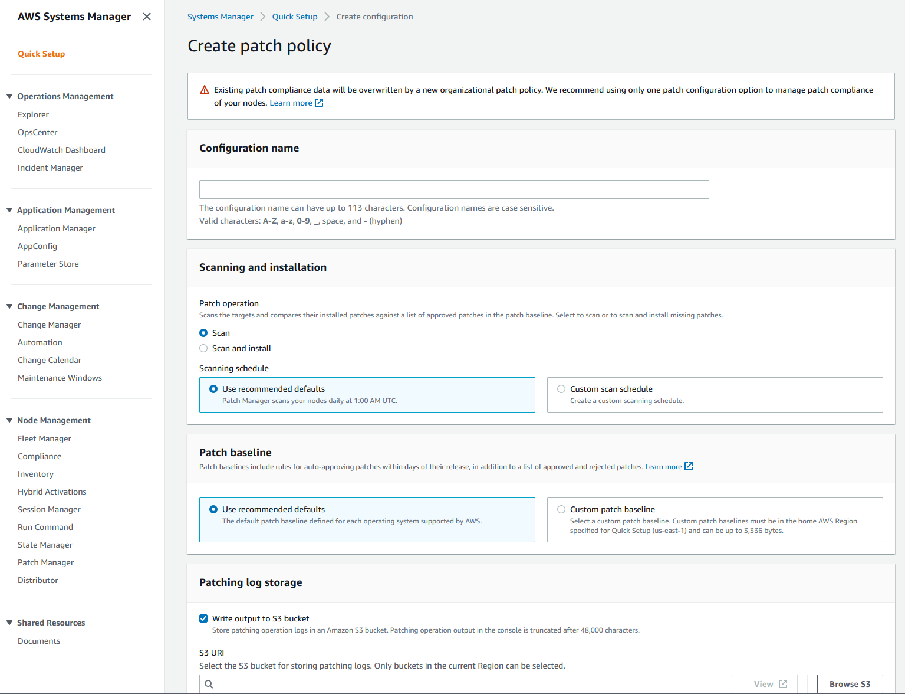

## AWS

### Day 49 : AWS Cloud Overview

#### 📌 AWS

✔️ AWS 클라우드(AWS Cloud)는 아마존 웹 서비스(AWS)가 제공하는 클라우드 컴퓨팅 플랫폼으로 컴퓨팅, 스토리지, 네트워킹, 데이터베이스, 분석, 머신러닝, 보안 등 광범위한 서비스 제공

✔️ AWS 클라우드를 사용하면 기업은 사용한만큼 비용을 지불하고, 필요에 따라 리소스를 확장하거나 축소할 수 있음

#### 📌 Flexibility

✔️ AWS 클라우드의 주요 이점으로 요구 사항에 가장 적합한 서비스를 선택하고 사용한만큼 비용 지불

⭐️ 인프라에 막대한 초기 투자 없이도 필요한 리소스에 액세스할 수 있도록 하기에 이상적

#### 📌 Security

✔️ 데이터와 리소스를 보호하기 위한 다양한 보호 조치를 갖춤

- 암호화, 자격 증명 및 액세스 관리, 네트워크 보안

✔️ 데이터가 안전하고 관련 규정을 준수하도록 보장하기 위해 다양한 규정 준수 프로그램 마련

- HIPAA, PCI DSS 및 GDPR

#### 📌 EC2 (Amazon Elastic Compute Cloud)

✔️ 클라우드에서 가상 서버를 쉽게 시작하고 관리할 수 있으므로 필요에 따라 리소스를 쉽게 확장하거나 축소할 수 있음

✔️ 다양한 인스턴스 유형과 크기 중 선택할 수 있으며 사용한 리소스에 대해서만 비용 지불

#### 📌 S3 (Amazon Simple Storage Service)

✔️ 인터넷 어디에서나 대량의 데이터를 저장하고 검색할 수 있는 객체 스토리지 서비스

✔️ 확장성과 내구성, 보안이 뛰어나 클라우드에서 데이터를 저장하고 관리하는데 이상적인 솔루션이 됨

#### 📌 Database

✔️ 아래 서비스를 사용하면 인프라나 확장에 대해 걱정할 필요 없이 클라우드에서 복잡한 애플리케이션을 쉽게 구축하고 관리할 수 있음

- 데이터베이스 관리를 위한 `RDS` (Amazon Relational Database Service)

- 데이터 웨어하우징 및 분석을 위한 `Amazon Redshift`

- 검색 및 분석을 위한 `Amazon Elasticsearch Service`

⭐️ 전반적으로 AWS 클라우드는 광범위한 서비스와 도구를 제공하는 강력하고 유연한 클라우드 컴퓨팅 플랫폼

### Day 50 : Get a Free Tier Account & Enable Billing Alarms

#### 📌 프리티어 계정 가입

✔️ 1. AWS 웹사이트로 이동

- 아래의 AWS 웹사이트에 액세스 후 "AWS 계정 생성" 클릭

<https://aws.amazon.com/ko/>

✔️ 2. AWS 계정 생성

- 계정이 있는 경우 로그인, 없는 경우 회원가입

✔️ 3. 계정 정보 제공

- 비밀번호, 이름, 회사명, 전화번호 등 정보 입력 후 "Continue" 클릭

✔️ 4. 결제 정보 제공

- Pre tier 계정에 가입하려면 결제 정보 제공해야함 => 신원 확인 및 사기 방지를 위함으로 Pre Tier 기간동안 요금 부과 X

✔️ 5. 지원 수준 선택

- 필요에 따라 선택하지만, 무료 프리티어를 원하는 경우 Basic support 선택

### Day 52 : Identity and Access Management (IAM)

⚡️ AWS의 데이터와 리소스 보안 관리를 위한 가장 중요한 도구 중 하나가 IAM

#### 📌 AWS IAM

✔️ `사용자와 AWS 리소스에 대한 액세스를 관리`할 수 있는 웹서비스

- IAM을 사용하면 `리소스에 액세스할 수 있는 사람`, `수행할 수 있는 작업`, `액세스할 리소스` 제어 가능

✔️ 세분화된 액세스 제어를 제공하여, 세부적인 수준에서 특정 리소스에 대한 권한을 부여하거나 거부할 수 있음

✔️ 리소스 보호에 필수적인 도구

- 없을 경우 AWS 계정에 액세스할 수 있는 사람은 누구나 모든 리소스에 무제한으로 액세스 가능

✔️ IAM을 사용하면 여러 AWS 계정을 생성 및 관리 가능

- 대규모 조직이 항상 서로 일정 수준의 상호작용이 필요한 많은 계정을 보유하기에 필수적

#### 📌 IAM 시작

✔️ 1. AWS 계정 생성

✔️ 2. IAM 설정

- IAM 콘솔로 이동하여 IAM 설정 가능

  - 콘솔에서 IAM 사용자, 그룹, 역할 및 정책 관리

✔️ 3. IAM 사용자 설정

- IAM 사용자 생성

  - IAM 사용자는 AWS 리소스에 액세스해야하는 사람이나 서비스를 나타내는 IAM에서 생성한 엔티티

  - IAM 사용자 생성 시 사용자가 가져야하는 권한 지정 가능

✔️ 4. IAM 그룹 생성

- IAM 그룹은 IAM 사용자의 모음

  - IAM 그룹 생성 시 그룹이 가져야하는 권한 지정 가능

  - "IAM Basics"와 "IAM User Guide: Getting Started" 참고

  <https://www.youtube.com/watch?v=iF9fs8Rw4Uo&feature=youtu.be>

  <https://docs.aws.amazon.com/IAM/latest/UserGuide/getting-started.html>

✔️ 5. IAM 그룹에 권한 할당

- 생성된 IAM 그룹에 권한 할당 가능

  - 그룹이 가져야하는 권한을 정의하는 IAM 정책 생성 작업 포함

  - 정책을 그룹에 연결

  - "IAM Tutorial & Deep Dive"와 "IAM Tutorial" 참고

  <https://www.youtube.com/watch?v=ExjW3HCFG1U>

  <https://docs.aws.amazon.com/IAM/latest/UserGuide/tutorial_cross-account-with-roles.html>

✔️ 6. IAM 사용자 테스트

- IAM 사용자를 테스트하여 올바른 권한이 있는지 확인

  - 테스트를 위해 IAM 사용자의 자격 증명을 사용하여 AWS Management Console에 로그인하고 사용자가 수행할 수 있어야 하는 작업 수행 가능

⭐️ AWS IAM은 `리소스에 액세스할 수 있는 사람`, `수행할 수 있는 작업`, `액세스할 리소스`를 제어할 수 있어 `리소스 보호`에 필수적인 도구

### Day 53 : AWS Systems Manager

#### 📌 AWS Systems Manager

✔️ AWS Systems Manager는 사용자가 AWS 및 온프레미스 리소스 모두에서 운영 작업을 관리하고 자동화할 수 있게 해주는 완전관리형 서비스

- AWS 리소스, 가상머신 및 애플리케이션을 관리하기 위한 중앙 집중식 플랫폼 제공 => DevOps 전문가는 `운영 작업을 자동화`하고 `규정 준수를 유지`하며 `운영 비용 절감` 가능

> 온프레미스(On-premise): 기업의 서버를 클라우드와 같이 '가상의 공간'이 아니라 자체적으로 보유하고 있는 서버에 직접 설치하고 운영하는 방식. (<-> 클라우드와 대비되는 개념)

✔️ 사용자는 패치 관리 자동화, OS 및 애플리케이션 배포 자동화, Amazon 머신 이미지(AMI) 생성 및 관리, 리소스 활용도 모니터링 등의 작업 수행 가능

- 실행 명령, 상태 관리자, 인벤토리 및 유지 관리 기간을 포함하여 인스턴스 구성 및 관리를 위한 도구 세트 제공

✔️ 운영 데이터에 대한 통합 보기를 제공

- 사용자는 EC2 인스턴스, 온프레미스 서버 및 AWS 서비스를 비롯한 `AWS 인프라 전체에서 운영 데이터를 시각화하고 모니터링 가능`

- 사용자가 문제를 더 빠르게 식별하고 해결하여 운영 효율성을 향상하고 가동 중지 시간을 줄일 수 있음

#### 📌 AWS System Manager 시작하는 법

✔️ 1단계: AWS System Manager 콘솔로 이동

- 콘솔에서 "Get Started with Systems Manager" 클릭 > 원하는 지역 선택 > "시작하기"

✔️ 2단계: 구성 유형 선택

- `관리할 리소스 선택`해 AWS Systems Manager 구성

- 예시로 "Patch Manager" 선택

✔️ 3단계: 구성 옵션 지정

- Systems Manager config에 적용할 고유 매개변수 세트 설정

- 본 단계에서 `리소스 그룹`을 만들어 리소스 구성

  - 리소스 그룹이란 공통 속성을 공유하는 리소스의 모음으로 이를 통해 종합적으로 정책과 작업을 함께 적용할 수 있음

✔️ 4단계: 리소스 배포, 검토 및 관리

- 리소스 그룹 생성 후 AWS System Manager 콘솔에서 리소스를 보고 관리할 수 있음

- 자동화 workflow를 생성, 패치 관리, 리소스에 대한 기타 작업 수행 가능

⭐️ AWS System Manager를 통해 `리소스의 운영을 자동화`할 수 있고 `AWS 인프라 전체에서 운영 데이터를 시각화하고 모니터링`이 가능해져 사용자가 문제를 더 빠르게 식별하고 해결하여 `운영 효율성을 향상`하고 `가동 중지 시간을 줄일 수 있음`

### Day 54 : AWS CodeCommit

#### 📌 AWS CodeCommit

✔️ 개발자가 private Git 레포지토리를 쉽게 호스팅하고 관리할 수 있도록 하는 완전 관리형 소스 제어 서비스

- AWS CodeCommit을 통해 팀이 공동으로 작업한 코드를 클라우드에 안전하게 저장, 액세스를 안전하게 제어할 수 있고 암호화 및 자동 백업 지원

- "CodeCommit vs GitHub" 리소스 참조

  - AWS CodeCommit의 목표는 `여러 파일 전체에 걸쳐 일괄 변경 사항을 처리하고 개발자가 이를 비공개로 저장하고 관리하는데 도움을 주는 것`

  - GitHub의 목표는 `여러 공동 작업자 코드가 가질 수 있는 모든 충돌 변경 사항을 처리하는 도구를 제공해 더 효과적으로 공동 작업을 수행할 수 있도록 함`

  - AWS CodeCommit은 `사용 가능한 광범위한 private repository를 찾는 사람`에게 적합하고, GitHub는 `협업 솔루션을 찾는 사람`에게 적합

  <https://appwrk.com/aws-codecommit-vs-github>

✔️ 개발자는 강력한 코드 리뷰 및 workflow 도구를 사용하여 Git 레포지토리를 쉽게 생성, 관리 및 협업 가능

- AWS CodePipeline 및 AWS CodeBuild와 같은 다른 AWS 서비스와 원활하게 통합되므로 완전히 자동화된 방식으로 애플리케이션을 구축하고 배포할 수 있음

✔️ AWS CodeCommit의 주요 기능

- 코드 리뷰와 pull request를 지원하는 Git 기반 레포지토리

- 안전한 액세스 제어를 위해 AWS IAM(Identity and Access Management)와 통합 가능 => 큰 장점

- 저장 및 전송 중인 데이터 암호화

- 자동 백업 및 장애 조치 기능 => 확장성과 가용성이 뛰어남

- 다른 AWS 개발자 도구와 통합 가능. ex. AWS CodePipeline, AWS CodeBuild

⭐️ 전반적으로 `코드에 대해 협력`하고, `레포지토리를 안전하게 관리`하고, `개발 workflow를 간소화`해야하는 팀을 위한 강력한 도구

⭐️ CodeCommit을 효과적으로 활용하려면 Git 사용법을 아는 것이 좋음

### Day 55 : AWS CodePipeline

#### 📌 AWS CodePipeline

✔️ CodePipeline은 IaC 또는 소프트웨어 릴리즈 프로세스를 자동화할 수 있는 완전관리형 지속적 전달 서비스

- 코드 변경 사항을 지속적이고 안정적으로 빌드, 테스트 및 배포하는 pipeline 생성 가능

- 이를 통해 `더 빠른 릴리즈 주기를 달성`하고, `개발 및 운영 팀 간의 협업을 개선`하고, `소프트웨어 릴리즈의 전반적인 품질과 안정성을 향상`시킬 수 있음

✔️ AWS CodePipeline과 통합되는 다른 AWS 서비스

- Source Action Integrations

- Build Action Integrations

- Test Action Integrations

- Deploy Action Integrations

- Approval Action Integrations

- Invoke Action Integrations

✔️ AWS 서비스 이외의 GitHub, Jenkins, Bitbucket과 같은 타사 도구와도 통합 가능

✔️ CodePipeline을 사용하여 여러 AWS 계정 및 region에서 애플리케이션 업데이트 관리 가능

#### 📌 AWS CodePipeline 시작

✔️ 1단계: IAM role 생성

- 파이프라인을 실행하는데 필요한 AWS 리소스에 액세스할 수 있도록 허용하는 IAM role 생성

✔️ 2단계: CodePipeline 파이프라인 생성

- AWS CodePipeline 콘솔로 이동하여 CodePipeline 생성

- 코드의 소스 위치, 사용할 빌드 공급자, 사용할 배포 공급자 등에 따라 IAM role 지정

✔️ 3단계: 코드 변경 사항 테스트 및 배포

- CodePipeline 파이프라인을 생성한 후 코드 변경 사항을 자동으로 구축, 테스트하고 환경에 배포

- AWS CodePipeline 콘솔에서 파이프라인의 진행 상황 모니터링 가능

⭐️ AWS CodePipeline을 통해 `다양한 도구와의 통합이 가능`하며, 코드 변경 사항을 지속적이고 안정적으로 빌드, 테스트 및 배포하는 pipeline 생성하여 `더 빠른 릴리즈 주기를 달성`하고, `개발 및 운영 팀 간의 협업을 개선`하고, `소프트웨어 릴리즈의 전반적인 품질과 안정성을 향상`시킬 수 있음

## Red Hat OpenShift

### Day 56 : What does Red Hat OpenShift bring to the party? An Overview

#### 📌 Vanilla vs Enterprise Kubernetes

✔️ Vanilla Kubernetes

- 공식 Kubernetes 프로젝트에서 제공하는 오픈 소스 버전

- 사용자가 직접 Kubernetes 클러스터를 설치하고 관리해야 함

- 커스터마이징과 확장이 가능하며 다양한 플러그인과 도구 사용 가능

- 클라우드 제공 업체들이 바닐라 쿠버네티스를 기반으로 한 클라우드 서비스 제공

✔️ Enterprise Kubernetes

- 기업용 솔루션 및 상용 제품으로서, 바닐라 쿠버네티스를 기반으로 한 추가 기능과 지원 서비스 제공

- 고급 보안, 모니터링, 스케일링, 로깅, 자동화 등의 기능 강화

- 단순화된 배포, 구성, 관리 기능 포함

- 엔터프라이즈 쿠버네티스 플랫폼은 다양한 클라우드 공급자에 대한 지원을 제공하며 멀티 클러스터 관리, 클라우드 네이티브 스토리지 및 네트워킹, 자동화된 규정 준수 검사와 같은 기능이 추가되는 경우가 많음

#### 📌 Enterprise Kubernetes

✔️ Enterprise Kubernetes를 제공하는 주요 공급업체: `Red Hat OpenShift`, `Google Anthos`, `Amazon EKS`, `Microsoft Azure Kubernetes Service` 및 `VMware Tanzu`

✔️ Red Hat OpenShift와 같은 엔터프라이즈 쿠버네티스 선택 이유

- 자동화 및 엔터프라이즈급 보안

  - Red Hat OpenShift는 기본 인프라의 보안을 보장하면서 애플리케이션을 빠르고 쉽게 배포, 관리, 확장하는데 도움이 되는 자동화된 플랫폼 제공

- 오픈 소스

  - Red Hat OpenShift는 Kubernetes, Docker, Red Hat Enterprise Linux와 같은 오픈 소스 기술을 기반으로 구축 => 애플리케이션을 항상 최신 기술로 최신 상태 유지 가능

- 지속적인 통합 및 제공

  - 안전하고 안정적인 방식으로 애플리케이션을 쉽게 배포하고 관리할 수 있도록 해주는 지속적인 통합 및 제공을 위한 통합 도구 세트

- 확장성 및 고가용성

  - 다운타임 없이 대량의 트래픽과 데이터를 처리할 수 있는 가용성과 확장성이 뛰어난 플랫폼 제공

- 비용 절감

  - 클라우드에서 애플리케이션을 실행하기 위한 비용에 관한 효율적인 솔루션 제공. OpenShift의 자동화된 플랫폼을 활용하면 인프라 및 운영 비용 절감 가능

#### 📌 Red Hat OpenShift

✔️ 기본 기능

- 사전 빌드된 컨테이너 이미지 및 컨테이너 런타임 환경

- 통합된 오픈소스 플랫폼 및 컨테이너 런타임 환경

- 데이터베이스, 메세징, 스토리지 등의 광범위한 서비스 액세스

- 맞춤형 애플리케이션 배포를 위한 플랫폼

- 웹 기반 사용자 인터페이스, 명령줄 도구 및 API

- 모니터링 및 로깅 기능

- 보안 및 리소스 격리

- 자동화된 빌드 및 배포 파이프라인

- 지속적인 통합 및 지속적 전달(CI/CD) 기능

✔️ 어디에 배포할 수 있는가

- 자체 데이터센터 내에서 베어메탈 또는 하이퍼바이저 등 생각할 수 있는 대부분의 플랫폼 뿐 아니라 자체 관리 또는 Red Hat에서 관리하는 클라우드 제품까지 확장 가능

- 클라우드 서비스 에디션
  
  - AWS, Azure, IBM Cloud, Red Hat Dedicated 

- 자체 관리 버전

  - AWS, GCP, Microsoft Azure, Microsoft Azure Stack Hub 등 

✔️ 평가판에 액세스

- OpenShift는 3가지 옵션 제공

  - `Developer Sandbox` : 30일동안 즉시 사용할 수 있는 호스팅된 OpenShift 인스턴스

  - `Managed Service` : 사용할 완전 관리형 Red Hat OpenShift 전용 인스턴스로, AWS 또는 GCP 클라우드 계정을 제공해야 배포 가능. 60일 평가판

  - `Self-Managed` : 위에 지정된 플랫폼에 직접 OpenShift 배포. 60일 평가판

### Day 57 : Understanding the OpenShift Architecture, Installation Methods and Process

⚡️ Red Hat OpenShift 아키텍처

#### 📌 기본 운영 체제 - Red Hat CoreOS

✔️ Red Hat OpenShift의 기본 운영 체제인 Red Hat CoreOS (RHCOS)는 Red Hat OpenShift 환경의 일부로만 사용하도록 지원 => 즉, 범용 Linux로 사용하기 위해 인스턴스를 회전시킬 수는 없음

✔️ RHCOS는 Red Hat OpenShift Plane 노드(마스터 노드)에 대해 지원하는 유일한 운영 체제 => 컴퓨팅 플레인 노드의 경우 RHCOS를 운영체제로 하거나 RHEL을 배포하도록 선택알 수 있음

✔️ RHCOS는 구성 관점에서 최소한의 사용자 상호 작용 플랫폼으로 설계되어 있으며 인스턴스는 Red Hat OpenShift 플랫폼 자체에서 관리되므로 모든 구성은 Kubernetes 개체를 통해 제어됨

✔️ 요약하면 RHCOS는 특별히 설계된 클라우드 네이티브 운영 체제로 아래 기능 제공

- Ignition (머신의 첫번째 부팅 구성)

- Kubernetes 기본 컨테이너 런타임 구현인 CRI-O

- 컨테이너 시작 및 모니터링을 위한 Kubernetes 노드 에이전트인 Kubelet

#### 📌 제품 아키텍처

✔️ 기본적으로 Red Hat OpenShift는 오픈소스 플랫폼인 Kubernetes를 기반으로 구축되어있으며, 기본 플랫폼에서 배운 모든 구성 요소가 Red Hat OpenShift 플랫폼에서 명확하게 정의되어있고 사용 가능

✔️ Kubernetes 위의 Red Hat은 아래 엔터프라이즈 소스 제공

- 다양한 클라우드 또는 온프레미스 데이터 센터에 배포 가능

- Red Hat Enterprise Linux에서 Red Hat 기술 통합

- 오픈 소스 개발 모드 => 공개 소프트웨어 저장소에서 소스 코드 사용 가능

✔️ 완전한 엔터프라이즈 지원 Kubernetes 플랫폼을 제공하기 위해 아래 구성 요소 위에 계층화됨

- RHCOS를 기반으로 하는 사용자 정의 운영체제

- 클러스터 플랫폼 수준에서 설치 및 수명주기 관리가 단순화됨

- 운영자는 플랫폼 기반 역할을 하여 운영체제 및 제어 플레인 애플리케이션을 업그레이드할 필요가 없어 수명 주기 관리가 단순해짐

- Red Hat Quay 컨테이너 이미지 레지스트리

- 기본 Kubernetes 플랫폼에 대한 기타 개선 사항

  - 소프트웨어 정의 네트워킹

  - Authentication

  - 로그 집계

  - 모니터링

  - 라우팅

✔️ 웹 콘솔이나 Red Hat OpenShift용 특정 CLI가 혼합된 사용자 정의 OpenShift CLI 도구를 통해 Cluster와 상호작용 가능

✔️ 바닐라 Kubernetes 플랫폼 대신 Red Hat OpenShift를 선택하는 이유

- 클러스터 생성 및 관리 단순화

- 애플리케이션 개발자가 애플리케이션을 모니터링하고 확장하는 기능과 같은 워크로드 수명주기 관리가 포함된 애플리케이션을 생성 및 배포할 수 있는 도구 내장

✔️ Operator란 무엇인가

- Operator는 기본적으로 Kubernetes 클러스터 내에서 실행되는 소프트웨어에서 일반적인 설치,구성 및 재구성,업데이트,백업,장애 조치, 복원 등의 활동을 구현하고 자동화

- Kubernetes 개념과 API 사용 => Kubernetes 네이티브 애플리케이션

- Operator를 사용하면 애플리케이션을 Pod, Deployment, Service, 또는 ConfigMap과 같은 기본 요소의 컬렉션으로 처리하는 대신 애플리케이션에 적합한 손잡이만 노출하는 단일 객체로 처리 가능

#### 📌 Red Hat OpenShift 설치 방법

⚡️ Red Hat OpenShift Container Platform (OCP)는 아래 유연성 제공

- 프로비저닝된 인프라와 이를 유지,관리하는 클러스터에 배포

- 준비하고 유지, 관리하는 인프라에 클러스터에 배포

⚡️ 클러스터에 대한 설치 방법/배포 방법에는 아래의 유형 존재

- 설치자 프로비저닝 인프라 (IPI)

- 사용자 프로비저닝 인프라 (UPI)

- 보조 설치 프로그램 (AI)을 통해 UPI의 유연성을 제공하는 에이전트 기반의 방법

⚡️ 위의 IPI, UPI는 Linux 및 MacOS 에만 제공되는 CLI 도구인 설치 프로그램에서 `openshift-install` 구동

⚡️ 설치 프로그램은 클러스터를 구축하는데 필요한 구성 요소 생성 => 클러스터란 부트스트랩, 마스터 및 작업자 시스템용 Ignition 파일

- 성공적인 클러스터 배포를 위해 설치에서 달성해야하는 대상에 대한 설치를 추가로 모니터링하고 필요한 문제 해결 로그를 수집하여 클러스터 배포가 실패한 경우 오류 처리 제공

- 이러한 부분을 시각화하기 위해 Red Hat OpenShift 문서는 아래 이미지 제공

  - 클러스터는 `install-config.yaml`라 불리는 파일을 생성하는 것. 이 파일은 아래 정보 포함

    - 클러스터 이름

    - 기본 도메인 (클러스터가 실행될 네트워크에 대한 FDQN)

    - 이미지 레지스트리에서 소프트웨어를 가져오기 위한 세부 정보 (Pull Secret)

    - SSH 키 (문제 해결을 위해 노드에 액세스)

    - 특정 인프라 플랫폼 세부 정보 (사용할 네트워크 및 스토리지 등의 로그인 세부 정보)

    - Control plane(Master)와 Compute plane(Worker) 노드에 사용할 인스턴스 유형과 같은 사용자 정의 워크로드 
  
  - 네트워킹 플랫폼과 같은 인프라 통합을 위해 부트스트래핑을 지원하도록 구성하는 `install-config.yaml`와 폴더의 루트 옆에 저장할 수 있는 `manifests` 추가 파일 존재

- 위의 파일이 모두 존재하면 `openshift-install` CLI 도구를 실행하여 부스트랩, 제어 플레인 및 컴퓨팅 플레인 노드에 대한 Ignition file 생성

  - 운영체제를 구성하고 상호 작용을 최소화하거나 전혀 사용하지 않고 일관된 Kubernetes 클러스터를 구축하는 프로세스를 시작하는 첫 부팅 정보 포함

 

✔️ 설치자 프로비저닝 인프라 (IPI)

- 기본 설치 방법이자 Red Hat 고객이 클러스터 설치를 시작할 때 선호하는 방법. 기본적으로 참조 아키텍처 배포 제공

- CLI `openshift-install`는 자체 설치 마법사 역할을 하여 선택한 플랫폼에 배포하는데 필요한 값에 대한 여러 쿼리 제공. 배포된 머신 수, 인스턴스 유형/크기, Kubernetes 서비스 네트워크의 CIDR 범위와 같은 고급 시나리오 지원하도록 정의 가능

- 설치 소프트웨어가 클러스터의 기본 인프라를 프로비저닝한다는 점이 중요

- IPI를 사용하면 프로비저닝된 클러스터는 수명주기 관리 관점에서 앞으로 클러스터와 프로비저닝된 인프라의 모든 측면을 계속 관리할 수 있는 추가 기능 가지게 됨

Ex. 클러스터의 컴퓨팅 플레인(master node) 노드 수를 확장하면 OpenShift Contaienr Platform은 기본 플랫폼(AWS, VMware, vSphere)과 상호작용하여 새 가상 머신 생성하고 이를 클러스터에 부트스트랩 가능

✔️ 사용자 프로비저닝 인프라 (UPI)

- UPI를 사용하면 사용자가 제공한 인프라에 OpenShift Container Platform 설치

- 설치 소프트웨어는 클러스터를 프로비저닝하는데 필요한 자산을 생성하는데 사용되지만, 수동으로 노드를 구축하고 노드를 온라인으로 전환하는 데 필요한 Ignition 제공

- 아래 클러스터 리소스를 지원하는 인프라 관리해야 함

  - 노드가 배포되거나 노드 기반으로 하는 모든 인프라 (Azure Stack Hub, vSphere, IBM Power, Bare Metal)

  - 로드 밸런서

  - DNS 레코드 및 필수 서브넷을 포함한 클러스터 네트워킹

  - 클러스터 인프라와 워크로드를 모두 위한 스토리지

- UPI 설치를 사용할 때 컴퓨팅 플레인 노드를 Red Hat Enterprise Linux 머신으로 배포할 수 있는 옵션 존재

✔️ 보조 설치 프로그램

- 지원 설치 프로그램은 일종의 UPI 방식 하이브리드지만, 설치 아티팩트 호스팅을 제공하고 부트스트랩 시스템이 필요하지 않음

- 기본적으로 라이브부팅 CD에서 노드를 프로비저닝/설치하고 노드를 불러오고 알려진 위치에서 호스팅된 나머지 파일을 가져오는데 필요한 구성

#### 📌 설치 과정

✔️ 임시 부트스트랩 머신은 IPI 또는 UPI를 사용하여 프로비저닝됨. 여기에는 OpenShift 클러스터 자체를 구축하는데 필요한 정보 포함. Control plane이 온라인 상태가 되면 Computing plane이 노드 생성 시작

✔️ Control plane이 초기화되면 부트스트랩 머신 파괴. UPI 플랫폼을 수동으로 프로비저닝하는 경우 여러 프로비저닝 단계를 수동으로 완료

1. 부트스트랩 머신이 부팅되고 control plane 머신이 부팅하는데 필요한 원격 리소스 호스팅 시작

2. 부트스트랩 머신은 단일 노드 etcd 클러스터와 임시 Kubernetes control plane 시작

3. control plane은 부트스트랩 머신에서 원격 리소스를 가져오고 부팅 완료

4. 임시 control plane은 프로덕션 control plane 머신에 대한 프로덕션 control plane을 예약

5. CVO(Cluster Version Operator)가 온라인 상태가 되어 etcd Operator 설치. etcd Operator는 모든 컨트롤 플레인 노드에서 etcd 확장

6. 임시 control plane이 종료되고 생산 control plane으로 제어 전달

7. 부트스트랩 머신은 OpenShift Container Platform 구성 요소를 프로덕션 control plane에 주입

8. 설치 프로그램이 부트스트랩 시스템 종료

9. control plane은 computing node 설청

10. control plane은 일련의 연산자 형태로 추가 서비스 설치

✔️ 위 부트스트래핑 프로세스의 결과로 OpenShift Container Platform 클러스터가 실행되고 이후 클러스터는 지원되는 환경에서 컴퓨팅 머신 생성을 포함한 작업에 필요한 나머지 구성 요소를 다운로드하고 구성
